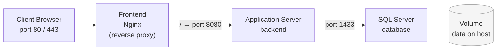
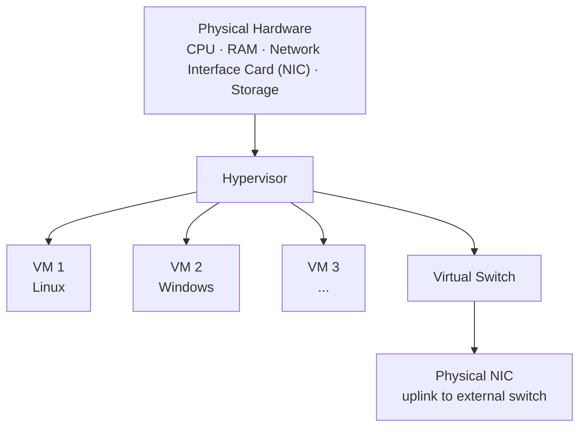

---
tags:
  - university/datacenter-design-and-operation
  - virtualization
  - containers
  - kubernetes
  - docker
  - hypervisor
date: 2026-05-07
lecture: "Virtualization and Containerization"
professor: "Antonio Cisternino"
---

# Virtualization and Containerization

This lecture covers two fundamental technologies for the modern datacenter: **containers** and **virtual machines** (VMs). The professor intentionally presents containers first — even though historically they came after virtualization — because they make the isolation principle easier to grasp. Hypervisor-based virtualization is the technology that originally made cloud computing possible as we know it today.

---

## Containers

### The Core Principle: cgroups and Namespaces

A container is not a separate operating system — it is a *restricted view* of the existing one. The underlying mechanism is called a **cgroup** (control group), a Linux kernel module that groups processes together and limits which system resources they can name.

> [!tip] The Power of Naming
>
> In computer science, naming a resource is the only prerequisite for accessing it. A memory address is a name. A PID is a name. If a resource cannot be named — meaning it is not visible in the process's namespace — it does not exist for that process. cgroups exploit this principle exactly: they show the processes inside a container only the resources belonging to their own group.

Concretely, when a process inside a container makes a system call to list available resources (other processes, network interfaces, filesystems), the kernel filters the response to show only those belonging to its cgroup. The result is the illusion of having a dedicated operating system, while sharing the same kernel with every other container on the machine.

This is where the fundamental difference from VMs emerges: **all containers share the same kernel**. This has significant security implications: a kernel vulnerability hits every running container simultaneously. A recent and concrete example is **CVE-2026-31431 "Copy Fail"**: a bug introduced in August 2017 in the `authencesn` cryptographic module of the Linux kernel, which lay dormant for nearly ten years and was discovered in 2026 through AI-assisted analysis (Xint Code tool). A standard Python exploit of just 732 bytes is enough to obtain root privileges on all major Linux distributions (Ubuntu, RHEL, Amazon Linux, SUSE). Because the kernel page cache is shared across all processes — including those belonging to different containers — the vulnerability is not merely a local privilege escalation but also a **container escape** and a Kubernetes node compromise vector. At the time of the lecture no general patch existed: the recommendation was to disable the module unless strictly needed.

### The Layered (Differential) Filesystem

A container has its own filesystem, but it is not a full copy: it is a **layered differential filesystem**. Each container image is defined by a stack of overlapping layers. When creating a container from a base image, a new layer is added that records only the differences from the one below — exactly like a differential disk in VMs.

> [!example] Advantages of the Layered Filesystem
>
> If ten containers share the same base image (e.g. Ubuntu), the common layers exist only once on disk. When pulling an image, any layer already present locally is not downloaded again. This yields storage savings and incremental downloads.

The flip side is **performance**: the differential filesystem is a complex data structure. When accessing a file, the system must look for it in the current layer and, if not found, walk up through the previous layers. The more layers there are, the more I/O operations are needed. For performance-sensitive data — such as database files — it is advisable to mount an actual host directory instead.

### Volumes and Environment Variables

Two mechanisms allow injecting configuration and data from outside without modifying the container's internal filesystem:

**Environment variables**: before the container era they were considered an obsolete and awkward configuration method. Docker revived them because they are the simplest way to inject parameters into a container without touching its internal filesystem. Configuration is specified at container launch time and does not require rebuilding the image.

**Volumes**: a volume is a host filesystem directory (or file) mounted at a specific path inside the container. The container sees it as part of its own filesystem, but the data physically resides on the host. Primary use cases:
- Data persistence beyond the container's lifecycle (e.g. database data directory)
- Sharing data between multiple containers
- Injecting configuration files or certificates without rebuilding the image

> [!warning] Persistent Data in Containers
>
> If you run a database in a container without mounting a volume for the data directory, all data is lost when the container is removed. Mounting `/var/lib/postgresql/data` (or equivalent) onto a host volume is mandatory practice in production.

### Networking in Containers

Every container has its own network namespace: its `localhost` is different from the host's `localhost` and from that of every other container. In Docker, each container receives an IP address in the `172.x.x.x` range of Docker's internal network. Containers do not communicate via `localhost` but via these private IP addresses or via the service name defined in Docker Compose.

The port mapping (`ports`) in the Compose file exposes a container port on a host port. Since all containers share the same physical network interface, two containers cannot both listen on host port 80: port mapping resolves the conflict by assigning different external ports.

> [!note] Shared Network Security
>
> In containers the host's physical network interface card (**NIC**, *Network Interface Card*) is shared among all running containers — it is the same hardware handling everyone's traffic. In VMs, by contrast, each virtual machine receives a dedicated virtual network interface card (vNIC) emulated by the hypervisor, with its own MAC address and full network identity. This is one of the most significant isolation differences between the two approaches.

### Docker Compose

Docker Compose lets you describe a multi-container application as a composition of services in a YAML file. The professor walks through an example with three services: a frontend (Nginx as reverse proxy), an application server (backend on port 8080) and a database (SQL Server on port 1433).

> [!example] Anatomy of a docker-compose.yml
>
> - **`image`**: specifies the image to pull from Docker Hub (or a private registry such as Microsoft's). The `latest` tag is a convention: when publishing, the most recent image is tagged `latest` in addition to the specific version.
> - **`environment`**: environment variables injected into the container (e.g. SA password for SQL Server, EULA acceptance). In development files it is acceptable to have passwords in plain text; in production use secret managers.
> - **`volumes`**: `host_path:container_path` mapping, optionally with `:ro` for read-only. Useful for mounting certificates, credentials, and data directories.
> - **`ports`**: `host_port:container_port` mapping. If the ports are the same, a single number suffices.
> - **`depends_on`**: controls startup order between services.
> - **`networks`**: services on the same network can reach each other; services on different networks cannot.

The typical architecture using Nginx as a reverse proxy is recommended because application servers (Tomcat, Kestrel, etc.) are not designed to handle high-concurrency web traffic directly. Nginx is optimised for this and acts as TLS termination point, load balancer, and proxy to the backends.

*Fig. — Multi-container application architecture with Docker Compose: Nginx receives external connections and forwards them to the backend; the database mounts a host volume for persistence.*

### Orchestration: Kubernetes

Once you can run multiple containers, the need to orchestrate them across multiple machines arises naturally. Kubernetes (K8s) was born at Google precisely for this: scaling search services across clusters of thousands of machines. The original use case is straightforward — if I have 1000 concurrent requests, I want to automatically spin up N replicas of the container handling them and load-balance across them.

> [!definition] Kubernetes
>
> Open source platform for container orchestration across machine clusters. You declare the desired system state (replica count, allocated resources, networking rules) and Kubernetes autonomously maintains it.

The architecture consists of a **control plane** (master node coordinating the entire cluster) and **worker nodes** where containers run. Containers are grouped into **pods** — the smallest deployable unit in Kubernetes, typically one container or a tightly coupled group.

> [!tip] Canary Deployments and Rolling Updates
>
> Kubernetes allows running version 1 and version 2 of a service simultaneously. The ingress controller (reverse proxy at the entry point) decides what percentage of traffic to route to each version. This enables gradual software updates with no service interruption (rolling update) or testing a new version on a small percentage of users (canary deployment).

---

## Virtualization

### VMs vs Containers: The Fundamental Difference

The key difference is the isolation level: containers share the host OS kernel; VMs do not. A VM contains its own complete operating system, kernel included. This means:

- A Linux VM and a Windows VM can run simultaneously on the same physical host (impossible with containers, which must share the host kernel)
- A kernel vulnerability does not cross the VM boundary
- VMs have greater overhead (disk footprint, memory, boot time)

> [!note] WSL2 and Linux Containers on Windows
>
> On Windows, Linux containers run inside a lightweight Linux VM managed by Hyper-V (WSL2). This is not a violation of the principle: the containers share the Linux VM's kernel, not the Windows kernel directly.

### The Hypervisor

The **hypervisor** is the software that implements virtualization: it takes the physical machine's resources (CPU, memory, network, storage) and slices them into allocations assigned to each VM. It is responsible for:

- **CPU scheduling**: distributing physical cores across VMs
- **Memory management**: isolating address spaces
- **Virtualised I/O**: presenting each VM with disk controllers, network interfaces and other devices as if they were physical
- **Virtual console**: providing graphical access to the VM

*Fig. — Virtualization system architecture: the hypervisor sits between the physical hardware and the VMs, exposing virtualised resources to each one.*

### The Virtual Switch

Alongside the hypervisor, the **virtual switch** is the component that makes VMs indistinguishable from physical machines at the network level. Since multiple VMs run on the same physical host, an internal network infrastructure is needed that:

- Assigns each VM a complete network identity (MAC address, IP, VLAN)
- Handles east-west traffic between VMs on the same host without touching the physical network interface card (purely in-memory traffic, much faster)
- Connects the VMs to the physical network using the host's physical network interface card as an uplink to the external switch

The virtual switch implements in software the same functions as a physical switch: broadcast domains, VLAN tagging, MAC-based forwarding. In VMware this component is called **vSwitch** (or **Distributed Switch** in enterprise configurations).

### Live Migration

The most powerful capability of virtualization is **live migration** (called **vMotion** in VMware): moving a running VM from one physical server to another **without interrupting the service**.

> [!tip] Why Live Migration Is Revolutionary
>
> A website serving pages can be moved from one physical machine to another while it continues responding to HTTP requests. This makes hardware maintenance without downtime possible, enables load balancing across servers, and allows automatic fault handling. It is the technology that made cloud computing economically viable.

The mechanism rests on the fact that a VM's complete state (memory, CPU registers, device state) is a data structure in the hypervisor's software. Copying this structure from one host to another, syncing the last changes, and switching control is technically complex but feasible. Shared storage (SAN or NAS) eliminates the need to move disk files as well.

### CPU Virtualization: Rings and Hardware Instructions

The most subtle technical challenge of virtualization is **CPU virtualization**. An OS kernel executes privileged instructions that access hardware directly (interrupt handling, physical memory manipulation, timer configuration). When a "guest" kernel runs inside a VM, these instructions must be intercepted and handled by the hypervisor before reaching the physical CPU.

x86 CPUs (and ARM) do not have just two privilege levels (supervisor/user): the Intel 386 already had 16, called **rings** (from ring 0, most privileged, to ring 15). The kernel normally runs in ring 0 and applications in ring 3.

Early virtualization implementations exploited these intermediate rings to interpose the guest kernel between the hypervisor kernel and applications, but this was a fragile architecture. The definitive solution came with **dedicated hardware virtualization instructions**:

- **Intel VT-x** (Virtualization Technology for x86)
- **AMD-V** (AMD Virtualization)

These extensions add data structures (VMCS on Intel) to efficiently save and restore the complete VM state during context switches between VMs, virtual interrupts separate from physical ones, and independent virtual timers.

> [!warning] VM Context Switch vs Process Context Switch
>
> A process context switch saves/restores the process registers. A VM context switch must save/restore the entire guest kernel state (registers + MMU state + virtual interrupt controller + timers). Without hardware support this is orders of magnitude more expensive.

### Major Hypervisors

> [!abstract] Vendor Landscape
>
> - **VMware** (now Broadcom): historical enterprise market leader. Founded 1997–98, acquired by Dell via EMC², then sold to Broadcom. The ownership change brought a radical licensing overhaul that pushed many customers to seek alternatives — difficult because VMware's technical maturity is unmatched in enterprise settings.
> - **Hyper-V** (Microsoft): built into Windows Server and the Pro/Enterprise editions of Windows. Microsoft was for a period the largest contributor to the Linux kernel, contributing the Hyper-V virtualization modules (also used by WSL2).
> - **KVM** (Kernel-based Virtual Machine): module built into the Linux kernel; foundation of many cloud distributions including OpenStack.
> - **Proxmox**: open source solution based on KVM, widely used in homelabs and SMBs. Does not match VMware's performance and maturity in enterprise environments.

### Snapshots and Checkpoints

A **checkpoint** (or snapshot) is an instantaneous photograph of a VM's complete state at a given moment: memory contents, CPU register state, disk state. It is implemented through the same differential filesystem mechanism: at snapshot time the virtual disk file is frozen and all subsequent writes go into a new differential file.

> [!example] Demo: Snapshot and Restore
>
> During the lecture the professor demonstrates the power of snapshots:
> 1. Creates an Ubuntu VM on Hyper-V with a VHDX virtual disk
> 2. Installs Ubuntu
> 3. Takes a checkpoint (the disk file splits: frozen base + active differential)
> 4. Runs `rm -rf /` inside the VM, destroying the filesystem
> 5. Restores the previous checkpoint → the VM resumes exactly where it was before the disaster, memory state included

> [!warning] Snapshot Performance Overhead
>
> Every disk access on a VM with active snapshots requires a cascading lookup through the layers: first in the current differential, then in the previous one, and so on. The more snapshots there are, the more I/O operations pile up for each access. Keeping long-lived snapshots on production VMs (which write continuously for updates, logs, etc.) significantly degrades performance and increases disk usage well beyond the nominal size allocated to the VM. This is a common bad practice in datacenter operations teams.

> [!question] Possible Exam Questions
>
> - What is the fundamental isolation difference between containers and VMs?
> - How does the cgroup mechanism achieve container isolation?
> - Why does a Linux kernel vulnerability affect all containers but not VMs?
> - What is the virtual switch and why is it a critical component of virtualization?
> - How does live migration work and why is it strategically important?
> - Why do modern CPUs have dedicated hardware instructions for virtualization?
> - What are the performance trade-offs of using multiple snapshots on a VM?
> - What happens to storage when a snapshot is taken on a VM?
