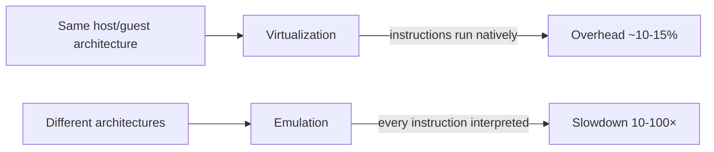
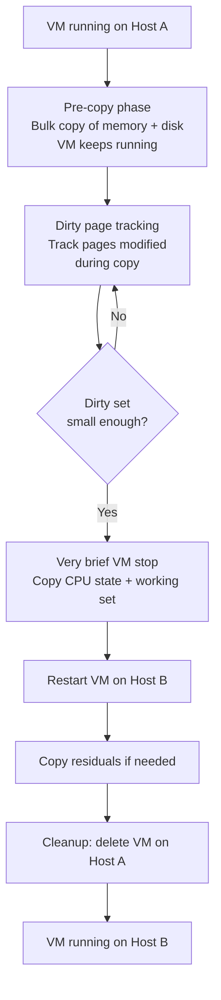
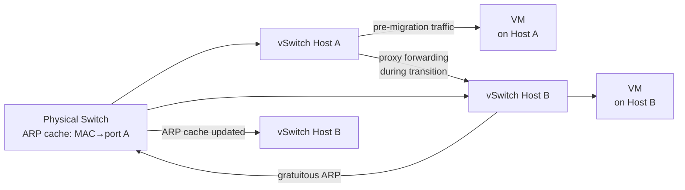
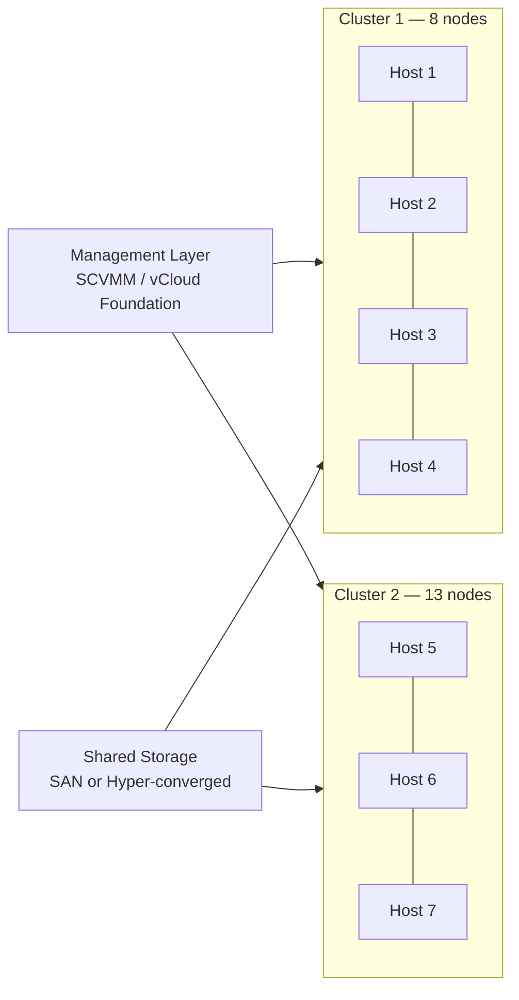
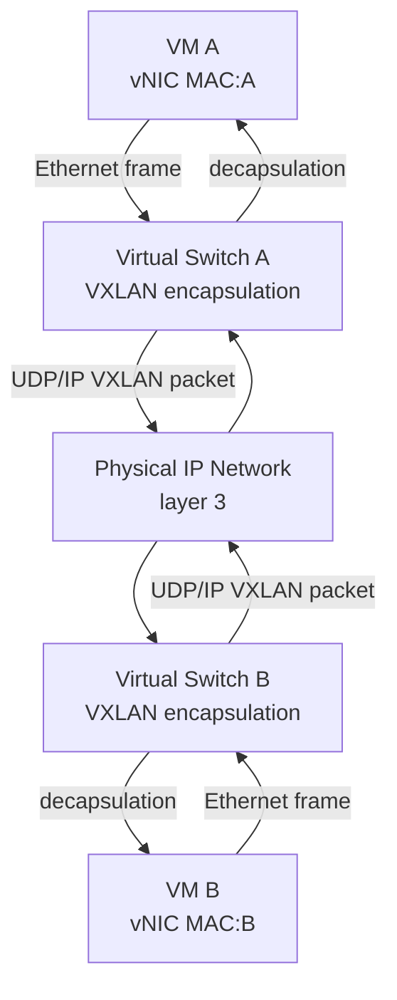

---
tags:
  - università/datacenter-design-and-operation
  - virtualization
  - hypervisor
  - live-migration
  - cluster
  - vxlan
  - overlay-network
  - hyper-converged
data: 2026-05-08
lezione: "Virtualization 2 — Live Migration and Virtual Datacenter Management"
professore: "Antonio Cisternino"
---
# Virtualization 2 — Live Migration and Virtual Datacenter Management

This lecture picks up where the previous one left off, examining the internal mechanics of the hypervisor, the operations it enables — above all **live migration** — and the architectural consequences these capabilities have had on the cloud industry as a whole. The professor demonstrates everything live on a real cluster at the University of Pisa.

---

## Historical Context: From IBM to the 2000s

Virtualization is not a recent invention. IBM's **VM/CMS** operating system, which appeared in the 1970s, was already a complete virtualization system: it allowed multiple independent instances of a single-programmed system to run on the same physical mainframe. The idea predates even the modern concept of a process.

### Emulation: The Practical Predecessor

Before virtualization became dominant, **emulation** was the standard solution for running software written for a different architecture. Macintosh computers with PowerPC CPUs, for example, used an x86 emulator to run Windows software — slower, but functional. The logic of emulation is conceptually simple:

> [!definition] Emulator
>
> A program that implements the fetch-decode-execute cycle of a target CPU, interprets each instruction, and simulates the effect of every I/O operation. It can run code of any architecture on any other architecture, at the cost of significant slowdown.

The slowdown arises because each cycle of the emulated CPU requires many cycles of the physical CPU to simulate. Historically this was only acceptable for emulating very old systems — Moore's Law provided enough headroom to compensate for the inefficiency. Today, tools like **JSLinux** by Fabrice Bellard demonstrate that even complex systems (Linux, Windows 2000) can be emulated inside a browser, including CPUs of architectures different from the host device.

> [!note] Faithful Bugs
>
> An emulator must implement not just the official CPU specification, but also its bugs. Real software often relies on undocumented behaviors or historical hardware quirks: an emulator that does not reproduce them fails to run that software correctly.

### The Birth of VMware (1997) and x86 Virtualization

In 1997, when VMware was founded, multi-core CPUs did not yet exist. The problem that motivated the first hypervisor was pragmatic: a sales representative needed to demonstrate client-server architectures without a reliable internet connection. The solution was to run both client and server on the same laptop — but in isolation.

Emulating an x86 CPU on top of another x86 CPU is technically possible but slow. VMware's key insight was different: if the code already runs on the same architecture, there is no need to emulate instructions — one simply needs a mechanism to *preempt* the virtualized machine's code and let it run directly on the physical CPU, intervening only when necessary (privileged accesses, I/O, context switches).

*Fig. — Emulation vs virtualization: the deciding factor is architectural compatibility.*

---

## Why Virtualization Took Off

The explosion of virtualization in datacenters happened around **2003-2004**, for a structural reason: hardware was growing faster than software. Servers of that era were already too powerful for the available applications. A web server or mail server, being **IO-bound** workloads, kept the CPU busy only a small fraction of the time: the processor was waiting for disk or network, not computing.

Running a single application per server in this context was enormous waste. Virtualization offered the answer: run dozens of isolated services on the same physical machine, exploiting otherwise idle cores.

> [!tip] Why Not Just Processes?
>
> Processes share the operating system, libraries, and kernel. Two applications requiring different versions of the same library cannot easily coexist. A security patch to one component requires rebooting the entire machine. A web server compromise can spread to the database. A VM solves all three problems through **complete isolation**.

The second catalyst was the arrival of **multi-core CPUs** around 2006. Software of that era was almost entirely single-threaded — multithreading was considered advanced programming. Virtualization became the primary way to exploit additional cores without rewriting applications: each VM occupied one or more separate cores.

The overhead introduced by a modern hypervisor is estimated at around **10-15%** — well spent given the return in isolation, flexibility, and manageability.

---

## The Server Hypervisor

Desktop virtualization software (VirtualPC, VMware Workstation) was designed to run operating systems with graphical interfaces, audio, USB. The **server hypervisor** is a completely different system: no graphical console, management only via network, optimized to run dozens or hundreds of headless VMs.

### The vCPU and Instruction Set Management

Each VM receives one or more **vCPUs** — virtual CPUs that map onto physical cores of the server. A vCPU is not simply a dedicated physical core: it is a configurable abstraction. In particular, the hypervisor can declare to the VM a subset of the instructions available on the physical CPU.

This is crucial for **live migration**. If a VM uses AVX-512 instructions available only on certain Intel models, it cannot be moved to a server with an older CPU that does not support those instructions. By configuring the vCPU to expose only the instructions common to both source and destination, portability is guaranteed.

Similarly, the hypervisor can configure the **NUMA** topology perceived by the VM: how many sockets, how many NUMA nodes, how much memory per node. The VM does not see the real topology of the physical server — it sees only what the hypervisor presents to it.

### Two Operating Systems at Windows Boot

A little-known fact: Windows, at boot, launches **two operating systems**, not one. The first is a very small micro-OS, with no console, that takes control of the hardware dedicated to protecting cryptographic keys — those used for BitLocker, TPM, and financial transactions. This micro-OS is internally called **Secure World** (or Virtual Secure Mode). Only after launching it does Windows start normally, running alongside it in virtualized mode.

> [!example] Why Two OS?
>
> Software is not perfect. If an attacker gains kernel privileges on Windows, they can normally read any area of memory, including cryptographic keys. With the two-OS model, the keys reside in the Secure World, inaccessible even to the Windows kernel. The Secure World is exposed only through well-defined APIs, making key exfiltration much harder.

The same principle applies to **Windows Subsystem for Linux (WSL2)**: a full Linux kernel runs inside Windows, exploiting the same virtualization techniques. On the professor's ARM laptop, a built-in x86 emulation layer also runs under Windows, demonstrating coexistence of three levels: native ARM, emulated x86, and virtualized Linux.

---

## Fundamental VM Operations

### Pause and Resume

A hypervisor can stop the execution of a VM entirely at any moment. This is possible because an operating system is, ultimately, code being executed by the fetch-execute cycle. If that cycle is interrupted and the state — CPU registers — is preserved, the operating system has no way of knowing that time has stopped. On resumption, it continues exactly from where it was.

> [!definition] Complete VM State
>
> The complete state of a VM consists of three elements: (1) **CPU registers**, including system registers, (2) the contents of the **RAM** allocated to the VM, (3) the state of the **virtual disk**. Preserving all three is equivalent to being able to faithfully recreate the VM at any future point.

### Snapshot

A **snapshot** is a photograph of the VM's complete state at a given instant. Technically it is implemented with a combination of:
- CPU register copy
- Memory copy (or CoW — Copy-on-Write reference)
- Differential disk: from that point on, writes to disk go into a separate differential file; the original disk remains intact as the "base"

The chain of snapshots allows returning to any previous point in time, exactly like commits in a version control system.

### Integration Services

The hypervisor exposes to the VM a set of integration services that go beyond simple hardware emulation:

- **Clock synchronization**: the VM uses the host's clock. Crucial because Kerberos (the authentication protocol used in Active Directory and datacenters) requires all systems to have the same time within a margin of less than 5 minutes. A desynchronized clock prevents authentication.
- **Heartbeat**: the VM periodically sends a signal to the hypervisor. If the heartbeat stops, the hypervisor knows the VM's kernel is frozen and can intervene with a forced restart — fundamental for business continuity.
- **Graceful shutdown**: the hypervisor can send the VM the equivalent of pressing the power button, allowing a clean shutdown rather than a brutal kill.
- **Contention-free backup**: by briefly suspending the VM, the hypervisor can perform a consistent disk backup without race conditions, even with the system running.

---

## Live Migration

**Live migration** is probably the most important feature introduced by virtualization to the datacenter industry. It allows moving a VM from one physical server to another **while it is running**, with a perceivable interruption on the order of a few milliseconds — entirely compatible with normal network glitches.

### Cold Migration vs Live Migration

*Cold migration* is conceptually simple: shut down the VM, copy the disk and memory files to the destination server, restart. The VM is offline for the entire duration of the copy.

*Live migration* keeps the VM operational during almost the entire transfer. The technical problem is that the VM continues modifying memory and disk during the copy, making it impossible to obtain a consistent snapshot without coordinated intervention.

*Fig. — The live migration process in six phases: pre-copy with dirty tracking, stop-copy, restart, and cleanup.*

### Phase 1: Pre-Copy with Dirty Page Tracking

The first phase is the longest. The hypervisor begins copying memory and disk to the destination server while the VM continues running. During this copy, every memory page (or disk block) modified by the VM is marked as **dirty**: it must be re-copied because the value already transferred has become stale.

The hypervisor's **page fault** mechanism is the key tool: when the VM tries to write to a page already sent to the destination, a fault is generated that allows the hypervisor to update its tracking.

Over time, if the VM is not too write-intensive, the dirty set shrinks: most of memory has already been copied and not been re-modified. At this point the system is ready for the final phase.

### Phase 2: Stop, Copy the Working Set, Restart

When the dirty set is small enough — each system has its own thresholds — the hypervisor **stops the VM for a very brief moment**. During this stop:
1. CPU registers are copied
2. Remaining dirty pages (the *active working set*) are copied
3. Everything is transferred to the destination

The VM is then **restarted on the destination**. The stop typically lasts a few milliseconds — comparable to the latency of a network round-trip, or the preemption that any operating system normally undergoes during scheduling.

### Phase 3: Network Management — The ARP Cache Problem

When the VM moves to another physical host, its MAC address (and IP) remain unchanged — they travel with the VM. But physical switches maintain an **ARP cache** that associates each MAC address with the physical port where it was last seen. After the move, that cache is stale: packets would still be sent to the old host's port.

The solution is a two-level mechanism:

1. The **destination virtual switch** sends a **gratuitous ARP** — an unsolicited ARP message announcing "MAC X is now reachable from this switch." This forces network switches to immediately invalidate stale entries.

2. In the brief interval between the migration and the gratuitous ARP propagation, the source virtual switch — which is software aware of the migration — acts as a **proxy**: packets still arriving at the source are forwarded to the destination rather than dropped.

The practical result is **zero packet loss** during migration.

*Fig. — Network handling during live migration: proxy forwarding + gratuitous ARP eliminate packet loss.*

---

## The Cloud as a Consequence of Live Migration

Live migration changed the rules of the game in the IT industry. Before it, software was bound to the hardware it ran on: upgrading or replacing a server meant downtime. With live migration, that bond is broken.

> [!tip] Why Is It Called "Cloud"?
>
> The term "cloud" is metaphorical: clouds in the sky are a mass of water vapor that cannot be precisely located. Similarly, in the cloud you do not know — and do not need to know — on which specific hardware your resources are running. The cloud provider can move them freely, and as long as the service works, it is equivalent for the customer.

Live migration is the enabling technology for this abstraction. A server with a broken disk? VMs are migrated to other hosts in seconds, the server is shut down, repaired, restarted — without any user noticing.

The professor cites the concrete example of the University of Pisa cluster: operational for 8 years, the first cluster of 10 nodes was completely decommissioned and nobody noticed, because VMs were gradually moved via live migration.

### Containers vs VMs for Mobility

**Containers** — unlike VMs — cannot be migrated live with the same ease. A process with its internal state (open sockets, allocated memory, file descriptors) cannot be "frozen" and restored on another host without explicitly serializing all state. That technology (CRIU for Linux) exists but is complex and not universally supported.

For this reason, the dominant pattern in datacenters is running **containers inside VMs**: you get the best of both worlds. Containers provide lightness and fast startup for workloads; the VM provides hardware isolation and mobility via live migration.

---

## Management Software: The Orchestrator Layer

A single hypervisor manages the VMs of a single host. But a datacenter has dozens or hundreds of hosts. Software is needed to coordinate all hypervisors from a single control point.

For Microsoft environments, this software is **System Center Virtual Machine Manager (SCVMM)**. For VMware, **vCloud Foundation**. These tools allow viewing the datacenter as a single resource pool, performing live migrations through a GUI or API, monitoring all clusters, and configuring virtual networks.

Open source alternatives exist: **OpenStack** (more API-oriented, less integrated), **Proxmox** (closer to commercial tools in usability). The professor emphasizes that the choice between open source and commercial in the datacenter is not purely technical:

> [!warning] Open Source in the Datacenter: A Critical Reflection
>
> Having the source code does not mean being able to resolve every problem independently. When 300 virtual machines go offline due to storage inconsistency, the time available for debugging is zero. In that case, having a support contract with engineers who know the product from the inside is worth its cost. The professor describes a real incident: resolution required 6 hours of escalation across three continents (India → Japan → Mexico), where an expert used an open source tool to analyze filesystem metadata and provide the exact command to restore consistency. The alternative without support would have been 4 days of restore from backup.

---

## Cluster Architecture

A **cluster** is a set of servers that share resources and coordinate to guarantee high availability. Each node contributes CPU, memory, storage, and network to the shared pool. The hypervisor on each node communicates with the others to know how many resources are available, where the VMs are, and what to do in case of failure.

*Fig. — The datacenter as a set of clusters managed by a centralized management layer.*

### Cluster Size Limits

Clusters do not grow indefinitely. The practical limit is around **32 nodes**. The reason is the complexity of intra-cluster communication: each node must stay updated on the state of all others. The communication pattern is nearly **quadratic** in the number of nodes: doubling the nodes almost quadruples the quantity of heartbeat and state synchronization messages. Beyond a certain size, coordination introduces unacceptable latency.

The **master role** within the cluster is floating: one node assumes the master role, but it is not fixed. If the master becomes unreachable, the other nodes use a consensus protocol to elect a new one. This avoids the single point of failure that would exist with a fixed master.

To scale beyond the limits of a single cluster, **multiple clusters** are used, all coordinated by the same management layer.

> [!note] Prerequisite for Intra-Cluster Live Migration
>
> All nodes in a cluster must be connected to the **same networks**. If a VM is connected to a specific VLAN, that VLAN must be available on every host in the cluster — otherwise live migration fails because the VM cannot maintain its connectivity.

---

## Storage: Hyper-Converged vs SAN

The way storage is connected to VMs has significant performance implications.

### Hyper-Converged Infrastructure (HCI)

In the **hyper-converged** architecture, the physical disks of each server are part of a distributed storage pool. VM files physically reside on the disks of the server running the VM — or on the closest servers in the cluster network. Traffic between vCPU and vDisk travels over the internal **PCIe** bus of the server, not the network.

The software managing the distributed pool (S2D on Microsoft, vSAN on VMware) typically maintains **3 copies** of every data block on different nodes. This guarantees survival of one or two node failures.

**Advantage**: maximum bandwidth, minimum latency.
**Disadvantage**: only 1/3 of total disk space is usable (33% efficiency). Software licenses (Microsoft S2D, VMware vSAN) are expensive — sometimes more than the hardware itself.

### SAN (Storage Area Network)

In the SAN configuration, storage is centralized in a dedicated array, reachable via FC or iSCSI. VM disks reside on the SAN, not on the servers.

**Advantage**: more efficient space utilization (traditional RAID, less replication overhead); software licenses often absent or cheaper.
**Disadvantage**: the SAN is a bottleneck. FC or iSCSI network bandwidth is lower than PCIe. Under heavy I/O loads (databases), this is noticeable.

> [!warning] The AI Impact on Storage Costs
>
> The cost of storage media (SSD, NVMe) has increased significantly due to AI demand. This has made HCI's ×3 replication even more expensive, pushing some organizations toward SAN despite its technical limitations.

---

## Virtual Networking and Overlay Networks

### Layered Complexity

Each VM has one or more **virtual NICs** (vNICs). These vNICs are connected to a software **virtual switch** running on the hypervisor host. The virtual switch in turn is connected to the physical NICs of the server, which are connected to the physical switches of the network.

Each layer adds complexity to troubleshooting: tracing the path of a packet requires knowing the virtual switch configuration, the VLAN tags on physical ports, and the physical switch topology.

### The VLAN Limit and VXLAN

Traditional VLANs (IEEE 802.1Q) have a 12-bit identifier: at most **4096 distinct VLANs** across the entire network. In a datacenter with millions of virtual tenants, this is insufficient.

The solution is **VXLAN** (*Virtual eXtensible LAN*): an overlay protocol that encapsulates layer 2 Ethernet frames inside layer 3 UDP packets. The VXLAN identifier is 24 bits: approximately **16 million** distinct virtual networks.

*Fig. — VXLAN: Ethernet frames between VMs encapsulated in UDP/IP, enabling independent virtual LANs regardless of physical infrastructure.*

> [!definition] Overlay Network
>
> A logical network built on top of an existing physical network, without requiring modifications to the physical infrastructure. Overlay traffic appears as normal IP/UDP traffic to physical switches, but carries frames of separate virtual networks. This allows creating isolated LANs for different tenants across any number of servers in the datacenter.

The overlay network eliminates the need to configure VLANs on physical switches for each new tenant — a manual, slow operation limited to 4096 combinations. With VXLAN, configuration happens entirely at the software level in the virtual switch, from a centralized panel.

### NIC Redundancy

Each server in a cluster is typically connected with **two NICs** to the production network (plus a third for management). The two NICs go to two different physical switches — spine-leaf. If one physical switch fails, traffic flows automatically through the other link. The virtual switch handles this failover transparently for the VMs.

---

## Resource Aggregation and the Datacenter View

Putting all the pieces together, a virtualized datacenter presents itself as:

- A set of **clusters** of 8-32 hosts each
- Each host contributes CPU, RAM, storage, and network to the cluster pool
- Multiple cluster pools are managed by a single management layer
- VMs are allocated by drawing from the pool's resources
- Live migration allows load balancing, hardware maintenance, and transparent failure response

Virtualization has completely **decoupled software from hardware**: software does not know which physical server it runs on, and does not need to. The cloud is the extreme manifestation of this principle — software does not even know which physical datacenter it runs in.

> [!abstract] Summary
>
> Virtualization is not just a way to run multiple OS on the same machine. It is the technological infrastructure that made cloud computing possible: live migration guarantees workload mobility; the virtual switch and VXLAN guarantee network portability; hyper-convergence maximizes I/O performance. The cost paid — 10-15% CPU overhead, tripled disk space, software licenses — is amply justified by the operational benefits: hardware maintenance without downtime, automatic disaster recovery, and complete isolation between tenants.

> [!question] Possible Exam Questions
>
> - What is the difference between emulation and virtualization? When is one preferable over the other?
> - Describe the phases of live migration and the dirty page tracking mechanism.
> - How is the network managed during a live migration? Why is packet loss practically zero?
> - Why do hypervisor clusters have a typical maximum size of 32 nodes?
> - What is the technical difference between hyper-converged infrastructure and SAN? Advantages and disadvantages of each.
> - What is VXLAN and why is it necessary in modern datacenters?
> - Why can containers not be migrated "live" like VMs?
