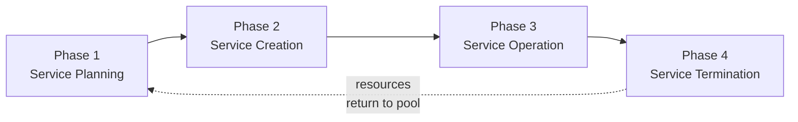

---
tags:
  - università/datacenter-design-and-operation
  - cloud
  - control-layer
  - orchestration
  - sla
  - virtualization
data: 2026-05-15
lezione: "18 - Control Layer, Service Layer, Orchestration and SLA"
professore: "Antonio Cisternino"
---

# Control Layer, Orchestration and SLA

The lecture picks up where the previous session left off: the **Control Layer**, the last functional layer of the cloud reference architecture not yet covered in detail. The professor clarifies the right perspective from the start — from a computer science standpoint, none of the cloud's functional layers is particularly complex conceptually. The real difficulties lie in the hardware, topology and implementation choices of each individual layer. The goal is to move quickly through the functional layers so there is time to discuss the more interesting cross-cutting topics: security, business continuity, service management and, above all, legal frameworks and compliance.

---

## The Control Layer

### Position in the Architecture

The control layer sits above the virtual layer (or directly above the physical layer when there is no virtualization). It receives requests from the layers above it — the service and orchestration layers — and is responsible for provisioning the physical and virtual resources needed to fulfill those requests.

*Fig. — The Cloud Reference Model with the Control Layer highlighted (in yellow). Above it sit the Service Layer and the Orchestration Layer; below are the Virtual Layer and the Physical Layer.*

> [!definition] Control Layer
>
> Includes the software tools responsible for managing and controlling the underlying cloud infrastructure, enabling provisioning of IT resources for creating cloud services.

### The Control Software

The control software ties the underlying resources together. Its main functions are: **resource pooling**, **dynamic allocation** of resources, **optimization of utilization**, and centralized management of all assets. This last characteristic explains why the software was adopted by many enterprise organizations well outside pure cloud contexts: it provides a single point from which to manage all systems in bulk, coordinate maintenance operations, apply security patches by draining the target node before taking it offline, rebooting it, and then rebalancing resources — all without any user noticing.

The control software only works well if the environment is **homogeneous**: if procedures are standardized and repeatable, automation makes sense. Otherwise, each system would demand individual attention, negating the advantages of the layer.

A crucial role of the control software is that of an **adapter**: it abstracts the brand and technology of physical components from the layers above. The cloud does not know whether storage comes from Dell, HP or VAS Data — it does not matter. The control layer deals with the hardware specifics and presents upper layers with a uniform interface. Likewise, the entire infrastructure exposes **APIs** that allow operations to be automated and orchestrated programmatically.

### Element Manager vs Unified Manager

The control software can be organized in two ways:

**Element Manager**: each infrastructure component (compute, network, storage) is managed by a dedicated piece of software provided by the vendor. Each element manager exposes its own APIs toward the resources it manages.

*Fig. — Element Managers independently manage the three pillars: compute, network and storage.*

**Unified Manager**: a single software provides a unified interface for configuring and provisioning all resources. Internally it communicates with the element managers via APIs, but it presents administrators and upper layers with a holistic, consistent view of the entire infrastructure.

*Fig. — The Unified Manager provides a single point of control, internally coordinating the element managers for compute, network and storage.*

Real-world implementations combine both approaches: the unified manager handles high-level operations while the element managers deal with the specific details of each component.

---

## Resource Provisioning Phases

### Resource Discovery

Before anything can be allocated, the system must **know what resources are available**. Resource discovery is the process by which new resources are added to the resource pool. This reflects the industrialization of the datacenter: rather than intervening on a single broken disk, one waits until an entire pod drops below a threshold (e.g., 20% of available resources), decommissions the entire pod, replaces it physically, and then lets the new resources be discovered automatically and added to the pool. This applies to compute, storage and network alike.

### Resource Pool Management and Grading

Once resources are known, they are **abstracted and classified**. There is no point tracking every technical detail — whether a link is 25 Gbps over OM4 optical fiber or something slightly different — for billing, monitoring and provisioning purposes. Instead, **equivalence categories** are defined, within which resources are considered interchangeable even if technically distinct.

The standard mechanism is **grading**: qualitative tiers such as *Gold*, *Silver* and *Bronze* are defined for each resource type (compute, storage, network). Each tier has a different cost and different guarantees. For example:

- **Gold Storage**: includes Flash, FC and SATA drives, supports automated storage tiering, 3 TB capacity, RAID 5.
- **Silver Storage**: balanced mix of Flash, FC and SATA, RAID 1+0.
- **Bronze Storage**: FC drives only, no automated tiering.

Grading allows differentiated choices to be offered to consumers and lets the platform make allocation decisions without knowing the underlying physical details.

### Resource Provisioning

When a consumer selects a service from the catalog, the system allocates resources from the pool matching the requested grade. If there are insufficient resources, the answer is straightforward: the service cannot be created. A classic example is a virtual machine larger than any single available server — even if the server is 100% free, the VM simply cannot be created because it is physically impossible.

---

## The Software-Defined Approach

The natural corollary of centralized management at scale is **software-defined infrastructure**: separating management functions from physical components and delegating them to software controllers. This approach took hold starting around 2008, with standards such as **OpenFlow** for networking and later VXLAN for network overlays.

*Fig. — The software-defined controller abstracts compute, storage and network, exposing APIs to external applications and communicating with physical components via standardized APIs.*

The original advantage was economic: software-defined allowed expensive proprietary hardware (especially dedicated storage) to be replaced with commodity hardware. Today the picture has partially reversed: software vendors have raised license prices to the point where in some cases it is cheaper to go back to dedicated hardware. These dynamics change over time.

The software-defined approach applies to all three pillars:
- **Compute**: a server can be provisioned entirely via software (e.g., Redfish on the BMC).
- **Storage**: storage pools managed via API, regardless of vendor.
- **Network**: programmable switches via OpenFlow; VXLAN to create VLAN overlays without physically configuring every switch.

---

## Resource Management Techniques

### Allocation Models

Two fundamental approaches exist:

> [!definition] Relative Resource Allocation
>
> Resources are allocated proportionally relative to other services. Not widely used in practice.

> [!definition] Absolute Resource Allocation
>
> A quantitative range is defined: a **lower bound** (minimum guarantee) and an **upper bound** (maximum consumption limit). The cloud provider signs SLA contracts based on these ranges and must honor them while managing contention between tenants.

The problem with absolute allocation is **tenant contention**: if all tenants simultaneously demand the maximum, resources are exhausted. The cloud provider must balance allocations so all contracts can be honored; otherwise the provider is exposed to legal liability.

### Hyper-Threading

> [!definition] Hyper-Threading
>
> An Intel technique that makes a single physical core appear as two logical cores, executing two instruction streams in a partially parallel manner while sharing the physical computational units.

The professor explains the evolution in detail. In the 1990s, threads emerged as a lightweight form of concurrency: multiple execution flows within the same process, with context switching cheaper than switching between processes (no need to update paged memory data structures, since threads within the same process share the address space). Hardware vendors began optimizing this pattern.

The key insight of hyper-threading is that **not all threads use all computational units simultaneously**: if one thread performs integer arithmetic and another performs floating-point operations, they can proceed in parallel on the same core. The core is designed with two fetch/execute pipelines that only contend for the shared computational units when necessary.

*Fig. — Hyper-threading: each physical core exposes two logical cores. VMs see virtual processors that map onto logical cores, not physical ones.*

> [!warning] HPC and Hyper-Threading
>
> In HPC (High Performance Computing) environments, hyper-threading is often **disabled**: workloads are predominantly floating-point, so both threads compete for the same FPU, creating more contention than parallelism. The result can be slower than running a single thread per core.

For general cloud workloads (IO-bound, network-oriented), hyper-threading is roughly equivalent to doubling the number of cores. With a server exposing 56 logical CPUs, one can safely allocate up to 112 virtual cores to VMs without meaningful performance degradation, because most of the time the CPU is idle waiting for IO. This **core overbooking** is the norm in cloud environments.

### Memory Ballooning (Dynamic Memory Allocation)

Memory overbooking is achieved through a technique called **ballooning**. A driver installed inside the VM communicates with the hypervisor. The hypervisor tells the VM that a portion of its memory is occupied (the "balloon"), reducing the memory the VM perceives as available. The hypervisor continuously monitors memory pressure: if it sees a VM doing heavy paging (i.e., suffering from memory shortage), it can **deflate** the balloon — reduce the amount of memory declared occupied — so the VM perceives more free memory.

This allows more VMs to run simultaneously than the physical memory would support if all were fully allocated. When real contention arises (all VMs want all the memory at once), **priorities** are defined to decide who waits.

A further optimization is **memory page sharing**: if two VMs run the same operating system, they almost certainly have identical memory pages. The hypervisor can identify them and point both VMs to the same physical page, saving memory.

### Virtual Storage Provisioning and Storage Management

**Thin provisioning** applied to storage works the same way: the VM is presented with more space than is physically allocated. Real space is allocated only when data is actually written.

**Storage pool rebalancing** prevents a situation where one server accumulates too many VMs while others sit nearly empty: the system automatically migrates VMs from overloaded nodes to underutilized ones.

**Automated storage tiering** manages where data is physically stored: recently accessed data is kept on SSDs (or even DRAM cache), while cold data is migrated to slower, cheaper mechanical drives. The movement is transparent to applications.

---

## Live Demo: SCVMM at the University of Pisa

The professor gives a live demonstration of **System Center Virtual Machine Manager (SCVMM)**, the control layer of the University of Pisa's private cloud. The APIs are PowerShell-based (a legacy of an era when HTTP REST APIs were less common), but the concept is identical to any modern control layer.

The interface shows:
- The **fabric**: the total resource pool, with port profile classification (high bandwidth, medium bandwidth, etc.) for tagging network resources.
- **Storage**: *bronze*, *flash* and *hyper-class* tiers. The university runs a hyper-converged infrastructure, so storage lives in the same pool as the servers.
- The **logical network**: a software-defined abstraction that maps different physical VLANs (e.g., VLAN 1800 in datacenter 1 and VLAN 1801 in datacenter 2) to a single logical "public" network. The cloud does not know which physical VLAN is in use — only that the traffic is public.
- The **image library**: the repository from which VM templates are cloned.

Particularly noteworthy is the **service template** for the university's exam recording system: two virtual machines (frontend + database backend), connected to specific networks, with the frontend scalable from 1 to 5 instances while the database is not horizontally scalable (it scales vertically). When a new service instance is created, SCVMM allocates both VMs, configures them and connects them automatically.

The VM creation wizard shows how the system automatically suggests the optimal node for load balancing. Everything done graphically translates into an automatically generated **PowerShell script** — confirming that even graphical interfaces do not "control" things directly: they generate API calls.

> [!tip] Key insight on bookkeeping
>
> Bookkeeping is a critical activity in the cloud: tracking every VM, every service, every tenant is essential because public clouds easily reach millions of instances. Who removes abandoned resources if there is no record of who created them? A bookkeeping error produces "ghost VMs" that consume resources with no accountable owner.

---

## The Service and Orchestration Layer

*Fig. — In the module 6 Reference Model, the Service Layer (blue) and the Orchestration Layer (orange) sit at the top of the architecture.*

### Service Layer

The service layer is the topmost layer of the cloud architecture. Its main functions are:

- **Defining the service catalog**: the list of available services, with all the information a consumer needs.
- **On-demand self-provisioning**: a consumer can request a service without any human intervention from the provider.
- **Presenting cloud interfaces**: the functional interface (to use the service) and the management interface (to manage the service instance).

> [!definition] Service Catalog
>
> A structured list of all services offered by the provider. Each entry includes: category, name, description, features and options, quality-of-service expectations, price, provisioning timeframe, and a reference to the SLA and documentation.

The professor shows the Azure portal as a concrete example: an enormous catalog of categorized services (VMs, databases, firewalls, etc.), each with variants and options. That is a production service catalog.

### Cloud Portal

The cloud portal is the UI of the service layer. It has two functions:

1. **Presentation**: displays the service catalog, active instances and management interfaces.
2. **Interaction with the orchestration layer**: sends service requests to the orchestrator and displays status updates.

Everything in the cloud portal is **asynchronous**: when a VM is requested, a request is issued and enters a queue. The portal shows the order status in real time (pending → in progress → ready).

### Portability Standards

The professor recounts the history of cloud portability standards with a sardonic tone:

**TOSCA** (*Topology and Orchestration Specification for Cloud Applications*): an attempt to standardize a language for defining services portably across different clouds. It essentially failed. The reality is that cloud has split into two categories:

1. **Portable services** (typically IaaS): export the VM, import it into the other cloud. No sophisticated standard is actually needed.
2. **Locked-in services** (typically PaaS/SaaS): Google Bigtable, Alexa, AI models. These services are not portable by nature — they behave differently even with the same prompt. No standard can bridge that semantic gap.

**OVF** (*Open Virtualization Format*): an open standard for packaging virtual appliances. Still in use, especially in the VMware ecosystem. It works because the problem is simpler: package VMs with their metadata (CPU count, memory, network configuration) in a format that another hypervisor can interpret.

> [!note] REST and SOAP
>
> The protocols for accessing cloud services are already familiar: **REST** (stateless architecture based on HTTP, resources identified by URIs, standard methods GET/POST/PUT/DELETE) and **SOAP** (XML-based protocol for structured message exchange). REST is now dominant.

---

## Service Orchestration

Orchestration is the operational core of the cloud: the mechanism that, starting from a service catalog request, automatically coordinates all the operations needed to create, manage and terminate a service.

> [!definition] Service Orchestration
>
> Automated arrangement, coordination and management of various cloud infrastructure components to provide and manage cloud services. It converts service catalog requests into concrete operations on the control layer.

The orchestrator works with asynchronous systems and queues. The orchestrator's **resilience** is critical: losing orchestration state means ending up with thousands of VMs with no record of which service they belong to. For this reason, all operations are persisted to a database, not kept only in memory.

*Fig. — The orchestrator is the central integration point: it receives requests from the Cloud Portal and coordinates the Unified Manager, Billing System, Directory Service, CMS and Service Management Tools.*

*Fig. — The orchestrator executes a workflow made up of API calls to different systems (approval, billing, unified manager) sequentially or in parallel.*

### Use Case: Provisioning a DB2 Database

The workflow the professor walks through step by step:

1. Are resources available in the pool?
   - **No** → update portal (order pending) → provision more resources → if now available, resume; otherwise → order failed.
   - **Yes** → continue.
2. Update cloud portal: "Order in Progress".
3. Create the VM.
4. Install the guest OS.
5. Connect the VM to the correct VLAN.
6. Assign the IP address.
7. Install DB2.
8. Configure the database.
9. Update the Configuration Management System (CMS).
10. Generate the bill for the new service.
11. Update the cloud portal: "Service Ready".

*Fig. — The complete DB2 provisioning workflow: from resource check to service-ready notification.*

### Use Case: Removing a Tenant

When an organization decides to stop using the cloud, everything must be cleaned up:

1. Get the consumer organization details (user list and service list).
2. Is the service instance list empty?
   - **No** → delete service instances and release resources → remove from CMS → check again.
   - **Yes** → continue.
3. Is the tenant user list empty?
   - **No** → delete tenant users from CMS → check again.
   - **Yes** → delete the consumer organization from CMS. Done.

*Fig. — The tenant removal workflow: complete deprovisioning of services, users and organization from the CMS.*

---

## Cloud Service Lifecycle

A service does not begin when it is first deployed: its lifecycle starts much earlier.

*Fig. — The four phases of the Cloud Service Lifecycle.*

### Phase 1: Service Planning

The planning phase is **strategic**: it is where the decision is made whether it is worth creating a service at all. The professor gives the university example: at some point the demand for web servers from professors (research sites, teaching pages, etc.) was assessed, and the decision was made to support only WordPress, simplifying the portfolio while satisfying most of the demand.

Key planning questions:
- What services will be created or upgraded? What is the appropriate service model (IaaS, PaaS, SaaS)?
- What hardware and software resources are required?
- Who are the target consumers? What is the projected demand?
- What deployment model is appropriate (private, public, hybrid)?
- What regulatory compliance requirements apply?

### Billing Policy

Billing is not just about making profit. The professor emphasizes this: the cloud **hides costs**. When accessing a cloud service on a smartphone, one does not think about the energy consumed by servers, switches and disks. Storing a useless document in the cloud wastes energy and money.

> [!example] Example: Google Drive and the 100 TB
>
> A colleague of the professor accumulated 100 TB on Google Drive because a backup had started with the wrong settings and nobody noticed. When cloud storage was "infinite" and "free," people did not perceive the costs. Google subsequently made storage limited for exactly this reason: to make people perceive the value of what they consume.

Billing is also a **policy instrument**: the price of a service can be raised to discourage its use (e.g., an energy-intensive or less green service) and lowered for a preferred alternative. The University of Pisa is considering assigning a virtual IT budget to researchers and staff, with the option to top it up using research funds if the threshold is exceeded — precisely to create awareness.

Billing types in private cloud:
- **Chargeback**: the cost is actually charged to the organizational unit.
- **Showback**: the cost is displayed without being charged, purely for transparency and awareness.

### Phase 2: Service Creation

A **service template** is defined (service structure, default attributes, management operations), the corresponding **orchestration workflow** is created, and the **service offering** is published in the catalog. The service offering is the combination of:

- Template + structure.
- Constraints (who can access the service).
- Policy (QoS, firewall rules, bandwidth quota).
- Rules (scaling limits, subscription period).
- Price.
- **SLA** (Service Level Agreement).

### Phase 3: Service Operation

Ongoing operational management: monitoring, reporting, provisioning of new instances, troubleshooting. The goal is to automate as much as possible.

### Phase 4: Service Termination

When a service is terminated (by provider decision, consumer decision, or end of contract), all resources are released and returned to the pool. Termination must not impact other service instances or consumers' data.

---

## Service Level Agreement (SLA)

The professor dedicates the final part of the lecture to the SLA, considering it one of the most important — and most neglected — documents in the cloud.

> [!definition] Service Level Agreement (SLA)
>
> A contract that defines the **quality of service** the provider guarantees to the consumer. What is purchased is not specific hardware: it is a quality level, regardless of how the provider achieves it.

The cloud is "somewhere": one does not know on which disk, in which datacenter, in which country one's data resides. The SLA is the only contractual instrument guaranteeing that the service received matches what was paid for.

### Key SLA Questions

> [!question] Key SLA Questions
>
> 1. What are the minimally acceptable performance and availability levels?
> 2. Is there a limit on the amount of resources that can be consumed?
> 3. How is a service outage defined? How are consumers compensated for an outage?
> 4. What is the level of service performance during maintenance periods?
> 5. Do consumers need to pay any licensing fees above and beyond the service charges?
> 6. Where will the primary copy of consumer data be stored? How will it be protected?
> 7. Are compliance adherence and data security offered as supplementary services?
> 8. Will consumers be notified if a law enforcement agency requests their data?
> 9. What kinds of customer service and response time guarantees are provided?

**On point 1**: cost increases non-linearly with the availability level. Guaranteeing 95% uptime is relatively cheap; guaranteeing 99.99% requires massive redundancy that is reflected in the price.

**On point 3**: the definition of "service outage" is the most critical and legally slippery part of the SLA. This is where providers have the most room to maneuver.

**On point 6**: for European public administrations, data must reside in European datacenters (GDPR). The SLA must explicitly specify the geographic location of data.

**On point 8**: after the September 11, 2001 attacks, the US government reserved the right to access the emails and communications of terrorism suspects without notifying those individuals. An SLA with a US provider may not guarantee notification in the event of a government data access request.

### The Downtime Definition: The Critical Clause

The professor stresses that the first thing to read in an SLA is not the compensation table but the **definitions section** — in particular the definition of downtime.

> [!warning] Tricks in the downtime definition
>
> - **User-minutes measurement**: downtime is not measured in clock minutes but in (minutes × users impacted). If the problem affects only one account out of 50,000, the user-minutes impact is nearly zero — so it does not count as downtime.
> - **Minimum time slots**: Amazon's first SLA stated that an outage was only counted if the VM was inaccessible for at least 5 consecutive minutes. A 4-minute outage did not exist. Multiple short outages could accumulate without being counted.
> - **Third-party fault**: if the problem is in the consumer's ISP network, or on the consumer's laptop, it is not the cloud provider's fault.
> - **Scheduled downtime**: planned maintenance announced at least 5 days in advance does not count as downtime.

### Case Study: Microsoft 365 SLA

The professor opens the live Microsoft 365 SLA document and analyzes the key sections.

**Uptime Percentage definition**:

$$
\text{Uptime \%} = \frac{\text{User Minutes} - \text{Downtime}}{\text{User Minutes}} \times 100
$$

Where:
- **User Minutes** = (total minutes in the period − scheduled downtime) × number of users.
- **Downtime** = Σ (incident duration in minutes × users impacted by the incident).

**Scheduled Downtime**: "We will publish notice at least five days prior to the downtime." If notice arrives late, that maintenance window is no longer "scheduled downtime" — it becomes a real outage.

**Service Credits** (compensation):

| Uptime % | Credit |
|---|---|
| < 99.9% | 25% |
| < 99% | 10% |
| < 95% | 50% |
| Below any guaranteed threshold | 100% |

> [!note] Credits are credits, not refunds
>
> Microsoft (and virtually all providers) returns value as **service credits**, not cash. The consumer must file a claim, Microsoft must approve it, and only then does the consumer receive credits to spend on Microsoft services.

> [!example] Practical impact of user-minutes measurement
>
> If an outage lasts 1 hour and affects only your account among 50,000 users at the University of Pisa, the downtime in user-minutes is 60 × 1 = 60 user-minutes. The total user-minutes for the month are ≈ 50,000 × 43,200 = 2,160,000,000. The percentage impact is negligible — effectively zero for SLA calculation purposes.

### Final Takeaway

The professor closes with a reflection: technicians tend to look only at whether a service is up or down, without thinking about the legal implications. But we are entering a world where digital systems are the counterpart of the physical world: if the university's IT systems are down on graduation day due to the CIO's fault, the damages are real and the legal liability is real too.

> [!abstract] Summary
>
> The cloud is not just technology: it is a sociotechnical system with legal, economic and organizational implications. The Control Layer manages the infrastructure in an automated and scalable way. The Service and Orchestration Layer exposes that infrastructure as consumable services. The SLA is the contract that defines the guarantees — and understanding it requires legal attention, not just technical expertise.
