# Introduzione ai Cyber-Physical Systems e IoT

## Cyber-Physical Systems e Ambienti Intelligenti

I sistemi cyber-fisici (**Cyber-Physical Systems**, CPS) vivono e connettono due mondi distinti: possiedono sensori e attuatori per interagire con il mondo fisico e, contemporaneamente, sono entità cibernetiche dotate di capacità di elaborazione, memoria e comunicazione per agire nel ciberspazio. L'**Internet of Things** (IoT) rappresenta una "incarnazione" concreta di questi sistemi, implementando quelli che vengono definiti **ambienti intelligenti** (*smart environments*).

> [!definition] Cyber-Physical System (CPS)
>
> Sistema che integra capacità computazionali e di comunicazione con il controllo diretto del mondo fisico tramite sensori e attuatori. La componente cibernetica e quella fisica sono inseparabili e si influenzano reciprocamente.

In un ambiente intelligente, gli oggetti (*smart objects*) assumono una duplice natura fisica e cibernetica. Dal punto di vista fisico, qualsiasi oggetto è soggetto a esperienze tangibili: può essere posizionato in luoghi diversi, spostato ed è esposto ai rischi dell'ambiente esterno, come danni, furti o manomissioni. Questi dispositivi sono caratterizzati da posizionamento libero, dimensioni ridotte, diverse forme (*form factor*) e gusci protettivi. La mobilità è garantita da capacità di comunicazione wireless e alimentazione a batteria, rendendoli spesso consapevoli della propria posizione (*position-aware*). L'esposizione all'ambiente esterno impone ridondanza, sicurezza e costi contenuti.

Un ambiente si definisce "smart" principalmente in relazione all'utente finale: è in grado di riconoscere il contesto, le attività e le situazioni, comprendendo i bisogni dell'utente al momento giusto e fornendo servizi — anche fisici — tramite attuatori o robot. Le caratteristiche comuni di questi ambienti includono la pervasività e la natura non intrusiva dei dispositivi cyber-fisici. Il concetto di "smart" si estende però anche alla gestione, al dispiegamento (*deployment*) e alla manutenzione del sistema stesso: un sistema intelligente deve essere sostenibile, flessibile, sicuro e facile da usare.

---

## Le Quattro Generazioni di Internet

L'IoT rappresenta l'ultimo sviluppo di Internet e del computing, interconnettendo dispositivi intelligenti che vanno dagli elettrodomestici ai sensori minuscoli, integrando ricetrasmettitori mobili negli oggetti di uso quotidiano. Internet supporta la loro connettività, solitamente verso sistemi cloud, abilitando nuove forme di comunicazione tra persone e cose, e tra le cose stesse. Gli oggetti forniscono informazioni sensoriali, agiscono sul loro ambiente e, in alcuni casi, modificano se stessi come parte di un sistema più ampio.

È possibile identificare quattro generazioni di Internet in base ai sistemi finali supportati:

| Generazione | Tecnologia | Dispositivi tipici | Caratteristiche |
|---|---|---|---|
| Information Technology (IT) | Cablata | PC, server | Elaborazione e storage centralizzati |
| Operational Technology (OT) | Cablata/industriale | Macchinari, sistemi di controllo | Automazione di processi industriali |
| Personal Technology | Wireless | Smartphone, tablet | Connettività mobile personale |
| Sensor/Actuator Technology (IoT) | Wireless, batteria | Sensori, attuatori monoscopo | Bassa potenza, bassa banda, sistemi embedded |

L'IoT è guidato principalmente da dispositivi embedded a bassa potenza, bassa larghezza di banda ed energia limitata, ma include anche apparecchi come telecamere di sicurezza ad alta risoluzione che richiedono elevate capacità di streaming.

---

## Architettura a Livelli dell'IoT

Ogni dispositivo IoT è composto da sensori e attuatori, un microcontrollore, un'interfaccia wireless e un software che contiene la logica di business. L'architettura IoT è strutturata a livelli sovrapposti che rispecchiano la separazione tra mondo fisico, rete e applicazioni.

Alla base si trova il livello di **Percezione**, costituito dagli oggetti fisici e dai sensori che raccolgono dati dall'ambiente. Sopra di esso si trova il livello di **Comunicazione**, che gestisce le tecnologie di rete e wireless responsabili del trasporto dei dati. Seguono il livello di gestione delle risorse e dei servizi e il livello di gestione dei dati e della conoscenza, che comprende storage e *data analytics*. Al vertice vi sono i servizi specifici del dominio applicativo, come Smart Industry, Smart Energy o Smart Transport. Parallelamente a tutti i livelli opera la sicurezza, che non è un componente isolato ma una proprietà trasversale all'intera architettura.

> [!note] Sensori al livello di percezione
>
> I sensori possono monitorare parametri molto diversi a seconda del contesto. Per il tracciamento degli asset si utilizzano geolocalizzazione GNSS, prossimità NFC o rilevamento dell'orientamento tramite giroscopi. Per la logistica di magazzino si impiegano tecnologie come il Time of Flight (UWB) o l'Angle of Arrival (Bluetooth) per la localizzazione precisa al chiuso.

---

## Piattaforme IoT e Gestione dei Dati

Le **piattaforme IoT** agiscono come strati software tra i dispositivi e le applicazioni, distribuendo le funzionalità tra i dispositivi stessi, i gateway e i server nel cloud. Queste piattaforme offrono un insieme di funzionalità critiche che coprono l'intero ciclo di vita dei dispositivi e dei dati.

L'**identificazione** fornisce un modo univoco per riconoscere gli oggetti nella piattaforma, utilizzando standard come indirizzi IP, URI (*Universal Resource Identifier*) o UUID (*Universally Unique Identifier*). La **discovery** permette di trovare dispositivi, risorse e servizi all'interno di un dispiegamento IoT e di ottenerne le caratteristiche. La **gestione dei dispositivi** (*Device Management*) include l'inizializzazione, la configurazione, l'aggiornamento automatico di software e firmware, il monitoraggio — ad esempio del livello batteria — e il controllo remoto; esistono standard specifici come OMA LWM2M per i dispositivi IoT e BBF TR-069 per gli apparecchi utente. La **composizione dei servizi** costruisce servizi compositi integrando servizi di diversi dispositivi IoT e componenti software. Infine la **semantica** fornisce un modo per rappresentare i dispositivi e il loro contesto, abilitando ragionamento e elaborazione AI sui dati.

Per la gestione dei dati, specialmente in contesti di big data e applicazioni real-time, si utilizzano spesso database **NoSQL** come MongoDB, che offrono un design più semplice rispetto a SQL e scalano bene orizzontalmente. In MongoDB i record sono documenti con sintassi simile a JSON, dove i dati sono memorizzati come coppie nome/valore; questi documenti sono raggruppati in collezioni, che corrispondono alle tabelle dei database relazionali ma senza imporre la stessa struttura a tutti i documenti.

---

## Architetture di Rete: Edge, Fog e Cloud

Le problematiche di latenza, affidabilità e larghezza di banda nell'IoT vengono affrontate distribuendo l'elaborazione su diversi livelli di rete, ciascuno con caratteristiche e responsabilità distinte.

> [!definition] Cloud
>
> Livello centrale dell'architettura, caratterizzato da data center cablati e tempi di risposta transazionali. Adatto per l'archiviazione a lungo termine e l'elaborazione computazionalmente pesante.

> [!definition] Edge
>
> Livello periferico della rete aziendale, costituito dai dispositivi IoT stessi (sensori e attuatori) o dai gateway che li interconnettono. Opera con tempi di risposta nell'ordine dei millisecondi.

> [!definition] Fog Computing
>
> Livello intermedio tra Edge e Cloud. I dispositivi Fog sono fisicamente vicini all'Edge e convertono i flussi di dati di rete in informazioni adatte all'archiviazione o all'elaborazione di alto livello, riducendo il volume di dati inviati al cloud e garantendo tempi di risposta in tempo reale.

Lo scopo del Fog è eseguire l'elaborazione il più vicino possibile ai sensori — valutazione, formattazione, riduzione dei dati — alleggerendo così il traffico verso il cloud e abbattendo la latenza per le applicazioni che richiedono risposte immediate.

> [!tip] Intuizione chiave
>
> La scelta tra Edge, Fog e Cloud non è esclusiva: le architetture IoT moderne sfruttano tutti e tre i livelli in modo complementare, assegnando a ciascuno il tipo di elaborazione più adatto alle sue caratteristiche di latenza, capacità e affidabilità.

---

## Intelligenza Artificiale e Machine Learning

L'**Intelligenza Artificiale** (AI) nell'IoT mira a rendere i sistemi capaci di comportamenti intelligenti, sia attraverso la conoscenza curata sotto forma di regole causa-effetto, sia tramite il **Machine Learning** (ML). Il Machine Learning permette ai sistemi di imparare dai dati (*training set*) per associare input a output, generalizzando poi su dati mai visti prima.

I paradigmi principali del ML sono tre. L'apprendimento **non supervisionato** analizza strutture nei dati senza etichette predefinite. L'apprendimento **supervisionato** impara da esempi in cui sono forniti sia l'input sia l'output desiderato. L'apprendimento per **rinforzo** si basa su un meccanismo di ricompense: il sistema impara a compiere azioni che massimizzano una funzione di utilità interagendo con l'ambiente.

La **Blockchain** introduce un cambio di paradigma per l'IoT, spostando l'archiviazione da centralizzata a decentralizzata su un registro distribuito pubblico e fidato. Questo approccio garantisce che le transazioni non possano essere alterate retroattivamente, fornendo un *single point of truth* utile per la tracciabilità nelle catene di approvvigionamento e per aumentare la fiducia nei dati prodotti dai dispositivi.

---

## Interoperabilità e Sicurezza

### Interoperabilità

L'**interoperabilità** è una delle sfide più critiche dell'IoT. Spesso le soluzioni sono progettate come **silos verticali** (*vertical silos*), dove i dispositivi funzionano solo con componenti dello stesso produttore, generando il fenomeno del *vendor lock-in*. Per gestire standard incompatibili si utilizzano gateway a livello applicativo che mappano protocolli e comportamenti diversi, consentendo l'integrazione tra sistemi eterogenei.

Le configurazioni di interoperabilità variano da sistemi omogenei con stesso produttore e protocollo, fino a sistemi con produttori e protocolli diversi che richiedono gateway di integrazione distribuiti.

Tra gli standard wireless rilevanti per l'IoT, **IEEE 802.11** (WiFi) offre alta velocità nell'ordine dei Mbps con range limitato a circa 100 metri. **IEEE 802.15.4** e **ZigBee** privilegiano la bassa potenza e il basso throughput, supportando reti mesh multi-hop per coprire grandi aree. **Bluetooth** e la sua variante a basso consumo **BLE** (*Bluetooth Low Energy*) sono orientati alla comunicazione personale a corto raggio. Il **5G** offre banda larga mobile potenziata, comunicazioni massive tra macchine (*massive Machine Type Communications*) e comunicazioni ultra-affidabili a bassa latenza (*URLLC*), abilitando scenari come la guida autonoma e l'Industria 4.0.

### Sicurezza

La sicurezza è un punto critico a causa delle vulnerabilità dei sistemi embedded, spesso difficili da aggiornare (*patching*). I requisiti fondamentali, definiti nella raccomandazione **ITU-T Y.2066**, riguardano tre aree principali: la sicurezza della comunicazione (integrità e confidenzialità nel trasferimento dei dati), la sicurezza della gestione dei dati (archiviazione ed elaborazione) e la sicurezza della fornitura dei servizi (controllo degli accessi).

I gateway IoT svolgono funzioni di sicurezza essenziali: l'identificazione di ogni accesso, l'autenticazione — preferibilmente mutua — con dispositivi e applicazioni, e la protezione della privacy. Tuttavia, implementare queste misure su **dispositivi vincolati** (*constrained devices*) privi di capacità crittografiche può risultare impraticabile, rendendo necessario un bilanciamento tra sicurezza e risorse disponibili.

> [!warning] Vincoli dei dispositivi embedded
>
> Molti dispositivi IoT hanno risorse computazionali, memoria e autonomia energetica estremamente limitate. Questo rende difficile applicare protocolli crittografici standard e aggiornare il firmware dopo il dispiegamento, aumentando la superficie di attacco nel tempo.

---

```{=latex}
\newpage
```

# Piattaforme IoT

## Identificazione e Discovery

L'**identificazione** fornisce un metodo univoco per riconoscere le entità all'interno di una piattaforma. Esistono diversi standard a seconda del contesto operativo: gli indirizzi IP per Internet, l'**MSISDN** nella telefonia, gli **URI** sul web, l'**OID** nelle telecomunicazioni e gli **UUID** nei sistemi informatici, molto utilizzati anche nello standard Bluetooth.

La **discovery** è il meccanismo attraverso il quale la piattaforma individua dispositivi, risorse o servizi all'interno di un'infrastruttura IoT, permettendo di interrogarne in modo dinamico le proprietà e le caratteristiche offerte.

---

## Gestione dei Dispositivi

La fase di gestione dei dispositivi parte dall'inizializzazione e configurazione, attività che includono il pairing, la definizione delle impostazioni di sicurezza con la relativa distribuzione delle chiavi crittografiche, la calibrazione dei trasduttori e la localizzazione spaziale degli endpoint. La piattaforma IoT si occupa anche di gestire l'aggiornamento automatico del software e del firmware, di monitorare in tempo reale lo stato dell'hardware — come il livello della batteria e la temperatura interna — e di effettuare attività di diagnostica per il rilevamento di eventuali guasti.

È inoltre contemplato il controllo remoto degli apparati per forzare riavvii o attivare specifiche periferiche, e la manutenzione di accurati log di sistema a scopo di audit. Questi processi di management poggiano spesso su standard industriali consolidati come **OMA DM** e **OMA LWM2M** per terminali e sensori, e **BBF TR-069** per apparecchiature destinate agli utenti finali.

---

## Astrazione, Semantica e Composizione dei Servizi

L'**astrazione** e la **virtualizzazione** nascondono la complessità fisica dell'hardware per trattare i dispositivi IoT come veri e propri servizi, introducendo concetti architetturali chiave come il **digital twin** per l'Industry 4.0.

> [!definition] Digital Twin
>
> Il digital twin è una rappresentazione virtuale di un oggetto o sistema fisico, mantenuta sincronizzata con la sua controparte reale. Nell'Industry 4.0 permette di simulare, monitorare e ottimizzare il comportamento dei dispositivi fisici senza interagire direttamente con essi.

La **semantica** attribuisce significato strutturato ai dati raccolti, permettendo di rappresentare il contesto operativo degli apparati per abilitare un ragionamento logico e favorire l'elaborazione dei flussi informativi da parte dell'intelligenza artificiale.

La **service composition** si incarica di aggregare i servizi di svariati dispositivi IoT e di componenti software preesistenti per dare origine a funzionalità composite o catene di data analytics complesse.

---

## Database NoSQL e MongoDB

I flussi informativi ad alta intensità tipici dell'IoT richiedono soluzioni di archiviazione flessibili e performanti, motivo per cui ci si affida sovente ai database **NoSQL**, pensati per applicazioni real-time e scenari Big Data. I sistemi NoSQL offrono prestazioni eccellenti scalando in modo orizzontale su cluster di macchine e hanno un design più snello e destrutturato rispetto all'approccio relazionale SQL classico.

**MongoDB**, ad esempio, salva le proprie entità non come record tabellari ma come documenti formattati in una sintassi molto vicina al JSON, potendo incorporare array e oggetti nidificati per ridurre l'esecuzione di operazioni costose come le join. I documenti vengono logicamente raggruppati in **collection** — assimilabili alle tabelle — pur non dovendo condividere necessariamente la medesima struttura rigida. Le query su un database MongoDB consentono l'applicazione flessibile di criteri di filtraggio, l'utilizzo di proiezioni per definire i campi da ritornare e l'impiego di modificatori per l'ordinamento e la manipolazione del risultato finale.

---

## Problematiche Tecniche nell'IoT

Lo sviluppo delle reti IoT incontra ostacoli tecnologici che spaziano dall'efficienza energetica alla garanzia delle prestazioni in sistemi su larga scala, passando per la personalizzazione e l'elaborazione dei segnali. È prioritario gestire meccanismi efficienti di comunicazione e **brokerage** capaci di mettere agevolmente in collegamento la molteplicità di produttori di informazioni — i sensori — con i relativi consumatori, siano essi attuatori o servizi di astrazione superiori.

Si impone la necessità di una forte standardizzazione nei formati dei dati a garanzia di interoperabilità. In tale direzione operano protocolli a vari livelli di stack: **Bluetooth**, **IEEE 802.15.4** e **ZigBee** per i livelli più bassi o di rete, affiancati a protocolli applicativi come **MQTT** e **CoAP**. Sussistono inoltre notevoli criticità in merito ai vincoli di latenza e affidabilità generati dal dover instradare su mezzi spesso instabili un traffico di letture veloci, massicce ed eterogenee, sfide che stimolano l'adozione di topologie edge e fog.

---

## Edge, Fog e Cloud Computing

Mentre il **Cloud** gestisce grandi moli di informazioni supportando un tempo di risposta transazionale tramite infrastrutture cablate, in periferia opera l'**Edge Computing**. L'Edge costituisce l'estremità della rete composta prettamente da sensori e attuatori, i quali interagiscono tra loro o convergono tramite gateway dedicati verso la rete internet, offrendo la possibilità di azioni locali real-time nell'ordine di grandezza dei millisecondi.

Il **Fog Computing** risponde a un'esigenza contrapposta a quella dell'accentramento del Cloud, posizionando le risorse di storage e di calcolo in prossimità dei dispositivi emettitori. L'elaborazione a livello Fog filtra, formatta e riduce i volumi dei flussi di rete grezzi estraendo informazioni essenziali prima che queste vengano inviate ai livelli alti dell'infrastruttura, mitigando così l'occupazione di banda, risolvendo colli di bottiglia e abbassando le latenze.

---

## Intelligenza Artificiale e TinyML

L'**intelligenza artificiale** (AI) ricerca modelli comportamentali ottimali operando attraverso logiche a regole inferenziali — curated knowledge basata su reti semantiche e relazioni causa/effetto — o, più comunemente nell'IoT, mediante il **Machine Learning**. Il Machine Learning sostituisce l'approccio classico in cui il programmatore stila l'algoritmo con l'analisi induttiva tramite insiemi di dati. Esposto ad appositi dataset di addestramento e validazione, il sistema definisce un modello con spiccate capacità di generalizzazione, adatto a processare e riconoscere misurazioni o scenari mai incontrati prima.

Tra le principali famiglie algoritmiche si trovano l'**Unsupervised Learning** (usato per cercare in autonomia pattern nascosti nei dati), il **Supervised Learning** (che sfrutta accoppiamenti dati-risultato atteso per elaborare previsioni) e il **Reinforcement Learning** (che evolve attraverso un meccanismo di rinforzo o ricompensa).

> [!note] TinyML
>
> Il paradigma **TinyML** permette di miniaturizzare e implementare modelli di Machine Learning direttamente su processori IoT a bassa potenza, portando capacità inferenziali all'edge senza dipendere da connettività cloud. Questo apre scenari di elaborazione locale estremamente efficienti dal punto di vista energetico.

---

## Federated Learning

> [!definition] Federated Learning
>
> Il **Federated Learning** è un'architettura di intelligenza artificiale distribuita che ovvia alla necessità del Machine Learning tradizionale di accentrare tutti i dati di addestramento su un singolo server. Nel modello federato, ciascun dispositivo edge addestra autonomamente il proprio modello usando dati generati e mantenuti esclusivamente in locale. I soli parametri aggiornati — e non i dati grezzi — vengono inoltrati a un server di aggregazione che ricompila un nuovo modello globale più accurato e lo propaga nuovamente a tutti gli endpoint in un ciclo di perfezionamento ininterrotto.

Questo approccio offre enormi vantaggi in termini di scalabilità e tutela della privacy, poiché i dati sensibili non lasciano mai il dispositivo. Tuttavia il sistema non è esente da rischi.

> [!warning] Attacchi al Federated Learning
>
> Il Federated Learning è soggetto ad attacchi di **poisoning** (avvelenamento). L'avversario può inquinare i dati locali corrompendo le associazioni e inserendo falle volontarie (**Data poisoning**), oppure manipolare direttamente i gradienti e i pesi prima di inviarli all'aggregatore centrale (**Model poisoning**), inquinando silenziosamente l'intera rete. Per difendersi si applicano metodologie di rilevazione anomalie basate sul comportamento atteso dei modelli conformi, meccanismi di reputation e auditing tramite Blockchain.

---

## IoT e Blockchain

La **Blockchain** rappresenta per l'ecosistema IoT un radicale cambio di paradigma, offrendo un registro pubblico distribuito in cui nessuna entità governa in maniera centralizzata lo storico delle transazioni. Le iscrizioni sulla blockchain non sono modificabili e rendono i dati *tamper-evident*, certificando un unico punto della verità per tutti i partecipanti al network.

Uno degli scenari d'uso più frequenti nell'IoT è il controllo della **supply chain**: reti di sensori analizzano lo stato delle merci per tutte le fasi di produzione e transito e firmano le conformità sotto forma di **smart contract** direttamente sul registro distribuito condiviso tra le varie aziende della catena logistica.

---

## Interoperabilità e Standard

L'assenza di standardizzazione produce architetture in totale isolamento, meglio note come **vertical silos**, nelle quali l'intera architettura software e hardware scaturisce da un'unica entità monopolistica e lavora senza poter dialogare con il mondo esterno. Questo tipo di business model vincola il cliente a un singolo produttore creando il fastidioso **vendor lock-in**, causando elevati costi in caso di migrazioni e rendendo di fatto incompatibili gli apparati di diversi costruttori.

Per favorire l'interoperabilità, vi è un continuo proliferare di standard legati al mondo wireless: dai corti e medi raggi in radiofrequenza con le varie iterazioni di **IEEE 802.11** (WiFi), Bluetooth e ZigBee, alle vaste coperture tipiche della famiglia cellulare (2G, 3G, 4G, 5G). La transizione allo standard **5G** apporta particolare valore grazie alle tre macro-aree di applicazione previste:

| Macro-area | Sigla | Applicazione tipica |
|---|---|---|
| Enhanced Mobile Broadband | eMBB | Video HD, realtà virtuale |
| Massive Machine Type Communication | mMTC | Smart city, decine di migliaia di sensori |
| Ultra Reliable and Low Latency Communications | URLLC | Automazione industriale, guida autonoma |

Alle problematiche puramente fisiche si aggiunge la frammentazione nel campo software middleware e nei protocolli applicativi, per i quali diventa spesso obbligatorio inserire nodi di **integration gateway** preposti non solo alla conversione sintattica dei pacchetti, ma anche alla mappatura di comportamenti logici per allineare le diversificate configurazioni presenti sul mercato.

---

## Sicurezza

Una problematica endemica nel mondo IoT riguarda la sicurezza informatica limitata o precaria presente all'interno dei **constrained devices**, i dispositivi embedded di consumo. La forte competizione di mercato e l'incentivo a realizzare l'hardware nel minor tempo e a basso costo si traducono in dispositivi vulnerabili, privi di validi meccanismi integrati per il rilascio di patch sistematiche.

Numerose debolezze derivano da sviste grossolane quali l'adozione di interfacce vulnerabili, la mancanza di adeguata protezione fisica o di crittografia, e soprattutto dall'uso di password in chiaro o scritte direttamente nel codice nativo (**hard-coded credentials**). I requisiti imposti dai principali standard internazionali richiedono esplicitamente di salvaguardare l'integrità, l'affidabilità e la confidenzialità di tutti i dati elaborati o veicolati, fornendo audit adeguati per contrastare minacce interne ed esterne.

Poiché numerosi endpoint faticano a gestire la mutua autenticazione per limiti puramente tecnici, le piattaforme demandano la messa in sicurezza ai **gateway** posti ai bordi della rete, incaricati di validare transazioni, decodificare flussi criptati e gestire dinamicamente eventuali policy centrali, in ottemperanza ai rigidi dettami previsti dalla protezione della privacy personale degli utenti finali.

---

```{=latex}
\newpage
```

# Interoperabilità e Standard nell'IoT

Il concetto di **interoperabilità** rappresenta una delle sfide cruciali nello sviluppo dell'Internet of Things. Implementare una soluzione IoT "dal basso", ovvero dal livello fisico fino all'applicazione, non costituisce di per sé un problema tecnico insormontabile; tuttavia, questo approccio porta spesso alla creazione di quelli che vengono definiti *vertical silos*.

> [!definition] Vertical Silos
>
> In questo modello, una soluzione funziona esclusivamente all'interno del proprio ecosistema: i dispositivi proprietari comunicano solo con l'infrastruttura dello stesso fornitore, rendendo incompatibili i prodotti di terze parti.

Questa strategia di design è spesso intenzionale e risponde a un modello di business basato sul *vendor lock-in*.

> [!definition] Vendor Lock-in
>
> La pratica di "ingabbiare" il cliente con l'obiettivo di prevenire l'utilizzo di componenti di altri produttori e imporre costi elevati per l'eventuale migrazione verso soluzioni alternative. Tale migrazione comporta spesso la completa riprogettazione e il dispiegamento di un nuovo sistema, con il rischio di entrare semplicemente in un altro silos.

Storicamente, il problema dell'interoperabilità risiedeva principalmente a livello hardware (come nel caso delle prese elettriche), ma nell'IoT moderno la questione si è spostata prevalentemente a livello software. La soluzione universalmente riconosciuta per mitigare queste barriere è l'introduzione e l'adozione di **standard** condivisi.

## Tecnologie Wireless e Standard di Riferimento

Il panorama delle tecnologie wireless è vasto e differenziato in base al rapporto tra raggio di copertura (range) e velocità di trasmissione dati (data rate).

**IEEE 802.11 (Wi-Fi)** è una famiglia di standard originariamente definita per operare a 2.4 GHz con velocità di 1–2 Mbps, che si è evoluta nel tempo attraverso varie iterazioni (802.11a, b, g, n, ac, ecc.). Le evoluzioni successive hanno introdotto nuove bande di frequenza (come i 5 GHz), aumentato drasticamente il bit rate (fino a oltre 400 Mbps), esteso il raggio di trasmissione e migliorato la gestione della **Quality of Service (QoS)** e il roaming tra access point.

**IEEE 802.15.4** definisce i livelli fisico e MAC per reti a basso consumo. Su queste basi costruisce **ZigBee**, un consorzio industriale che aggiunge i livelli di rete superiori e le interfacce applicative. ZigBee è progettato specificamente per reti di sensori a bassa potenza, caratterizzate da un throughput limitato (fino a 115 Kbps) e un duty cycle molto basso (circa l'1%). Supporta configurazioni multi-hop, essenziali per coprire aree estese attraverso una rete capillare di dispositivi.

**Bluetooth** offre rispetto a ZigBee un data rate superiore ed è orientato alla comunicazione personale e multimediale (audio e video a bassa qualità). Si basa su una topologia master-slave per piccoli gruppi di dispositivi, detta *piconet*. Con l'avvento del Bluetooth 2 il throughput è stato incrementato fino a 10 Mbps.

Le **reti cellulari** hanno attraversato diverse generazioni: dall'analogico (1G) al digitale con supporto SMS (2G-GSM), fino all'introduzione della commutazione di pacchetto e dell'accesso a Internet (2.5G GPRS, 3G EDGE). Il **4G LTE** ha segnato un punto di svolta per la larghezza di banda e la riduzione della latenza sotto i 20 ms.

## Il Paradigma 5G

> [!tip] Il 5G come cambio di paradigma
>
> Il 5G non rappresenta solo un incremento di velocità, ma un cambiamento profondo che abilita categorie di scenari d'uso radicalmente diverse, ciascuna con requisiti tecnici incompatibili tra loro. Questa molteplicità di casi d'uso è spesso rappresentata in un diagramma triangolare.

Le tre macro-categorie del 5G esprimono esigenze distinte. L'**Enhanced Mobile Broadband (eMBB)** copre applicazioni che richiedono altissima velocità dati, come video 3D o streaming in qualità 8K: il requisito dominante è la larghezza di banda. Il **Massive Machine Type Communication (mMTC)** affronta invece lo scenario dell'IoT su scala urbana — smart cities, smart homes — dove l'obiettivo non è la velocità ma la capacità di connettere simultaneamente miliardi di dispositivi a basso consumo energetico. L'**Ultra-Reliable Low Latency Communications (URLLC)**, infine, si rivolge ad applicazioni mission-critical come la guida autonoma o la chirurgia remota: qui affidabilità e latenza diventano parametri vitali, mentre la velocità di picco è secondaria.

Confrontando il 5G con il 4G tramite grafici radar (*spider chart*), si nota un miglioramento sostanziale in tutte le metriche chiave: efficienza spettrale, densità di connessione, efficienza energetica della rete e latenza.

## La Necessità e la Complessità degli Standard

Gli standard nascono dalla necessità di ridurre i costi di sviluppo tecnologico attraverso accordi tra diversi produttori, in un regime di **coopetition** (cooperazione tra competitor). Solitamente, la standardizzazione avviene quando una tecnologia diventa matura e i grandi margini di profitto non risiedono più nello sviluppo della tecnologia di base, ma altrove. Senza queste condizioni economiche, gli standard tendono a fallire.

Tuttavia, la proliferazione degli standard — come nel caso delle comunicazioni wireless — ha spostato il problema dell'interoperabilità ai livelli middleware e applicativo. Oggi esistono numerosi protocolli di livello applicativo (MQTT, CoAP, LWM2M, ecc.), creando una situazione in cui l'incompatibilità non è solo tra silos verticali, ma anche tra standard differenti.

Per gestire questa eterogeneità si ricorre agli **Application-level gateway**. Questi dispositivi non si limitano a tradurre protocolli di basso livello: mappano comportamenti applicativi differenti l'uno nell'altro, operando come interpreti semantici tra ecosistemi incompatibili.

## Configurazioni di Integrazione

Le architetture IoT possono assumere configurazioni molto diverse in base all'omogeneità dei dispositivi e dei protocolli coinvolti. La tabella seguente riassume i quattro tipi principali:

| Tipo | Fornitore | Protocollo | Necessità di gateway |
|------|-----------|------------|----------------------|
| A | Unico | Unico | No |
| B | Multiplo | Unico (condiviso) | No o minimale |
| C | Multiplo | Diversi | Sì — Integration Gateway per la traduzione |
| C/II | Multiplo (consumer) | Diversi | Sì — ecosistemi come Google Home o Alexa |
| D | Multiplo | Eterogenei e distribuiti | Sì — gateway multipli con mappature complesse |

Al crescere della complessità, dal Tipo A al Tipo D, il gateway di integrazione deve gestire un numero esponenziale di mappature tra protocolli allo stesso livello. La sfida non è solo tecnica ma organizzativa: ogni nuovo fornitore o protocollo aggiunto alla rete moltiplica le combinazioni da gestire.

---

## Sicurezza nell'IoT

La sicurezza nei sistemi cyber-fisici e nell'IoT ha raggiunto un punto di crisi. A differenza dei sistemi IT tradizionali, i dispositivi IoT sono spesso sistemi embedded economici, prodotti con forti incentivi a ridurre costi e tempi di immissione sul mercato (*Time-to-Market*), a discapito della sicurezza.

Questi dispositivi sono frequentemente affetti da vulnerabilità per le quali non esiste un meccanismo efficace di patching, lasciando centinaia di milioni di dispositivi connessi esposti ad attacchi. Le conseguenze variano dall'inserimento di dati falsi nella rete (attacchi ai sensori) alla compromissione delle operazioni fisiche (attacchi agli attuatori). Esempi reali includono università attaccate dalle proprie vending machine connesse o sistemi ransomware che bloccano l'accesso fisico alle stanze d'albergo.

## Requisiti di Sicurezza secondo ITU-T Y.2066

La raccomandazione **Y.2066** dell'ITU-T identifica i requisiti fondamentali per la sicurezza IoT organizzandoli in tre aree concettuali distinte. La prima riguarda la **sicurezza della comunicazione**: si tratta di garantire la riservatezza e l'integrità dei dati durante la trasmissione o il trasferimento tra dispositivi e piattaforme. La seconda area è la **sicurezza della gestione dei dati**, che si occupa di proteggere riservatezza e integrità quando i dati sono archiviati o elaborati, ovvero a riposo piuttosto che in transito. La terza area affronta la **sicurezza della fornitura del servizio**: l'obiettivo è prevenire accessi non autorizzati ai servizi e proteggere le informazioni private degli utenti.

A questi tre pilastri si aggiungono la necessità di integrare diverse politiche di sicurezza, l'implementazione dell'**autenticazione mutua** tra dispositivi o tra dispositivo e utente — più robusta dell'autenticazione a una via — e la capacità di effettuare audit di sicurezza trasparenti e tracciabili.

## Il Ruolo del Gateway nella Sicurezza

In un'architettura IoT, il gateway agisce spesso come punto centrale di applicazione delle policy di sicurezza. Sul fronte dell'**identificazione e autenticazione**, gestisce l'accesso di ogni dispositivo connesso: l'autenticazione mutua è preferibile perché entrambe le parti si verificano reciprocamente, mentre quella a una via lascia uno dei due lati esposto. Il gateway si occupa anche della **protezione della privacy**, tutelando sia i dispositivi periferici che se stesso. Supporta inoltre le attività di **manutenzione e aggiornamento**, inclusi l'autodiagnosi, la riparazione remota e — punto cruciale — l'aggiornamento di firmware e software, spesso assente nei dispositivi IoT economici. Infine, gestisce la **configurazione** dei dispositivi, sia in modalità automatica che manuale, locale o remota, basandosi su policy dinamiche.

> [!warning] Dispositivi vincolati e limiti di sicurezza
>
> I **dispositivi vincolati** (*constrained devices*) pongono ostacoli concreti all'implementazione di questi requisiti. Ad esempio, garantire la sicurezza dei dati archiviati su un dispositivo privo di capacità hardware di crittografia può risultare impraticabile. Con la diffusione del *Massive IoT*, la **privacy** diventa un'area di crescente preoccupazione: l'enorme mole di dati sensibili — medici, di posizione, sulle abitudini — raccolti da governi e aziende amplifica i rischi in modo proporzionale alla scala del deployment.

```{=latex}
\newpage
```

# Fondamenti dell'IoT e Architettura del Protocollo MQTT

Questa lezione analizza l'evoluzione delle architetture di rete e degli stack di protocolli pensati per l'Internet of Things, culminando con un'analisi strutturale del protocollo MQTT. Vengono esplorati i paradigmi di comunicazione, le logiche di connessione, la strutturazione dei topic e i meccanismi di affidabilità offerti da questa tecnologia.

## I Requisiti dell'IoT e la Conventional Internet Protocol Suite

Perché un oggetto diventi a tutti gli effetti un dispositivo IoT deve essere connesso a Internet. Tradizionalmente, i sistemi si interfacciano alla rete globale tramite la **Internet protocol suite** convenzionale, strutturata sul binomio TCP/IP affiancato da un livello applicativo come HTTP. Questa suite si articola su tre livelli: il **livello di rete**, dominato da **IP** che si occupa di indirizzamento e routing in modalità best-effort; il **livello di trasporto**, che impiega **TCP** per canali con garanzie di consegna o **UDP** per un accesso più diretto al livello IP; il **livello applicativo**, storicamente dominato da **HTTP** con la sua architettura client/server.

Il problema è che questo stack è stato pensato per dispositivi *resource-rich*, privi di vincoli stringenti di alimentazione, memoria o connettività. Per i nodi IoT risulta troppo pesante. I dispositivi periferici operano su reti instabili (*lossy*), con hardware a bassissimo consumo energetico (*low power*) e risorse estremamente limitate (*constrained*), restando però operativi per anni. Questi vincoli impongono una ridefinizione completa dei requisiti di rete e applicativi:

|**Requisiti di Rete**|**Impatto sul Networking**|
|---|---|
|**Scalabilità / Ridondanza**|Necessità di reti multi-hop e architetture mesh.|
|**Sicurezza**|Deve essere configurabile, con livelli differenziati in base alle capacità dei singoli dispositivi.|
|**Indirizzamento**|Richiede uno spazio di indirizzamento scalabile e protocolli a basso overhead.|
|**Requisiti del Dispositivo**|**Impatto sul Livello Applicativo**|
|**Basso consumo / A batteria**|Progettazione di applicazioni con basso duty-cycle.|
|**Capacità limitata (memoria/CPU)**|Necessità di protocolli con footprint minimo e bassa complessità.|
|**Basso costo**|Aumenta la richiesta di affidabilità, introducendo però ulteriori vincoli fisici.|

---

## Introduzione al Protocollo MQTT

> [!definition] MQTT
>
> **MQTT** (*Message Queuing Telemetry Transport*) è un protocollo di messaggistica leggero di tipo publish/subscribe, progettato per ambienti con risorse limitate e connettività instabile. È standardizzato da OASIS e la versione di riferimento è MQTT 3.1.1 (novembre 2014).

MQTT è stato creato nel 1999 da Andy Stanford-Clark (IBM) e Arlen Nipper (Arcom). La sua leggerezza si manifesta in tre modi: code footprint ridotto, basso consumo di banda e overhead di pacchetto minimo, con prestazioni nettamente superiori a HTTP in scenari vincolati.

Dal punto di vista architetturale, MQTT si appoggia su TCP/IP operando tipicamente sulla **porta 1883** per le comunicazioni in chiaro e sulla **porta 8883** quando incapsulato in sessioni **SSL/TLS**. Va tuttavia sottolineato che l'adozione di SSL introduce un overhead computazionale significativo, spesso problematico per le MCU più piccole.

L'infrastruttura MQTT concentra volutamente la complessità sul lato server (il broker), mantenendo l'implementazione client estremamente semplice. Il protocollo è *data agnostic* — non si cura della natura del contenuto trasmesso — e implementa nativamente meccanismi di garanzia della consegna tramite i livelli di **Quality of Service** (QoS). È impiegato in applicazioni M2M e IoT che spaziano dai collegamenti sensore-satellite all'automazione domestica, ed è supportato nativamente da Microsoft Azure, Amazon AWS e Google Cloud IoT.

---

## Il Paradigma Publish / Subscribe

> [!tip] Pub/Sub e i tre disaccoppiamenti
>
> Il paradigma **publish/subscribe** introduce tre forme di *decoupling* che lo rendono ideale per l'IoT:
> - **Space decoupling**: publisher e subscriber non si conoscono, non condividono IP né porta.
> - **Time decoupling**: non devono essere operativi contemporaneamente.
> - **Synchronization decoupling**: le operazioni sui client non vengono bloccate durante publish o receive.

A differenza del rigido paradigma client/server, il pub/sub implementa uno schema di interazione *loosely coupled*. Gli attori sono due: i **publisher** (pubblicatori) e i **subscriber** (sottoscrittori), che agiscono entrambi come client senza essere a conoscenza dell'esistenza reciproca. I publisher producono eventi interagendo unicamente con il broker; i subscriber esprimono il proprio interesse verso specifici topic e ricevono notifiche non appena queste vengono generate.

Il **broker** è il server dell'infrastruttura, noto sia ai publisher che ai subscriber. Si occupa di ricevere tutti i messaggi in ingresso, filtrarli, distribuirli ai subscriber interessati e gestire le richieste di iscrizione e disdetta. Le operazioni cardine si riducono a quattro verbi: *Publish*, *Subscribe*, *Notify* e *Unsubscribe*.

Rispetto all'approccio client/server, la scalabilità di questa architettura è superiore. Poiché le operazioni del broker sono *event-driven*, si prestano bene alla parallelizzazione. Esistono tre modalità di filtraggio dei messaggi: **basato su topic** (il soggetto fa parte del messaggio, ed è la via di MQTT), **basato sul contenuto** (il broker ispeziona il payload, ma questo impedisce la cifratura dei dati), e **basato sul tipo** (filtraggio sulla struttura semantica dell'evento, con forte integrazione richiesta con il linguaggio di programmazione).

Due aspetti importanti del paradigma: publisher e subscriber devono accordarsi *a priori* sui nomi dei topic, e i publisher non possono assumere che qualcuno stia effettivamente ascoltando.

---

## Il Modello MQTT: Connessione e Flusso Operativo

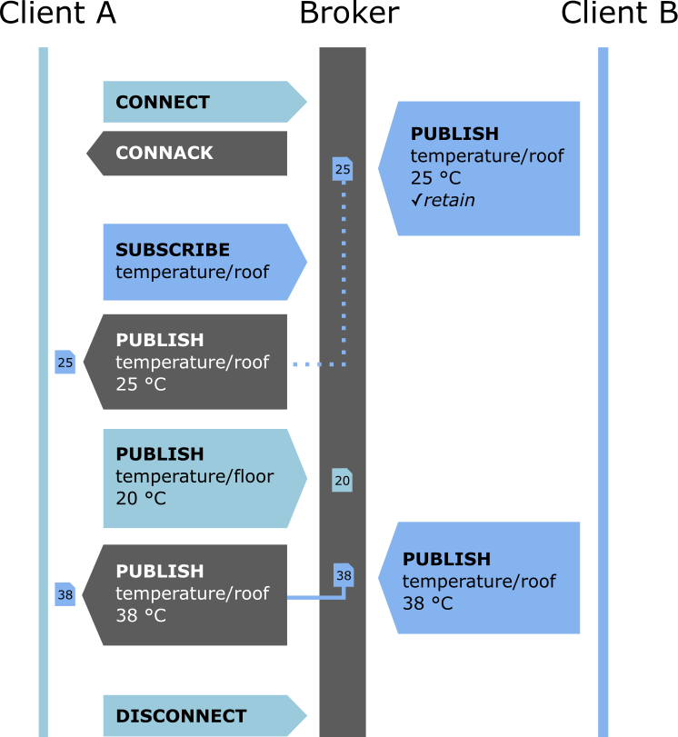
*Fonte: Wikimedia Commons — Il flusso completo: Client A si connette (CONNECT/CONNACK), Client B si sottoscrive al topic `temperature/roof` (SUBSCRIBE), Client A pubblica tre misurazioni (20°C, 25°C, 38°C) con flag retain, il broker le inoltra a Client B.*

MQTT adotta il paradigma pub/sub con filtraggio basato su topic organizzati gerarchicamente. L'infrastruttura opera ai livelli applicativi (5-6 del modello ISO/OSI), sopra TCP (livello 4) e IP (livello 3). Tutti i dispositivi devono conoscere in anticipo hostname e porta del broker. Le librerie client gestiscono quasi sempre le operazioni asincronamente tramite *callback*, pur non precludendo API sincrone.

### L'Instaurazione della Connessione

L'interazione tra client e broker inizia quando il client invia un messaggio **CONNECT**, che contiene i seguenti parametri:

- **Client ID** (obbligatorio): stringa univoca che identifica il client presso il broker. Se lasciato vuoto, il broker assegna un ID automatico, ma non conserverà alcuno stato persistente; in tal caso il flag *Clean Session* deve essere impostato a `true`.
- **Clean Session** (opzionale): se impostato a `false`, il client richiede una *persistent session* — il broker salva le sottoscrizioni e i messaggi non consegnati (con QoS ≥ 1) e li ripristina alla successiva riconnessione con lo stesso Client ID. Con `true`, la sessione è effimera e il broker rimuove ogni stato precedente.
- **Username/Password** (opzionali): per l'autenticazione. Senza TLS/SSL transitano in chiaro.
- **Will flags** (opzionali): definiscono il "testamento" del nodo — istruiscono il broker a inviare un avviso agli altri client nel caso di disconnessione anomala (*ungraceful disconnect*).
- **KeepAlive** (opzionale): intervallo in secondi (campo a 16 bit) entro cui il client si impegna a inviare almeno un pacchetto di controllo (ping). È il meccanismo primario con cui il broker rileva le disconnessioni fisiche. Il valore `0` disabilita il meccanismo.

Il broker risponde con un pacchetto **CONNACK** (*Connect Acknowledgement*) che include il flag *Connection Accepted* o *Connection Refused* (per violazione del protocollo, ID non valido o credenziali errate) e il flag *Session Present*, che indica se il broker conservava già una sessione persistente per quel client.

### Sottoscrizione e Ricezione

Per abilitare la ricezione dei dati, un client invia al broker un pacchetto **SUBSCRIBE** contenente un `packetId` (per mappare la risposta attesa) e un elenco di topic da sottoscrivere, ciascuno con il proprio livello massimo di QoS desiderato.

Il broker risponde con un pacchetto **SUBACK** che riporta lo stesso `packetId` e un `returnCode` per ogni topic: il valore `128` indica fallimento (permessi assenti o topic malformato); i valori `0`, `1` o `2` indicano successo, comunicando il *maximum QoS granted*, che può essere inferiore a quello richiesto. Per revocare una sottoscrizione si usa il pacchetto **UNSUBSCRIBE** (con `packetId` e lista di topic), a cui il broker risponde con **UNSUBACK**.

### Gestione e Best Practices dei Topic

I **topic** sono stringhe gerarchiche in cui ogni livello è separato dal carattere `/`. Un esempio tipico è `home/firstfloor/bedroom/presence`. I subscriber possono usare due tipi di **wildcard**:

- **`+`**: sostituisce un singolo livello. Ad esempio `home/firstfloor/+/presence` corrisponde a tutti i sensori di presenza al primo piano, indipendentemente dalla stanza.
- **`#`**: sostituisce tutti i livelli successivi. Ad esempio `home/firstfloor/#` cattura qualsiasi dato proveniente dal primo piano.

I topic che iniziano con `$` sono riservati al broker per statistiche interne del sistema (es. `$SYS/broker/uptime`, `$SYS/broker/clients/connected`). I client non possono pubblicare su questi topic.

> [!warning] Best practices per i topic
>
> - Non iniziare il topic con `/` (es. `/home/livingroom` è scorretto).
> - Non usare spazi nelle stringhe.
> - Mantenere le stringhe corte per ridurre l'overhead.
> - Usare solo codifiche ASCII o UTF-8.
> - Includere il `clientId` nella gerarchia (es. `sensor1/temperature`) per delimitare logicamente le autorizzazioni di pubblicazione.
> - Progettare la gerarchia pensando all'espandibilità futura.
> - Preferire topic specifici (`home/livingroom/temperature` e `home/livingroom/humidity`) rispetto ad aggregati generici (`home/livingroom/sensors`).
> - Evitare di abusare del wildcard `#` nella sottoscrizione: si rischia di sommergere il client con troppi messaggi. Ha senso solo per storage centralizzato su database.

### Pubblicazione e Struttura dei Messaggi

Una volta connesso, il publisher può inviare messaggi al broker tramite pacchetti **PUBLISH**, ciascuno composto da:

- **topicName**: stringa che identifica il topic di destinazione, usata dal broker per il routing verso i subscriber.
- **payload**: il contenuto informativo del messaggio. MQTT è *data agnostic*, quindi il payload può essere dati binari grezzi, testo, XML o JSON — la scelta è interamente applicativa.
- **packetId**: identificatore numerico a 16 bit, usato per tracciare lo scambio. Vale `0` per QoS 0 (dove non è necessario).
- **retainFlag**: se attivo, il broker conserva l'ultimo messaggio pubblicato su quel topic e lo consegna immediatamente ai nuovi subscriber che si iscrivono in seguito.
- **dupFlag**: indica che il messaggio è un duplicato di uno precedente non ancora confermato. Rilevante solo per QoS > 0.
- **qos**: livello di Quality of Service (0, 1 o 2).

Una volta inviato il messaggio al broker, il client publisher non ha responsabilità ulteriori: non sa quanti subscriber stiano ascoltando né quando riceveranno il dato.

---

## I Meccanismi della Quality of Service (QoS)

Il QoS in MQTT regola il livello di garanzia di consegna dei messaggi tra client e broker. Un aspetto architetturale importante è che il QoS sul percorso publisher→broker può essere diverso da quello sul percorso broker→subscriber: i due segmenti sono indipendenti. Il `packetId` è un intero a **16 bit**, univoco per sessione, usato per tracciare i messaggi nei livelli con conferme.

> [!abstract] I tre livelli QoS a confronto
>
> | Livello | Nome | Garanzia | Meccanismo | Duplicati |
> |---|---|---|---|---|
> | **QoS 0** | At most once | Nessuna | Nessun ACK, nessuna memorizzazione | No |
> | **QoS 1** | At least once | Almeno una consegna | PUBACK | Possibili |
> | **QoS 2** | Exactly once | Esattamente una consegna | PUBLISH → PUBREC → PUBREL → PUBCOMP | No |

### QoS 0 — At Most Once

QoS 0 è la modalità *best effort*: il messaggio viene inviato una sola volta senza alcuna conferma (**ACK**) e senza che il broker lo memorizzi. Se la connessione cade nel momento sbagliato, il messaggio è perso. È la scelta corretta per dati che invecchiano rapidamente (es. letture periodiche di sensori) e per connessioni stabili dove la perdita occasionale è accettabile.

### QoS 1 — At Least Once

QoS 1 garantisce che il messaggio arrivi almeno una volta a destinazione. Il broker memorizza il messaggio finché non riceve dal publisher il pacchetto di conferma **PUBACK**. Se il PUBACK non arriva entro un certo tempo, il publisher ritrasmette il messaggio con il flag `dupFlag` impostato. Questo può generare **duplicati**: il subscriber potrebbe ricevere lo stesso messaggio più volte. QoS 1 è adatto quando nessun dato deve andare perso e il sistema ricevente è in grado di gestire i duplicati (ad esempio tramite deduplicazione).

### QoS 2 — Exactly Once

QoS 2 è il livello più alto: garantisce che ogni messaggio venga consegnato **esattamente una volta**, senza duplicati. Il costo è un handshake a quattro fasi che aumenta la latenza e l'overhead:

1. **PUBLISH**: il publisher invia il messaggio al broker.
2. **PUBREC** (*Publish Received*): il broker conferma la ricezione e memorizza il messaggio.
3. **PUBREL** (*Publish Release*): il publisher conferma il PUBREC e autorizza il broker a procedere con la consegna.
4. **PUBCOMP** (*Publish Complete*): il broker conferma che la consegna è avvenuta e che il messaggio può essere eliminato.

Il meccanismo a quattro fasi serve a evitare sia la perdita del messaggio (gestita da PUBREC) sia la consegna duplicata (gestita da PUBREL e PUBCOMP). QoS 2 è indicato per applicazioni in cui ogni evento deve essere processato esattamente una volta — ad esempio transazioni finanziarie o comandi critici — accettando il compromesso su latenza e throughput.

---

## Verso le Sessioni Persistenti

Quando un dispositivo IoT si disconnette temporaneamente, il rischio è di perdere le sottoscrizioni attive e i messaggi nel frattempo pubblicati sui topic di interesse. Le **persistent session** risolvono questo problema: se il flag *Clean Session* è impostato a `false` nella fase di CONNECT, il broker mantiene in memoria — associato al `clientId` — tutte le sottoscrizioni attive e tutti i messaggi non ancora consegnati con QoS 1 o 2. Alla riconnessione con lo stesso `clientId`, la sessione viene ripristinata automaticamente senza dover ripetere le sottoscrizioni. Questo meccanismo è fondamentale per dispositivi con connettività intermittente e getta le basi per le logiche avanzate di gestione dello stato nel panorama IoT.

---

```{=latex}
\newpage
```

# Reti Wireless e Standard IEEE 802.11

L'introduzione alle reti senza fili segna un passaggio fondamentale nello studio delle telecomunicazioni moderne, delineando il confine tra il mondo statico dei cavi e l'ubiquità della connettività mobile. In questo capitolo esploreremo le basi fisiche e architetturali delle reti wireless, le sfide intrinseche alla propagazione dei segnali radio e le prime nozioni sui protocolli necessari per gestire l'accesso a un mezzo condiviso e invisibile. Il testo segue un approccio *top-down*, in linea con la filosofia didattica di Kurose e Ross.

---

## Fondamenti delle Reti Wireless

### Perché le Reti Wireless

Tradizionalmente, i cavi nei computer sono stati impiegati per due scopi primari: comunicare e fornire energia. Tuttavia, l'evoluzione tecnologica ha portato alla nascita dei **Sistemi Cyber-Fisici** (*Cyber-Physical Systems*), i quali integrano capacità di calcolo, sensori, meccanismi di controllo e funzionalità di rete direttamente all'interno di oggetti fisici e infrastrutture, connettendoli a Internet e tra di loro. Poiché è materialmente impossibile cablare ogni singolo oggetto fisico, la tecnologia si è adattata di conseguenza: le reti wireless sostituiscono i cavi per le telecomunicazioni, mentre le batterie rimpiazzano i cavi per l'alimentazione elettrica.

### Elementi di una Rete Wireless

Una rete wireless è costituita da host connessi tramite collegamenti senza fili. Gli **host wireless** sono i dispositivi finali (*end-system*) che eseguono le applicazioni: smartphone, tablet, laptop, sensori, elettrodomestici smart e veicoli. Essi sono solitamente alimentati a batteria e possono essere stazionari oppure mobili.

> [!warning] Wireless ≠ Mobile
>
> È fondamentale sfatare un equivoco comune: **wireless non implica necessariamente mobilità** ($wireless \neq mobile$). Un dispositivo può essere connesso senza fili pur rimanendo fisso in un punto. Mobilità e assenza di cavi sono dimensioni ortogonali.

Un ruolo cardine è giocato dalla **Stazione Base** (*Base Station*) o **Access Point**: essa è responsabile dell'invio e della ricezione dei dati da e verso gli host wireless ad essa associati. Fungere da relè è il suo compito principale, essendo tipicamente connessa a una rete cablata più ampia (si pensi alle torri cellulari o agli Access Point IEEE 802.11). Un host wireless si definisce "associato" a una stazione base quando si trova entro la distanza utile di comunicazione e la utilizza per instradare i dati verso la rete più ampia.

I **collegamenti wireless** (*Wireless Links*) connettono i dispositivi mobili alla stazione base e sono utilizzati anche come collegamenti di backhaul. Poiché il canale è condiviso, un protocollo di accesso multiplo coordina l'accesso al collegamento tramite tecniche come l'accesso casuale, FDMA, TDMA, CDMA o Polling. Un aspetto significativo della complessità moderna è che un singolo dispositivo wireless è dotato di diverse interfacce radio per connettersi a reti differenti: un iPhone 16, ad esempio, è equipaggiato con circa 11 radio differenti e numerose antenne, tra cui 5 diverse radio cellulari, WiFi, Bluetooth, UWB, radio satellitare, NFC e GPS.

### Tassonomia e Prestazioni

Le reti wireless possono essere classificate incrociando due dimensioni: la presenza o assenza di un'infrastruttura centralizzata e il numero di salti (*hop*) necessari per la comunicazione. Le quattro categorie risultanti sono le seguenti.

Nella configurazione **single-hop con infrastruttura** l'host si connette direttamente a una stazione base (WiFi, WiMAX, cellulare 3G/4G/5G), la quale fornisce l'accesso a Internet. Tutte le operazioni di rete tradizionali — autenticazione, fatturazione, assegnazione degli indirizzi IP e routing — sono gestite dall'infrastruttura cablata. È supportato l'**Handoff**, ovvero il processo tramite cui un dispositivo mobile cambia la stazione base di riferimento senza perdere la connessione.

Nella configurazione **multi-hop con infrastruttura** l'host deve passare attraverso diversi nodi wireless prima di raggiungere il nodo connesso a Internet. Questo è il caso delle reti *Mesh* (WiFi Mesh o tecnologie radio per la sicurezza pubblica come TETRA).

Nella configurazione **single-hop senza infrastruttura** non c'è stazione base e non è necessariamente garantita una connessione a Internet. Un esempio classico è il Bluetooth.

Infine, nelle reti **multi-hop senza infrastruttura** i nodi devono fare affidamento sugli altri partecipanti per l'inoltro dei messaggi. Questo è il modello tipico di ZigBee, delle **MANET** (*Mobile Ad-hoc Networks*) e delle **VANET** (*Vehicular Ad-hoc Networks*).

| Modalità | Infrastruttura | Hop | Esempi |
|---|---|---|---|
| Single-hop con infrastruttura | Sì | 1 | WiFi, 4G/5G |
| Multi-hop con infrastruttura | Sì | >1 | WiFi Mesh, TETRA |
| Single-hop senza infrastruttura | No | 1 | Bluetooth |
| Multi-hop senza infrastruttura | No | >1 | ZigBee, MANET, VANET |

Dal punto di vista delle prestazioni esiste un chiaro compromesso tra il tasso di trasferimento dati e l'intervallo di copertura. Per ambienti indoor (10–30 m), lo standard 802.11ax può raggiungere i 14 Gbps, mentre il Bluetooth si attesta sui 2 Mbps. Spostandosi su scenari outdoor a lungo raggio (4–15 km), il 5G può fornire fino a 10 Gbps mentre il 4G LTE garantisce un'ampia copertura.

---

## Fisica dei Segnali Radio

### Onde Elettromagnetiche e Modulazione

La comunicazione wireless è resa possibile dall'elettromagnetismo: una variazione di corrente in un punto (trasmettitore) genera un campo elettromagnetico nello spazio che induce una corrente in una posizione remota (ricevitore).

Le **onde elettromagnetiche** uniscono il campo elettrico e quello magnetico e si propagano alla velocità della luce. Sono caratterizzate dalla **lunghezza d'onda** ($\lambda$), ovvero la distanza spaziale tra due picchi d'onda successivi; dal **tempo di ciclo**, il tempo intercorso tra due picchi successivi; e dalla **frequenza**, l'inverso del tempo di ciclo (misurata in Hz), calcolabile come $c/\lambda$. Si aggiungono la direzionalità di propagazione e l'ampiezza variabile nel tempo.

Un concetto fondamentale per la trasmissione dei bit è la **fase** (*Phase*), che indica la posizione di un segnale periodico all'interno del suo ciclo a un dato istante $t$ (spesso misurata in gradi, da 0° a 360°). È possibile codificare informazioni binarie nel segnale alterando la sua fase pur mantenendo la stessa frequenza: questa tecnica è alla base della **modulazione di fase** (*Phase Shift Keying*).

### Potenza, Banda e Capacità di Shannon

La forza di un segnale radio è definita dalla sua **Potenza**, ovvero l'energia trasmessa o ricevuta dall'antenna per unità di tempo. Può essere misurata in scala lineare usando i Watt (o milliwatt) o in scala logaritmica mediante i decibel (dBm), con la seguente formula di conversione:

$$P_{dBm}=10\cdot \log_{10}\left(\frac{P_{mW}}{1\,\text{mW}}\right)$$

Ad esempio, la potenza trasmissiva massima tipica di un dispositivo mobile è di 250 mW, che equivale a 24 dBm.

L'occupazione dello spettro è descritta dalla **Densità Spettrale di Potenza** (*Power Spectral Density* — PSD), che illustra come la potenza del segnale è distribuita in funzione della frequenza, di solito centrata attorno a una **frequenza portante** (*Carrier Frequency*). La **Larghezza di Banda** (*Bandwidth*) — da non confondersi con la "banda" intesa come capacità massima di trasmissione dati — indica l'estensione in Hz del range di frequenze utilizzato dal segnale. Ad esempio, il canale 6 di una rete WiFi utilizza 22 MHz di larghezza di banda (distribuiti tra 2.427 e 2.449 GHz, centrati a 2.438 GHz).

Nella realtà il segnale deve scontrarsi con il **Rumore** (*Noise*) e l'**Interferenza**, causata da altri trasmettitori che operano nella stessa banda. Il parametro che descrive la qualità del canale è il **Rapporto Segnale-Rumore** (*SNR — Signal-to-Noise Ratio*), spesso misurato in dB:

$$SNR_{dB}=10\cdot \log_{10}\left(\frac{\text{received signal power}}{\text{noise power}}\right)$$

Un SNR pari a 0 dB implica che segnale e rumore hanno uguale potenza. A SNR elevati è facile estrarre il segnale; i limiti operativi inferiori sono circa −10/−6 dB per i cellulari e 20 dB per il WiFi.

> [!note] La banda ISM 2.4 GHz e il problema dell'affollamento
>
> La banda a 2.4 GHz, nota come **banda ISM** (*Industrial, Scientific and Medical*), è non licenziata ed estremamente affollata: ospita contemporaneamente dispositivi WiFi, Bluetooth, ZigBee, forni a microonde, telecomandi per garage, baby monitor e droni. Questo rende il canale particolarmente soggetto a interferenze, e spiega in parte la migrazione verso la banda a 5 GHz introdotta dagli standard più recenti.

> [!definition] Shannon Capacity
>
> Il lavoro di Claude Shannon del 1948 definisce il limite massimo teorico della velocità con cui i dati possono essere trasmessi su un canale in funzione della larghezza di banda e dell'SNR:
>
> $$C = B \cdot \log_{2}\!\left(1 + \frac{\text{received signal power}}{\text{noise power}}\right)$$
>
> Dove $C$ è la capacità in bit/s e $B$ è la larghezza di banda in Hz. Nessun sistema reale può superare questo limite, indipendentemente dalla tecnica di codifica o modulazione adottata.

> [!tip] Il trade-off tra SNR e modulazione
>
> La capacità di Shannon scala **linearmente** con la banda, ma solo **logaritmicamente** con l'SNR. Superato un certo limite, incrementare a dismisura la potenza del segnale — e quindi l'SNR — offre vantaggi sempre minori in termini di bitrate. Di conseguenza, la scelta pratica non è "più potenza sempre", ma adattare lo schema di modulazione all'SNR disponibile: con SNR basso si usano modulazioni robuste come BPSK (1 Mbps), mentre con SNR elevato si può passare a modulazioni ad alto rateo come QAM-256 (8 Mbps).

---

## Le Sfide della Propagazione

### Path Loss, Terminali Nascosti e Multipath

La natura stessa delle onde radio introduce severe sfide per le architetture di rete, che non hanno equivalenti nel mondo cablato.

La prima sfida è il **Path Loss** (o *fading*): il segnale radio si attenua perdendo potenza mentre si propaga. L'attenuazione segue una proporzione generale $1/(f \cdot d)^n$, dove $f$ è la frequenza, $d$ la distanza e l'esponente $n$ dipende dall'ambiente — vale 2 per lo spazio libero, tra 2.7 e 3.5 in aree urbane, e tra 3 e 6 all'interno degli edifici. All'aumentare della distanza, quindi, la ricezione diventa progressivamente più difficile, e frequenze più alte si attenuano più rapidamente.

> [!warning] Hidden Terminal Problem
>
> A causa dell'attenuazione con la distanza (o per la presenza di ostacoli fisici come montagne e palazzi), due nodi potrebbero non essere in grado di percepirsi a vicenda, pur essendo entrambi nel raggio di un terzo nodo intermedio. Se A e C vogliono comunicare con B, ma A e C sono fuori portata l'uno per l'altro, entrambi potrebbero iniziare a trasmettere contemporaneamente — inconsapevoli della reciproca interferenza — causando una collisione disastrosa al ricevitore B. Questo è il **Problema del Terminale Nascosto** (*Hidden Terminal Problem*), e non può essere rilevato dal classico meccanismo CSMA/CD.

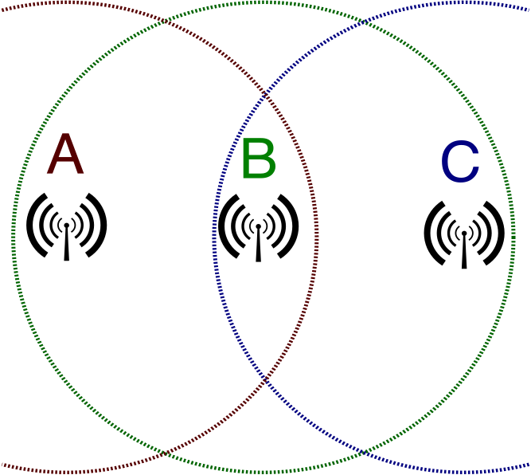
*Fonte: Wikimedia Commons — I nodi A e C non si trovano nel reciproco raggio di copertura (cerchi tratteggiati non sovrapposti), ma entrambi raggiungono B. Le trasmissioni simultanee causano una collisione invisibile ai due mittenti.*

La terza sfida è il **Multipath**: il segnale trasmesso non viaggia solo in linea d'aria, ma si riflette, viene diffratto e disperso (*scattering*) dal suolo e dagli edifici circostanti. Al ricevitore giungono quindi diverse copie del segnale originale, sfalsate temporalmente. Per evitare che questi echi interferiscano con la trasmissione successiva, i pacchetti di impulsi devono essere distanziati nel tempo. L'intervallo minimo richiesto prima di poter inviare un nuovo segnale senza sovrapposizioni si chiama **Tempo di Coerenza** (*Coherence Time* — $T_c$). Il $T_c$ è inversamente proporzionale alla frequenza utilizzata e alla velocità del ricevitore in caso di mobilità: sistemi ad alta frequenza e ricevitori in movimento richiedono guardie temporali più brevi ma più frequenti.

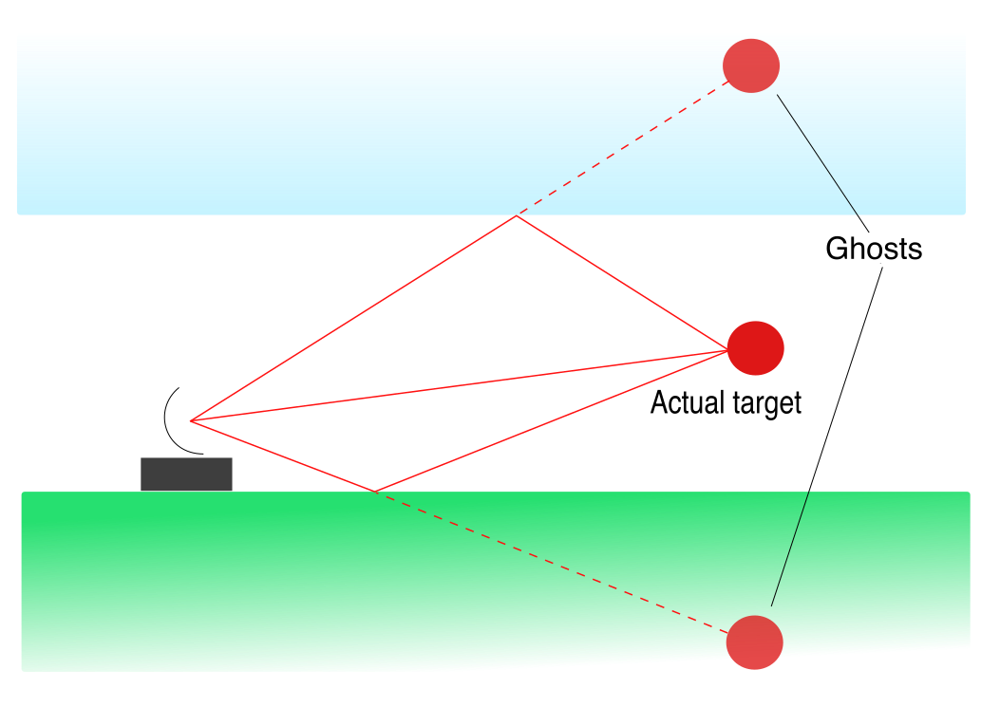
*Fonte: Wikimedia Commons — Il trasmettitore (sinistra) invia il segnale verso il ricevitore (destra) attraverso un percorso diretto e più percorsi riflessi dagli edifici circostanti. Al ricevitore giungono "fantasmi" del segnale sfalsati nel tempo, che possono interferire con la trasmissione successiva.*

Questi tre fenomeni influenzano direttamente il **Bit Error Rate** (*BER*), ovvero la probabilità che un bit trasmesso arrivi errato. Per un dato livello fisico, aumentare la potenza riduce il BER incrementando l'SNR. L'adattamento dinamico dello schema di modulazione in base all'SNR rilevato — tecnica nota come *Adaptive Modulation and Coding* — è uno dei meccanismi fondamentali dei sistemi wireless moderni.

---

## Protocolli per Reti Wireless

Le criticità fisiche descritte sopra creano sfide sistemiche che si ripercuotono su tutti i livelli dello stack protocollare: visibilità limitata della rete da parte del singolo nodo (terminali nascosti e terminali esposti), fallimenti e mobilità dei terminali, limiti intrinseci di batteria e memoria, e il problema della privacy causato dall'intercettazione dei segnali (*eavesdropping*).

Per mitigare questi limiti è necessario adottare meccanismi appositi. Il **CSMA/CD**, protocollo standard per reti cablate Ethernet, non può essere utilizzato: un nodo radio non è in grado di trasmettere e ricevere contemporaneamente per "ascoltare" una collisione nel proprio segnale. È quindi necessario un protocollo MAC alternativo. Serve inoltre la gestione dell'**Hand-off** per la transizione tra Access Point, e complessi protocolli di **Routing multi-hop** (per reti ad hoc) capaci di reagire ai cambiamenti arbitrari della topologia di vicinato (*neighborhood*).

Nello stack dei protocolli per reti wireless, mentre i livelli Applicazione e Trasporto (TCP/UDP) restano identici al mondo cablato, le fondamenta si differenziano profondamente. Il livello di Rete per ecosistemi senza infrastruttura si affida a protocolli speciali come AODV, DSR o DYMO. Il livello Datalink implementa l'accesso al mezzo tramite il protocollo **CSMA/CA** (*Carrier Sense Multiple Access with Collision Avoidance*), appositamente studiato per aggirare le trappole dei collegamenti radio.

```{=latex}
\newpage
```

# Protocolli MAC e Reti Wireless: Da CSMA/CD allo Standard IEEE 802.11

Questo capitolo esplora in modo approfondito l'evoluzione dei protocolli di accesso al mezzo (MAC), partendo dalle fondamenta delle reti cablate fino ad arrivare alle complesse dinamiche delle reti wireless. Analizzeremo le sfide fisiche della trasmissione via radio, introducendo i meccanismi architetturali e i protocolli, come il CSMA/CA e la famiglia IEEE 802.11, che rendono possibile la connettività Wi-Fi moderna.

---

## I Protocolli MAC per le Reti Cablate: Un Riepilogo

Per comprendere le reti wireless, è fondamentale fare un passo indietro e analizzare le assunzioni di base che governano i protocolli MAC (Medium Access Control) nelle tradizionali reti cablate. In questi scenari, si assume generalmente che sia disponibile un **singolo canale condiviso** per tutte le comunicazioni e che tutte le stazioni collegate possano trasmettere e ricevere su di esso. Un principio cardine è che se due o più frame vengono inviati simultaneamente, il segnale risultante sul canale risulterà incomprensibile, generando quella che viene definita una **collisione**. Nelle reti cablate, tutte le stazioni sono fisicamente in grado di rilevare queste collisioni. Nel tempo, sono stati sviluppati diversi protocolli per gestire questo accesso, partendo da ALOHA e slotted ALOHA, fino ad arrivare a CSMA e CSMA/CD.

### Il Protocollo CSMA/CD

Il protocollo **CSMA/CD** (Carrier Sense Multiple Access with Collision Detection) si basa su un'idea fondamentale: "ascoltare prima di parlare". Quando una stazione ha un frame pronto per l'invio, si mette in ascolto sul canale per verificare se qualcun altro sta già trasmettendo. Se il canale risulta occupato, la stazione attende pazientemente che diventi libero (idle). Non appena il mezzo è libero, la stazione inizia a trasmettere il suo frame. Se durante questa fase si verifica una collisione, la stazione interrompe (aborts) immediatamente la trasmissione, attende una quantità di tempo casuale e ripete l'intera procedura.

> [!definition] CSMA/CD — Carrier Sense Multiple Access with Collision Detection
>
> Protocollo di accesso al mezzo che combina l'ascolto preventivo del canale (Carrier Sense) con il rilevamento attivo delle collisioni durante la trasmissione (Collision Detection). Quando viene rilevata una collisione, la trasmissione viene interrotta immediatamente, riducendo lo spreco di banda. È il cuore dello standard IEEE 802.3 Ethernet.

Questo meccanismo di rilevamento precoce fa sì che, se due stazioni percepiscono simultaneamente il canale libero e iniziano a trasmettere, entrambe interrompano l'invio non appena rilevano la sovrapposizione dei segnali, risparmiando così tempo prezioso e larghezza di banda. Per la sua efficienza, il CSMA/CD è stato ampiamente adottato nei sottolivelli MAC delle LAN, diventando il cuore dello standard **IEEE 802.3 Ethernet**.

### Limiti Temporali e Dimensione Minima del Frame

Il comportamento del CSMA/CD impone vincoli fisici ben precisi. Definendo con $T$ il tempo di propagazione necessario per raggiungere la stazione più lontana della rete, nel caso peggiore occorrerà un tempo pari al Round Trip Time ($RTT$), ovvero $2T$, affinché la stazione trasmittente possa rilevare con certezza una collisione.

- Ad esempio, se la stazione A inizia a trasmettere al tempo $t=0$, e la stazione B (la più remota) inizia a trasmettere poco prima che il segnale di A la raggiunga (al tempo $t=T-\delta$), B rileverà la collisione quasi subito, al tempo $t=T$.

- Tuttavia, il fronte d'onda della collisione impiegherà un altro tempo $T$ per viaggiare a ritroso verso A, che si accorgerà del problema solo al tempo $t=2T-\delta$.


Di conseguenza, la stazione A deve obbligatoriamente monitorare il canale per l'intero intervallo di tempo $RTT$ con gli "occhi aperti" per intercettare eventuali interferenze. Una volta che l'intero frame è stato inviato, infatti, la stazione mittente non ne conserva una copia nel buffer MAC e non controlla più il mezzo trasmissivo per eventuali collisioni. Per garantire che la trasmissione duri almeno quanto il tempo $RTT$, è necessario imporre un vincolo sulla **dimensione minima del frame**.

Facciamo un esempio pratico: consideriamo una rete CSMA/CD con una larghezza di banda di 10 Mbps e un tempo massimo di propagazione (inclusi i ritardi hardware) di 25.6 $\mu sec$. Nel caso peggiore, la stazione deve trasmettere per un tempo di trasmissione minimo del frame $T_{fr} = 2 \times T_{p} = 51.2~\mu sec$ per poter intercettare con successo una collisione. Traducendo questo tempo in dati, la dimensione minima del frame risulta essere: 10 Mbps x 51.2 $\mu sec$ = **512 bit**, ovvero **64 byte** (la dimensione minima effettiva adottata nell'Ethernet standard).

### Il Binary Exponential Backoff

Quando avviene una collisione, come si stabilisce il tempo di attesa casuale? Il CSMA/CD utilizza l'algoritmo di **Binary Exponential Backoff**. Il tempo successivo a una collisione viene suddiviso in _contention slots_ (slot di contesa), la cui lunghezza è esattamente pari al tempo di propagazione andata e ritorno nel caso peggiore ($2T$).

- Dopo la prima collisione, ogni stazione coinvolta attende 0 oppure 1 slot in modo casuale prima di riprovare.

- Dopo la collisione iesima ($i$), la stazione sceglie un numero casuale $x$ nell'intervallo $[0, 2^i - 1]$ e salta esattamente $x$ slot prima di un nuovo tentativo.

- Per evitare attese infinite in reti congestionate, dopo 10 collisioni consecutive l'intervallo di randomizzazione viene "congelato" a un massimo di 0..1023.

- Se si raggiungono le 16 collisioni, il livello MAC si arrende e riporta il fallimento della trasmissione ai livelli superiori.


---

## Le Reti Wireless: Sfide e Problemi Strutturali

Nelle reti cablate il rilevamento delle collisioni in fase di trasmissione funziona perfettamente, ma nelle reti wireless questo principio fallisce a causa della natura stessa del mezzo radio. Nelle trasmissioni senza fili, la potenza del segnale decade rapidamente, diminuendo in proporzione al quadrato della distanza.

A causa di questa attenuazione, il segnale emesso dall'antenna del trasmettitore (il _self-signal_) risulta infinitamente più forte rispetto a qualsiasi altro segnale debole in arrivo da una stazione distante. Questo "acceca" il trasmettitore, rendendogli impossibile rilevare una collisione mentre sta inviando dati. Inoltre, le condizioni del canale wireless sono spazialmente diverse tra chi trasmette e chi riceve. Una collisione rilevata dal trasmettitore potrebbe non essere una collisione al ricevitore, e viceversa. Nelle reti wireless, l'unica cosa che conta veramente è l'**interferenza al ricevitore**, non al mittente. Questa limitazione genera due problemi classici della comunicazione radio: il _Terminale Nascosto_ e il _Terminale Esposto_.

### Il Problema del Terminale Nascosto (Hidden Terminal)

> [!definition] Terminale Nascosto (Hidden Terminal)
>
> Si verifica quando due o più stazioni, reciprocamente fuori dal raggio radio l'una dell'altra, trasmettono simultaneamente verso un destinatario comune. Poiché nessuna delle due stazioni riesce a rilevare la trasmissione dell'altra, entrambe credono il canale libero e avviano l'invio, causando una collisione al ricevitore che nessuna delle sorgenti è in grado di percepire.

Immaginiamo quattro stazioni allineate: A, B, C e D. A è in raggio radio con B; B è nel raggio di A e C; C è nel raggio di B e D. Supponiamo che A stia attualmente trasmettendo dei dati a B. C, desiderando trasmettere, si mette in ascolto sul mezzo. Poiché C si trova fisicamente al di fuori del raggio di copertura radio di A, non percepirà alcuna trasmissione in corso. Credendo che il canale sia libero, C avvia una trasmissione (diretta a B o a D). Il risultato è disastroso: i segnali di A e di C si sovrapporranno fisicamente in corrispondenza dell'antenna di B, causando una collisione e distruggendo i dati. In questo scenario, C è incapace di rilevare il potenziale competitore (A) ed è quindi definito come **nascosto** (hidden) rispetto alla comunicazione da A verso B. Il problema del terminale nascosto si verifica quando due o più stazioni, reciprocamente fuori raggio, trasmettono simultaneamente a un destinatario comune. Anche A, per lo stesso motivo legato alla distanza, non si accorgerà della collisione provocata da C.

### Il Problema del Terminale Esposto (Exposed Terminal)

> [!definition] Terminale Esposto (Exposed Terminal)
>
> Si verifica quando una stazione rinuncia inutilmente a trasmettere perché rileva sul canale il segnale di un'altra stazione, pur non essendoci alcun rischio di collisione al ricevitore di destinazione. La stazione "esposta" è in grado di ascoltare una trasmissione vicina ma irrilevante, e ne viene erroneamente bloccata dall'invio di frame del tutto legittimi verso un destinatario distante.

Consideriamo la stessa topologia (A, B, C, D). Questa volta, B sta trasmettendo dati verso A, e parallelamente C desidera inviare un messaggio a D. C, mettendosi in ascolto, rileva forte e chiaro il segnale di B. Applicando ciecamente le regole del CSMA, C conclude erroneamente di non poter trasmettere verso D, per paura di creare una collisione. In realtà, se C iniziasse a trasmettere, il suo segnale raggiungerebbe D senza problemi, e le due trasmissioni (da B verso A, e da C verso D) potrebbero avvenire perfettamente in parallelo senza disturbarsi a vicenda (le loro "zone di interferenza" ai ricevitori non si sovrappongono in modo distruttivo). In questo caso, C è un terminale **esposto** alla comunicazione tra B e A. Il problema del terminale esposto impedisce a una stazione trasmittente di inviare frame del tutto legittimi a causa dell'ascolto di un'interferenza locale generata da un'altra stazione.

Il fatto che non si possa verificare lo stato del canale al ricevitore semplicemente mettendosi in ascolto dal trasmettitore rende palese la necessità di progettare protocolli MAC sensibilmente diversi da quelli delle classiche reti LAN cablate.

---

## I Protocolli MACA e MACAW: Evitare le Collisioni

Per mitigare le problematiche descritte, nel 1990 Phil Karn presentò un protocollo rivoluzionario chiamato **MACA** (Multiple Access with Collision Avoidance), originariamente concepito per il "packet radio". L'idea fondante del MACA non è quella di rilevare le collisioni, ma di prevenirle stimolando il ricevitore a inviare un breve frame di controllo prima che inizi la trasmissione dei dati veri e propri (molto più lunghi). Le stazioni vicine, sentendo questo frame di controllo, si asterranno dal trasmettere durante il successivo invio dei dati.

### Il Meccanismo RTS / CTS

Il funzionamento si basa su uno scambio di messaggi denominato RTS/CTS:

1. **RTS (Request To Send):** Quando la stazione A desidera inviare dati a B, invia prima un breve pacchetto RTS indirizzato a B. Questo pacchetto non è generico, ma contiene l'ID della sorgente, l'ID della destinazione e, fattore cruciale, la lunghezza (durata) del frame dati che seguirà. Tutte le stazioni nel raggio di A (ad esempio C ed E) riceveranno questo RTS.

2. **CTS (Clear To Send):** Se B riceve l'RTS ed è pronto e desideroso di ricevere il messaggio, risponde trasmettendo un pacchetto CTS. Anche il CTS è un frame molto breve che copia e diffonde l'informazione sulla lunghezza dei dati ricevuta nell'RTS. Questo CTS verrà ascoltato da A (che ottiene così il permesso di procedere), ma anche da tutte le stazioni nel raggio di B (ad esempio D ed E).

3. Alla ricezione del frame CTS, la stazione A inizia a trasmettere il frame dati vero e proprio in totale sicurezza.

> [!tip] Insight chiave del meccanismo RTS/CTS
>
> Il meccanismo RTS/CTS risolve entrambi i problemi topologici in modo elegante: il terminale nascosto viene messo a tacere dal CTS del ricevitore (che esso sente, anche se non ha sentito l'RTS del mittente), mentre il terminale esposto viene liberato dall'obbligo di silenzio perché sente l'RTS ma non il CTS (e quindi deduce che la ricezione avviene fuori dalla sua area di influenza). Il canale viene così "prenotato" in modo distribuito, senza coordinamento centralizzato.

Vediamo come il MACA risolve i problemi topologici precedenti:

- **Gestione dell'Esposto (C):** La stazione C ascolta l'RTS inviato da A, ma, essendo troppo lontana da B, non sentirà mai il relativo CTS. Deduce quindi di essere un terminale esposto, comprende che la ricezione avverrà lontano dalla sua area di influenza ed è quindi del tutto libera di iniziare una propria trasmissione.

- **Gestione del Nascosto (D):** La stazione D non ascolta l'RTS di A, ma riceve forte e chiaro il CTS di risposta inviato da B. D capisce immediatamente che B è in procinto di ricevere dati e che una sua trasmissione disturberebbe B. Pertanto, D si silenzia disciplinatamente fino al completamento della trasmissione del frame dati (calcolando il tempo di attesa in base alla durata dichiarata nel CTS).

- Se una stazione centrale come E ascolta sia l'RTS che il CTS, sa ovviamente di dover rimanere in silenzio per non disturbare la delicata operazione in corso.


Nel MACA, le collisioni possono ancora avvenire? Assolutamente sì, ma **solo tra pacchetti RTS** (ad esempio se C e B inviano un RTS simultaneamente verso A). Quando due RTS collidono, il destinatario non genererà alcun CTS. Il grande vantaggio è che in queste collisioni non viene perso alcun dato applicativo (NO DATA information is lost) e, dato che gli RTS sono brevissimi (circa 20 byte), il canale viene tenuto occupato e sprecato solo per una frazione di tempo minuscola. In caso di collisione di RTS, i mittenti rinviano i messaggi utilizzando anch'essi la tecnica del **Binary Exponential Backoff** mutuata dall'Ethernet.

### L'Evoluzione: MACAW e l'Integrazione nel CSMA/CA

Il MACA originario è stato successivamente affinato dando vita al protocollo **MACAW** (MACA for Wireless LANs), documentato da Bharghavan et al. nel 1994. Il MACAW ha introdotto miglioramenti fondamentali:

- L'introduzione di un frame **ACK (Acknowledgement)** inviato dal ricevitore per confermare esplicitamente la ricezione corretta del frame dati.

- Meccanismi di condivisione delle informazioni (come i contatori di backoff) tra le stazioni per garantire un'allocazione equa (fair) del throughput.


La combinazione dei concetti del MACAW con l'aggiunta di una fase preventiva di "Carrier Sensing" (per evitare di inviare pacchetti RTS inutili in un canale già visibilmente saturo) ha dato vita al protocollo **CSMA/CA** (Carrier Sense Multiple Access with Collision Avoidance), che è il cuore pulsante dello standard IEEE 802.11 moderno.

### Esercizio Pratico: Topologia di Rete

Per testare la comprensione del meccanismo RTS/CTS, si consideri la seguente topologia di rete a grafo: il nodo A è connesso a B e C; il nodo D forma uno snodo centrale connesso a B, C, E, F; E è connesso a D e F; F è connesso a D e E. Applicando le regole appena spiegate:

1. In una trasmissione da E verso D, le stazioni B, C e F riceverebbero il CTS da D ma non l'RTS da E (agendo come terminali nascosti da proteggere).

2. Se D ascolta un RTS da E ma non il relativo CTS (ad esempio se E sta contattando F), D deduce di essere un terminale esposto rispetto a E.

3. Similmente, se B ascolta un CTS da D senza aver sentito alcun RTS, deve silenziarsi temporaneamente. Per esplorare appieno questi casi, gli studenti possono avvalersi delle simulazioni interattive per reti 802.11 (con o senza terminali nascosti) fornite durante il corso.


---

## Lo Standard IEEE 802.11 (Wi-Fi) e la sua Architettura

L'**IEEE** (Institute of Electrical and Electronics Engineers) è l'ente principale a livello mondiale per la standardizzazione delle reti locali (LAN). All'interno di questo ecosistema, il progetto IEEE 802 è gestito dall'IEEE 802 Working Group. La filosofia architetturale prevede che il sottolivello LLC (Logical Link Control) e i livelli superiori (es. Rete/IP, Trasporto/TCP o UDP, Applicazione) rimangano comuni tra le diverse tecnologie, mentre i livelli inferiori (il sottolivello MAC e il livello Fisico) vengano specializzati in base al mezzo trasmissivo adottato. Così come lo standard IEEE 802.3 definisce l'Ethernet CSMA/CD su cavo (UTP, STP, fibra), la famiglia **IEEE 802.11** definisce lo standard per le reti Wireless LAN (universalmente note con il marchio commerciale **Wi-Fi**) che utilizzano la trasmissione radio. Altri standard noti includono l'802.15 (Wireless PAN, come il Bluetooth) e l'802.16 (Broadband wireless, WiMAX).

### L'Evoluzione della Famiglia 802.11

Tutte le reti 802.11 operano sfruttando canali radio collocati nelle bande **ISM** (Industrial, Scientific, and Medical) o **U-NII** (Unlicensed National Information Infrastructure), comunemente nelle frequenze dei 900 MHz, 2.4 GHz e 5 GHz, garantendo progressivamente decine fino a migliaia di Mbit/s di capacità. Ripercorriamo l'evoluzione storica del livello fisico (PHY):

- **IEEE 802.11 (Legacy mode):** Rilasciato originariamente nel 1997 e chiarito nel 1999. Operava nella banda dei 2.4 GHz offrendo data rate molto bassi (1-2 Mbps) implementati tramite raggi infrarossi (IR) o frequenze radio. Avendo troppi gradi di libertà implementativi, poneva severi problemi di interoperabilità ed è oggi considerato obsoleto.

- **IEEE 802.11a:** Rilasciato nel 1999, è stato pioniere dell'uso della banda a 5 GHz (U-NII), offrendo un throughput tipico di 23 Mbps e un tetto massimo di 54 Mbps.

- **IEEE 802.11b:** Contemporaneo alla versione 'a' (1999), divenne lo standard di massa iniziale. Operando a 2.4 GHz (massimo 11 Mbps), implementava schemi di modulazione specifici per limitare le forti interferenze in quella banda affollata (telefoni cordless, microonde, ecc.).

- **IEEE 802.11g:** Introdotto nel 2003, mantenne l'uso della banda a 2.4 GHz ma aumentò la velocità fino a 54 Mbps.

- **IEEE 802.11n (WiFi 4):** Rilasciato nel 2009, ha introdotto il rivoluzionario supporto alla tecnologia **MIMO** (multiple-input multiple-output). Usando più antenne in trasmissione e ricezione contemporaneamente sia a 2.4 GHz che a 5 GHz, ha spinto il data rate massimo fino a 248 Mbps (e teoricamente 600 Mbps) estendendo la portata.

- **IEEE 802.11ac (WiFi 5):** Standardizzato nel 2013, si concentra esclusivamente sui 5 GHz, superando la barriera del gigabit (fino a 1.3 Gbps per flussi base, fino a 3.47 Gbps massimi).

- **IEEE 802.11ax (WiFi 6):** Rilasciato intorno al 2019/2020, supporta 2.4 GHz, 5 GHz e introduce i 6 GHz. Progettato per efficienza estrema in ambienti densi, raggiunge fino a 10-14 Gbps, con sensibili miglioramenti nel consumo energetico dei dispositivi e nei protocolli di sicurezza.

- _(Menzioni speciali):_ Versioni come 802.11af (2014, che sfrutta le bande TV inutilizzate) e 802.11ah (2017, per applicazioni a 900 MHz a lunghissimo raggio fino a 1 Km) si rivolgono ad ambiti specialistici o all'IoT.


|**Standard**|**Anno**|**Max Data Rate**|**Copertura (Range)**|**Frequenza**|
|---|---|---|---|---|
|**802.11b**|1999|11 Mbps|30 m|2.4 GHz|
|**802.11g**|2003|54 Mbps|30 m|2.4 GHz|
|**802.11n (WiFi 4)**|2009|600 Mbps|70 m|2.4, 5 GHz|
|**802.11ac (WiFi 5)**|2013|3.47 Gbps|70 m|5 GHz|
|**802.11ax (WiFi 6)**|2020|14 Gbps|70 m|2.4, 5 GHz|
|**802.11af**|2014|35-560 Mbps|1 Km|Bande TV (54-790 MHz)|
|**802.11ah**|2017|347 Mbps|1 Km|900 MHz|
|Tabella riassuntiva delle specifiche IEEE 802.11. Tutti utilizzano CSMA/CA e supportano configurazioni base-station o reti ad-hoc.|||||

### Elementi Architetturali: BSS ed ESS

Dal punto di vista della struttura della rete, il blocco logico fondamentale dell'802.11 è il **BSS (Basic Service Set)**. Un BSS è semplicemente un gruppo di stazioni wireless in grado di comunicare tra loro sotto il controllo di una singola funzione di coordinamento. Esistono due modalità operative principali per un BSS:

1. **Rete Ad-Hoc:** L'infrastruttura di controllo è assente. Le stazioni comunicano direttamente e pariteticamente (peer-to-peer) l'una con l'altra.

2. **Rete Infrastrutturata:** È presente una stazione base specializzata chiamata **AP (Access Point)**. Tutte le comunicazioni, anche tra due host della stessa cella, vengono obbligatoriamente incanalate e gestite attraverso l'AP.


Per formare reti più vaste, più BSS vengono interconnessi tra loro creando un **ESS (Extended Service Set)**. In questo scenario, gli Access Point fungono da ponti e forniscono connettività inter-cella instradando il traffico attraverso un'infrastruttura fissa (solitamente cablata) denominata **DS (Distribution System)**.

### Selezione del Canale e Meccanismi di Associazione

Lo spettro radio assegnato al Wi-Fi è logicamente suddiviso in vari canali operanti a frequenze leggermente diverse. L'amministratore di rete configura manualmente o automaticamente la frequenza in cui opera un determinato AP. Un problema tipico di progettazione si verifica quando AP limitrofi (vicini fisicamente) vengono configurati sullo stesso canale, generando interferenze distruttive tra le celle.

Quando un dispositivo wireless (es. smartphone o laptop) arriva in un'area coperta, deve associarsi a un AP prima di poter navigare. Questo avviene tramite una fase di scansione dei canali (scansione alla ricerca della rete e del suo **SSID** - Service Set Identifier, oltre all'indirizzo MAC dell'AP noto come BSSID). Esistono due modalità di scansione:

1. **Scansione Passiva (Passive Scanning):** L'host si mette in ascolto silente dei _beacon frames_ periodicamente e automaticamente trasmessi dagli AP circostanti. Una volta ricevuti i beacon, l'host sceglie tipicamente l'AP il cui segnale arriva con la massima potenza (highest signal strength). A questo punto, l'host invia all'AP selezionato un frame di _Association Request_, e attende in risposta un frame di _Association Response_.

2. **Scansione Attiva (Active Scanning):** L'host assume l'iniziativa e invia attivamente in broadcast un _Probe Request frame_ su vari canali. Gli AP nel raggio d'azione che ricevono la richiesta rispondono con _Probe Response frames_. L'host valuta le risposte, sceglie l'AP e avvia il classico handshake inviando l' _Association Request_ e ricevendo la _Association Response_.


Completata l'associazione, la stazione segue tipicamente le normali procedure di autenticazione di sicurezza e avvia un client DHCP per ottenere un indirizzo IP valido nella sottorete gestita dall'AP.

---

## Il Sottolivello MAC 802.11: DCF, PCF e Dinamiche CSMA/CA

Il sottolivello MAC dello standard IEEE 802.11 è diviso in due funzioni architetturali ben distinte che determinano le modalità di accesso al mezzo: la DCF e la PCF.

- **PCF (Point Coordination Function):** È un modulo opzionale che si posiziona concettualmente "sopra" il livello DCF e gestisce servizi _contention-free_ (ovvero privi di collisioni) in modo centralizzato, controllando rigorosamente i turni di trasmissione degli host.

- **DCF (Distributed Coordination Function):** È il fondamento universale del MAC 802.11. È sempre disponibile in ogni rete (ad-hoc o infrastrutturata) e gestisce l'accesso _contention-based_ tramite il protocollo **CSMA/CA**. Essendo un sistema decentralizzato e distribuito, le collisioni sono ovviamente una possibilità reale.


### Il Carrier Sensing: Fisico e Virtuale (NAV)

Nel CSMA/CA, prima di trasmettere, una stazione deve necessariamente accertarsi che il canale sia libero eseguendo il **Carrier Sensing**. Questo avviene su due livelli interconnessi:

1. **Sensore Fisico (Physical CS):** L'hardware analizza la frequenza per rilevare energia o intercettare l'arrivo di un segnale elettromagnetico, stabilendo se c'è attività nel canale dovuta ad altre fonti.

2. **Sensore Virtuale (Virtual CS):** È il meccanismo logico software. Il protocollo prevede l'inserimento di precise informazioni sulla durata temporale della comunicazione nell'header dei primissimi byte di frame come RTS, CTS e pacchetti Dati generici. Ascoltando queste durate, ogni stazione aggiorna una variabile locale chiamata **NAV** (Network Allocation Vector). Il NAV funge da timer: indica al sistema per quanto tempo il canale sarà "virtualmente occupato" e quanto bisogna aspettare prima di poter persino pensare di campionare nuovamente lo stato fisico del mezzo.


Basta che uno solo dei due sensori (Fisico o Virtuale/NAV) dia esito "occupato", affinché la stazione consideri l'intero canale indisponibile (busy).

### Gli Interframe Spaces (IFS) e le Priorità

Nel mondo 802.11, il concetto di "canale libero" è strettamente legato ai tempi. L'accesso prioritario al mezzo è regolamentato imponendo l'uso di periodi obbligatori di attesa e inattività chiamati **IFS** (Interframe Space). Lo standard definisce durate precise:

- **DIFS (Distributed IFS):** È un intervallo temporale "lungo". È il tempo minimo di default che una stazione normale deve attendere (misurando canale ininterrottamente libero) prima di poter avviare una trasmissione regolare.

- **SIFS (Short IFS):** È un intervallo temporale "brevissimo". Viene utilizzato esclusivamente come tempo di attesa prima di inviare pacchetti critici e ad altissima priorità, come i CTS o i messaggi di conferma ACK. Poiché rigorosamente **SIFS < DIFS**, la stazione che sta completando un handshake (es. sta per inviare un ACK) riuscirà sempre a prendere possesso del canale prima che le altre stazioni in attesa finiscano di contare il proprio lungo periodo DIFS, garantendo l'assenza di interruzioni durante le transazioni.


### L'Algoritmo CSMA/CA in Azione

Sintetizziamo i passaggi della DCF per trasmettitore e ricevitore:

1. **Attesa Iniziale:** Se la stazione mittente percepisce il canale costantemente libero per un periodo pari almeno al DIFS, trasmette l'intero frame dati (ricordiamo, senza collision detection).

2. **Backoff Randomico:** Se invece il canale risulta occupato (fisicamente o tramite NAV), la stazione fa partire un tempo di backoff casuale. Questo timer scorre alla rovescia (counts down) solamente mentre il canale risulta libero; si congela istantaneamente se un'altra stazione inizia a trasmettere. Quando il timer raggiunge lo zero (ed è trascorso anche il DIFS), la stazione trasmette.

3. **Il ruolo dell'ACK:** Ricevuto correttamente un frame, il destinatario attende il breve tempo SIFS e risponde immediatamente con un pacchetto ACK per confermare l'avvenuto recapito (l'ACK è vitale in wireless a causa delle perdite naturali e dei terminali nascosti).

4. **Gestione delle Collisioni:** Cosa succede se l'ACK non arriva? Il mittente assume che si sia verificata una collisione (o una perdita per attenuazione). Si innesca la penalità: il mittente incrementa l'intervallo casuale di backoff (raddoppiandolo ad ogni tentativo fallito secondo la logica Binary Exponential Backoff), aspetta il DIFS e ritenta la procedura.


_Nota sull'inefficienza delle collisioni semplici:_ Se avviene una collisione e l'RTS/CTS non viene impiegato, poiché nessuna stazione è in grado di interrompere la trasmissione a metà, l'intero frame dati verrà completamente sprecato, "sprecando" una massiccia porzione di larghezza di banda, specialmente se il frame era molto grande.

### RTS e CTS nello Standard IEEE 802.11

Per evitare l'enorme spreco di risorse causato dalle collisioni sui frame dati primari, l'implementazione 802.11 permette di "prenotare" (reserve) il mezzo trasmissivo utilizzando i mini-pacchetti RTS e CTS (descritti nel MACA). L'host invia prima l'RTS in modalità CSMA; l'AP di destinazione diffonde in broadcast un CTS per notificare l'autorizzazione e zittire tutte le altre stazioni (che aggiornano il loro NAV), permettendo poi la trasmissione incontrastata dei dati. Anche qui, se due RTS collidono per il possesso (reservation collision), solo i pacchettini corti vanno persi.

Gli amministratori di rete possono configurare la modalità DCF per gestire l'RTS/CTS in tre modi differenti (RTS Threshold):

1. **Mai (Never):** Non si usano RTS/CTS. Questa impostazione è eccellente per reti con carico di traffico estremamente leggero, in cui il ritardo aggiunto dallo scambio RTS/CTS sarebbe inutile e inefficiente.

2. **Soglia di dimensione:** RTS/CTS viene abilitato unicamente per messaggi "lunghi", ovvero quando la dimensione del pacchetto supera un certo limite (RTS Threshold) calcolato dall'amministratore.

3. **Sempre (Always):** L'uso dell'RTS/CTS è imposto per ogni trasmissione. È l'impostazione raccomandata in condizioni di altissimo carico e densità sul mezzo wireless per minimizzare le disastrose probabilità di sovrapposizione e la gestione dei nodi nascosti.


---

> [!abstract] Riepilogo dei Concetti Chiave
>
> Nelle LAN cablate (802.3) il rilevamento delle collisioni avviene direttamente durante la trasmissione (CSMA/CD), bloccando tempestivamente l'invio. Nelle WLAN (802.11) questo è fisicamente precluso a causa dell'attenuazione del segnale radio, per cui si adottano tecniche di "Avoidance" preventivo basate su ACK obbligatori (CSMA/CA). I problemi strutturali del mezzo radio — terminale nascosto ed esposto — derivano dall'impossibilità di verificare lo stato del canale al ricevitore ascoltando dal trasmettitore; entrambi vengono gestiti tramite il meccanismo di prenotazione del canale MACA/MACAW integrato nello standard 802.11 attraverso lo scambio RTS/CTS. Il Virtual Carrier Sensing e il NAV garantiscono il blocco totale delle trasmissioni indesiderate attraverso timer logici interni che propagano in modo distribuito la durata delle comunicazioni in corso. L'architettura unificata dello standard IEEE 802.11 — basata su BSS e ESS, tempi di attesa differenziati (SIFS vs DIFS) e Backoff Esponenziale — opera sulle bande ISM/U-NII libere da licenze, consentendo la connettività Wi-Fi moderna in una vasta gamma di scenari, dalle reti ad-hoc alle infrastrutture enterprise.

```{=latex}
\newpage
```

# Mobile Networks: dalle reti cellulari al 4G/5G

Questa lezione introduce i fondamenti dell'architettura delle reti cellulari moderne, ripercorrendo l'evoluzione storica dal 1G fino al 5G e proiettandosi verso il 6G. Il filo conduttore è capire come ogni generazione abbia trasformato non solo la velocità di trasmissione, ma soprattutto il modello architetturale: dalla commutazione a circuito puramente analogica del 1G, alla **all-IP core** del 4G LTE, fino alla **Service Based Architecture** cloud-native del 5G. Lungo questo percorso emergono i meccanismi che rendono le reti cellulari peculiari rispetto a Internet cablata: la mobilità come servizio nativo di prima classe, il tunneling per preservare gli indirizzi IP durante gli spostamenti, l'autenticazione mutua basata sulla SIM e la separazione netta tra piano di controllo e piano dati.

> [!note] Riferimenti bibliografici
>
> Le slide sono un libero adattamento del libro **"Computer Networking: A Top-Down Approach"** (8ª edizione, 2020) di **James F. Kurose** e **Keith W. Ross**. Per l'architettura 5G il riferimento è **"5G Mobile Networks: A Systems Approach"** di **Larry Peterson** e **Oguz Sunay** (CC BY-NC-ND 4.0). Il quadro evolutivo verso il 6G riprende: Zakria Qadir et al., *"Towards 6G Internet of Things: Recent advances, use cases, and open challenges"*, ICT Express, Elsevier, Giugno 2023.

---

## L'evoluzione delle reti cellulari: dal 1G al 6G

Le reti cellulari hanno attraversato in quattro decenni una trasformazione che le ha portate da semplici sistemi di telefonia analogica a infrastrutture distribuite per l'Internet of Things globale. Ogni "generazione" non rappresenta solo un salto di velocità ma un ripensamento dell'architettura.

Il **1G** degli anni '80 (standard AMPS, TACS) trasportava solo voce in formato analogico, multiplexato in frequenza (FDMA), con copertura e sicurezza molto limitate. Negli anni '90 il **2G** introduce la voce digitale (GSM, CDMA) con multiplexing combinato TDM+FDM e gli SMS; con l'estensione **2.5G/GPRS** (General Packet Radio Service) si affaccia per la prima volta il concetto di **commutazione a pacchetto per i dati**, accanto alla commutazione a circuito che continua a gestire la voce. Il **3G** degli anni 2000 (UMTS, CDMA2000, HSPDA) porta l'accesso Web in mobilità: la rete voce resta a circuito ma in parallelo opera una rete dati a pacchetto.

La svolta architetturale arriva con il **4G** (LTE Advanced, anni 2010): tutto il traffico — voce inclusa — viaggia su un **All-IP core**, tunnelizzato come pacchetti IP dalla Base Station al gateway. Cade la separazione fra rete voce e rete dati e si introduce la separazione fra piano di controllo e piano dati. Il **5G** degli anni 2020 (5G NR) ridisegna il core in chiave cloud-native (**Service Based Architecture**), introduce il **network slicing** per partizionare logicamente la rete, e sfrutta sia frequenze sub-6 GHz sia onde millimetriche (mmWave). Il **6G**, atteso intorno al 2030, è già oggetto di ricerca e punta a un ecosistema "fully-connected" potenziato da AI con architetture *cell-less*.

| Gen | Anni | Standard | Velocità | Accesso | Voice switch | Data switch | Caratteristiche |
|---|---|---|---|---|---|---|---|
| **1G** | 1980s | AMPS, TACS | 2.4 kbps | FDMA | Circuit | Circuit | Voce analogica, copertura limitata |
| **2G** | 1990s | GSM, CDMA, EDGE | 64 kbps | TDM+FDM | Circuit | Circuit | Voce digitale + SMS |
| **2.5G** | fine '90s | GPRS | — | — | Circuit | Packet | Prima commutazione a pacchetto sui dati |
| **3G** | 2000s | UMTS, CDMA2000, HSPDA | fino a 2 Mbps | CDMA | Circuit | Packet | Web in mobilità |
| **4G** | 2010s | LTE Advanced | 100–1000 Mbps | OFDMA | Packet | Packet | All-IP core, tunneling, separazione control/data |
| **5G** | 2020s | 5G NR | fino a ~20 Gbps | OFDMA + mmWave | Packet | Packet | SBA, network slicing, sub-6 GHz + mmWave |
| **6G** | 2030s (prev.) | — | ~1 Tbps | — | — | — | Cell-less, AI-native, fully-connected |

> [!tip] La traiettoria di fondo
>
> A ogni generazione la rete diventa più simile a Internet: prima si introduce la commutazione a pacchetto sui dati (2.5G), poi anche sulla voce (4G), poi si modularizza il core in microservizi (5G). La direzione è quella di una rete cellulare **indistinguibile da un cloud distribuito**, dove la mobilità è una feature applicativa e non un'eccezione.

---

## Diffusione e standardizzazione delle reti 4G/5G

Le reti 4G/5G sono oggi la soluzione standard per l'Internet mobile su area geografica ampia. Già nel 2019 i dispositivi connessi via banda larga mobile superavano quelli a banda larga fissa con un rapporto di **5 a 1**. La disponibilità del 4G ha raggiunto il **97% del tempo in Corea** e il **90% negli Stati Uniti**, con velocità tipiche di **20 Mbps e oltre**. La standardizzazione tecnica è curata dal consorzio **3GPP** (3rd Generation Partnership Project), che definisce in particolare lo standard **LTE (Long-Term Evolution)** per il 4G e il **5G NR (New Radio)** per il 5G.

---

## Architettura di alto livello: RAN, Backhaul, Mobile Core

L'architettura di una rete cellulare 4G/5G si scompone in tre blocchi funzionali che collaborano per portare un pacchetto IP dal dispositivo dell'utente fino a Internet (e viceversa):

- **Radio Access Network (RAN)** — è la "rete d'accesso" radio: una collezione distribuita di **Base Station** (stazioni base) che gestiscono lo spettro radio condiviso fra i dispositivi all'interno della loro **cella** di copertura.
- **Backhaul Network** — interconnette la RAN con il Mobile Core. Tipicamente cablata in fibra ottica, ma sono in arrivo soluzioni wireless integrate (Integrated Access Backhaul, IAB).
- **Mobile Core Network** — fornisce connettività IP per dati e voce, garantisce i requisiti di **QoS**, traccia la mobilità per assicurare un servizio ininterrotto e gestisce billing & charging. Si chiama **Evolved Packet Core (EPC)** in 4G e **NG-Core** in 5G.

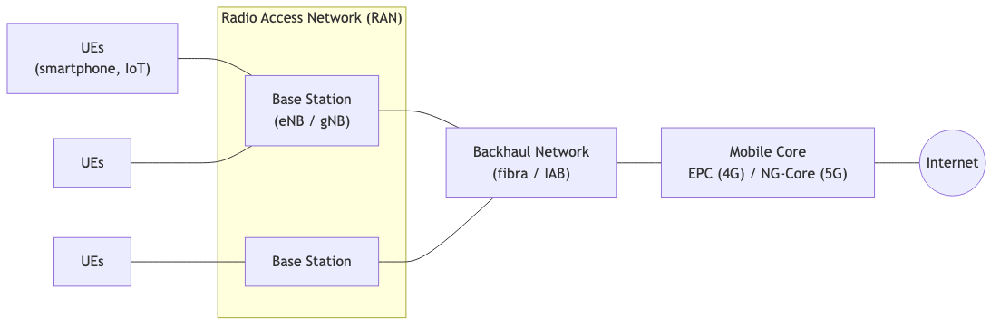
*Fig. — I tre blocchi dell'architettura cellulare. La RAN gestisce lo spettro, il backhaul è il "trasporto" verso l'interno della rete, il Mobile Core fa da gateway verso Internet e custodisce le funzioni di mobilità, autenticazione e charging.*

---

## Gli elementi dell'architettura 4G LTE

L'architettura 4G LTE è comunemente chiamata **all-IP Enhanced Packet Core (EPC)**. Vale la pena entrare nel dettaglio dei suoi componenti, perché molti concetti sopravvivono inalterati anche in 5G (cambiando solo nome o granularità).

### User Equipment (UE)

> [!definition] UE — User Equipment
>
> Con **UE** si intende qualsiasi dispositivo terminale dotato di radio 4G LTE: smartphone, tablet, laptop, dispositivo IoT. Implementa l'**intero stack Internet a 5 livelli**. La sua identità globale è l'**IMSI** (International Mobile Subscriber Identity), un codice a 64 bit memorizzato sulla **SIM** (Subscriber Identity Module). L'IMSI identifica univocamente l'abbonato nel sistema cellulare mondiale, codificando la nazione e il carrier "home".

### Base Station (eNode-B)

La Base Station si trova al "margine" (*edge*) della rete del carrier: gestisce le risorse radio wireless e i dispositivi all'interno della propria **cella**, e coordina l'autenticazione del dispositivo interfacciandosi con gli altri elementi del core. Rispetto a un Access Point Wi-Fi, però, il suo ruolo è molto più attivo:

- coordina gli **handover** del dispositivo tra celle adiacenti, mantenendo le sessioni in corso;
- collabora con le Base Station vicine per **minimizzare le interferenze radio**;
- crea **tunnel IP specifici per ogni dispositivo** verso i gateway del core;
- gestisce direttamente la mobilità intercella.

In gergo LTE è chiamata **eNode-B** (evolved NodeB).

### Mobility Management Entity (MME)

L'MME è il "cervello" del piano di controllo. Coordina l'**autenticazione bidirezionale** (dispositivo → rete e rete → dispositivo) interfacciandosi con l'HSS della rete *home* dell'utente. Si occupa inoltre della gestione del dispositivo: **handover** fra celle, **tracking/paging** della posizione, e setup dei percorsi (tunneling) verso S-GW e P-GW.

### Home Subscriber Service (HSS)

> [!definition] HSS — Home Subscriber Service
>
> Database centrale che contiene tutte le informazioni sugli abbonati. Memorizza i dati dei dispositivi per i quali la rete in cui si trova l'HSS è la **home network** ("rete di casa"), e collabora strettamente con l'MME nelle procedure di autenticazione.

### Serving Gateway (S-GW)

L'S-GW si trova **sul percorso dei dati** fra dispositivo mobile e Internet. Si occupa dell'inoltro dei pacchetti IP da/verso la RAN e funge da **Local Mobility Anchor**: quando un utente si sposta da un eNode-B a un altro all'interno della stessa rete, l'S-GW fa da "ancora locale" della sessione, cosicché l'handover risulti trasparente ai livelli superiori.

### PDN Gateway (P-GW)

Il **Packet Data Network Gateway** connette il core 4G alle reti dati esterne — tipicamente Internet o reti aziendali private. È **l'ultimo elemento LTE** che un datagramma incontra prima di entrare nella Internet pubblica. Si comporta come un router gateway "normale", ma con responsabilità aggiuntive: **NAT**, applicazione di policy, traffic shaping, charging.

> [!note] S-GW e P-GW co-locati
>
> Nelle implementazioni reali S-GW e P-GW possono essere co-localizzati sullo stesso nodo fisico. Le specifiche 3GPP permettono molte configurazioni: ad esempio un'unica coppia MME/P-GW può servire un'intera area metropolitana, mentre gli S-GW vengono distribuiti su ~10 siti edge cittadini, ciascuno a servizio di ~100 stazioni base.

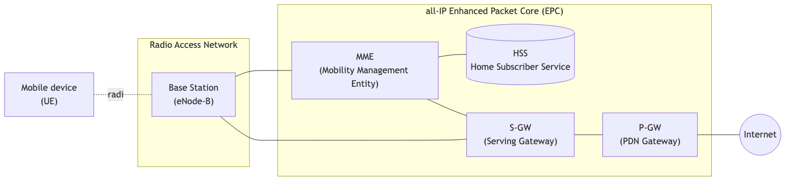
*Fig. — Topologia logica del 4G LTE. In rosso scuro le interfacce di controllo (verso MME e HSS), il piano dati attraversa BS → S-GW → P-GW → Internet.*

---

## Separazione tra Control Plane e Data Plane

Una caratteristica distintiva dell'architettura LTE è la **netta separazione fra Piano di Controllo e Piano Dati**. Questa scelta — ereditata e amplificata in 5G — riflette principi di Software Defined Networking: chi prende le decisioni (MME, HSS) è disaccoppiato da chi inoltra i pacchetti (S-GW, P-GW).

La Base Station si trova esattamente sull'incrocio dei due piani, e inoltra **sia pacchetti di controllo sia pacchetti utente** fra Mobile Core e UE.

- Nel **Piano di Controllo**, i pacchetti viaggiano tunnellizzati su **SCTP/IP** (Stream Control Transmission Protocol, RFC 4960). SCTP è un'alternativa affidabile a TCP, progettata per trasportare la **segnalazione** delle reti telefoniche; gestisce le procedure di registrazione, tracking e autenticazione.
- Nel **Piano Dati**, i pacchetti utente sono incapsulati nei tunnel **GTP-U** (General Packet Radio Service Tunneling Protocol — User plane), un protocollo 3GPP che opera **sopra UDP**.

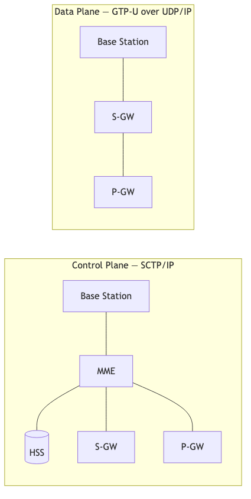
*Fig. — Separazione Control Plane / Data Plane in LTE. Il control plane (sopra) trasporta segnalazione su SCTP fra BS, MME, HSS e gateway; il data plane (sotto) trasporta i pacchetti utente in tunnel GTP-U attraverso BS → S-GW → P-GW.*

> [!tip] Perché la separazione è cruciale
>
> Disaccoppiare control e data plane permette di scalarli indipendentemente: si possono aggiungere S-GW per assorbire più traffico utente senza toccare MME/HSS. Inoltre apre la strada alla **virtualizzazione** delle funzioni di controllo (NFV), che in 5G diventa il principio architetturale dominante.

---

## Il tunneling GTP: come la rete supporta la mobilità

Il datagramma originario emesso dall'UE viene **incapsulato con GTP** e spedito dentro un datagramma **UDP** verso l'S-GW; l'S-GW lo *re-incapsula* e lo invia al P-GW, che lo "scarta" l'incapsulamento e lo immette su Internet. Le sessioni vengono identificate dal **TEID** (Tunnel Endpoint Identifier).

> [!tip] Perché il tunneling GTP abilita la mobilità
>
> Il tunneling GTP risolve il problema della mobilità IP in modo molto elegante: incapsulando il datagramma dell'utente dentro un nuovo pacchetto UDP/GTP, gli **indirizzi IP visibili a Internet rimangono fissi** (quelli dell'S-GW e del P-GW). Quando l'utente cambia cella o si sposta in un'altra area, basta **aggiornare gli endpoint del tunnel** — il dispositivo mantiene il suo indirizzo IP e le sessioni TCP attive non vengono interrotte.

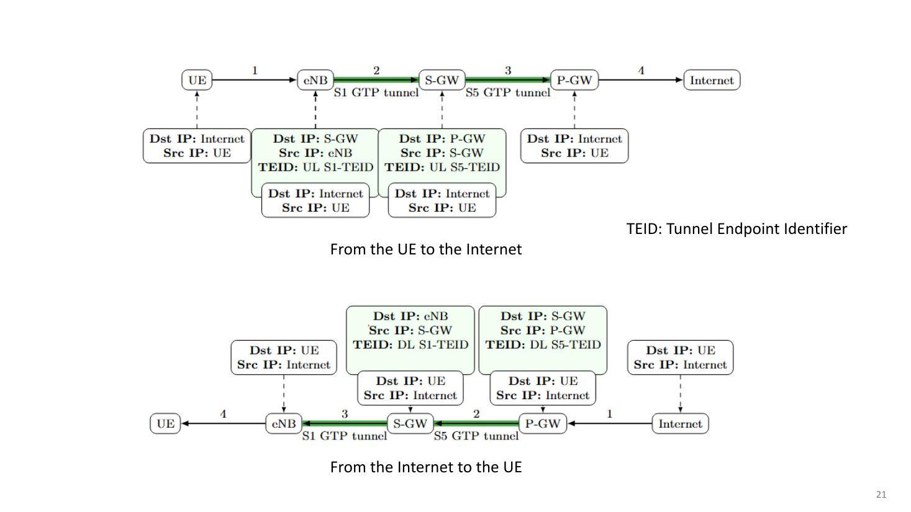
*Fig. — Composizione degli header GTP nel doppio senso del traffico. **UE → Internet:** il pacchetto originale `Src=UE, Dst=Internet` viene incapsulato dall'eNB in un GTP+UDP+IP con `Src=eNB, Dst=S-GW, TEID=UL-S1-TEID` (tunnel S1); l'S-GW lo ri-incapsula con `Src=S-GW, Dst=P-GW, TEID=UL-S5-TEID` (tunnel S5); il P-GW rimuove gli incapsulamenti e immette il datagramma originale su Internet. **Internet → UE:** il P-GW riceve `Src=Internet, Dst=UE`, lo incapsula con `Src=P-GW, Dst=S-GW, TEID=DL-S5-TEID`; l'S-GW lo ri-incapsula verso l'eNB con `Src=S-GW, Dst=eNB, TEID=DL-S1-TEID`; l'eNB consegna il datagramma all'UE via radio.*

---

## Lo stack del Data Plane LTE

A livello radio (cioè fra UE e Base Station), lo stack del piano dati LTE è composto da quattro livelli specifici, che si frappongono fra il livello IP "ordinario" e l'aria:

1. **Packet Data Convergence Protocol (PDCP)** — compressione degli header e crittografia.
2. **Radio Link Control (RLC)** — frammentazione e riassemblaggio dei pacchetti IP, trasferimento affidabile a livello di collegamento (ACK/NACK).
3. **Medium Access Control (MAC)** — richiesta e uso degli slot di trasmissione radio, rilevazione e correzione degli errori.
4. **Physical Layer** — modulazione e accesso al canale: FDM e TDM, e in particolare **OFDM** (Orthogonal Frequency Division Multiplexing) in downlink, le cui sottoportanti "ortogonali" minimizzano l'interferenza fra canali. Ogni dispositivo attivo riceve **due o più time slot da 0.5 ms** distribuiti su **12 frequenze**; lo scheduler non è standardizzato (lo decide l'operatore) e rende possibili velocità nell'ordine di **centinaia di Mbps per dispositivo**.

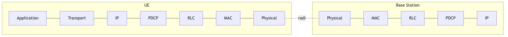
*Fig. — Stack del data plane LTE sul primo hop UE↔BS. Sopra l'IP "classico" si innestano PDCP, RLC, MAC e Physical, che insieme forniscono compressione, crittografia, riassemblaggio, scheduling e modulazione OFDM.*

---

## Sleep modes e procedura di associazione

Per preservare la batteria, i dispositivi LTE — analogamente a Wi-Fi e Bluetooth — possono mettere la radio in **sleep**:

- **Light sleep** dopo centinaia di millisecondi di inattività; il dispositivo si risveglia periodicamente (ogni ~100 ms) per controllare se ci sono trasmissioni in arrivo.
- **Deep sleep** dopo 5–10 secondi di inattività. In deep sleep il dispositivo potrebbe **cambiare cella**, quindi al risveglio deve **ristabilire l'associazione** per ricevere i messaggi di **paging** broadcastati dall'MME quando qualcuno cerca di contattarlo (chiamata, SMS, dato in arrivo).

> [!note] Cos'è il paging
>
> Quando qualcuno tenta di chiamare o inviare un messaggio a un dispositivo, la rete deve prima localizzarlo. L'MME **broadcasta** messaggi di paging nell'area in cui il dispositivo è probabilmente presente (la "tracking area"). Il dispositivo, ricevuto il paging, esce dal deep sleep e si ri-associa per ricevere il dato.

La **procedura di associazione** a una rete avviene in più passi:

1. La BS broadcasta ogni 5 ms un **primary synch signal** su tutte le frequenze. Più carrier diversi possono star broadcastando in parallelo.
2. Il dispositivo individua il primary synch signal e poi il **secondary synch signal** sulla stessa frequenza.
3. Legge le informazioni broadcastate dalla BS: larghezza di banda, configurazioni, info sul carrier cellulare.
4. Il dispositivo **seleziona la BS** a cui associarsi (preferendo tipicamente il proprio carrier home).
5. Seguono altri passi per **autenticarsi**, stabilire stato e configurare il piano dati.

---

## La rivoluzione del 5G: prestazioni e use case

Mentre il 4G mirava a circa 10 Mbps e 10 ms di latenza, il 5G alza drasticamente l'asticella (proiezioni GAO e ITU):

- **10× il bitrate di picco** — 100 Mbps di "User experienced data rate" sostenuti, con picchi potenziali $> 10$ Gbps;
- **10× più bassa la latenza** — fino a **1 ms**;
- **100× più capacità di traffico**, e una **densità di connessione** che supporta **1 milione di dispositivi per km²**.

La nuova radio **5G NR (New Radio)** **non è retrocompatibile** con il 4G. Opera su due bande principali:

- **FR1** — 450 MHz – 6 GHz (microonde "tradizionali", buona copertura);
- **FR2** — 24 GHz – 52 GHz (**onde millimetriche**, mmWave).

Le frequenze millimetriche permettono velocità immense ma su distanze brevi: questo richiede antenne direzionali (**MIMO**, Multiple-Input Multiple-Output) e un'installazione **densissima** di nuove stazioni base, le **pico-cells**, con raggio di soli 10–100 m.

### I tre macro-scenari d'uso

> [!example] eMBB — Enhanced Mobile Broadband
>
> Larghezza di banda incrementata per applicazioni multimediali pesanti: realtà aumentata e virtuale, video streaming 4K/360°. Si punta a *data rate* multi-Gbps di picco, 100+ Mbps sostenuti, e capacità aggregata di 10 Tbps per km².

> [!example] URLLC — Ultra Reliable Low-Latency Communications
>
> Applicazioni mission-critical altamente sensibili alla latenza: automazione di fabbrica, **guida autonoma**. Richiede affidabilità "five nines" (99.999%), latenza **1 ms** e supporto della mobilità ad alta velocità (fino a 100 km/h).

> [!example] mMTC — Massive Machine Type Communications
>
> Accesso *narrowband* per pervasività sensoriale: metering, monitoring, IoT diffuso. Dispositivi **ultra-low-power** (10+ anni di batteria), ultra-low-complexity (decine di bit/s), ultra-high density (1M nodi/km²).

---

## La 5G Core e la Service Based Architecture

A livello architetturale il 5G Core (NG-Core) è profondamente riprogettato per integrarsi con Internet e con i servizi cloud. L'approccio è **cloud-native**: la rete è organizzata come un set di **Network Functions (NF)** indipendenti, riutilizzabili e implementabili come macchine virtuali o container su hardware generico (**Network Function Virtualization, NFV**). Le NF possono essere lanciate e rilasciate dinamicamente in base al carico.

Ogni Network Function espone i propri servizi tramite una **Service-Based Interface (SBI)**, un'interfaccia REST ben definita su **HTTP/2**. È un cambio paradigmatico: le funzioni di rete diventano **microservizi** che si chiamano tra loro come fossero API web.

Alcuni concetti rimangono comunque ereditati dal 4G — primo fra tutti l'incapsulamento dei pacchetti via **GTP-U** sul piano utente. La separazione fra control e user plane viene portata all'estremo, e i server vengono distribuiti **fino all'edge** della rete per ridurre la latenza.

### Mapping 4G → 5G delle funzioni

| **Componente 4G** | **Corrispettivo 5G** | **Funzione** |
|---|---|---|
| **eNB** | **gNB** | Radio 5G modulare e cloud-native, splittata in *Distributed Unit* e *Central Unit* per deployment flessibile |
| **S-GW + P-GW** | **UPF** (User Plane Function) | Inoltra il traffico fra RAN e Internet; gestisce packet inspection, QoS e reporting; può essere distribuita per Multi-Access Edge Computing (MEC) |
| **MME** | **AMF + SMF** | **AMF** (Access and Mobility Management Function): autenticazione, gestione connessione, mobilità, reachability. **SMF** (Session Management Function): gestione sessioni dati, allocazione IP, controllo QoS e routing user-plane |
| **HSS** | **AUSF + UDM** | **AUSF** (Authentication Server Function): procedure di autenticazione. **UDM** (Unified Data Management): identità degli utenti, credenziali, dati di abbonamento |
| **PCRF** | **PCF** | Policy Control Function — definisce le regole di policy che le altre NF di controllo applicano |

Il 5G introduce inoltre **Network Function di supporto** (helper) totalmente nuove, che rendono i servizi *stateless* e quindi facilmente scalabili:

- **SDSF** (Structured Data Storage Network Function) e **UDSF** (Unstructured Data Storage Network Function) — servizi di archiviazione dati centralizzati: estraendo lo stato dalle altre NF, queste possono restare stateless.
- **NEF** (Network Exposure Function) — espone in modo controllato e sicuro le capacità della rete a servizi di terze parti.
- **NRF** (NF Repository Function) — registry per la *service discovery* delle NF disponibili.
- **NSSF** (Network Slicing Selector Function) — seleziona la **Network Slice** appropriata per ogni UE, permettendo di partizionare logicamente la rete e differenziare il servizio fra utenti/tenant.

> [!tip] La logica cloud-native
>
> Avere storage separato (SDSF/UDSF) e un registry di servizi (NRF) non è un dettaglio tecnico: è esattamente lo stesso *pattern* di un'architettura a microservizi cloud (12-factor, Kubernetes-style). Permette di **scalare orizzontalmente** una NF aggiungendo istanze, di **sostituire un'istanza** in caso di guasto senza perdere stato, e di esporre a terzi (NEF) capacità di rete come API consumabili.

### UPF e Multi-Access Edge Computing

Particolarmente importante è il ruolo dell'**UPF**: corrispondente unificato di S-GW + P-GW, può essere replicato e distribuito in molteplici punti della rete, anche **all'edge** vicino agli utenti. Questa flessibilità abilita il **Multi-Access Edge Computing (MEC)**, in cui le **VNF** (Virtual Network Functions) e i workload applicativi possono essere co-locati con l'UPF stesso, riducendo drasticamente la latenza per scenari URLLC.

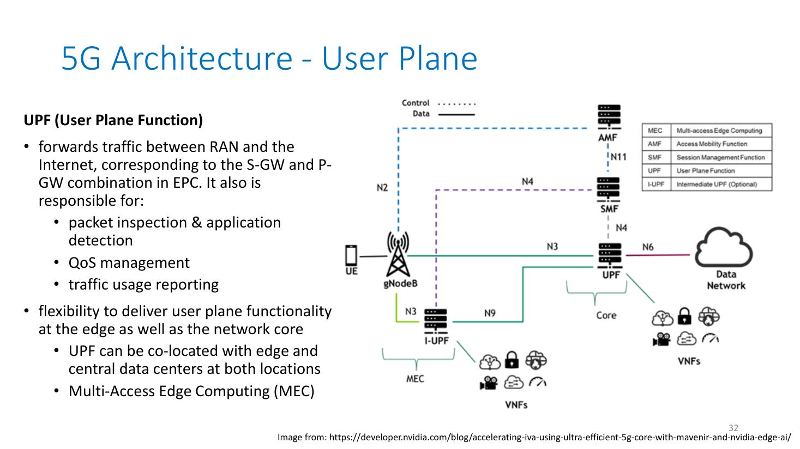
*Fig. — Architettura 5G User Plane (immagine NVIDIA/Mavenir). Il **gNodeB** dialoga con un'**I-UPF** (Intermediate UPF) all'edge tramite l'interfaccia N3, raggiungendo il core via N9 fino all'**UPF** centrale che si interfaccia col Data Network (N6). Il control plane (linee tratteggiate) — **AMF**, **SMF** — comunica con i nodi user-plane via N2, N4, N11. Le **VNF** all'edge realizzano il MEC.*

---

## Opzioni di deployment: Standalone vs Non-Standalone

Il passaggio da 4G a 5G non è atomico: gli operatori possono scegliere fra diverse strategie di deployment.

| Modalità | RAN | Core | Note |
|---|---|---|---|
| **Standalone 4G** | 4G | EPC | Rete 4G "pura" |
| **Non-Standalone (NSA)** | 4G + 5G | EPC (4G) | Le BS 5G affiancano quelle 4G per dare un *boost* di capacità; il **piano di controllo passa attraverso le BS 4G** verso il Core 4G, mentre le BS 5G veicolano **solo traffico utente** |
| **NSA su NG-Core** | 4G + 5G | NG-Core (5G) | Variante con BS 4G+5G ma core già migrato al 5G |
| **Standalone 5G** | 5G | NG-Core | 5G "puro": sia controllo che dati gestiti dal NG-Core |

> [!warning] Adozione del 5G SA molto disomogenea
>
> Secondo i dati Ookla 2025, l'adozione del 5G Standalone varia enormemente nel mondo: **80% in Cina**, **52% in India**, **24% negli Stati Uniti**, ma **solo 2% in Europa**. L'Europa è in forte ritardo sull'adozione del 5G "puro" e la maggioranza delle reti è ancora in modalità NSA.

---

## La rete cellulare come "rete di reti IP"

Le reti cellulari globali formano oggi una complessa "rete di reti IP" interconnesse tramite punti di interscambio chiamati **IPX** (IP eXchange). Pur condividendo molte tecnologie con Internet (HTTP, DNS, TCP/UDP, NAT, separazione control/data, SDN, Ethernet, tunneling), conservano alcune **specificità**:

|  | **Internet cablata** | **Reti cellulari 4G/5G** |
|---|---|---|
| Mobilità | non nativa | servizio di **prima classe** |
| Identità utente | varia (IP, account, ecc.) | fortemente legata alla **SIM card** |
| Modello di business | best-effort, peering | **abbonamento** a un carrier specifico |
| Home vs visited | non significativo | distinzione fondamentale, regola il **roaming** |
| Link di accesso | tipicamente cablato | **radio**, con tutti i suoi vincoli |

Il **roaming** — l'uso della rete da parte di un abbonato fuori dalla propria home network — è regolato dal **rapporto di fiducia commerciale** fra rete home e rete visitata: è la home network (che possiede l'HSS con i dati dell'abbonato) a "garantire" per l'utente, mentre la rete visitata fornisce l'accesso e poi regola economicamente i costi con la home.

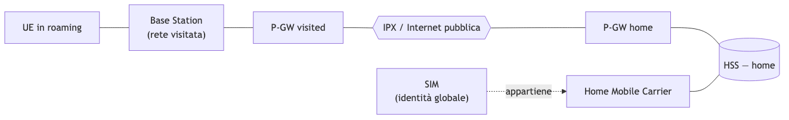
*Fig. — Roaming in una rete globale di carrier interconnessi via IPX. La SIM lega l'utente alla home network; quando è in roaming, la rete visitata si appoggia all'HSS della home per autenticare e autorizzare l'utente.*

---

## Sicurezza e autenticazione in 4G LTE: il protocollo AKA

Quando un dispositivo arriva in una rete (anche visitata), deve compiere **due operazioni distinte**:

1. **Associarsi alla BS** — stabilire la comunicazione sul canale radio 4G;
2. **Autenticarsi alla rete** — e contemporaneamente **autenticare la rete** (mutua autenticazione).

A differenza del Wi-Fi, qui la **SIM card fornisce l'identità globale** dell'utente, e i servizi disponibili nella rete visitata dipendono da una **subscription pagata** nella home network. **MME nella rete visitata** e **HSS nella rete home** giocano insieme il ruolo dell'Authentication Server di un access point Wi-Fi: il vero "ultimate authenticator" è l'HSS, ma le decisioni passano dall'MME visitato.

> [!definition] AKA — Authentication and Key Agreement
>
> Protocollo di autenticazione **challenge-and-response** definito da 3GPP, basato su **chiave simmetrica** condivisa fra abbonato e home network. Garantisce **autenticazione** delle entità, **integrità** e **confidenzialità** dei messaggi. Dopo la mutua autenticazione, vengono derivate chiavi crittografiche per proteggere sia la signaling sia i dati del piano utente.

Vediamo passo-passo come funziona, con particolare attenzione al *perché* la mutua autenticazione regge.

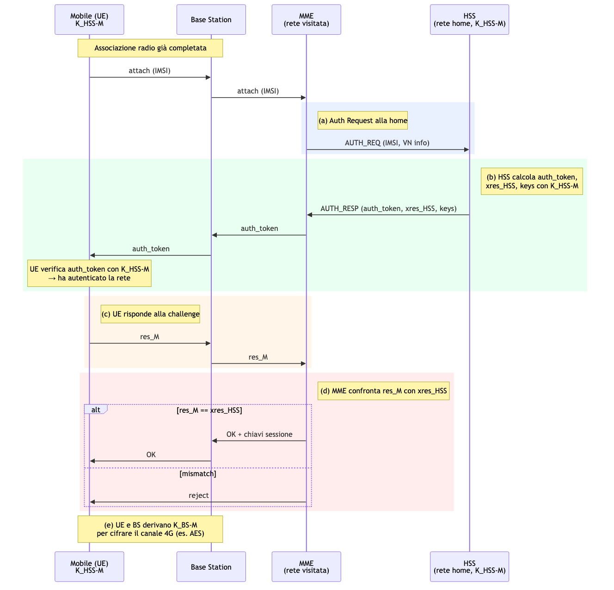
*Fig. — Sequence diagram del protocollo AKA in 4G LTE. Le cinque fasi (a)…(e) corrispondono ai passi numerati delle slide.*

### I cinque passi di AKA, in dettaglio

**(a) Attach + AUTH_REQ.** L'UE invia un messaggio di *attach* contenente il proprio **IMSI**. La BS lo inoltra all'MME della rete visitata, che a sua volta gira IMSI + informazioni della rete visitata (`VN info`) all'**HSS** nella home network del dispositivo. L'IMSI identifica esplicitamente la home network, quindi l'MME sa a chi rivolgersi.

**(b) HSS genera la challenge.** L'HSS, usando la **chiave segreta pre-condivisa** $K_{HSS\text{-}M}$ (memorizzata in modo sicuro sulla SIM dal lato UE, e nel database dell'HSS dal lato rete), calcola:

- un **auth_token** che contiene informazioni cifrate con $K_{HSS\text{-}M}$;
- la **risposta attesa** $\text{xres}_{HSS}$ (la "verifica" della challenge);
- le **chiavi di sessione**.

<<<<<<< HEAD
Manda `(auth_token, xres_HSS, keys)` all'MME, che inoltra solo l'`auth_token` all'UE attraverso la BS. L'UE, possedendo lui pure $K_{HSS\text{-}M}$, **decifra e verifica matematicamente** l'auth-token: se torna, significa che l'altra parte conosce davvero la chiave segreta — quindi è la vera home network. **A questo punto l'UE ha autenticato la rete.** Nel frattempo l'MME tiene da parte $\text{xres}_{HSS}$ per il passo (d).
=======
Manda `(auth_token, xres_HSS, keys)` all'MME, che inoltra solo l'`auth_token` all'UE attraverso la BS. L'UE, possedendo lui pure $K_{HSS\text{-}M}$, **decifra e verifica matematicamente** l'auth_token: se torna, significa che l'altra parte conosce davvero la chiave segreta — quindi è la vera home network. **A questo punto l'UE ha autenticato la rete.** Nel frattempo l'MME tiene da parte $\text{xres}_{HSS}$ per il passo (d).
>>>>>>> origin/main

**(c) UE risponde.** L'UE esegue **lo stesso calcolo crittografico** che ha fatto l'HSS, usando la sua copia di $K_{HSS\text{-}M}$, ottenendo $\text{res}_{M}$. Lo invia all'MME via BS.

**(d) MME valida.** L'MME confronta $\text{res}_{M}$ (calcolato dall'UE) con $\text{xres}_{HSS}$ (calcolato dall'HSS). Se coincidono, **la rete ha autenticato l'UE** — perché solo chi possiede $K_{HSS\text{-}M}$ poteva ottenere quel valore. L'MME informa la BS dell'avvenuta autenticazione e genera le chiavi di sessione per la BS.

**(e) Derivazione delle chiavi radio.** UE e BS, a partire dal materiale crittografico scambiato, derivano la chiave $K_{BS\text{-}M}$ con cui cifrano dati e frame di controllo sul canale wireless 4G — tipicamente con **AES**.

> [!question] Perché il confronto $\text{res}_M = \text{xres}_{HSS}$ basta a dimostrare l'identità dell'UE?
>
> Perché la funzione che calcola la response è **deterministica e dipende dalla chiave segreta** $K_{HSS\text{-}M}$. Solo due entità la conoscono: la SIM dell'utente e l'HSS. Se il valore calcolato dall'UE coincide con quello calcolato dall'HSS, è praticamente impossibile (sotto le ipotesi crittografiche standard) che l'UE non possieda la chiave — quindi è autentico. La presenza di un *nonce* freschissimo nella challenge previene attacchi di replay.

---

## Sicurezza in 5G: cosa cambia rispetto al 4G

Il 5G mantiene la struttura concettuale di AKA ma ne irrobustisce due aspetti chiave, entrambi rivolti a chiudere falle di privacy/fiducia presenti in 4G.

| Aspetto | 4G | 5G |
|---|---|---|
| **Decisione di autenticazione** | Presa dall'**MME nella rete visitata** | Presa dalla **rete home**; l'AMF visitato fa da "middleman" (può comunque rifiutare la connessione) |
| **Trasmissione dell'IMSI** | Inviato **in chiaro** alla BS al momento dell'attach | Cifrato con **crittografia a chiave pubblica** prima di essere trasmesso |

> [!warning] L'IMSI in chiaro era un problema serio
>
> In 4G l'IMSI viaggiava in cleartext sulla prima porzione del protocollo di attach: questo permetteva attacchi noti come **IMSI catcher** ("Stingray"), apparati che si fingono BS legittime per intercettare gli IMSI dei dispositivi vicini e tracciare gli utenti. Il 5G chiude questa falla cifrando l'identificativo con una **chiave pubblica della home network**: solo l'home network può decifrarlo, la rete visitata e gli intercettatori vedono solo un identificativo "schermato" (SUCI — SUbscription Concealed Identifier).

> [!note] Centralizzare la decisione nella home
>
> Spostare la decisione finale di autenticazione dalla rete visitata alla rete home riduce la superficie di attacco: anche se un MME visitato viene compromesso, da solo non può "creare" abbonati validi. La rete visitata mantiene comunque potere di veto sulla connessione (può rifiutare per policy locali), ma non può approvarla autonomamente.

---

> [!abstract] Sintesi
>
> L'evoluzione dalle reti cellulari analogiche al 5G è una trasformazione architetturale, non solo un aumento di velocità. Il cuore della trasformazione è il passaggio a un **All-IP core** (introdotto in 4G con l'EPC) e poi a una **Service Based Architecture cloud-native** (in 5G con l'NG-Core), con netta separazione di control plane e data plane e con le funzioni di rete organizzate come **microservizi** indipendenti. Il **tunneling GTP** è il pilastro che abilita la mobilità trasparente: gli IP del traffico restano fissi, cambiano solo gli endpoint dei tunnel quando l'utente si sposta. Il protocollo **AKA** garantisce mutua autenticazione UE↔rete sfruttando una chiave simmetrica condivisa fra SIM e home HSS; il 5G rafforza la sicurezza spostando la decisione finale alla home network e cifrando l'IMSI con crittografia a chiave pubblica per prevenire attacchi di tracciamento. Sul fronte radio, **5G NR** combina sub-6 GHz e onde millimetriche con MIMO e densità di celle elevate, abilitando i tre macro-scenari **eMBB**, **URLLC** e **mMTC**.

```{=latex}
\newpage
```

# MQTT: Affidabilità, Struttura dei Pacchetti e CoAP

La prima parte della lezione aveva introdotto MQTT come protocollo publish/subscribe progettato per l'IoT. Qui si approfondiscono i meccanismi che rendono il protocollo robusto: sessioni persistenti, messaggi trattenuti, testamento e keep alive. Poi si scende al livello dei singoli byte che compongono i pacchetti di controllo, si vede un'implementazione reale su Arduino, e infine si confronta MQTT con HTTP e con **CoAP** (*Constrained Application Protocol*), l'alternativa principale per reti fortemente vincolate.

---

## Meccanismi di Affidabilità

### Sessioni Persistenti

Il problema che le sessioni persistenti risolvono è semplice: un dispositivo IoT si disconnette spesso — per risparmio energetico, per copertura di rete instabile, per reset. Se il broker e il client non ricordano nulla di ciò che è avvenuto, ogni riconnessione equivale a ricominciare da zero, perdendo iscrizioni ai topic e messaggi accumulati durante l'assenza.

> [!definition] Sessione Persistente (*Persistent Session*)
>
> Meccanismo che richiede al broker — e al client — di conservare lo stato operativo attraverso disconnessioni e successive riconnessioni. Viene attivata dal client al momento della connessione impostando il flag **`cleanSession = false`** nel pacchetto CONNECT. Il broker ne conferma la creazione o la ripresa tramite il messaggio **CONNACK**.

Quando una sessione persistente è attiva, il broker memorizza le iscrizioni ai topic del client, i messaggi con QoS 1 e 2 che non è stato possibile consegnare durante l'assenza, e i messaggi in attesa di completamento del flusso di acknowledgment QoS 2. Simmetricamente, anche il **client** deve salvare stato localmente: tutti i messaggi inviati ma non ancora confermati dal broker (non-acked), e tutti i messaggi ricevuti con QoS 2 per i quali non è ancora stata inviata la conferma. Lo stato viene conservato finché le risorse di sistema lo consentono.

> [!warning] Quando NON usare le sessioni persistenti
>
> Non servono per client che pubblicano soltanto con QoS 0, perché in quel caso non c'è nulla da conservare. Vanno evitate anche quando la ricezione di messaggi vecchi è indesiderata, o quando il sistema è progettato per tollerare la perdita di dati senza conseguenze sulla logica applicativa.

### Messaggi Trattenuti (*Retained Messages*)

Nel paradigma publish/subscribe, un publisher non ha garanzia che i suoi messaggi raggiungano i subscriber — l'unica certezza che può ottenere, con QoS 1 o 2, è che il broker li abbia ricevuti. Di conseguenza, un client che si iscrive a un topic non sa quando arriverà il primo messaggio: potrebbe aspettare ore se il publisher aggiorna raramente. Questo è un problema reale per qualsiasi dato di stato che cambia di rado.

La soluzione è il **retained message**: un normale messaggio con il flag `retainFlag = true`. Quando il broker lo riceve, lo conserva. Se arriva un nuovo messaggio trattenuto sullo stesso topic, il broker sostituisce il precedente con l'ultimo — ne esiste sempre al massimo uno per topic. Il vantaggio si manifesta alla sottoscrizione: non appena un client si iscrive a un topic che possiede un messaggio trattenuto, il broker lo recapita immediatamente, senza attendere la prossima pubblicazione fisiologica. Questo funziona anche con le wildcard.

> [!example] Esempio: stato di un dispositivo domestico
>
> Un dispositivo pubblica il proprio stato su `home/devices/device1/status` con il payload `"ON"` e `retainFlag = true`. Quando un nuovo client si iscrive a quel topic — anche ore dopo — riceve immediatamente `"ON"`, senza aspettare il prossimo aggiornamento. Per cancellare il messaggio trattenuto, il publisher invia un messaggio vuoto con `retainFlag = true` sullo stesso topic.

È importante non confondere i retained messages con le sessioni persistenti: sono meccanismi ortogonali. I messaggi trattenuti vivono sul broker indipendentemente dalle sessioni dei client, e persistono anche dopo la consegna.

### Last Will & Testament

Quando un dispositivo si disconnette *normalmente* — inviando un pacchetto DISCONNECT — gli altri partecipanti possono essere notificati esplicitamente. Ma quando la disconnessione è anomala (crash hardware, interruzione di rete, timeout di keep alive), il dispositivo non ha modo di comunicare il proprio stato. Il meccanismo del **Last Will & Testament** (*testamento*) risolve esattamente questo scenario.

> [!definition] Last Will & Testament
>
> Messaggio pre-configurato che il client consegna al broker al momento della connessione (CONNECT time). Se il broker rileva una disconnessione anomala del client, pubblica automaticamente quel messaggio sul topic specificato, notificando tutti gli iscritti.

Il testamento è a tutti gli effetti un messaggio MQTT completo: ha un topic, un payload, un livello di QoS e un retained flag. Il broker lo memorizza dal momento della connessione e lo invia in quattro circostanze: errore di I/O sulla connessione di rete, mancato invio del PINGREQ entro l'intervallo di keep alive, chiusura brusca della connessione TCP senza DISCONNECT, oppure chiusura forzata da parte del broker per errore di protocollo. Se invece il client termina la sessione correttamente con DISCONNECT, il testamento viene scartato.

I quattro parametri del testamento si dichiarano nel messaggio CONNECT: **`lastWillTopic`** (stringa del topic), **`lastWillQoS`** (livello 0, 1 o 2), **`lastWillMessage`** (payload testuale) e **`lastWillRetain`** (booleano).

> [!tip] Sinergia tra Last Will e Retained Messages
>
> Il pattern più potente combina i due meccanismi. Riprendendo l'esempio precedente: il dispositivo pubblica `"ON"` come retained message su `home/devices/device1/status`. Configura anche un testamento con payload `"OFF"`, retained flag attivo, sullo stesso topic. Se va in crash, il broker pubblica automaticamente `"OFF"` come retained message — sia i client connessi che quelli futuri vedranno lo stato corretto del dispositivo.

### Keep Alive

Il **Keep Alive** affronta un problema specifico del TCP: una connessione può sembrare attiva anche quando il peer è irraggiungibile, finché non si tenta di trasmettere. In un sistema IoT con dispositivi che si connettono e scompaiono, il broker ha bisogno di un modo per accorgersi tempestivamente delle disconnessioni silenti.

Il client dichiara un intervallo di keep alive nel pacchetto CONNECT. È suo obbligo inviare un pacchetto **PINGREQ** al broker prima che quell'intervallo scada — qualunque messaggio trasmesso vale come segnale di vita, non solo il PINGREQ. Il broker risponde con **PINGRESP**. Se il client non invia nulla entro il timeout, il broker chiude la connessione e, se configurato, invia il messaggio di last will.

---

## Struttura dei Pacchetti MQTT

Comprendere la struttura dei pacchetti è utile sia per il debug a basso livello che per capire perché MQTT è così leggero. Ogni **MQTT Control Packet** si compone di tre parti: un **Fixed Header** (sempre presente), un **Variable Header** (presente solo in alcuni tipi di pacchetto) e un **Payload** (dipendente dal tipo).

### Fixed Header

Il Fixed Header occupa almeno 2 byte. Il **primo byte** codifica due informazioni: i bit 7–4 contengono il tipo di pacchetto (4 bit → 16 valori possibili, di cui 0 e 15 sono riservati); i bit 3–0 contengono flag specifici per tipo. Il **secondo byte** — eventualmente seguito da altri — rappresenta la *Remaining Length*, cioè la dimensione combinata di variable header e payload. Il campo usa una codifica a lunghezza variabile: un singolo byte copre fino a 127 byte, e il bit più significativo segnala la presenza di un byte aggiuntivo di lunghezza.

> [!note] Flag del primo byte
>
> Per la maggior parte dei pacchetti i 4 bit di flag sono riservati e devono valere `0,0,0,0`. Il pacchetto PUBLISH è l'eccezione: codifica nei flag i parametri **DUP** (primo bit), **QoS** (due bit centrali) e **Retain** (ultimo bit). I pacchetti PUBREL, SUBSCRIBE e UNSUBSCRIBE richiedono invece il valore fisso `0,0,1,0`.

I tipi di pacchetto e la direzione del flusso sono:

| Valore | Tipo | Direzione |
|--------|------|-----------|
| 1 | CONNECT | Client → Server |
| 2 | CONNACK | Server → Client |
| 3 | PUBLISH | Bidirezionale |
| 4–7 | PUBACK, PUBREC, PUBREL, PUBCOMP | Bidirezionale (gestione QoS) |
| 8 | SUBSCRIBE | Client → Server |
| 9 | SUBACK | Server → Client |
| 10 | UNSUBSCRIBE | Client → Server |
| 11 | UNSUBACK | Server → Client |
| 12 | PINGREQ | Client → Server |
| 13 | PINGRESP | Server → Client |
| 14 | DISCONNECT | Client → Server |

### Variable Header e Payload

Il **Variable Header** contiene principalmente il **packet identifier** (2 byte), un identificativo numerico univoco usato per correlare i pacchetti di acknowledgment. CONNECT e CONNACK non includono questo campo. Per PUBLISH, è presente solo se QoS > 0. L'header variabile trasporta anche informazioni aggiuntive dipendenti dal tipo: in CONNECT, ad esempio, include nome e versione del protocollo più vari flag operativi.

Il **Payload** è il corpo del messaggio. Nel CONNECT è obbligatorio e deve contenere il **client identifier**; può inoltre includere will topic, will message, username e password. In CONNACK e PUBLISH è opzionale. Nei pacchetti di puro controllo come PINGREQ, PINGRESP, DISCONNECT e tutti i pacchetti di acknowledgment QoS il payload è assente.

---

## Implementazione Pratica: MQTT su Arduino

La libreria più diffusa per MQTT su Arduino è **PubSubClient**. È progettata deliberatamente per essere leggera: implementa solo le funzionalità core di MQTT, senza SSL/TLS, senza supporto a QoS 2, e con un limite rigido di 128 byte per il payload. Questi vincoli la rendono adatta ai microcontrollori a basse risorse tipici dell'ecosistema Arduino.

### Costruzione del client

La libreria si istanzia con il costruttore completo `PubSubClient(server, port, callback, client, stream)`, dove `server` è l'`IPAddress` del broker, `port` è un intero, `callback` è un puntatore a funzione che viene invocata all'arrivo di un messaggio, `client` è un'istanza di rete (tipicamente `EthernetClient`), e `stream` è opzionale per lo storage dei messaggi ricevuti. È anche possibile usare il costruttore vuoto e configurare i parametri successivamente via setter (`setServer`, `setCallback`, `setClient`, `setStream`).

> [!note] Callback
>
> Il meccanismo di callback funziona come nelle interfacce grafiche con gli event listener: la funzione viene eseguita solo quando arriva un messaggio su un topic sottoscritto. Non c'è polling attivo.

### API principale

`connect(clientID, username, password, willTopic, willQoS, willRetain, willMessage)` avvia la connessione specificando credenziali e parametri del testamento; restituisce `true` in caso di successo. `disconnect()` chiude la sessione in modo pulito.

`publish(topic, payload, length, retained)` pubblica un messaggio; restituisce `false` se la connessione è caduta o il payload supera il limite. `subscribe(topic, qos)` e `unsubscribe(topic)` gestiscono le iscrizioni, entrambe con valore di ritorno booleano.

Fondamentale è la chiamata ripetuta a **`loop()`** nel ciclo principale: è questa funzione che genera i PINGREQ e mantiene viva la connessione. Senza di essa il broker considererà il client disconnesso entro l'intervallo di keep alive. I metodi `connected()` e `state()` supportano il debugging.

---

## MQTT vs HTTP e il Problema della Scalabilità

MQTT e HTTP sono i principali competitor nell'IoT, ma operano su paradigmi radicalmente diversi. HTTP impone un'architettura **client/server** rigida e simmetrica: ogni entità deve essere o client o server. Organizzare una rete IoT con HTTP significa che ogni sensore deve agire da server (o da client che interroga un server centrale), e che ogni comunicazione è strettamente 1-a-1. Con centinaia o migliaia di dispositivi, il numero di connessioni simultanee al server centrale cresce proporzionalmente — e con esso il carico di risorse. **HTTP non scala bene**.

MQTT invece, grazie al publish/subscribe, fa crescere il numero di connessioni solo sul broker, non sui client. Un nuovo subscriber si aggiunge alla rete senza che nessun publisher debba sapere della sua esistenza. Il broker gestisce il *fan-out* internamente.

Dal punto di vista tecnico, MQTT invia dati come array di byte con header compatti (pochi byte), mentre HTTP trasmette documenti con header testuali voluminosi. MQTT supporta tre livelli di QoS e topologie 1-a-0, 1-a-1 e 1-a-N; HTTP ha un solo livello di servizio e comunicazione esclusivamente 1-a-1.

> [!warning] Limiti strutturali di MQTT
>
> Nonostante i vantaggi, MQTT presenta tre criticità architetturali importanti. Prima: il broker è un **single point of failure** — se cade, l'intera rete smette di comunicare. Seconda: al crescere della rete, l'overhead computazionale del broker può diventare incompatibile con le risorse dei dispositivi finali più vincolati. Terza: MQTT si appoggia a **TCP**, che richiede risorse considerevolmente superiori a UDP, causa tempi di risveglio (*wake-up time*) elevati per la procedura di handshake, e accorcia la vita della batteria dei dispositivi che devono mantenere connessioni persistenti.

---

## CoAP: L'Alternativa per Reti Vincolate

È proprio il problema del TCP che apre la strada al **CoAP** (*Constrained Application Protocol*), standardizzato in RFC 7252. CoAP è progettato specificamente per operare su nodi computazionalmente deboli e reti con alta perdita di pacchetti, bandwidth nell'ordine dei 10 kbit/s e dispositivi con poche decine di byte di RAM e ROM. Trova applicazione naturale in sistemi M2M (*Machine-to-Machine*), building automation e smart energy.

A differenza di MQTT, CoAP abbraccia un classico paradigma **client/server** con un twist: sono i sensori e gli attuatori periferici ad agire da *server*, mentre i software applicativi centrali fanno da *client* che li interrogano. L'interfaccia è un modello **REST** completo: i sensori espongono risorse tramite URI, e i client le manipolano con i verbi **GET, PUT, POST, DELETE** — esattamente come nell'HTTP convenzionale, ma con profonde ottimizzazioni sotto.

> [!abstract] Caratteristiche tecniche di CoAP
>
> CoAP utilizza **UDP/IP** come trasporto invece di TCP, eliminando l'overhead di connessione. Adotta formati di codifica compatti con header di dimensioni ridottissime. Include nativamente una *resource directory* per la scoperta (*discovery*) delle risorse nella rete. Sul fronte sicurezza, integra meccanismi crittografici robusti — la protezione è paragonabile a chiavi RSA da 3072 bit. Prospera nelle **6LoWPAN** (reti IPv6 over Low-Power Wireless PAN), ambienti con packet error rate elevato e throughput limitato.

CoAP supporta anche un modello di comunicazione asincrona che ne avvicina il comportamento a MQTT, e ha un supporto nativo (seppur minoritario) per trasmissioni multicast. Il supporto formale di Eclipse ne accelera la diffusione.

> [!tip] Quando scegliere CoAP vs MQTT
>
> Scegli **MQTT** quando l'obiettivo è massimizzare il disaccoppiamento tra produttori e consumatori di dati — nel tempo e nello spazio — e quando il broker centralizzato non è un vincolo architetturale. Scegli **CoAP** quando lo scenario richiede sicurezza crittografica forte *by default*, quando si lavora su reti UDP con dispositivi ultra-vincolati, o quando si vuole evitare la dipendenza da un broker centrale.

Entrambi i protocolli hanno oggi lo status di standard riconosciuti per l'IoT. CoAP è più giovane e i suoi meccanismi di affidabilità della consegna sono meno sofisticati della gerarchia QoS di MQTT, ma la sua leggerezza e la base UDP lo rendono insostituibile negli scenari più vincolati.

---

```{=latex}
\newpage
```

# The ZigBee Standard — Part 1

## Obiettivi e Caratteristiche

Lo standard **ZigBee** è un protocollo di comunicazione concepito specificamente per le reti di sensori wireless (**wireless sensor networks**), sviluppato e promosso dalla **ZigBee Alliance**. Le sue applicazioni spaziano dalla **home automation** (domotica e _ambient assisted living_) all'assistenza sanitaria (**health care**), dall'elettronica di consumo all'automazione industriale, fino a impieghi estremi come le missioni di esplorazione su Marte.


*Panoramica delle applicazioni ZigBee nei diversi domini.*

I requisiti di progetto (**main requirements**) che ZigBee deve soddisfare sono tre: la rete deve operare in modo completamente autonomo senza intervento umano, i dispositivi devono avere una durata della batteria molto elevata lavorando a basso data rate, e deve essere garantita la piena interoperabilità tra dispositivi di produttori differenti.

Le caratteristiche principali (**main features**) che ne derivano sono coerenti con questi requisiti: ZigBee è basato su standard aperti, ha costi ridotti, può essere impiegato globalmente, è affidabile e auto-rigenerante (_self-healing_), scala a un numero elevato di nodi, è facile da distribuire sul campo e garantisce sicurezza delle comunicazioni insieme a una lunghissima durata della batteria.

---

## Rapporto con IEEE 802.15.4 e Architettura a Strati

ZigBee è costruito sopra lo standard **IEEE 802.15.4**, rilasciato nel 2003 e revisionato nel 2006. ZigBee stesso è stato pubblicato per la prima volta a fine 2004 e revisionato nel 2006; entrambe le prime revisioni sono distribuite gratuitamente.


*Corrispondenza tra i livelli ISO/OSI e gli standard IEEE 802.15.4 e ZigBee.*

In termini di stack protocollare, IEEE 802.15.4 copre il **Physical layer** e il **MAC layer**, gestendo reti a basso data rate definite _Wireless Personal Area Networks_. Questo standard è infrastructure-less, a corto raggio, supporta topologie a stella e peer-to-peer e può coesistere con IEEE 802.11 e Bluetooth (IEEE 802.15.1). Opera su bande di frequenza libere da licenza: 868–868.6 MHz (Europa) a 20 kbps, 902–928 MHz (Nord America) a 40 kbps, e 2400–2483.5 MHz (mondiale) a 250 kbps.

ZigBee aggiunge sopra questi livelli il **Network layer** e l'**Application layer**. Il livello applicativo è articolato in tre componenti: l'**Application Framework**, che ospita fino a 240 **Application Objects (APO)** numerati da 1 a 240, ciascuno rappresentante un'applicazione ZigBee definita dall'utente; il **ZigBee Device Object (ZDO)**, che fornisce i servizi per organizzare gli APO in un'applicazione distribuita; e l'**Application Support sublayer (APS)**, che eroga servizi di dati e gestione sia agli APO sia allo ZDO.

---

## Servizi e Primitive di Comunicazione

Ogni livello dello stack eroga servizi di dati e di gestione al livello superiore tramite quattro tipologie di **Service Primitives**. La **Request** è invocata dal livello superiore per richiedere un servizio al livello inferiore. L'**Indication** è generata dal livello inferiore verso quello superiore per notificare il verificarsi di un evento. La **Response** è invocata dal livello superiore per completare una procedura iniziata da una precedente Indication. La **Confirm** è generata dal livello inferiore per comunicare al livello superiore l'esito di una o più Request precedenti. Non tutti i servizi utilizzano tutte e quattro le primitive.

In uno schema di comunicazione end-to-end, un oggetto applicativo incapsula i dati in un **APDU**, che passa al servizio dati APS diventando **NPDU**. Il livello **NWK** aggiunge le proprie intestazioni producendo un **MPDU** tramite il NWK data service; il livello **MAC** genera la **PPDU** tramite il MAC data service, che viene infine trasmessa fisicamente dal **PHY** data service verso la destinazione, dove il processo si inverte.


*Flusso di incapsulamento dei dati attraverso i livelli dello stack ZigBee, da sorgente a destinazione.*

---

## Il Network Layer: Topologie e Servizi

### Tipologie di Dispositivi

Il Network Layer definisce tre ruoli distinti. Il **Network Coordinator** è un dispositivo completamente funzionale (**FFD**, _full functional device_) che crea e gestisce l'intera rete. I **Router** sono anch'essi FFD e dispongono di capacità di instradamento. Gli **End-device** sono dispositivi a funzionalità ridotta (**RFD**, _reduced functional device_) o FFD che operano come nodi semplici senza capacità di routing.

Le topologie gestite dal Network Layer sono tre. La topologia a **stella** si mappa direttamente sulla struttura IEEE 802.15.4 e utilizza il meccanismo del _superframe_. La topologia ad **albero** può anch'essa avvalersi del superframe. La topologia a **mesh** opera invece tipicamente senza superframe, affidandosi a comunicazioni dirette nodo-nodo.

### Tabella dei Servizi

| **Name**              | **Request** | **Indication** | **Confirm** | **Description**                                                       |
| --------------------- | :---------: | :------------: | :---------: | --------------------------------------------------------------------- |
| **DATA**              |      X      |       X        |      X      | Trasmissione dati.                                                    |
| **NETWORK-DISCOVERY** |      X      |                |      X      | Ricerca di PAN esistenti.                                             |
| **NETWORK-FORMATION** |      X      |                |      X      | Creazione di una nuova PAN (coordinator).                             |
| **PERMIT-JOINING**    |      X      |                |      X      | Consente l'associazione di nuovi dispositivi alla PAN.                |
| **START-ROUTER**      |      X      |                |      X      | (Re-)inizializza il superframe del coordinator o di un router.        |
| **JOIN**              |      X      |       X        |      X      | Richiesta di unirsi a una PAN esistente.                              |
| **DIRECT-JOIN**       |      X      |                |      X      | Forza un end-device a unirsi alla PAN del coordinator o di un router. |
| **LEAVE**             |      X      |       X        |      X      | Lasciare una PAN.                                                     |
| **RESET**             |      X      |                |      X      | Resetta il livello di rete.                                           |
| **SYNC**              |      X      |                |      X      | Sincronizza o estrae dati pendenti dal coordinator o da un router.    |
| **GET**               |      X      |                |      X      | Legge i parametri del livello di rete.                                |
| **SET**               |      X      |                |      X      | Imposta i parametri del livello di rete.                              |

---

## Network Formation

Prima di comunicare, un dispositivo ZigBee deve formare una nuova rete assumendo il ruolo di **ZigBee Coordinator**, oppure unirsi a una rete esistente come router o end-device. Il ruolo viene scelto a tempo di compilazione (_compile-time_).

La **Network Formation** è avviata dal Coordinator — solo se non è già parte di un'altra PAN — tramite la primitiva **NETWORK-FORMATION.request**. Il processo si articola in una sequenza di interazioni con il livello MAC: dapprima vengono eseguiti un energy scan e un active scan (tramite **SCAN.request** e **SCAN.confirm**) per identificare il canale meno rumoroso e verificare l'assenza di reti limitrofe che potrebbero generare conflitti. Individuato il canale, viene selezionato un **PAN ID** non ancora in uso, dopodiché il Coordinator si auto-assegna l'indirizzo di rete a 16 bit **0x0000**. Invoca quindi **SET.request** al livello MAC per configurare PAN identifier e indirizzo del dispositivo, e infine emette **START.request** (confermata da **START.confirm**) affinché il MAC inizi a trasmettere i beacon. La sequenza si chiude con la **NETWORK-FORMATION.confirm** verso il livello applicativo.

---

## Ingresso in una Rete Esistente

Un dispositivo può unirsi a una rete in due modi: tramite associazione classica avviata dal dispositivo stesso, oppure tramite **Direct join**, in cui è il coordinator o un router a forzare un end-device ad aggregarsi alla propria PAN.

### Join through Association (child-side)

Il dispositivo avvia una **NETWORK-DISCOVERY** emettendo una **SCAN.request** di tipo active scan per individuare le PAN disponibili. Ricevuta la **NETWORK-DISCOVERY.confirm**, seleziona la PAN di interesse e invia una **JOIN.request** contenente l'identificatore della rete e un flag che indica se intende aggregarsi come router o come end-device.

A livello NWK, la JOIN.request porta alla selezione di un nodo genitore **P** appartenente alla PAN nel vicinato del dispositivo. Il comportamento varia in base alla topologia: in una rete a stella P è necessariamente il coordinator e il dispositivo si aggancia come end-device; nelle topologie ad albero P può essere il coordinator o un router, e il dispositivo può aggregarsi sia come router sia come end-device.

Tramite il protocollo di associazione MAC (primitive **ASSOCIATE.request** e **ASSOCIATE.confirm**), il nodo P assegna al nuovo dispositivo un **indirizzo breve a 16 bit** (_short address_), che viene consegnato al livello NWK tramite **JOIN.confirm** e utilizzato per tutte le comunicazioni successive.

> [!note] Direct Join
>
> Nel Direct Join è il coordinator o un router a prendere l'iniziativa, forzando un end-device ad aggregarsi alla propria PAN tramite la primitiva **DIRECT-JOIN.request**. Non richiede che il dispositivo target avvii autonomamente una Network Discovery.

---

## Struttura ad Albero e Indirizzamento

Le relazioni genitore-figlio stabilite durante il joining costruiscono una topologia logica ad albero in cui il Coordinator funge da radice, i router sono nodi interni (o foglie), e gli end-device sono esclusivamente foglie.

Questa struttura viene sfruttata per l'assegnazione sistematica degli indirizzi di rete. Al momento della formazione, il Coordinator viene configurato con tre parametri statici:

- $R_m$: numero massimo di router figli per ogni nodo router.
- $D_m$: numero massimo di end-device figli per ogni nodo router.
- $L_m$: profondità massima dell'albero.

In base a questi valori, ogni router riceve un intervallo specifico di indirizzi da distribuire ai propri discendenti. L'ampiezza dell'intervallo assegnato a un router alla profondità $d$ è calcolata tramite la funzione ricorsiva $C_{skip}$:

$$
C_{skip}(d) = \begin{cases} 1 & \text{se } d = L_m \\ 1 + R_m \cdot C_{skip}(d+1) + D_m & \text{altrimenti} \end{cases}
$$

Il valore $C_{skip}(d)$ rappresenta il numero totale di indirizzi (incluso il proprio) che ogni router alla profondità $d$ deve riservare per sé e per tutti i suoi discendenti. Se un router ha indirizzo $A$ e si trova alla profondità $d$, i suoi $R_m$ figli router ricevono rispettivamente gli indirizzi $A+1$, $A+1+C_{skip}(d+1)$, $A+1+2\cdot C_{skip}(d+1)$, …, e i suoi $D_m$ end-device ricevono gli indirizzi successivi a tutti i blocchi dei router.

> [!example] Esempio con $R_m=2$, $D_m=2$, $L_m=3$
>
> - $C_{skip}(3) = 1$
> - $C_{skip}(2) = 1 + 2 \cdot 1 + 2 = 5$
> - $C_{skip}(1) = 1 + 2 \cdot 5 + 2 = 13$
> - $C_{skip}(0) = 1 + 2 \cdot 13 + 2 = 29$ → la radice (coordinator, $A=0$) gestisce $[0\text{–}28]$
>
> Il primo figlio router riceve $A=1$ e gestisce $[1\text{–}13]$; il secondo $A=14$ e gestisce $[14\text{–}26]$; gli end-device del coordinator sono 27 e 28.

È preferibile che i dispositivi si aggreghino il più in alto possibile nell'albero per minimizzare il numero di hop. Sebbene gli indirizzi vengano assegnati secondo una struttura ad albero, la connettività fisica può comunque formare una mesh.

> [!warning] Rigidità dell'indirizzamento
>
> Il modello è riconosciuto come rigido: se un sottoalbero è localmente saturo, un nuovo dispositivo non riesce ad aggregarsi tramite quel nodo. Il vantaggio è la piena decentralizzazione — nessun router deve consultare il coordinator, non esistono rischi di collisione e non sono necessari algoritmi di accordo distribuito. La connettività fisica può comunque formare una mesh, anche se gli indirizzi sono distribuiti secondo logica ad albero.

---

## Routing

Il Network Layer supporta tre modalità di instradamento: broadcast, **Tree routing** e **Mesh routing**.

### Tree Routing

Nel Tree routing i pacchetti seguono gerarchicamente la struttura genitore-figlio dell'albero fino alla destinazione, basandosi esclusivamente sull'indirizzo di rete. È un approccio semplice ma rigido, e consente l'uso dei beacon poiché ogni router di inoltro sincronizza il proprio superframe con il nodo limitrofo.

### Mesh Routing

Il Mesh routing è più flessibile e si ispira a protocolli per reti ad hoc come **AODV**. Se il mittente è un end-device, il pacchetto viene inoltrato direttamente al suo nodo genitore. Se il mittente è un router o il coordinator, viene consultata la **Routing Table (RT)**, che contiene per ogni entry il **Destination Address** (16 bit), il **Next-hop Address** (16 bit) e l'**Entry Status** (3 bit: _Active_, _Discovery\_underway_, _Discovery\_failed_, _Inactive_).

Quando nella Routing Table non è presente un'entry valida, il router avvia il **Route Discovery Protocol**: viene diffuso in broadcast un messaggio **RREQ** (Route Request) contenente l'RREQ ID, l'indirizzo di destinazione e il path cost inizialmente a 0. I nodi intermedi propagano l'RREQ aggiornando il _Forward Cost_ in base alle stime di qualità del link fornite dall'interfaccia IEEE 802.15.4. Un nodo intermedio che conosce già il percorso verso la destinazione **può rispondere autonomamente** con un RREP senza attendere la destinazione; la destinazione risponde sempre. Il **RREP** (Route Reply) viene inviato in unicast lungo il percorso inverso: durante il ritorno ogni nodo aggiorna la propria Routing Table con il _Residual Cost_. La **Route Discovery Table (RDT)** traccia per ogni scoperta: RREQ ID (8 bit), Source Address (16 bit), Sender Address (16 bit, hop precedente a costo minore), Forward Cost (8 bit, basato su link quality estimation), Residual Cost (8 bit, compilato dal RREP) ed Expiration time (16 bit, millisecondi alla scadenza).

> [!example] Esempio di Routing Table nel Mesh
>
> Nella rete con $R_m=2$, $D_m=2$, $L_m=3$, supponiamo che il nodo 3 debba raggiungere il nodo 25. Poiché non esiste un'entry valida, viene avviato il Route Discovery. Al termine, le routing table risultanti possono essere:
>
> | Nodo | Destination | Next-hop |
> |------|-------------|----------|
> | 3    | 25          | 15       |
> | 14   | 25          | 25       |
> | 25   | —           | —        |
>
> Il nodo 3 instrada verso 15 (che ha un link diretto con 25), non necessariamente seguendo il percorso ad albero.

> [!tip] Trade-off Mesh vs Tree
>
> Mesh routing è più robusto e flessibile ma non supporta il beaconing. Tree routing consente il beaconing ma segue cammini rigidi. Le due modalità **possono coesistere nella stessa rete ZigBee**: ogni router può mantenere sia informazioni per il mesh routing che per il tree routing, e l'algoritmo di instradamento può passare dinamicamente da un modo all'altro — ad esempio usando il tree routing quando il beaconing è necessario e passando al mesh quando è preferibile un percorso ottimale.

---

```{=latex}
\newpage
```

# Mobile Networks — Mobilità nelle Reti Cellulari

La mobilità nelle reti di telecomunicazione moderne si estende lungo un ampio spettro: dall'assenza totale di spostamento fino a scenari in cui un dispositivo attraversa reti di operatori diversi mantenendo attive le proprie sessioni. Questo capitolo analizza le architetture che rendono possibile tale mobilità — in particolare nelle reti 4G/5G — esaminando i meccanismi di registrazione, i due approcci di routing (indiretto e diretto) e le procedure di _handover_ tra stazioni base.

---

## Lo Spettro della Mobilità e la Home Network

Dal punto di vista infrastrutturale, la mobilità non è una proprietà binaria ma uno spettro continuo. A un estremo si trovano dispositivi completamente statici; procedendo si incontrano dispositivi che cambiano rete solo tra una sessione e l'altra, o che si muovono tra Access Point dello stesso operatore. L'estremo di maggiore interesse è l'**alta mobilità**: un dispositivo che cambia rete mantenendo attive le connessioni in corso.

Per gestire questo livello di mobilità è indispensabile il concetto di **home network**: una fonte autorevole e centralizzata che registra la posizione attuale del dispositivo e dalla quale le altre entità di rete possono ottenerla. Senza di essa non esiste modo affidabile di recapitare traffico a un nodo in movimento.

### Reti 4G/5G vs ISP/WiFi

Nelle reti cellulari **4G/5G** la home network corrisponde alla rete dell'operatore con cui l'utente ha sottoscritto il contratto (es. Verizon, Orange). Il database centrale che memorizza identità e servizi abilitati è l'**Home Subscriber Server (HSS)**. L'identità globale del dispositivo — inclusa la sua rete di appartenenza — è codificata nella **SIM card**.


*Fig. — Struttura della home network in un'architettura 4G/5G.*

Quando il dispositivo lascia la copertura del proprio operatore entra in una **visited network**, condizione nota come _roaming_. La rete visitata ha accordi commerciali con altre reti per garantire accesso ai dispositivi in transito.


*Fig. — Relazione tra home network e visited network in uno scenario di roaming.*

Le reti **ISP/WiFi** presentano un'architettura radicalmente diversa: manca una nozione globale di home. L'autenticazione avviene tramite server locali, le credenziali variano da rete a rete e la mobilità fluida è difficile da realizzare. Esistono eccezioni accademiche come _eduroam_ e architetture teoriche come **Mobile IP**, ma quest'ultima non ha mai raggiunto un'adozione commerciale significativa.

---

## Approcci alla Gestione della Mobilità

I progettisti di rete hanno valutato due filosofie principali per permettere a un nodo corrispondente di raggiungere un dispositivo mobile.

Il primo approccio affida la mobilità direttamente ai router, che annuncerebbero la posizione del nodo mobile attraverso i consueti protocolli di routing. Tecnicamente Internet potrebbe supportarlo tramite il _longest prefix match_, ma l'approccio è stato scartato per mancanza di scalabilità: propagare la posizione di miliardi di dispositivi mobili nelle tabelle di routing globali è impraticabile.

Il secondo approccio, quello effettivamente implementato, sposta la complessità ai margini della rete (_edge_), lasciando che siano i sistemi terminali a gestirla. Questo dà origine a due tecniche: il **routing indiretto** e il **routing diretto**.

---

## La Fase di Registrazione

Indipendentemente dalla tecnica di routing adottata, la home network deve sempre conoscere la posizione corrente del dispositivo. Questo avviene tramite la **registrazione**: il dispositivo si associa a un _mobility manager_ nella rete visitata, il quale comunica la posizione aggiornata all'HSS domestico. Al termine della procedura, il mobility manager della rete visitata è a conoscenza della presenza del dispositivo e l'HSS domestico conosce la sua posizione remota.


*Fig. — Procedura di registrazione tra visited network e home network.*

Durante le operazioni in roaming il dispositivo mantiene il proprio indirizzo permanente associato alla home network, ma ottiene temporaneamente un indirizzo IP nel range della rete visitata, tipicamente assegnato tramite NAT.

---

## Routing Indiretto e Routing Diretto

Nel **routing indiretto** — modalità standard per le reti 4G LTE e per Mobile IP — il nodo corrispondente invia il datagramma all'indirizzo permanente del dispositivo mobile. Il gateway della home network lo riceve, lo incapsula in un tunnel e lo inoltra al gateway della rete visitata, che decapsula il pacchetto, applica la traduzione NAT e lo consegna al dispositivo. Le risposte possono seguire il percorso inverso oppure essere inviate direttamente al corrispondente.

Perché questo meccanismo funzioni servono tre protocolli specifici:

1. **Protocollo di associazione** dispositivo–rete visitata: il dispositivo si associa alla rete visitata e si disassocia quando la lascia.
2. **Protocollo di registrazione** rete visitata–HSS domestico: la rete visitata comunica all'HSS la posizione del dispositivo.
3. **Protocollo di tunneling** tra i due gateway: il gateway domestico incapsula il datagramma originale; il gateway visitato lo decapsula, applica il NAT e lo consegna al dispositivo.

Questo schema genera il cosiddetto _triangle routing_: se corrispondente e dispositivo si trovano nella stessa rete, i dati compiono un percorso inutilmente lungo fino alla home network. Il vantaggio, però, è notevole: ogni cambio di rete visitata è completamente trasparente per il corrispondente — la nuova rete si registra presso l'HSS e il traffico viene reindirizzato nel nuovo tunnel senza azioni da parte del corrispondente.

> [!note] Continuità delle sessioni durante il cambio di rete
>
> Quando il dispositivo si sposta in una nuova rete visitata, possono andare persi alcuni datagrammi in transito. Tuttavia le sessioni TCP rimangono attive: dal punto di vista del corrispondente, la posizione del mobile è un dettaglio interno alla home network.

Nel **routing diretto** il corrispondente interroga l'HSS domestico per ottenere il _care-of-address_ del dispositivo nella rete visitata e invia i datagrammi direttamente a quell'indirizzo, eliminando le inefficienze del triangle routing. Tuttavia l'approccio non è trasparente per il corrispondente, che deve gestire esplicitamente la richiesta dell'indirizzo. Inoltre, se il dispositivo cambia rete durante una sessione attiva, il problema è più complesso: il corrispondente ha interrogato l'HSS **solo all'inizio della sessione** e non conosce il nuovo indirizzo; sono quindi necessari meccanismi aggiuntivi per aggiornare dinamicamente il flusso dati, a differenza del routing indiretto dove è sufficiente cambiare l'endpoint del tunnel.

---

## L'Architettura Pratica: Mobilità nelle Reti 4G

Quando un dispositivo entra in una rete 4G visitata, la gestione della mobilità si sviluppa attraverso quattro fasi distinte che coinvolgono progressivamente il piano di controllo, il piano dati e infine la transizione tra celle.

- Il punto di ingresso è l'**associazione alla Base Station (BS)**: il dispositivo si aggancia alla stazione radio base della rete visitata e si identifica tramite il proprio **IMSI** (_International Mobile Subscriber Identity_), che codifica sia l'identità del dispositivo sia la sua home network di appartenenza.

- A questo punto entra in gioco il **piano di controllo**: la BS coinvolge la **Mobility Management Entity (MME)** locale, che usa l'IMSI per contattare l'HSS domestico. L'HSS restituisce all'MME i parametri di autenticazione, crittografia e servizi abilitati per quell'utente, e al tempo stesso viene aggiornato sulla nuova posizione del dispositivo. È qui che avviene la registrazione vera e propria: da questo momento l'HSS domestico sa dove si trova l'utente.

- Una volta autenticato l'utente, l'MME configura il **piano dati** stabilendo i tunnel necessari a far fluire il traffico. Poiché si adotta routing indiretto, tutto il traffico deve transitare per la home network. Vengono creati due tunnel distinti, entrambi usando il protocollo **GTP** (_GPRS Tunneling Protocol_):
  - **Tunnel BS ↔ S-GW**: quando il dispositivo cambia Base Station, non occorre ricreare il tunnel — è sufficiente aggiornare l'indirizzo IP dell'endpoint sul lato BS.
  - **Tunnel S-GW ↔ P-GW** (home network): implementa il routing indiretto verso la home network.

- La quarta fase è l'**handover tra Base Station**, che si attiva quando il dispositivo si sposta e la qualità del segnale sulla BS corrente degrada. La procedura completa si articola in sette passi:

  1. La **BS sorgente** decide di avviare l'handover (per degrado del segnale o sovraccarico) e seleziona la _target BS_, inviandole una **Handover Request**.
  2. La **target BS** pre-alloca le risorse radio e risponde con un **Handover Request ACK** contenente le informazioni di configurazione per il dispositivo.
  3. La **BS sorgente** notifica il dispositivo del cambio imminente; da questo momento il dispositivo può già trasmettere tramite la nuova BS — l'handover sembra completato dal punto di vista del dispositivo.
  4. La **BS sorgente** smette di trasmettere al dispositivo e inizia a **forwardare** i datagrammi in arrivo verso la target BS (che li recapita al dispositivo via radio).
  5. La **target BS** informa l'**MME** di essere la nuova BS per il dispositivo.
  6. L'**MME** istruisce lo **S-GW** di aggiornare l'endpoint del tunnel dati alla nuova target BS. La BS sorgente riceve conferma e può liberare le proprie risorse radio.
  7. I datagrammi del dispositivo fluiscono ora attraverso il **nuovo tunnel** dalla target BS allo S-GW.

> [!tip] Perché la BS sorgente decide l'handover
>
> Sia la decisione di avviare l'handover sia la scelta della target BS spettano alla **BS sorgente** (non all'MME). L'MME viene coinvolto solo nella fase finale per aggiornare il piano dati. Questo è un punto frequente nelle domande d'esame.


*Fig. — Sequenza di messaggi durante un handover tra due Base Station in 4G.*

---

## Mobile IP e Impatto sui Protocolli di Trasporto

L'architettura **Mobile IP** (RFC 5944), standardizzata circa vent'anni fa, anticipava molti dei concetti oggi presenti nel 4G: il _home agent_ univa i ruoli dell'attuale HSS e P-GW, mentre il _foreign agent_ corrispondeva all'accoppiata MME/S-GW. La registrazione avveniva tramite estensioni ICMP. All'epoca WiFi per i dati e reti 2G/3G per la voce erano considerati sufficienti, e Mobile IP non ha mai raggiunto una diffusione commerciale rilevante.

Sul fronte dell'impatto sui protocolli superiori, in teoria il layer wireless dovrebbe essere trasparente: il modello _best-effort_ di IP rimane invariato e TCP/UDP girano regolarmente su reti mobili. In pratica le prestazioni degradano sensibilmente. Errori di bit sui link radio e interruzioni transitorie durante gli handover vengono interpretati da TCP come sintomi di congestione di rete, inducendolo a ridurre la _congestion window_ in modo ingiustificato. A questo si aggiungono la limitatezza di banda dei link wireless e i ritardi che penalizzano il traffico in tempo reale.

---

```{=latex}
\newpage
```

# Software Defined Networking (SDN)

Questo paradigma architetturale segna il definitivo passaggio da un sistema di protocolli puramente distribuiti a un framework di controllo di rete completamente programmabile.

> [!definition] Software Defined Networking
>
> Il **Software Defined Networking** è un approccio alla gestione delle reti che sfrutta potenti meccanismi di astrazione per abilitare configurazioni e operazioni dinamiche ed efficienti a livello programmatico. La caratteristica distintiva è la separazione netta tra **control plane** e **data plane**.

---

## L'Evoluzione dei Requisiti e la Complessità del Traffico

Sebbene il SDN sia spesso definito come un'idea radicalmente nuova, esso nasce per risolvere problemi concreti dettati dai moderni trend tecnologici: l'esplosione del **Cloud computing**, la gestione dei **Big data**, il massiccio aumento del traffico mobile e la diffusione pervasiva dell'**IoT** (Internet of Things). I dispositivi moderni possiedono CPU più potenti, buffer più capienti e link più veloci, ma il vero ostacolo non risiede nei puri volumi di traffico, bensì nella sua **variabilità spaziale e temporale**: i pattern di traffico sono diventati altamente dinamici, complessi e strettamente sensibili alle applicazioni che li generano, rendendo insufficiente la gestione statica.

La complessità e dinamicità del traffico sono alimentate da tre fenomeni strutturali. Le architetture applicative moderne sono fortemente distribuite: interrogano database multipli e server di backend, generando enormi volumi di traffico orizzontale tra server che si sommano al tradizionale traffico verticale client-server. La proliferazione di piattaforme di **Unified Communications (UC)** integra su un'unica infrastruttura servizi come chat, voce, video e gestione della presenza, obbligando la rete a sostenere flussi paralleli con requisiti di **QoS** radicalmente diversi. Infine, l'ascesa del cloud computing ha alterato la località geografica del traffico: dati un tempo confinati nel perimetro aziendale oggi attraversano ampie **WAN** verso cloud remoti, sottoponendo i router enterprise a carichi severi e imprevedibili.

La virtualizzazione aggrava ulteriormente il quadro: migrazioni, replicazioni e failover di **Virtual Machines** causano forti sbalzi di traffico orizzontale la cui posizione e intensità variano costantemente. I dispositivi mobili aggiungono frequenti cambi di access point e ritmi di utilizzo irregolari. Il risultato è che applicazioni real-time necessitano bassa latenza, backup di massa privilegiano la banda, e transazioni finanziarie richiedono garanzie di consegna — esigenze incompatibili con l'instradamento statico.

> [!note] Il dominio del traffico East-West
>
> Oltre il 70% del traffico di rete odierno è di natura **East-West**, ovvero circoscritto alle comunicazioni interne tra server all'interno di un data center. I tradizionali data center a tre livelli (Access, Aggregation, Core) sono però ottimizzati per il traffico **North-South** (richieste client-server). Gestire efficientemente il traffico East-West richiede selezione ultra-flessibile dei path, load balancing efficace e riconfigurazioni immediate.

---

## Limiti Strutturali delle Architetture Tradizionali

Le reti convenzionali falliscono di fronte ai moderni scenari per tre ragioni fondamentali. L'**architettura statica e frammentata** è il primo problema: ogni protocollo risolve un problema isolato (routing, spanning tree, ACL) moltiplicando la complessità operativa senza una visione globale. L'**incoerenza delle policy** è il secondo: i parametri vengono elaborati localmente, obbligando gli operatori ad aggiornare manualmente ogni dispositivo con alto rischio di errata configurazione. Il **vendor lock-in** è il terzo: la logica di controllo è incapsulata in hardware proprietario privo di interfacce aperte, che impedisce la programmabilità dell'infrastruttura.

La forza storica di Internet è stata l'architettura a livelli gerarchici (Fisico, Link, Rete, Trasporto, Applicazione): la suddivisione in strati fornisce astrazioni precise dei servizi e consente a ciascun livello di evolversi indipendentemente. Tuttavia, queste astrazioni non sono state applicate in egual misura a tutti i piani. Mentre il data plane gode di logiche definite, il **control plane** tradizionale si è evoluto caoticamente aggiungendo protocolli su protocolli a ogni nuovo requisito tecnico. Costruito attorno a hardware chiusi con interfacce proprietarie, il network management non segue i principi solidi adottati, ad esempio, nei sistemi di database distribuiti: il risultato è un groviglio ingestibile di regole che sopprime l'innovazione.

---

## La Separazione tra Data Plane e Control Plane

> [!definition] Data Plane e Control Plane
>
> Il **Data Plane (Forwarding)** è l'atto meccanico e istantaneo di smistare ogni singolo pacchetto in transito su una porta d'uscita del router. Il **Control Plane (Routing)** è il processo decisionale, su scale temporali molto più dilatate, attraverso cui si mappa il tragitto completo sorgente-destinazione.

Nel tradizionale instradamento IP entrambi coesistono in un modello **per-router control plane** fortemente accoppiato: gli algoritmi risiedono in ogni nodo e calcolano localmente le tabelle di forwarding in modo decentralizzato. Tale struttura fu ideata per garantire resilienza, ma rende le moderne operazioni di _Traffic Engineering_ estremamente difficili. I link weight sono l'unico "manopola di controllo" disponibile. Si considerino tre scenari concreti su una rete con nodi u, v, w, x, y, z:

> [!example] Tre scenari impossibili con il routing tradizionale
>
> **Scenario 1 — Percorso specifico**: l'operatore vuole che il traffico da u a z segua il percorso u→v→w→z anziché il percorso più breve u→x→y→z. L'unica leva è ridefinire i link weight affinché l'algoritmo calcoli quella rotta — ma non esiste garanzia che il risultato sia quello voluto senza effetti collaterali sugli altri flussi.
>
> **Scenario 2 — Load balancing**: l'operatore vuole dividere il traffico da u a z equamente tra i due percorsi u→v→w→z e u→x→y→z. Non è possibile con il routing basato su destinazione: l'algoritmo converge su un unico percorso minimo.
>
> **Scenario 3 — Routing per-flusso**: il nodo w vuole instradare verso z in modo diverso il traffico blu (proveniente da u) rispetto al traffico rosso (proveniente da x). Non è possibile con il forwarding basato sulla sola destinazione (LS, DV): la decisione dipende unicamente dall'indirizzo di destinazione, non dal flusso.

---

## Il Paradigma SDN: Centralizzazione Logica e Programmabilità

La grande innovazione del SDN è il **Logically Centralized Control Plane**: un controller interroga e supervisiona remotamente la topologia globale calcolando le tabelle di forwarding per tutti i nodi. Mentre nel modello classico ogni tabella è rigidamente calcolata come $T_{i} = SPF(Topology, link\_weights)$ ignorando metriche esterne, nel modello SDN il controller calcola la funzione globale:

$$
\mathcal{F}: S(t) \rightarrow \{T_1, T_2, \ldots, T_n\}
$$

dove le tabelle di uscita derivano dallo stato $S(t)$ che ingloba in tempo reale topologia, traffico totale e vincoli di policy.

> [!important] Architettura SDN e astrazione Match-Action
>
> Il SDN poggia su pilastri imprescindibili: una demarcazione netta tra data plane e control plane; il control plane definisce il comportamento strategico della rete mentre il data plane applica le direttive ai pacchetti fisici; l'uso di switch elementari ad alte prestazioni governati tramite l'astrazione **match-action** orientata ai flussi (es. OpenFlow); il ricorso totale a protocolli aperti e programmabili.

Il controller SDN comunica su due assi. La **Southbound API** (tipicamente OpenFlow) è l'interfaccia verso il basso tra il controller e gli switch del data plane, tramite cui vengono installate le regole di forwarding nell'hardware. La **Northbound API** è l'interfaccia verso l'alto che dialoga con le applicazioni di gestione (bilanciamento, routing avanzato, access control), sviluppabili autonomamente da terze parti indipendentemente dai produttori hardware.

> [!warning] L'illusione del server singolo
>
> Sebbene logicamente centralizzato, il _SDN Controller_ è fisicamente implementato come un sistema fortemente distribuito. Ciò assicura tolleranza agli errori, elevata scalabilità e robustezza contro guasti singoli critici.

---

## Architettura SDN: I Tre Componenti

L'architettura SDN si articola in tre livelli distinti con ruoli ben separati.

### Data-Plane Switches

Gli switch del data plane sono dispositivi semplici e veloci, spesso basati su hardware commodity a basso costo. Il loro unico compito è applicare meccanicamente le regole di forwarding ai pacchetti in transito secondo l'astrazione **match-action**: confrontano i campi dell'intestazione del pacchetto con le regole nella flow table e applicano l'azione corrispondente. Le flow table vengono calcolate e installate da remoto dal controller, non localmente. Lo switch espone un'API standardizzata (tipicamente OpenFlow) che definisce cosa è controllabile dall'esterno e cosa no, e un protocollo per comunicare con il controller.

### SDN Controller (Network Operating System)

Il controller SDN svolge il ruolo di **sistema operativo di rete**: mantiene una visione aggiornata dello stato globale della rete (topologia, link attivi, tabelle di forwarding). È il punto di mediazione tra le applicazioni che esprimono policy di alto livello e gli switch che le devono applicare. Interagisce verso il basso tramite la **Southbound API** con gli switch del data plane, e verso l'alto tramite la **Northbound API** con le applicazioni di controllo. Sebbene appaia come un'entità singola, è implementato come sistema distribuito per garantire performance, scalabilità, tolleranza ai guasti e robustezza.

### Network-Control Applications

Le applicazioni di controllo sono il vero "cervello" della rete: implementano le funzioni di controllo (routing, access control, load balancing, …) sfruttando i servizi e le API esposte dal controller. Il punto chiave è che sono **unbundled**: possono essere sviluppate e fornite da soggetti terzi — distinti sia dal produttore degli switch hardware sia dal produttore del controller SDN. Questo disaccoppiamento abilita un ecosistema aperto in cui l'innovazione a livello applicativo è indipendente dall'hardware sottostante.

> [!abstract] Sintesi dell'architettura
>
> | Livello | Componente | Ruolo |
> |---------|-----------|-------|
> | Alto | Network-control apps | "Brains": routing, load balancing, ACL — unbundled, terze parti |
> | Medio | SDN Controller (Network OS) | Stato globale della rete; northbound ↔ southbound |
> | Basso | Data-plane switches | Match-action su flow table installate dal controller |

---

## Cronologia e Sviluppi Storici

| **Periodo** | **Pietra Miliare** | **Dettagli** |
|---|---|---|
| ~2004 | Genesi ricercativa | Princeton, Stanford, Berkeley avviano la ricerca su nuovi paradigmi di gestione del networking. |
| 2008 | Nascita ufficiale SDN | NICIRA presenta NOX; OpenFlow nasce in collaborazione con Stanford. |
| 2011 | Standardizzazione | Fondazione dell'**Open Networking Foundation (ONF)** con Google, Yahoo, Verizon, Cisco, HP, Dell. |
| 2013 | Consacrazione scalabile | Picco di interesse all'Open Networking Summit (1600 partecipanti). Google rende pubblica la propria implementazione SDN sulla WAN globale. |
| 2014 | Data center | VMware NSX e Cisco ACI portano SDN nei data center globali. |
| 2021+ | ML, 5G, P4 | Intent-Based Networking con AI/ML (Cisco DNA, Mist AI). SDN come base del 5G. Linguaggio **P4** (Programming Protocol-independent Packet Processors) per switch programmabili a line speed. |

---

```{=latex}
\newpage
```

# Lezione 12 — Application Layer of ZigBee

L'**Application Layer** del protocollo ZigBee si basa sullo standard IEEE 802.15.4 e gestisce direttamente i servizi applicativi della rete. Questo livello si compone di tre elementi fondamentali: l'**Application Framework**, lo **ZigBee Device Object (ZDO)** e l'**Application Support Sublayer (APS)**. L'Application Framework è l'ambiente in cui risiedono fino a 240 **Application Objects (APO)**, ovvero le applicazioni ZigBee definite dall'utente. Lo ZDO, invece, fornisce i servizi necessari per organizzare gli APO in un'applicazione distribuita. Infine, l'APS fa da tramite offrendo servizi dati, di scoperta e di gestione (binding) sia agli APO che allo ZDO.


## L'Application Framework e gli Endpoints

All'interno dell'Application Framework, ogni **Application Object (APO)** è associato a uno specifico **Endpoint**, identificato da un numero compreso tra 1 e 240. ==L'Endpoint 0 è strettamente riservato allo ZDO==. Grazie a questo sistema, un singolo dispositivo ZigBee può eseguire molteplici applicazioni simultaneamente, in quanto gli endpoint fungono da "cavi virtuali" (simili ai socket in Unix) che collegano le applicazioni e consentono la coesistenza di profili e punti di controllo distinti su un unico nodo. Ogni APO è identificato in modo univoco dalla combinazione tra l'indirizzo di rete del dispositivo ospitante e il suo numero di endpoint. Nelle prime versioni di ZigBee, gli APO più semplici venivano interrogati tramite il servizio **Key Value Pair (KVP)**, ora assorbito dalla Cluster Library , mentre le applicazioni più complesse comunicano tramite il servizio messaggi.

> [!important] Focus: Definizione di Cluster e Profilo 
> Un **Cluster** è una collezione di comandi e attributi che definiscono l'interfaccia per una specifica funzionalità del dispositivo (ad esempio, accendere o spegnere una luce). È identificato da un codice a 16 bit, il cui significato dipende dal profilo di appartenenza. Un **Application Profile** è invece la specifica del comportamento di un'intera classe di applicazioni (es. _Home Automation_) che possono operare su vari dispositivi ZigBee. Anche i profili usano ID a 16 bit: quelli pubblici vanno da $0\times0000$ a $0\times7FFF$, mentre quelli dei produttori da $0\times BF00$ a $0\times FFFF$. Ogni messaggio inviato in rete è infatti contrassegnato (tagged) con un Profile ID.

## I Cluster e i Profili

I cluster permettono di interagire con le funzionalità di un APO tramite protocolli operativi che, nei casi più semplici, prevedono lo scambio di un singolo messaggio. I **comandi** innescano azioni fisiche o logiche sul dispositivo, mentre gli **attributi** ne rivelano lo stato corrente. Esistono svariati cluster definiti dalla ZigBee Alliance per ambiti generali.

|**Cluster Name**|**Cluster ID**|
|---|---|
|Basic Cluster|$0\times0000$|
|Power Configuration Cluster|$0\times0001$|
|Temperature Configuration Cluster|$0\times0002$|
|Identify Cluster|$0\times0003$|
|Group Cluster|$0\times0004$|
|Scenes Cluster|$0\times0005$|
|OnOff Cluster|$0\times0006$|
|Level Control Cluster|$0\times0008$|
|Time Cluster|$0\times000A$|
|Location Cluster|$0\times000B$|

Anche gli Application Profiles sono standardizzati in un "domain space" per garantire l'interoperabilità in settori specifici:

|**Profile ID**|**Profile name**|
|---|---|
|0101|Industrial Plant Monitoring|
|0104|Home Automation|
|0105|Commercial Building Automation|
|0107|Telecom Applications|
|0108|Personal Home & Hospital Care|
|0109|Advanced Metering Initiative|

## Device IDs

I **Device IDs** sono codici a 16 bit (con range da $0\times0000$ a $0\times FFFF$) che identificano la tipologia fisica del dispositivo. Il loro scopo primario è rendere i dispositivi riconoscibili agli esseri umani e agli strumenti di diagnosi, ad esempio per mostrare a display l'icona di un interruttore o di un termostato anziché un codice illeggibile.

> [!warning] Attenzione: Scoperta dei Servizi e Device IDs 
> Un Device ID ti dice solo _cos'è_ l'oggetto (es. un forno o una lampadina intelligente), ma non ti indica affatto come poter comunicare con esso. Per capirlo devi necessariamente scoprire quali ID dei Cluster implementa. Proprio per questo motivo, ==la rete ZigBee non usa i Device ID per la Service Discovery==: la ricerca avviene interrogando direttamente i Profile ID e Cluster ID.

## L'Application Support Sublayer (APS)

L'APS funge da livello di trasporto leggero (Light Transport Layer) che eroga tre tipologie di servizi: **Data Service**, **Binding Service** (gestione delle connessioni logiche tra endpoint allo ZDO) e **Group Management**. Il servizio dati facilita lo scambio di messaggi e l'affidabilità si basa su tre primitive fondamentali: **request** (invio), **confirm** (notifica dell'esito della trasmissione di ritorno) e **indication** (ricezione al livello destinazione). L'APS si occupa attivamente di filtrare i pacchetti per scartare quelli destinati a endpoint non registrati o profili non compatibili, e ha il compito di generare gli acknowledgment end-to-end.


Per gestire gruppi di APO e consentire la trasmissione multicast, l'APS usa le proprie tabelle locali. Ogni gruppo ha uno specifico indirizzo a 16 bit: le primitive `ADD-GROUP` e `REMOVE-GROUP` associano dinamicamente la coppia indirizzo di rete / endpoint al gruppo, occupandosi di crearlo da zero nel caso non esista ancora. Tali informazioni vengono salvate e consultate nelle Group Tables dell'APS.

## APS Binding e Indirizzamento Indiretto

Il **Binding** consente di creare connessioni unidirezionali tra un endpoint su un nodo sorgente e uno o molteplici endpoint su altri nodi. È un meccanismo vitale che può essere configurato solo su esplicita richiesta dello ZDO di un coordinatore o di un router.

Il grande vantaggio del binding è permettere l'**indirizzamento indiretto**. Dispositivi estremamente semplici o sensori poveri non necessitano di conoscere la topologia della rete o l'indirizzo esatto di chi dovrà processare i loro dati. Tramite le primitive `BIND.request` e `UNBIND.request`, la Binding Table prende in carico una richiesta in uscita (incrociando l'indirizzo sorgente e l'ID del cluster in esame) e la mappa automaticamente verso le corrette coordinate `<destination endpoint, destination network addr>`.

> [!note] Contesto: Cambiamento Indirizzi e Address Map 
> Poiché i dispositivi ZigBee acquisiscono gli indirizzi in modo decentralizzato, in caso di reset o mancanza di corrente un sensore e un attuatore prima in comunicazione potrebbero risvegliarsi ottenendo nuovi indirizzi di rete a 16 bit. Non serve però l'intervento di un tecnico: l'APS layer usa internamente la **Address Map Table** che associa stabilmente gli indirizzi 16 bit NWK con gli immutabili indirizzi MAC a 64 bit (IEEE MAC address). In caso di riavvio il nodo esegue un annuncio sulla rete e tutti i nodi riaggiornano le tabelle locali in base ai MAC, ripristinando in modo invisibile i binding indiretti.

## Lo ZigBee Device Object (ZDO)

Lo **ZDO** è la speciale applicazione gestionale del nodo ed è perennemente attaccato all'Endpoint 0. Le sue funzionalità e comportamenti dipendono strettamente dallo **ZigBee Device Profile (ZDP)**, che definisce quali cluster un dispositivo standard deve supportare e regola le policy di sicurezza, la gestione dei nodi e le regole di binding. I principali servizi esposti dallo ZDO includono:

- **Device e Service Discovery:** La Device Discovery recupera per l'utente gli indirizzi fisici MAC o di rete interrogando la rete in unicast oppure sfruttando un broadcast gerarchico in cui i router o i coordinatori rispondono raggruppando i dispositivi a loro associati. La Service Discovery serve a reperire informazioni sui servizi, con richieste filtrate per cluster o ID di profilo, anch'esse risolte gerarchicamente dai router padre o in unicast (con i router che rispondono per conto dei nodi End Device addormentati).
    
- **Binding Management:** Processa e attua fisicamente tutte le richieste di modifica alle tabelle di binding dell'APS da entità remote o locali.
    
- **Node e Network Management:** Implementa il comportamento di base stabilito per il ruolo del nodo alla configurazione, garantendo la gestione ordinata di ingressi (join) e uscite (leave) dalla rete dei dispositivi e lo smistamento di informazioni interne sulle routing table.

## La ZigBee Cluster Library (ZCL)

Per evitare che gli sviluppatori riscrivano codice generico ("reinventare la ruota"), la ZigBee Alliance ha istituito la **ZigBee Cluster Library (ZCL)**, un gigantesco e aggiornato repository di funzionalità standardizzate che supporta e facilita enormemente l'interoperabilità tra dispositivi di terze parti e la manutenibilità software. Per esempio, all'interno del dominio domotico (_Home Automation_), i cluster sono strutturati rigorosamente in categorie semantiche : Closures (chiusure, serrature e tende), HVAC (pompe di calore, deumidificatori e termostati), Lighting (luci), Measurement and Sensing (sensori ambientali) o Protocol Interfaces (interfacce di traduzione).

#### L'Architettura Client-Server della ZCL

Ogni cluster introdotto dalla ZCL poggia saldamente su un modello gerarchico Client-Server per l'accesso e la manipolazione di un Dominio Funzionale:

- **Il Server** è colui che ospita fisicamente il dato e ne conserva lo stato (memorizza e governa gli **attributi**).
    
- **Il Client** è il dispositivo di comando che manipola gli attributi e invia istruzioni al Server. Questa logica supporta l'impilamento e permette la compatibilità verso il basso. In base alla propria complessità, per esempio, una "Lampadina dimmerabile a colori" vestirà simultaneamente i panni del Server nel Cluster On/Off, nel Cluster Level Control (luminosità) e nel Color Control, esponendo attributi diversi alla rete.

#### Comandi e Attributi della ZCL

I comandi ZCL consistono tecnicamente in messaggi formattati con un header e un payload. I flussi logici consentono di leggere, manipolare o interrogare le funzionalità, e partono comunemente dal client. Ma la vera forza è il **Dynamic Attribute Reporting** : si tratta di comandi preposti che viaggiano in senso contrario (dal Server al Client associato) contenenti aggiornamenti sul valore registrato dall'attributo. Grazie a regole parametriche precise (si può impostare una frequenza di aggiornamento, una durata, o notificare le anomalie al superamento di un valore di tolleranza), il reporting automatico previene gli sprechi d'energia in trasmissioni superflue.

Includono inoltre interrogazioni standard ai metadati dell'hardware, basate sul **Basic Device Info Cluster**($0\times0000$) e configurazioni sull'alimentazione tramite il **Power Configuration Cluster** ($0\times0001$), il cui attributo base **PowerSource** può valere "Mains (single phase)" ($0\times01$), "Battery" ($0\times03$) o "DC Source" ($0\times04$), fino agli UPS di emergenza ($0\times05$).

## Esempio Applicativo: Indoor Localization

Oltre alle tipiche automazioni, lo standard include funzionalità ingegnose come l'**Indoor Localization** all'interno di ZigBee. Attraverso lo scambio di segnali radio, un sensore valuta la distanza dai nodi adiacenti estrapolandola dalla qualità del segnale ricevuto misurata dell'hardware (RSSI) e attuando tecniche di triangolazione spaziale. La rete per farlo si appoggia a due architetture primarie:

1. **Remote Positioning:** Il nodo mobile è una scatola nera che invia il suo faro radio (ping). La rete di sensori statici riceventi (le _ancore_) misura e incrocia le RSSI per scoprire la posizione.
    
2. **Self Positioning:** La rete di ancore emette messaggi beacon continui; il dispositivo mobile intelligente fa una stima triangolando internamente i ping ricevuti e scoprendo la propria posizione.

Per esporre i dati agli sviluppatori si utilizza lo speciale **RSSI Location Cluster** che permette scambi opzionali di informazioni sulla potenza o sui canali. Contrariamente a quanto intuitivo, in questo modello ==il Client è il nodo fisso (l'ancora) mentre il Server del cluster è proprio il dispositivo Mobile== in quanto eroga lui i parametri. L'attributo essenziale `Location Method` ($0\times0001$) modella la tecnica: Laterazione RSSI classica ($0\times00$), localizzazione per Prossimità al ricevitore più vicino ($0\times01$), Fingerprinting incrociando i dati con un database precompilato ($0\times02$), Localizzazione da bande estranee a ZigBee ($0\times03$), o elaborazione demandata a Gateway **Centralizzato** ($0\times04$) in cui il nodo centrale raccoglierà tutto lo storico per iniettare l'esito calcolato nel cluster del dispositivo target tramite il comando `Set Absolute Location` ($0\times00$).

## Wrap-Up: Costruire una Soluzione ZigBee

Creare una linea di prodotti supportati da ZigBee non parte mai da zero. L'hardware di base, lo stack con le logiche dei livelli ISO-OSI (e il relativo ZDO) e gran parte delle librerie della ZCL sono già sviluppate dai produttori di SoC radio. Il lavoro dell'azienda si riduce all'assemblaggio dei trasduttori fisici ai chip, unito alla configurazione software mirata della classe del dispositivo: si programma il suo ruolo (Coordinatore, Router o End Device dormiente) e si instanziano gli specifici APO all'interno dei relativi endpoint per dare "cervello logico" (business logic) agli attributi preposti dalla ZCL, garantendo così istantanea compatibilità su vasta scala con gli impianti intelligenti esistenti nel mondo.

> [!summary] Glossario
> 
> - **APO (Application Object):** L'effettiva applicazione firmware scritta per un device ZigBee (es. logica di un termostato). Risiede all'interno dell'Application Framework.
>     
> - **Endpoint:** È l'indirizzamento logico che connette l'APO alla rete come un filo virtuale (da 1 a 240). Il nodo 0 è sempre dedicato per design al gestore di rete ZDO. - **Binding Indiretto:** Un geniale meccanismo dell'APS che crea ponti funzionali logici tra sensori e attuatori senza che essi sappiano nulla della rete, appoggiandosi alla tabella Binding Table aggiornata dinamicamente coi MAC address. 
> - **ZCL (ZigBee Cluster Library):** Standardizzazione mondiale che ordina ogni applicativo in un modello Client/Server rigoroso, associando ID (Cluster ID) a un elenco formale di Comandi e Attributi.
>

```{=latex}
\newpage
```

# Lezione 13 — ZigBee Security

La **sicurezza** all'interno dello standard ZigBee si fonda su un'architettura rigorosa, progettata per fornire quattro servizi essenziali a ogni nodo: lo stabilimento delle chiavi (**key establishment**), il loro trasporto logico (**key transport**), la protezione crittografica dei frame dati (**frame protection**) e la gestione remota e sicura dei dispositivi (**device management**). Queste quattro colonne portanti forniscono i blocchi fondamentali su cui si regge ogni policy di sicurezza all'interno del protocollo.

## Scelte di Design per la Sicurezza

Per garantire la robustezza del sistema, ZigBee impone precise e vincolanti scelte architetturali. In primo luogo, vige la regola per cui ==il livello di rete che genera originariamente un frame è sempre il diretto responsabile della sua messa in sicurezza iniziale== (ad esempio, un comando nato a livello NWK deve rigorosamente utilizzare la NWK security prima di essere inoltrato).

Se l'obiettivo dell'infrastruttura è proteggersi in modo proattivo dal furto di servizio (_theft of service_), allora la protezione a livello NWK va applicata in modo tassativo a tutti i frame che transitano; l'unica eccezione concessa riguarda le delicate fasi di _join_ quando un nuovo dispositivo entra nella rete.

L'architettura incoraggia fortemente il riutilizzo pratico del materiale crittografico tra i vari livelli di uno stesso dispositivo, e consiglia l'uso di link-key per aggiungere un ulteriore strato di sicurezza che accompagni il dato per tutto il tragitto end-to-end (dalla sorgente esatta alla destinazione finale). Un'applicazione software di terze parti ha sempre la libertà di introdurre meccanismi crittografici aggiuntivi, ma la loro gestione ricadrà interamente sulle spalle dell'applicazione stessa, senza coinvolgere il protocollo.

> [!warning] Attenzione: Gestione delle Anomalie
> 
> Ogni _Application Profile_ sviluppato deve sempre includere procedure di emergenza per gestire gli errori. Le eccezioni o i fallimenti nei processi di _securing_ e _unsecuring_ dei pacchetti non vanno mai ignorati, perché spesso sono i primissimi sintomi di una grave perdita di sincronizzazione del materiale crittografico o denotano l'attività di un attacco hacker in corso. È di vitale importanza rilevare tempestivamente le perdite di sincronizzazione dei contatori o il loro _overflow_, le perdite di sincronizzazione delle chiavi stesse, e far scadere proattivamente le chiavi per forzarne un aggiornamento periodico.

## L'Architettura di Sicurezza ZigBee

All'interno dello strato ISO-OSI, ogni livello fa la sua parte. Il **Network Layer (NWK)** ha il preciso compito di garantire il trasporto sicuro dei propri frame. Sfruttando le chiavi crittografiche fornite dal livello superiore, il NWK provvede alla cifratura del messaggio (_encryption_), alla verifica della sua integrità e al controllo della cosiddetta _freshness_: un meccanismo per assicurarsi che il dato sia "fresco" (non un duplicato) così da rigettare i _replay attacks_. Va però ricordato che, per forza di cose, alcuni pacchetti operativi (come i primissimi messaggi di associazione) viaggiano in chiaro.

Salendo, l'**Application Support Sublayer (APS)** fa il lavoro sporco. Deve garantire il trasporto sicuro dei frame a livello APS, implementare materialmente tutti i protocolli matematici per lo stabilimento e il trasporto delle chiavi e offrire i servizi base per il _device management_. Sopra l'APS siede lo **ZigBee Device Object (ZDO)**, il vero amministratore della sicurezza: lo ZDO governa le policy del nodo, ordina le operazioni da svolgere ed emette le primitive con cui istruisce fisicamente l'APS a gestire le chiavi crittografiche.

> [!important] Focus: Ottenimento e Tipologia delle Chiavi a 128 bit
> 
> Un nodo può ottenere nuovo materiale crittografico per pre-installazione in fabbrica (pre-caricato nel firmware), tramite **Key transport** (una chiave inviata via radio da un nodo all'altro) o per **Key establishment**(un accordo crittografico tra due nodi per derivare un segreto comune).
> 
> Le chiavi utilizzate sono tutte a 128-bit e si dividono in tre famiglie:
> 
> - **Network key:** Condivisa da tutti i nodi di una rete. Ottenuta per trasporto o pre-installazione. Può essere di tipo _standard_ o _high-security_.
>     
> - **Link keys:** Segreti univoci condivisi tra _due soli_ dispositivi (ottenuti per trasporto, establishment o pre-installazione). Si dividono in _uniche_ o _globali_ (queste ultime usate come default per parlare con il Trust Center).
>     
> - **Master key:** Ottenuta per trasporto o pre-installazione, questa chiave non cifra i messaggi operativi, ma viene passata attraverso speciali funzioni matematiche monodirezionali (_one-way functions_) al solo scopo di derivare in modo sicuro nuove Link Key per l'infrastruttura.
>     

## Stabilimento delle Chiavi e Servizi APS

Quando due nodi (un _initiator_ e un _responder_) devono accordarsi senza scambiarsi chiavi in chiaro, l'APS avvia il protocollo **Symmetric-Key Key Establishment (SKKE)**. È un elegante protocollo di tipo _challenge-response_ diviso in quattro momenti:

1. **Trust Provisioning:** Ci si basa su informazioni fiduciarie preesistenti (la **Master Key**). Tale radice può essere pre-installata in fabbrica, spinta da un terzo dispositivo delegato, oppure generata da dati inseriti a mano dall'utente (come PIN o password).
    
2. **Scambio Dati Effimeri:** I nodi si sfidano inoltrandosi a vicenda stringhe effimere, tipicamente un numero casuale (_random number_).
    
3. **Derivazione della Chiave:** Sfruttando l'entropia del numero casuale e il segreto della chiave madre, i dispositivi calcolano internamente, tramite un algoritmo, l'identica Link Key.
    
4. **Conferma:** Prima di inviare dati sensibili, i nodi si scambiano un rapido messaggio di conferma incrociata per avere l'assoluta certezza di aver computato correttamente lo stesso valore.

## Il Ruolo Indispensabile del Trust Center

==In ogni singola rete sicura ZigBee deve esserci uno e un solo Trust Center==. È il pilastro fidato della topologia: a lui è demandata per intero l'operazione di distribuzione delle chiavi operative per amministrare centralmente sia la rete che le configurazioni delle applicazioni end-to-end.

> [!note] Contesto: Configurazione Gerarchica del Trust Center
> 
> Nelle installazioni _high-security_ (bancarie o industriali critiche), il Trust Center è solitamente un macchinario ad-hoc corazzato, pre-caricato in fabbrica con il suo indirizzo univoco e la Master Key di base. Nelle installazioni più domestiche o commerciali, in alternativa, questo arduo compito è semplicemente assorbito dal Coordinator della rete o assegnato, per delega esplicita, a uno specifico router.

Ma cosa accade a un nuovo device che esegue la procedura di unione (join) alla rete? Esso è obbligato a chiedere i permessi e ottenere le chiavi dal Trust Center tramite vari protocolli.

Nelle reti a bassa sicurezza (_low-security_), il Trust Center semplifica la procedura inviando subito la Master Key vitale su un trasporto temporaneamente non sicuro (_unsecured transport_). Se però il dispositivo nuovo arrivato ha già pre-caricata al suo interno la Master Key di sistema, i due nodi sfrutteranno immediatamente quel segreto noto per erigere una corazza (_secure communication link_) dentro la quale il Trust Center spingerà in sicurezza tutte le altre chiavi operative.

Per riassumere l'intero quadro tecnico, le architetture ZigBee poggiano saldamente i propri piedi sul protocollo IEEE 802.15.4 (per la trasmissione e gli strati bassi), affidando al proprio **Network Layer** i complessi processi di associazione e formazione topologica e demandando al ricco mondo dell'**Application Sublayer**, unito al Framework Applicativo e allo ZDO, le logiche che governano comportamento e sicurezza.

> [!summary] Glossario
> 
> - **Key Establishment (SKKE):** Meccanismo tramite cui due dispositivi ZigBee dialogano sfidandosi a colpi di numeri casuali (_challenge-response_) per derivare indipendentemente la stessa chiave di cifratura basandosi su un segreto comune condiviso a monte.
>     
> - **Trust Center:** Entità logica univoca presente su una rete ZigBee, considerata del tutto affidabile. Eroga chiavi crittografiche per consentire la sicurezza end-to-end e valida gli accessi.
>     
> - **Freshness:** Un attributo di sicurezza del Network Layer necessario ad attestare che un pacchetto dati è del tutto nuovo, proteggendo il nodo contro malintenzionati che tentano di rispedire comandi registrati in passato.
>     
> - **Master Key:** Chiave madre a 128 bit il cui unico ed esclusivo fine non è cifrare il traffico di tutti i giorni, ma fare da perno per calcolare crittograficamente la generazione di nuove chiavi di legame (_Link keys_).
>

```{=latex}
\newpage
```

# Lezione 14 — IoT Design

### Anatomia di un nodo IoT

Un dispositivo IoT tipico è un sistema a basso costo, bassa potenza e di piccole dimensioni. I suoi componenti essenziali sono un **microprocessore** (spesso un MCU da pochi MHz come l'ATmega128L), una piccola quantità di **memoria**, un **ricetrasmettitore radio** (Wireless NIC) e una **scheda sensori** (sensor board) che può misurare accelerazione, pressione, umidità, luce, temperatura, GPS e molto altro. A queste si aggiungono eventuali **attuatori** e una fonte di energia, tipicamente una batteria o celle solari.

> [!definition] Nodo IoT (Mote)
>
> Un dispositivo IoT è un sistema embedded autonomo, composto da processore, memoria, radio e sensori, progettato per operare con risorse molto limitate di calcolo, memoria, banda e soprattutto energia.

### Principali sfide nel design

Il design di un nodo IoT è vincolato da quattro risorse finite: potenza di calcolo, memoria, capacità della batteria e larghezza di banda della comunicazione. Da questi vincoli discendono le sfide principali che il progettista deve affrontare:

**Efficienza energetica**: i sensori sono alimentati a batteria o tramite energy harvesting. Ogni operazione — campionamento, elaborazione, trasmissione — ha un costo energetico che deve essere minimizzato attraverso soluzioni hardware e software ad hoc.

**Adattabilità**: le condizioni della rete cambiano nel tempo (nodi che si scaricano, topologia che evolve), quindi servono protocolli di gestione della rete dinamici e meccanismi di riprogrammazione remota.

**Protocolli a bassa complessità e overhead**: le risorse limitate impongono protocolli leggeri a tutti i livelli dello stack (MAC, routing, applicazione), il che rende impossibile portare direttamente soluzioni pensate per reti cablate.

**Sicurezza**: la comunicazione wireless è intrinsecamente più esposta ad attacchi. La sicurezza va garantita a tutti gli strati dello stack, ma con un overhead accettabile.

**Comunicazione multi-hop**: la bassa potenza trasmissiva limita il raggio di copertura radio. I dati devono spesso attraversare più nodi intermedi per raggiungere il gateway (comunicazione multi-hop), richiedendo protocolli di routing dedicati.

**Mobilità e storage/pre-processing**: nodi mobili richiedono routing dinamico; elaborare i dati in locale (edge processing) prima di trasmetterli può ridurre drasticamente i consumi radio.

---

## La Legge di Moore e l'IoT

### La legge e le sue interpretazioni

Prima di occuparsi di efficienza energetica, vale la pena chiedersi: il progresso tecnologico risolverà autonomamente i vincoli IoT? La risposta richiede di capire cosa ci offre davvero la Legge di Moore.

> [!definition] Legge di Moore
>
> Il numero di transistor che possono essere integrati economicamente in un chip cresce esponenzialmente, raddoppiando circa ogni due anni.

La Legge di Moore non ha un'unica lettura: il raddoppio dei transistor si può "spendere" in tre modi diversi, e tutti e tre sono rilevanti per l'IoT:

1. **Stesse dimensioni, più prestazioni, stesso costo**: le prestazioni dei processori raddoppiano ogni due anni. Questo è il paradigma dei server e dei desktop.
2. **Stesso costo, metà dimensioni**: il chip si rimpicciolisce, e con esso si riduce il consumo energetico. Cruciale per i wearable e per qualsiasi applicazione in cui lo spazio conta.
3. **Stesse prestazioni, metà costo**: la stessa funzionalità diventa progressivamente più economica. Essenziale in IoT dove si deployano migliaia o milioni di nodi e il costo unitario è determinante.

Per dare un'idea concreta della portata di questa crescita: l'**Intel 4004** del 1971 integrava 2.300 transistor e lavorava a 740 KHz con 4 KB di memoria programma. L'**Intel Core i9-7980XE** del 2017 raggiunge 1,8 miliardi di transistor, 4,4 GHz di frequenza, 165 W di TDP e supporta fino a 128 GB di RAM. Un salto di sei ordini di grandezza in poco più di 40 anni.

### Perché la Legge di Moore non basta per l'IoT

Nell'IoT tutte e tre le interpretazioni della Legge di Moore trovano applicazione: ci sono applicazioni che richiedono sensori piccoli e a basso consumo, altre che necessitano di maggiore potenza di calcolo in-loco, e il costo è critico in quasi tutte. Tuttavia, la Legge di Moore **non risolverà automaticamente** i vincoli IoT, almeno nel breve termine.

Il motivo fondamentale è che i dispositivi IoT non usano i processori più avanzati: usano i processori più **economici** che soddisfano i requisiti dell'applicazione. Spesso si tratta di MCU progettati anni fa e ancora in produzione (come l'ATmega128L di Atmel). Acquistare il chip più recente e potente non è la strategia IoT: la scala di deployment — migliaia o milioni di nodi — rende il costo per unità il fattore dominante.

> [!tip] Intuizione chiave
>
> La Legge di Moore va usata per rendere i nodi IoT **più piccoli e più economici**, non necessariamente più potenti. La sfida del design efficiente rimane comunque aperta, perché la crescita della capacità delle batterie è molto più lenta di quella dei transistor.

---

## Efficienza Energetica

### Il problema: Intel vs Duracell

C'è un'asimmetria fondamentale nel progresso tecnologico che tocca direttamente l'IoT. Le prestazioni dei processori, la capacità delle memorie e quella dei dischi rigidi sono cresciute in modo esponenziale nell'arco degli ultimi decenni. La **capacità energetica delle batterie** invece è rimasta quasi piatta: la chimica delle batterie evolve molto più lentamente della microelettronica.

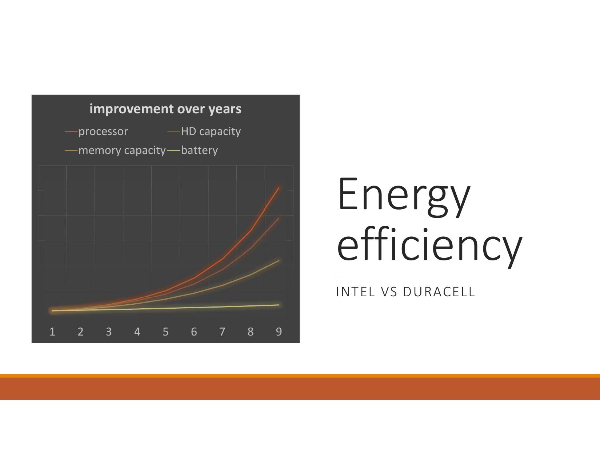
*Fig. — Il confronto "Intel vs Duracell": le curve di processore, HD e memoria crescono esponenzialmente nel tempo, mentre quella della batteria rimane quasi orizzontale. Il gap energetico si allarga progressivamente.*

Questo significa che più un nodo è capace di fare (più calcolo, più trasmissioni), più la batteria diventa il collo di bottiglia. Non si può semplicemente aspettare che le batterie migliorino: bisogna progettare per consumare meno.

### Dove va l'energia: laptop vs sensore

Per capire dove concentrare gli sforzi di ottimizzazione, è utile confrontare la distribuzione del consumo energetico in un laptop (sistema general-purpose) con quella di un sensore wireless.

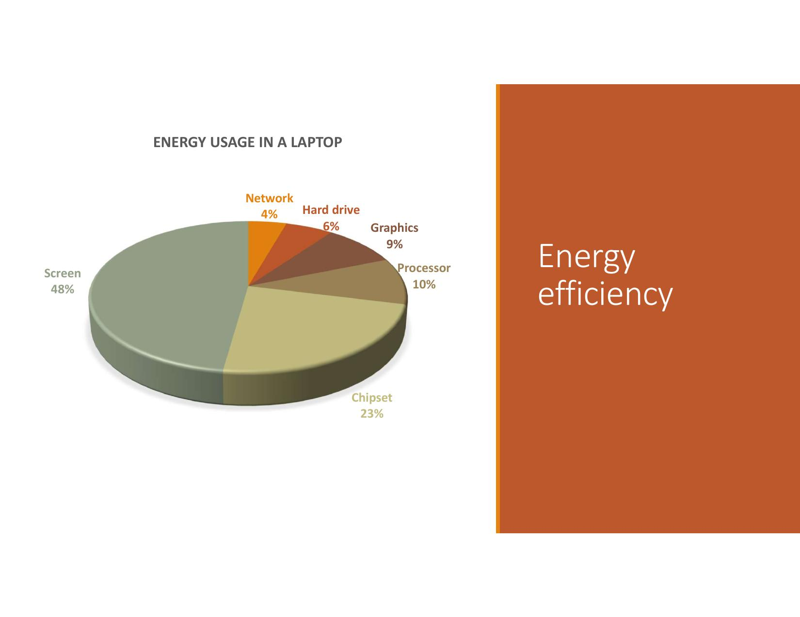
*Fig. — Ripartizione del consumo energetico in un laptop: lo schermo domina con il 48%, seguito dal chipset (23%), processore (10%), grafica (9%), HD (6%) e rete (4%). In un sistema general-purpose lo schermo è il primo target di ottimizzazione.*

In un laptop lo **schermo** assorbe quasi la metà dell'energia totale (48%), e le tecniche di risparmio energetico si concentrano su di esso (backlight dimming, display off automatico). Il processore incide solo per il 10%.

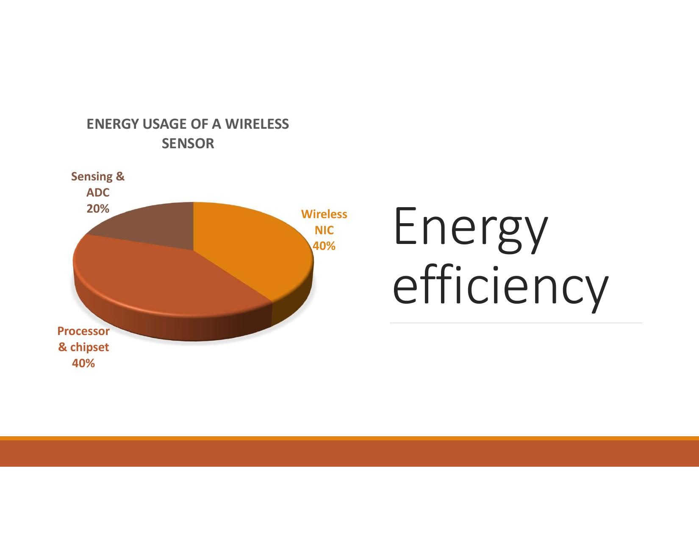
*Fig. — Ripartizione del consumo energetico in un sensore wireless: il Wireless NIC e il processore+chipset si equivalgono al 40% ciascuno, mentre sensing e ADC pesano il 20%. Non c'è schermo, quindi la radio diventa il componente critico.*

In un sensore wireless lo scenario è radicalmente diverso. **Non c'è schermo**. Il consumo è distribuito tra la scheda radio (NIC wireless, 40%), il processore e chipset (40%), e il campionamento con conversione A/D (20%). Processore e radio sono i due target principali per l'ottimizzazione.

### Consumi della radio: un dettaglio cruciale

Per comprendere perché la radio è così critica, vediamo i consumi di una tipica interfaccia WiFi:

- **Sleep mode**: 10 mA
- **Listen mode** (in ascolto): 180 mA
- **Receive mode** (ricezione attiva): 200 mA
- **Transmit mode** (trasmissione): 280 mA

Due osservazioni importanti:
1. La differenza tra sleep e listen è enorme: la radio in ascolto consuma 18 volte più della radio in sleep. Il semplice fatto di tenere la radio accesa e in ascolto è estremamente costoso.
2. In alcuni sensori il consumo in trasmissione è **inferiore** a quello in ricezione. Questo sembra controintuitivo ma dipende dai circuiti di amplificazione e dalla specifica implementazione hardware.

Su un sensore di classe Mote con interfaccia radio a bassa potenza i valori sono molto più contenuti: sleep a 0,016 mW, ascolto a 12,36 mW, ricezione a 12,50 mW, trasmissione tra 12,36 mW e 17,76 mW a seconda della potenza trasmissiva. Si conferma che il costo del "listen" è quasi pari al "receive": **tenere la radio accesa è costoso anche quando non si trasmette nulla**.

> [!warning] Radio accesa = energia sprecata
>
> Il consumo in modalità listen è paragonabile a quello in ricezione, e ordini di grandezza superiore allo sleep. La radio deve essere spenta il più possibile. Lo stesso vale per il processore: anche il turn-on/turn-off ha un costo energetico non trascurabile.

---

## Duty Cycle

### Motivazione: spegnere per risparmiare

La soluzione alla sfida energetica si chiama **duty cycle** (ciclo di lavoro). L'attività di un nodo IoT è tipicamente ripetitiva: campiona il sensore, elabora, trasmette, attendi, ricomincia. L'idea è di sfruttare i periodi di inattività per mettere in sleep tutti i componenti possibili, riducendo al minimo il consumo.

> [!definition] Duty Cycle (DC)
>
> Il duty cycle è la frazione di un periodo in cui il sistema (o un suo componente) è attivo. Si esprime come rapporto o percentuale: DC = t_attivo / T_periodo. Un DC del 100% significa sistema sempre attivo; un DC dell'1% significa attivo solo l'1% del tempo.

Il duty cycle ha senso per sistemi che operano in modo **ciclico**: eseguono la loro attività periodicamente e rimangono inattivi per la parte restante del periodo. Applicarlo in modo aggressivo è la leva principale per estendere la vita della batteria.

### Esempio pratico: il codice Arduino

Consideriamo un semplice programma Arduino che legge un sensore analogico e trasmette il valore via seriale, con una pausa di 380 ms tra un'iterazione e l'altra. La ripartizione temporale di un singolo ciclo di 400 ms è:

| Fase | Durata | Componenti attivi |
|------|--------|-------------------|
| Campionamento | 4 ms | Processore + Sensore |
| Elaborazione | 1 ms | Solo Processore |
| Trasmissione | 15 ms | Processore + Radio |
| Attesa (`idle`) | 380 ms | Nessuno (tutti in sleep) |

Il codice ottimizzato, che accende e spegne esplicitamente ogni componente quando non serve, è:

```c
void loop() {
    turnOn(analogSensor);
    int sensorValue = analogRead(A0);
    turnOff(analogSensor);
    
    float voltage = sensorValue * (5.0 / 1023.0);
    
    turnOn(radioInterface);
    Serial.println(voltage);
    turnOff(radioInterface);
    
    idle(380);  // tutto in sleep per 380 ms
}
```

Il duty cycle di ciascun componente si calcola come:

$$DC_\text{componente} = \frac{t_\text{attivo}}{T_\text{periodo}}$$

- **Processore**: attivo per 4+1+15 = 20 ms su 400 ms → $DC_p = 20/400 = 5\%$
- **Radio**: attiva per 15 ms su 400 ms → $DC_r = 15/400 = 3,75\%$
- **Sensore**: attivo per 4 ms su 400 ms → $DC_s = 4/400 = 1\%$

Il diagramma energia-tempo chiarisce visivamente questa struttura a stati:

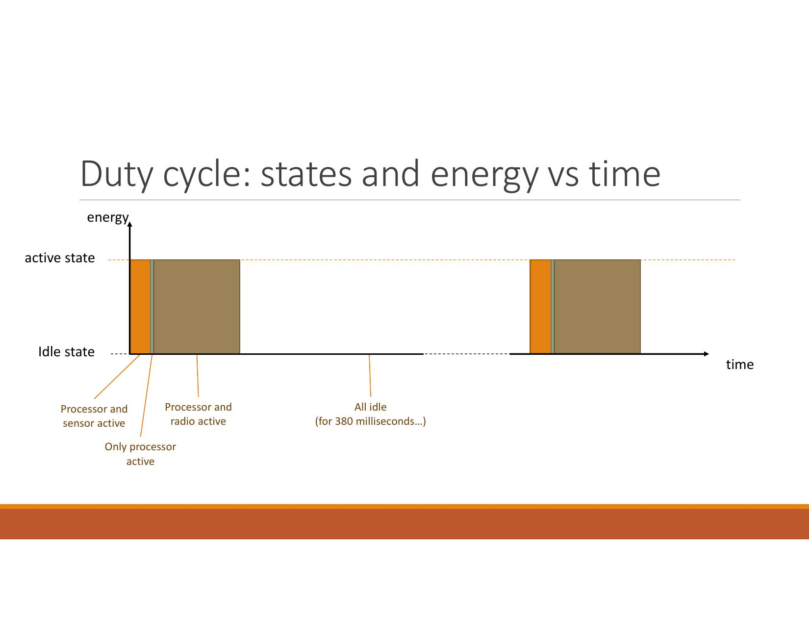
*Fig. — Diagramma stati/energia vs tempo per il codice di esempio: il consumo istantaneo varia a scalini in base ai componenti attivi. Il lungo periodo di idle (380 ms) abbassa drasticamente il consumo medio.*

### Calcolo del consumo energetico

Il consumo totale di energia di un nodo si calcola sommando i contributi di ciascun componente. Per un componente generico con duty cycle $dc$ il costo energetico per unità di tempo è:

$$E_\text{componente} = dc \cdot C_\text{active} + (1 - dc) \cdot C_\text{idle}$$

dove $C_\text{active}$ e $C_\text{idle}$ sono i correnti (in mA) rispettivamente in stato attivo e in sleep. Poiché si usa corrente continua e la tensione è (quasi) costante, si può esprimere tutto in **mAh** — sia l'energia consumata che la carica immagazzinata nella batteria.

Per il microprocessore il costo per ciclo è:

$$E_\mu = C_\mu^{full} \cdot dc_\mu + C_\mu^{idle} \cdot (1 - dc_\mu)$$

Per la radio, che ha due stati attivi (trasmissione e ricezione):

$$E_\rho = C_\rho^T \cdot dc_\rho^T + C_\rho^R \cdot dc_\rho^R + C_\rho^{idle} \cdot (1 - dc_\rho^T - dc_\rho^R)$$

Il costo totale per ciclo è la somma di tutti i componenti:

$$E = E_\mu + E_\rho + E_\lambda + E_\sigma$$

dove $E_\lambda$ è il costo del logger (memoria flash) e $E_\sigma$ quello della scheda sensori.

### Calcolo del lifetime

La vita utile del dispositivo dipende da quanta energia ha a disposizione (capacità della batteria $B_0$) e da quanto ne consuma per ciclo ($E$). Ignorando la perdita di carica della batteria per autoscarica, il lifetime in numero di cicli è:

$$Lifetime = \frac{B_0}{E}$$

Se si tiene conto dell'autoscarica della batteria (perdita percentuale $\varepsilon$ per ciclo), la carica residua segue la ricorrenza:

$$B_n = B_{n-1} \cdot (1 - \varepsilon) - E$$

Risolvendo la ricorrenza si ottiene:

$$B_n = B_0 \cdot (1-\varepsilon)^{n-1} + \frac{E \cdot ((1-\varepsilon)^n - 1)}{\varepsilon}$$

Il lifetime in cicli è il valore di $n$ per cui $B_n = 0$. In pratica il dispositivo smette di funzionare prima, quando la tensione scende sotto una soglia minima.

### Effetto del duty cycle sulla vita della batteria

I due grafici seguenti mostrano empiricamente l'impatto del duty cycle sulla vita di un nodo basato su specifiche hardware reali (Mote-class):

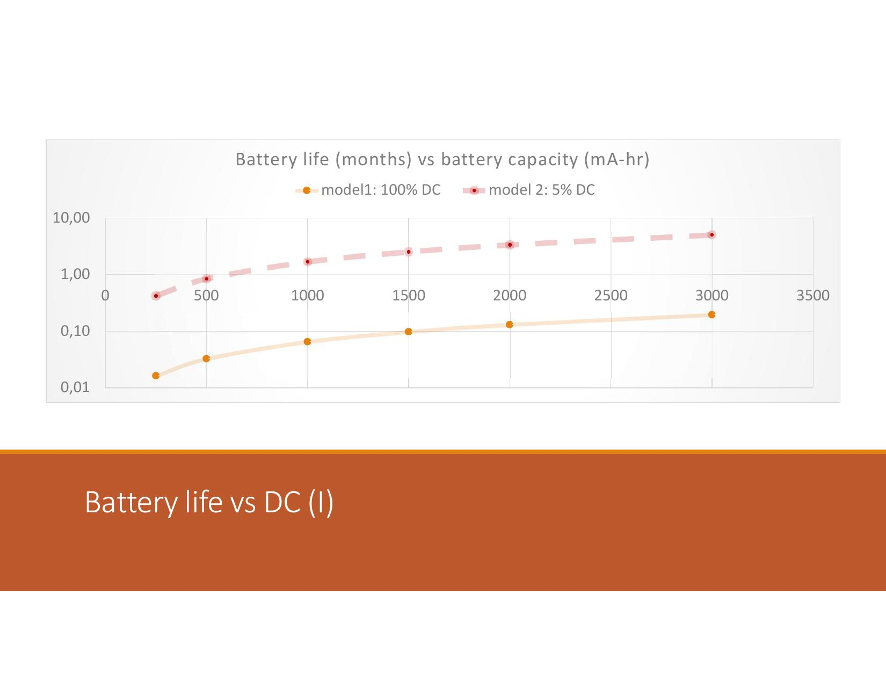
*Fig. — Vita della batteria in mesi vs capacità (mA-hr) per due modelli: DC al 100% e DC al 5%. Scala logaritmica sull'asse Y. A parità di capacità, il modello con DC al 5% ha una vita circa 10-15 volte superiore.*

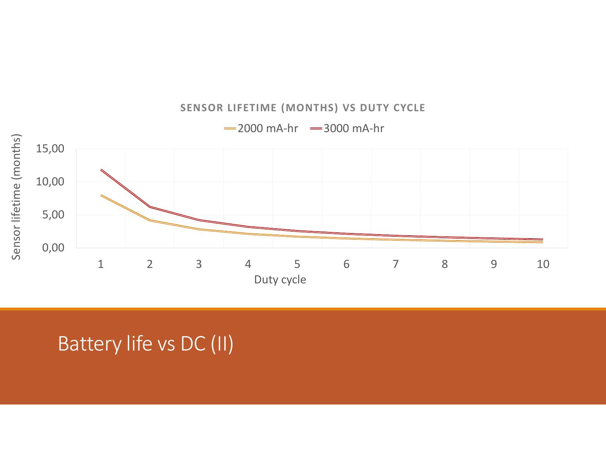
*Fig. — Vita del sensore (mesi) vs duty cycle per batterie da 2000 e 3000 mA-hr. La curva scende rapidamente: già passare dall'1% al 3% di DC dimezza approssimativamente il lifetime. L'effetto della capacità della batteria diventa trascurabile ad alti DC.*

Questi grafici mostrano due cose fondamentali. Prima cosa: ridurre il duty cycle è molto più efficace che aumentare la capacità della batteria — a DC alto le due curve per 2000 e 3000 mAh si sovrappongono, segno che la batteria più grande non aiuta quasi più. Seconda cosa: anche un DC basso ma non zero (5%) porta a lifetime dell'ordine dei mesi, non degli anni. Per applicazioni con deployment di lunga durata è necessario DC molto bassi o [[Energy Harvesting]].

### Esempio numerico: soluzione dell'esercizio base

Con le specifiche della Mote (ATmega128L: 8 mA full, 15 μA sleep; Radio: 20 mA xmit, 20 μA sleep; Sensor Board: 5 mA full, 5 μA sleep; Batteria: 2000 mAh) e il codice di esempio (periodo 400 ms, sensore 4 ms, calcolo 1 ms, trasmissione 15 ms, idle 380 ms):

- $dc_p = 5\%$, $dc_r = 3,75\%$, $dc_s = 1\%$

Il consumo per ora risulta 1,243 mAh, ripartito tra:

| Componente | Contributo idle | Contributo attivo |
|------------|-----------------|-------------------|
| Processore | 0,014 mAh | 0,4 mAh |
| Radio | 0,019 mAh | 0,75 mAh |
| Sensore | 0,005 mAh | 0,055 mAh |
| **Totale** | 0,038 mAh | 1,205 mAh |

**Lifetime ≈ 2000 / 1,243 ≈ 1609 ore** (circa 67 giorni).

### La complessità nascosta: spegnere la radio è una decisione globale

Spegnere il processore è una scelta locale: lo scheduler del nodo sa quando il processore non serve e può metterlo in sleep autonomamente. Spegnere la radio è invece una **decisione globale**: un nodo con radio spenta non può ricevere messaggi, non può fungere da router in una rete multi-hop, non può ricevere comandi o aggiornamenti. Un'intera rete di nodi che si addormentano nello stesso momento sarebbe inutile.

Questo crea un trade-off fondamentale: più i nodi dormono, meno consumano, ma peggiore è la capacità di comunicare. La soluzione sta nei **protocolli MAC** (Medium Access Control) progettati per l'IoT, che sincronizzano i nodi e coordinano chi può dormire e quando. Questi protocolli implementano strategie di risparmio energetico a livello di rete, e saranno oggetto delle lezioni successive.

---

## Esercizi: Calcolo di DC e Lifetime

### Esercizio 1 — Monitoraggio Frequenza Cardiaca (invio raw)

In questo scenario un dispositivo campiona un fotodiodo sul polso a 20 Hz (campionamento da 0,5 ms, richiede processore + sensore attivi), e invia ogni 5 campioni consecutivi al server (trasmissione da 2 ms ogni 0,25 s, richiede processore + radio). Il calcolo HR è demandato al server.

- $dc_\text{sampling} = 0,5\,ms / 50\,ms = 0,01$ (1%)
- $dc_\text{radio} = 2\,ms / 250\,ms = 0,008$ (0,8%)
- $dc_\text{processor} = dc_\text{sampling} + dc_\text{radio} = 0,018$ (1,8%)

Consumo per ora: 0,3935 mAh → **Lifetime ≈ 5082 ore (~212 giorni)**.

### Esercizio 2 — Monitoraggio HR con calcolo in-device

In questo scenario il dispositivo calcola HR localmente (ogni 2 s, elaborazione da 5 ms, solo processore) e trasmette solo 1 pacchetto ogni 10 s (2 ms di trasmissione).

- $dc_\text{sampling} = 0,01$ (identico al caso precedente)
- $dc_\text{processing} = 5\,ms / 2000\,ms = 0,0025$
- $dc_\text{radio} = 2\,ms / 10000\,ms = 0,0002$
- $dc_\text{processor} = 0,01 + 0,0025 + 0,0002 = 0,0127$

Consumo per ora: 0,1954 mAh → **Lifetime ≈ 10.235 ore (~426 giorni)**.

> [!tip] Edge processing vs cloud offloading
>
> Il confronto tra i due esercizi rivela un principio fondamentale nell'IoT: elaborare i dati in-loco (**edge processing**) invece di inviare tutti i campioni grezzi al server può ridurre drasticamente le trasmissioni radio — il componente più energivoro dopo il processore. Nonostante il calcolo HR aggiunga un piccolo overhead al processore, il risparmio sulla radio più che compensa, raddoppiando circa il lifetime.

---

## Conclusioni e Punti Chiave

La lezione ha costruito un quadro coerente intorno al problema energetico nell'IoT. I vincoli di processing, memoria, batteria e comunicazione non saranno risolti automaticamente dalla Legge di Moore, che nell'IoT viene usata principalmente per ridurre costi e dimensioni piuttosto che per aumentare le prestazioni. La sfida energetica persiste perché la capacità delle batterie non cresce al ritmo dei transistor.

L'efficienza energetica si ottiene comprendendo dove va l'energia (radio e processore sono i componenti dominanti, non lo schermo come nel laptop) e applicando il duty cycle per spegnere ogni componente quando non è necessario. Il modello formale permette di calcolare con precisione il consumo per ciclo e il lifetime atteso. La prossima lezione approfondirà i protocolli MAC per l'IoT, che risolvono il problema della coordinazione del duty cycle a livello di rete.

```{=latex}
\newpage
```

# Software Defined Networking (SDN) — Architettura

Il Software Defined Networking è un paradigma architetturale che separa nettamente il **piano di controllo** (*control plane*) dal **piano dati** (*data plane*). Questa separazione permette di programmare il comportamento della rete in modo centralizzato, eliminando la rigidità dei dispositivi di rete tradizionali che incorporano sia la logica di instradamento che la funzione di forwarding. La lezione approfondisce l'architettura interna di questi due piani e i meccanismi con cui interagiscono.

## Motivazioni: Perché SDN?

Il Software Defined Networking non è nato per risolvere un semplice problema di capacità, ma per rispondere a una trasformazione strutturale delle reti moderne. La domanda di rete — alimentata da cloud computing, big data, traffico mobile e IoT — è cresciuta enormemente, ma anche l'offerta ha tenuto il passo: CPU più veloci, buffer più grandi, link ad alta capacità. Il vero problema, dunque, non è quantitativo ma qualitativo: **la complessità si è spostata dal volume alla variabilità**.

I pattern di traffico moderni sono *time-variant* (cambiano nel tempo), *spatially dynamic* (cambiano nei percorsi) e *application-sensitive* (dipendono dal tipo di applicazione). Questa variabilità richiede un controllo programmabile della rete, che le architetture tradizionali non sono in grado di offrire.

### Dinamiche del Traffico Moderno

Le applicazioni distribuite moderne accedono simultaneamente a molteplici database e server backend, generando significativo traffico "orizzontale" (*server-to-server*) in aggiunta al tradizionale traffico "verticale" (*client-server*). I servizi di Unified Communications (UC) — messaggistica, presenza, VoIP, videoconferenza — amplificano ulteriormente questa complessità, richiedendo alla rete di supportare flussi concorrenti con requisiti di QoS eterogenei.

L'adozione massiva del cloud computing ha spostato traffico che un tempo rimaneva all'interno delle reti enterprise verso data center remoti, rendendo i carichi sui router enterprise imprevedibili. La virtualizzazione dei server ha aggiunto un ulteriore strato: una singola macchina fisica ospita multiple VM tra cui avvengono significative comunicazioni (migrazione, replica, failover).

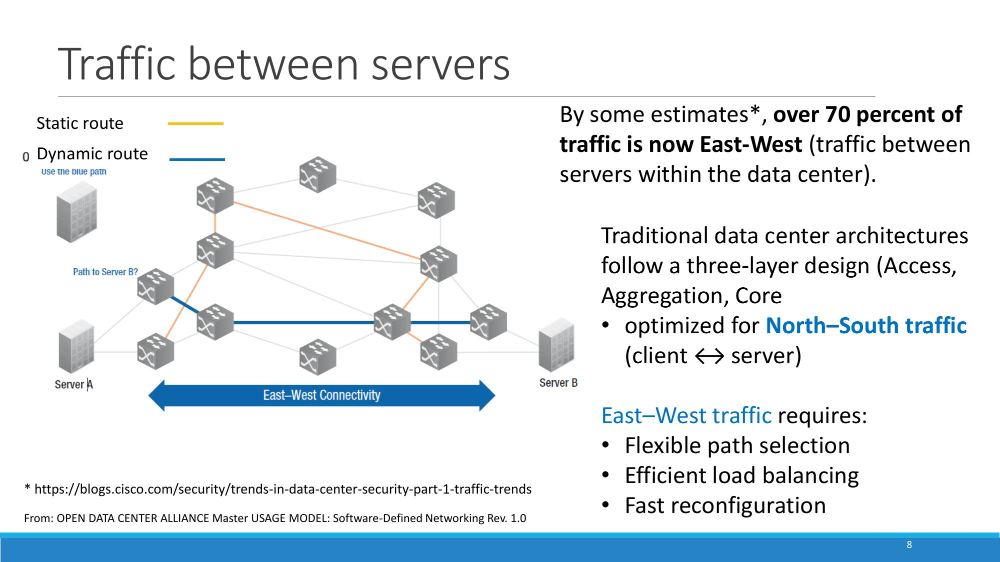
*Fig. 0 — Oltre il 70% del traffico nei data center moderni è East-West (tra server). Le architetture tradizionali a tre livelli (Access, Aggregation, Core) erano ottimizzate per il traffico North-South (client-server) e richiedono selezione flessibile dei percorsi, load balancing efficiente e riconfigurazione rapida.*

Il traffico mobile aggiunge un'ulteriore dimensione di imprevedibilità: i dispositivi mobili generano carichi rapidamente mutevoli e cambiano frequentemente il punto di connessione alla rete. Le applicazioni moderne richiedono trattamento differenziato: le applicazioni real-time (VoIP, videoconferenza) richiedono bassa latenza e alta priorità, mentre i trasferimenti bulk (backup) richiedono ampia banda ma tollerano ritardi.

### Limitazioni delle Reti Tradizionali

Le tendenze descritte richiedono una gestione flessibile delle risorse di rete, ma le architetture tradizionali mostrano tre limitazioni strutturali:

**A) Architettura statica e complessa**: le reti tradizionali sono costruite come collezione di protocolli indipendenti, ognuno pensato per una funzione specifica e separata (routing, spanning tree, ACL, ecc.). Il risultato è un control plane frammentato con complessità operativa crescente.

**B) Inconsistenza delle policy e rigidità operativa**: le modifiche di configurazione devono essere applicate manualmente su ogni singolo dispositivo. Le policy vengono enforced localmente, non globalmente, con alto rischio di misconfiguration.

**C) Dipendenza dal vendor e innovazione lenta**: la logica di controllo è embedded in hardware proprietario, con interfacce chiuse. Questo rende lento il deployment di nuovi servizi e limita la programmabilità.

---

## Il Paradigma SDN

### Separazione Control Plane / Data Plane

Le funzioni di rete a livello network si dividono in due categorie temporalmente molto diverse: il **forwarding** (spostare pacchetti dall'input all'output appropriato) avviene su scala temporale dei pacchetti (*fast timescales*), mentre il **routing** (determinare il percorso dei pacchetti da sorgente a destinazione) avviene su scala degli eventi di controllo (*slow timescales*). In una rete tradizionale, queste due funzioni sono tightly coupled nello stesso dispositivo.

> [!definition] Software Defined Networking (SDN)
>
> Approccio alla gestione di rete che usa l'astrazione per abilitare una configurazione e un'operazione della rete dinamica e programmaticamente efficiente. Separa il control plane dal data plane, centralizzando logicamente il primo in un controller remoto.

#### Il Problema del Traffic Engineering Tradizionale

Nelle reti con routing distribuito, i router calcolano i percorsi indipendentemente usando algoritmi come Dijkstra (link-state) o Bellman-Ford (distance-vector). Il problema è che l'unico "knob" disponibile all'operatore sono i pesi dei link: se si vuole forzare il traffico da u a z lungo il percorso uvwz invece di uxyz, bisogna ricalcolare i pesi, e questo può influenzare altri flussi in modo indesiderato.

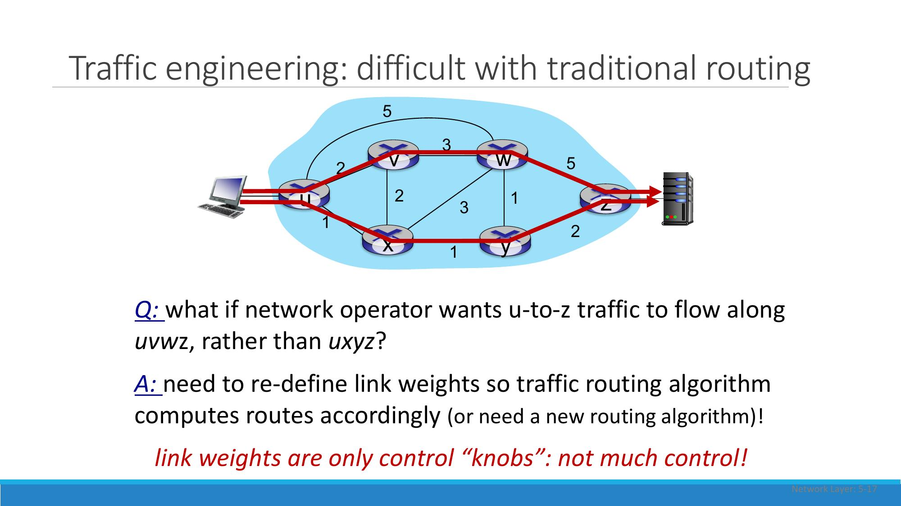
*Fig. 0.1 — Con il routing tradizionale, i link weights sono gli unici "knob" di controllo. Non è possibile: (a) forzare percorsi specifici senza alterare il routing globale, (b) fare load balancing su più percorsi, (c) differenziare traffico di colori diversi sullo stesso nodo.*

SDN risolve questo problema spostando la logica di routing in un controller centralizzato che ha visione globale della rete e può installare regole arbitrarie in ogni switch.

#### Control Plane Logicamente Centralizzato

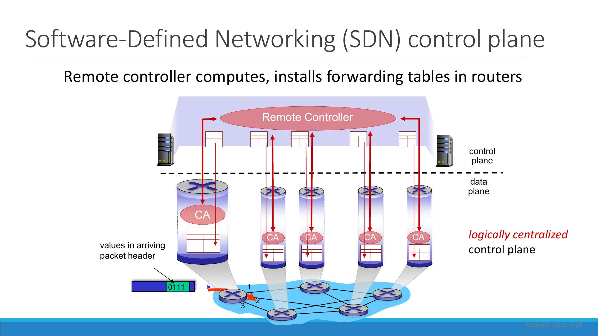
*Fig. 0.2 — Nel modello SDN, un Remote Controller logicamente centralizzato calcola le forwarding table e le installa nei router. I dispositivi del data plane (con etichetta CA, Controlled Agent) eseguono le istruzioni ricevute senza logica di routing autonoma.*

In una rete tradizionale, ogni router calcola la propria forwarding table come:
$$T_i = \text{SPF}(\text{Topology}, \text{link weights})$$
Il comportamento globale emerge da computazioni locali non coordinate. Non vengono considerati la traffic demand (traffic matrix) né le policy applicative.

In SDN, un controller centralizzato calcola:
$$\mathcal{F}: S(t) \rightarrow \{T_1, T_2, \ldots, T_n\}$$
dove $S(t)$ include topologia, stato del traffico e policy. Le forwarding table vengono calcolate in modo **consistente** su tutta la rete.

#### I Quattro Pilastri di SDN

SDN si fonda su quattro idee principali:

1. **Generalized flow-based forwarding**: il forwarding non si basa solo sull'indirizzo IP di destinazione, ma può usare qualsiasi campo dell'header (OpenFlow)
2. **Separazione control plane / data plane**: i dispositivi del data plane eseguono il forwarding senza prendere decisioni di routing autonome
3. **Control plane esterno agli switch**: la logica di controllo risiede nel controller, non nei dispositivi di rete
4. **Programmabilità**: le applicazioni di controllo implementano funzioni di rete (routing, access control, load balancing) usando le API del controller

### Architettura SDN a Tre Livelli

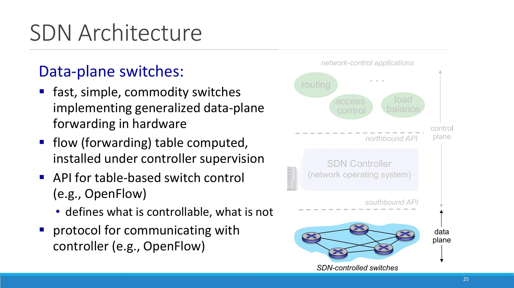
*Fig. 0.3 — L'architettura SDN è organizzata in tre livelli: le applicazioni di controllo in cima, il controller (network OS) al centro, e gli switch programmabili in basso. Le NorthBound API collegano controller e applicazioni; le SouthBound API (es. OpenFlow) collegano controller e switch.*

**Data-plane switches**: switch veloci e semplici (*commodity*) che implementano il generalized forwarding in hardware. Le flow table sono calcolate e installate sotto la supervisione del controller. L'API per il controllo (es. OpenFlow) definisce cosa è controllabile e cosa non lo è.

**SDN Controller** (*network operating system*): mantiene le informazioni di stato della rete, interagisce con le applicazioni via NorthBound API e con gli switch via SouthBound API. È implementato come sistema distribuito per performance, scalabilità, fault-tolerance e robustezza.

**Network-control applications**: il "cervello" del sistema, implementano le funzioni di controllo (routing, access control, load balancing) usando i servizi di basso livello offerti dal controller. Possono essere fornite da terze parti, separate dal vendor del controller o degli switch.

### Breve Storia di SDN

| Anno | Evento |
|------|--------|
| ~2004 | Ricerca su nuovi paradigmi di gestione (Princeton, Stanford/Berkeley) |
| 2008 | NOX Network OS (NICIRA), interfaccia OpenFlow (Stanford/NICIRA) |
| 2011 | Open Networking Foundation — board: Google, Yahoo, Verizon; membri: Cisco, HP, Dell |
| 2013 | 1600 partecipanti all'Open Networking Summit; SDN usato nel WAN di Google (B4) |
| 2014 | SDN nei data center: VMware NSX, Cisco ACI |
| 2021+ | SDN guidato da AI/ML (Cisco DNA Center, Juniper Mist AI), SDN in reti 5G, IoT, edge; P4 per switch hardware programmabili |

> [!note] Da protocolli distribuiti a controllo programmabile
>
> La traiettoria di SDN riflette una tendenza più ampia nell'informatica: la separazione tra *policy* (cosa fare) e *meccanismo* (come farlo). Così come i sistemi operativi hanno astratto l'hardware dai programmi applicativi, SDN astrae l'infrastruttura di rete dalle applicazioni di controllo, abilitando innovazione indipendente a ogni livello.

---

## SDN Data Plane

Il data plane, chiamato anche *resource layer* o *infrastructure layer*, è composto da dispositivi di forwarding — switch fisici e virtuali — che trasportano e processano i dati secondo le decisioni del control plane. L'elemento chiave che distingue un dispositivo SDN da un router tradizionale è l'assenza di software autonomo per prendere decisioni di instradamento: il dispositivo esegue soltanto le istruzioni che riceve dal controller.

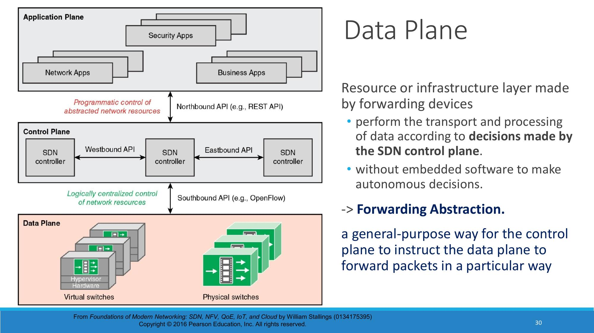
*Fig. 1 — L'architettura SDN stratificata: il Data Plane è il livello inferiore, composto da switch che eseguono il forwarding secondo le regole imposte dal Control Plane via SouthBound API (es. OpenFlow).*

> [!definition] Forwarding Abstraction
>
> Un meccanismo generico e standardizzato con cui il control plane istruisce il data plane su come instradare i pacchetti. Non è legata a un tipo specifico di dispositivo: vale tanto per router quanto per switch o firewall.

### Forwarding Generalizzato e Match+Action

Nel forwarding tradizionale basato sulla destinazione (*destination-based forwarding*), un router confronta l'indirizzo IP di destinazione del pacchetto con la propria tabella di routing e lo instrada di conseguenza. Il forwarding generalizzato di SDN generalizza radicalmente questo concetto: qualsiasi campo dell'header del pacchetto — a livello link, rete o trasporto — può essere usato come chiave di corrispondenza (*match*), e le azioni possibili sono molto più ricche del semplice forwarding.

> [!tip] L'astrazione Match+Action
>
> Un pacchetto arriva allo switch → lo switch confronta i campi dell'header con le voci della **flow table** → se trova corrispondenza, esegue l'**azione** associata. Questa astrazione unifica in un unico modello dispositivi che in passato erano separati: router, switch, firewall, NAT.

Le azioni possibili includono:
- **drop**: scarta il pacchetto (firewall)
- **forward**: invia il pacchetto su una porta specifica (router/switch)
- **modify**: modifica campi dell'header (NAT, VLAN rewriting)
- **send to controller**: invia il pacchetto al controller per decisione centralizzata

### Flow Table e Astrazione di Flusso

Un **flusso** (*flow*) è definito dall'insieme dei valori che i campi header possono assumere. La **flow table** contiene regole della forma:

| Componente | Descrizione |
|------------|-------------|
| **Match** | Pattern da confrontare con i campi header (wildcard `*` per qualsiasi valore) |
| **Action** | Cosa fare con il pacchetto che corrisponde |
| **Priority** | Priorità per risolvere ambiguità tra regole sovrapposte |
| **Counters** | Contatori di byte e pacchetti per statistica |

I campi su cui si può effettuare il match coprono tre livelli OSI contemporaneamente: porta di ingresso, MAC sorgente/destinazione, tipo Ethernet, VLAN ID, IP sorgente/destinazione, protocollo IP, ToS, porte TCP/UDP sorgente e destinazione. Questa flessibilità consente di implementare policy di rete complesse con un singolo meccanismo uniforme.

> [!example] Esempi di regole OpenFlow
>
> - **Forwarding IP classico**: `IP Dst = 51.6.0.8` → `forward(port 6)` — tutti i datagrammi verso quell'IP vengono instradati sulla porta 6.
> - **Firewall (blocca SSH)**: `TCP dst-port = 22` → `drop` — blocca tutti i pacchetti TCP destinati alla porta 22.
> - **Blocco per sorgente**: `IP Src = 128.119.1.1` → `drop` — blocca tutto il traffico da quell'host.
> - **L2 forwarding**: `Eth Dst = 22:A7:23:11:E1:02` → `forward(port 3)` — forwarding basato su MAC address.

---

### OpenFlow

**OpenFlow** è il protocollo standard che implementa la *SouthBound API* di SDN. Definisce come il controller comunica con i dispositivi di forwarding per installare, modificare e rimuovere regole nella flow table. Il primo paper che lo ha introdotto è di Nick McKeown et al. (2008) e ha dato origine a un intero ecosistema gestito oggi dalla *Open Networking Foundation (ONF)*.

> [!definition] OpenFlow
>
> Protocollo di comunicazione nelle architetture SDN che permette ai controller di consegnare *forwarding entries* ai dispositivi di data plane (switch e router, fisici e virtuali). È la principale implementazione della SouthBound API.

Sebbene l'adozione in ambienti di produzione rimanga limitata, OpenFlow ha un valore fondamentale per la ricerca e la didattica, avendo ispirato soluzioni più avanzate come **P4** (p4.org) per la programmazione generalizzata del data plane.

#### Struttura di una Flow Entry OpenFlow

Ogni voce nella flow table OpenFlow ha tre campi fondamentali:

1. **Match**: i campi header da confrontare (tutti i livelli)
2. **Action**: le operazioni da eseguire (forward, drop, modify header, encapsulate e invia al controller)
3. **Stats**: contatori di pacchetti e byte per monitoraggio

#### OpenFlow come Astrazione Unificante

> [!tip] Un solo modello per tutti i dispositivi
>
> | Dispositivo | Match | Action |
> |-------------|-------|--------|
> | Router | Longest prefix IP dst | Forward su link |
> | Switch L2 | MAC address destinazione | Forward o flood |
> | Firewall | IP + TCP/UDP port | Permit o deny |
> | NAT | IP address e port | Rewrite address e port |
>
> Tutti questi dispositivi, storicamente separati, diventano istanze della stessa astrazione match+action con flow table diverse.

---

### OpenFlow Switch e Flow Table Pipeline

Un OpenFlow switch ha tre componenti principali:

1. **Porte I/O**: le interfacce fisiche attraverso cui entrano ed escono i pacchetti
2. **Flow Tables** (*Datapath*): tabelle organizzate in pipeline per il processing dei pacchetti
3. **OpenFlow Channel**: il canale di comunicazione sicuro (TCP, opzionalmente TLS) con il controller

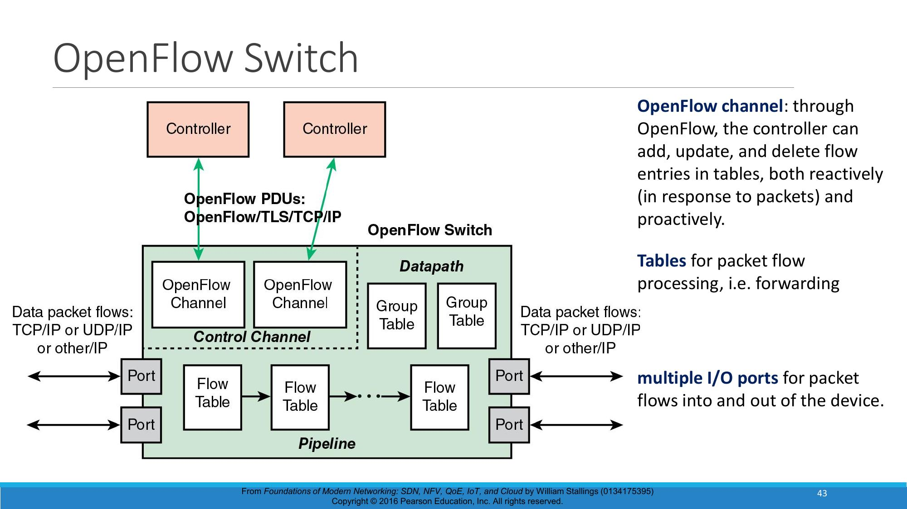
*Fig. 2 — L'OpenFlow Switch: il canale OpenFlow collega lo switch al controller, che può aggiungere, aggiornare e rimuovere flow entries sia in modo reattivo (in risposta ai pacchetti) che proattivo.*

#### Flow Table Pipeline

Uno switch può contenere **una o più flow table** organizzate in **pipeline**. Le tabelle sono numerate sequenzialmente a partire da 0. Il pacchetto viene processato prima dalla tabella 0, e in base al risultato del match può essere diretto ad altre tabelle, a una group table, a una meter table, o infine all'uscita.

$$
\text{Packet in} \rightarrow [\text{Table 0}] \rightarrow [\text{Table 1}] \rightarrow \cdots \rightarrow [\text{Table N}] \rightarrow \text{Packet out}
$$

L'uso di più tabelle in pipeline offre al controller notevole flessibilità: permette, ad esempio, di separare le regole di sicurezza da quelle di routing in tabelle distinte, applicandole in sequenza.

#### Processing Pipeline

Quando un pacchetto viene processato da una flow table:
- Se c'è **corrispondenza** con una o più entry, viene eseguita la regola con **priorità più alta**. Le istruzioni possono aggiornare l'action set, aggiornare metadata, eseguire azioni, o redirigere il pacchetto con `Goto` a un'altra tabella.
- Se c'è corrispondenza solo con la **table-miss entry** (entry speciale per pacchetti senza match), si può: (a) inviare al controller, (b) redirigere a un'altra tabella, (c) scartare.
- Se **non c'è alcun match** e non esiste table-miss entry, il pacchetto viene **scartato**.

---

### Group Tables

Oltre alle flow table, OpenFlow definisce le **group table**. Un pacchetto che corrisponde a una flow entry può essere diretto non a una singola porta di uscita, ma a un *group entry*, che specifica come il pacchetto deve essere gestito su più porte.

Ogni group entry ha:
- Un **Group ID** univoco
- Un **Group Type** che definisce la semantica
- Uno o più **action bucket** con le azioni possibili

| Group Type | Comportamento |
|------------|--------------|
| **ALL** | Il pacchetto viene inviato a tutti i bucket (multicast/broadcast) |
| **SELECT** | Il pacchetto viene inviato a un singolo bucket scelto per load balancing o hashing |

> [!example] Group Table in azione
>
> - Group 1 (ALL): Output su Port 2 e Port 3 → flooding su entrambe le porte
> - Group 2 (SELECT): Output su Port 4 o Port 5 → bilanciamento del carico tra due link

---

## SDN Control Plane

Il control plane SDN è il livello di intelligenza della rete. Centralizza la logica di instradamento, il calcolo dei percorsi e la gestione delle policy in un componente software chiamato **controller SDN**, che mantiene una visione globale e consistente dello stato della rete.

### Componenti del Controller SDN

Il controller SDN è organizzato in tre strati funzionali:

**Strato di comunicazione (*Communication Layer*)**: gestisce la comunicazione bidirezionale tra il controller e i dispositivi del data plane. I protocolli utilizzati sono OpenFlow (SouthBound API), SNMP, e altri.

**Strato di gestione dello stato di rete (*Network-Wide State Management*)**: mantiene un database distribuito con le informazioni sullo stato dell'intera rete: topologia dei link, informazioni sugli host, flow table degli switch, statistiche. È il cuore del controller, poiché fornisce la *global network view* necessaria per decisioni di routing ottimali.

**Strato di interfaccia verso le applicazioni (*Interface Layer*)**: espone API (*NorthBound API*) alle applicazioni di controllo (routing, access control, load balancing, orchestrazione). Queste API permettono alle applicazioni di interagire con la rete in modo astratto, senza conoscere i dettagli del protocollo SouthBound.

### Protocollo OpenFlow — Messaggi

OpenFlow opera tra controller e switch tramite **TCP** (opzionalmente cifrato con TLS). I messaggi sono divisi in tre classi:

**Controller → Switch:**

| Messaggio | Funzione |
|-----------|----------|
| **features** | Il controller interroga lo switch sulle sue capacità, lo switch risponde |
| **configure** | Il controller legge o imposta parametri di configurazione dello switch |
| **modify-state (FlowMod)** | Aggiunge, elimina o modifica flow entries nelle tabelle OpenFlow |
| **packet-out** | Il controller invia un pacchetto incapsulato a una porta specifica dello switch |

**Switch → Controller:**

| Messaggio | Funzione |
|-----------|----------|
| **packet-in** | Lo switch trasferisce un pacchetto (e il suo controllo) al controller |
| **flow-removed** | Notifica che una flow entry è stata eliminata dallo switch |
| **port-status** | Informa il controller di un cambiamento di stato su una porta |

> [!warning] I network operator non programmano OpenFlow direttamente
>
> In pratica, gli operatori usano astrazioni di alto livello fornite dal controller (es. intent framework in ONOS). La scrittura diretta di messaggi OpenFlow è riservata allo sviluppo interno del controller.

### Interazione Control Plane / Data Plane — Esempio

Un esempio concreto illustra la collaborazione tra i componenti. Si consideri un guasto su un link della rete:

1. Lo switch **S1** rileva il guasto e invia al controller un messaggio **port-status** per notificare il cambiamento di stato del link.
2. Il **controller SDN** riceve il messaggio e aggiorna il proprio database di stato dei link.
3. L'applicazione di routing **Dijkstra** (che si è registrata per ricevere notifiche sui cambiamenti di link) viene invocata.
4. Dijkstra accede al grafo della rete e alle informazioni di link-state nel controller e calcola i **nuovi percorsi ottimali**.
5. L'applicazione di routing interagisce con il componente di calcolo delle flow table nel controller per determinare le nuove regole da installare.
6. Il controller invia messaggi **FlowMod** via OpenFlow agli switch interessati per installare le nuove flow table.

> [!note] SDN vs routing distribuito tradizionale
>
> In una rete tradizionale, i router eseguono OSPF o BGP e calcolano i percorsi autonomamente scambiandosi informazioni. In SDN, questa logica è centralizzata nel controller: questo semplifica il coordinamento, ma richiede robustezza e alta disponibilità del controller stesso.

---

### Implementazioni di Controller SDN

| Controller | Note |
|------------|------|
| **NOX** | Primo controller SDN, riferimento storico |
| **Ryu** | Framework Python per SDN |
| **OpenDaylight (ODL)** | Controller open source enterprise-grade |
| **ONOS** | Open Network OS, forte enfasi su distribuzione e scalabilità |
| **TeraFlow SDN** | Controller per reti cloud-native, progetto ETSI |

#### OpenDaylight (ODL)

OpenDaylight è uno dei controller SDN più diffusi in ambienti enterprise. La sua architettura è stratificata:

- **Northbound API**: REST/RESTCONF/NETCONF per le applicazioni (Traffic Engineering, Firewalling, Load Balancing, Orchestration)
- **Basic Network Functions**: moduli interni per topology processing, switch management, statistiche, host tracking, gestione regole di forwarding
- **Service Abstraction Layer (SAL)**: il bus interno che interconnette applicazioni, servizi interni e protocolli SouthBound
- **Southbound API**: OpenFlow, NETCONF, SNMP, OVSDB

> [!tip] SAL in ODL
>
> Il Service Abstraction Layer è l'elemento architetturale chiave di ODL: agisce da mediatore tra il mondo delle applicazioni (Northbound) e i protocolli di rete specifici (Southbound), rendendo il controller agnostico rispetto al protocollo SouthBound utilizzato.

#### ONOS

ONOS (*Open Network Operating System*) enfatizza la separazione delle applicazioni di controllo dal core del controller e la robustezza distribuita:

- Le **applicazioni di controllo** (Traffic Engineering, Firewalling, Load Balancing) sono separate dal controller core e comunicano via Northbound API
- L'**intent framework** permette alle applicazioni di specificare *cosa* si vuole ottenere (es. connettività tra due host) piuttosto che *come* (es. quale percorso usare): il controller si occupa di tradurre l'intent in flow rules concrete
- Il **distributed core** garantisce alta disponibilità e scalabilità attraverso replicazione e consensus distribuito

---

## Forwarding e Topology Discovery

Un aspetto cruciale in una rete SDN è come il controller costruisce la conoscenza della topologia e come gestisce il forwarding dei pacchetti prima che le flow table siano popolate.

### Path Computation

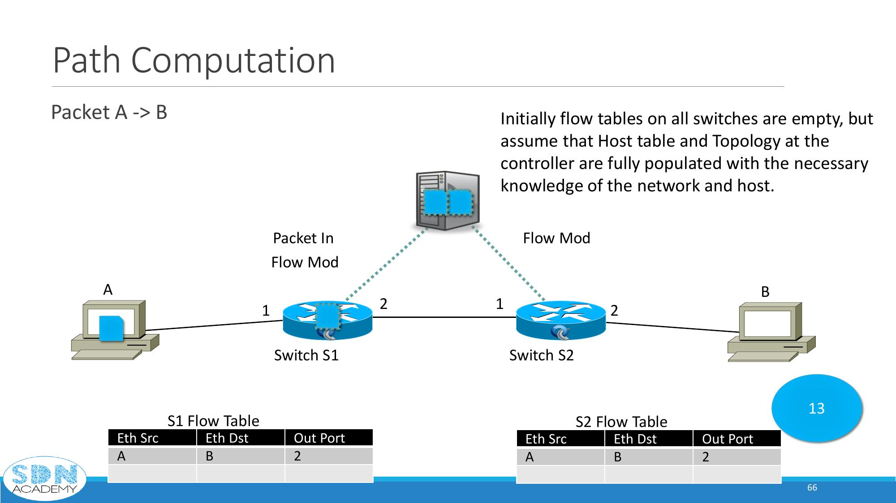
*Fig. 3 — Path computation: le flow table degli switch sono inizialmente vuote. Il primo pacchetto da A a B genera un Packet-In; il controller calcola il percorso e installa le regole via FlowMod.*

Quando un pacchetto arriva a uno switch e non trova corrispondenza nella flow table (*table-miss*), lo switch lo invia al controller tramite un messaggio **Packet-In**. Il controller, disponendo di una Host Table e di una Topology Table già popolate, calcola il percorso ottimale da sorgente a destinazione e invia messaggi **FlowMod** agli switch lungo il percorso.

> [!warning] Ordine di installazione delle flow entries
>
> I messaggi FlowMod vengono inviati in **ordine inverso**: prima allo switch più vicino alla destinazione, poi risalendo verso la sorgente. Questo garantisce che quando il pacchetto arriva al secondo switch, la regola sia già installata, evitando un secondo Packet-In al controller.

Una volta installate le regole, tutti i pacchetti successivi dello stesso flusso vengono gestiti direttamente dagli switch, senza passare dal controller.

---

### Routing Centralizzato

In una rete tradizionale, la funzione di routing è distribuita tra i router, ognuno dei quali mantiene la propria tabella di routing e partecipa a protocolli come OSPF. In SDN, è naturale centralizzare questa funzione nel controller, che:

- Ha una visione **globale e coerente** dello stato della rete
- Può implementare **policy application-aware** (es. preferire certi link per certi tipi di traffico)
- Libera gli switch dal burden computazionale e di storage del routing, migliorandone le prestazioni

Il routing centralizzato svolge due funzioni distinte:

1. **Link/Topology Discovery**: il controller deve conoscere i link tra gli switch del data plane (non standardizzata in OpenFlow, ogni implementazione ha il proprio approccio)
2. **Topology Manager**: mantiene la topologia aggiornata e calcola i percorsi più brevi tra nodi

---

### Inizializzazione degli Switch

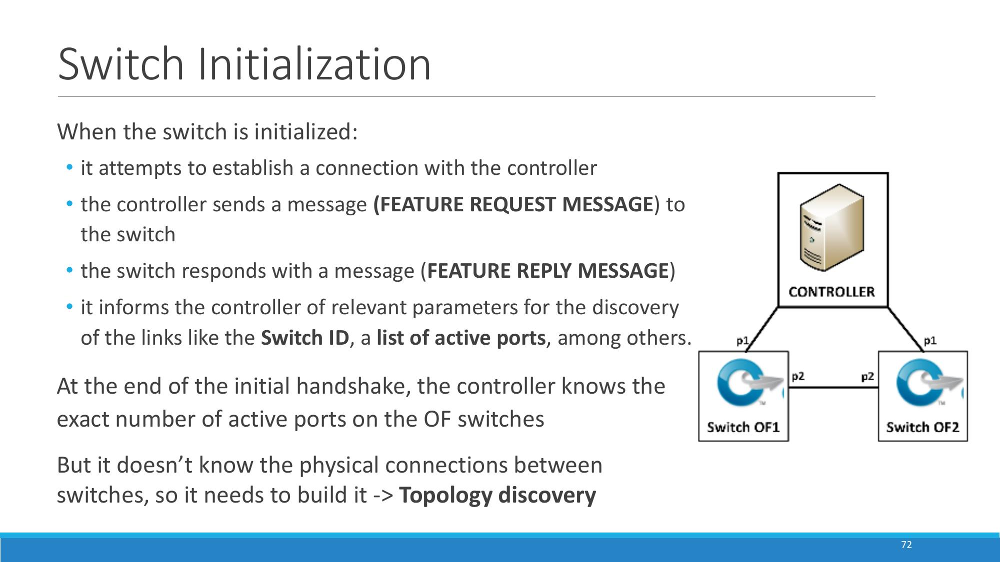
*Fig. 4 — Switch Initialization: al boot, lo switch stabilisce una connessione TCP con il controller. Lo scambio Feature Request / Feature Reply comunica al controller i parametri dello switch (Switch ID, porte attive).*

Quando uno switch OpenFlow viene acceso, esegue una procedura di handshake con il controller:

1. Lo switch tenta di stabilire una **connessione TCP** con l'indirizzo del controller (pre-configurato)
2. Il controller invia un messaggio **FEATURE REQUEST**
3. Lo switch risponde con un messaggio **FEATURE REPLY** contenente: Switch ID, lista delle porte attive, e altri parametri rilevanti

Al termine dell'handshake, il controller sa esattamente quante porte attive ha ogni switch, ma **non conosce ancora le connessioni fisiche tra switch**. Per questo è necessaria la topology discovery.

---

### Topology Discovery con LLDP

La topology discovery in reti OpenFlow si basa sul **Link Layer Discovery Protocol (LLDP)**, standardizzato da IEEE nel 2005 e 2009. LLDP è un protocollo *vendor-neutral* che opera al Livello 2 del modello OSI e permette a un dispositivo di annunciare la propria identità e le proprie capacità ai dispositivi adiacenti.

Gli switch OpenFlow hanno due configurazioni iniziali che abilitano la topology discovery:
1. **Indirizzo del controller**: ogni switch ha pre-configurato l'IP e la porta TCP del controller, a cui si connette al boot
2. **Flow rule per LLDP**: ogni switch ha una regola pre-installata che invia al controller (via Packet-In) qualsiasi frame LLDP ricevuto

#### Struttura del Frame LLDP

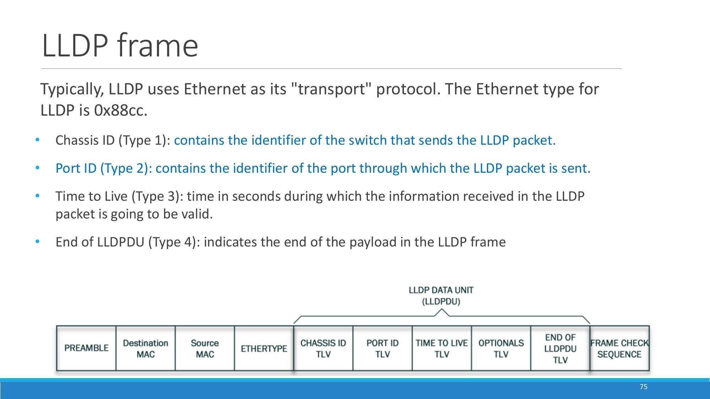
*Fig. 5 — Struttura del frame LLDP. Il tipo Ethernet è 0x88cc. I TLV (Type-Length-Value) fondamentali sono: Chassis ID (switch mittente), Port ID (porta mittente), TTL, End of LLDPDU.*

Il frame LLDP usa Ethernet come protocollo di trasporto (EtherType `0x88cc`) e contiene i seguenti campi TLV (*Type-Length-Value*):

| TLV | Tipo | Contenuto |
|-----|------|-----------|
| Chassis ID | 1 | Identificatore dello switch che invia il frame LLDP |
| Port ID | 2 | Identificatore della porta attraverso cui il frame viene inviato |
| Time to Live | 3 | Validità in secondi delle informazioni contenute nel frame |
| End of LLDPDU | 4 | Marcatore di fine payload |

#### Processo di Topology Discovery

Il processo si svolge in quattro passi:

1. Il controller genera un **Packet-Out** per ogni porta attiva su ogni switch scoperto, incapsulando al suo interno un frame LLDP con il Chassis ID e il Port ID dello switch sorgente.
2. Quando uno switch OF riceve un messaggio Packet-Out con un frame LLDP, lo **forwarda** sulla porta specificata nel Port ID verso lo switch adiacente.
3. Lo switch adiacente, ricevendo il frame LLDP su una porta non di controllo, lo **incapsula in un Packet-In** indirizzato al controller, includendo i propri Switch ID e Port ID come metadata.
4. Il controller riceve il Packet-In ed **estrae le informazioni**: conosce ora lo Switch ID e Port ID del frame LLDP (mittente originale) e lo Switch ID e Port ID del Packet-In (ricevente). Da questi dati deduce che esiste un link tra quei due switch su quelle specifiche porte.

> [!tip] Scalabilità della topology discovery
>
> In una rete con $S$ switch e un totale di $P$ porte attive, il numero di messaggi Packet-Out inviati dal controller è pari a $P$ (uno per porta attiva su ciascuno switch). L'intero processo viene eseguito periodicamente per rilevare cambiamenti nella topologia.

> [!note] Topology Discovery non standardizzata
>
> Il meccanismo di topology discovery non è standardizzato in OpenFlow: ogni implementazione di controller (ODL, ONOS, Ryu) può adottare varianti proprie. La procedura basata su LLDP descritta qui è quella tipicamente usata.

---

### Host Reachability

La scoperta della raggiungibilità degli host avviene in modo simile alla topology discovery, ma è **event-driven**: viene tipicamente scatenata da traffico sconosciuto che entra nel dominio SDN da un host collegato o da un router vicino.

Quando un host A invia il primo pacchetto verso B e lo switch non ha una regola corrispondente, invia un Packet-In al controller. Il controller:
1. Registra nella **Host Table** l'indirizzo Ethernet di A, lo switch a cui è collegato, e la porta
2. Calcola il percorso verso B (se B è già nella Host Table) oppure avvia una procedura di discovery

La Host Table cresce progressivamente man mano che gli host comunicano, costruendo una mappa completa della rete.

```{=latex}
\newpage
```

# SDN Applications e P4 Language

Questa lezione affronta tre casi d'uso concreti dell'[[Lezione 15 - (Lab) SDN Architecture]]: il caso reale di **B4**, la rete WAN globale di Google; il linguaggio **P4** per la programmazione del data plane; e il paradigma del **Service Function Chaining**. Il filo conduttore è la progressione da una rete tradizionale — rigida, sovradimensionata, costosa — verso un'infrastruttura completamente programmabile, dove sia il piano di controllo che il piano dati sono definiti via software.

---

## B4 — La WAN Software-Defined di Google

### Il problema: WAN tradizionali e loro limiti

Le reti WAN tradizionali nascono attorno a un principio di conservatività: i link intercontinentali sono costosi, la perdita di pacchetti è inaccettabile, e dunque si impiegano router di fascia altissima con un significativo sovrapprovisionamento della capacità. Il risultato è che i link WAN vengono utilizzati mediamente al **30–40%** della loro capacità, richiedendo un overprovisioning di 2–3x. Questo approccio tende inoltre a trattare tutto il traffico allo stesso modo: tutte le applicazioni sono considerate ugualmente importanti, senza distinzione di priorità o sensibilità alla latenza.

Google si è trovata davanti a una proiezione di costo insostenibile: crescere seguendo il modello tradizionale significava pagare 2–3 volte il costo di una WAN pienamente utilizzata. La soluzione è stata ridisegnare completamente la rete inter-datacenter.

### Cos'è B4

**B4** è la rete WAN globale proprietaria di Google, che connette i suoi datacenter tra loro — non è la rete Internet-facing per il traffico degli utenti. Google gestisce in realtà due backbone separati: **B2**, che porta il traffico Internet verso gli utenti (e cresce alla velocità di Internet), e **B4**, che gestisce il traffico inter-datacenter (cresciuto di 10x in 3,5 anni al momento della pubblicazione del paper originale).

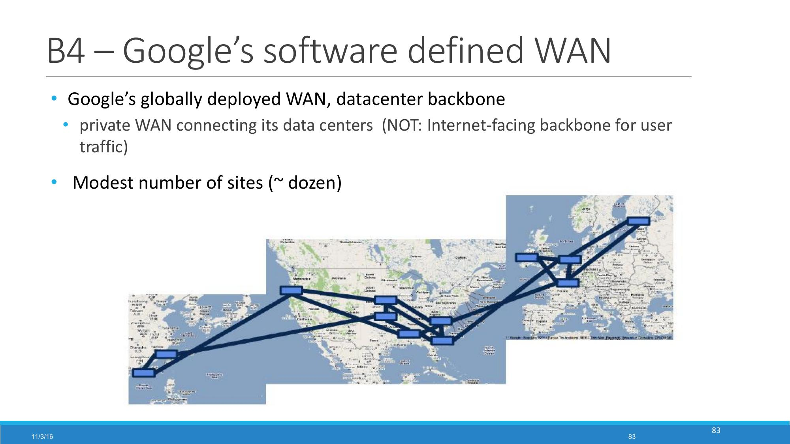
*Fig. — La rete B4 connette una dozzina di siti (datacenter) in tutto il mondo tramite link privati intercontinentali.*

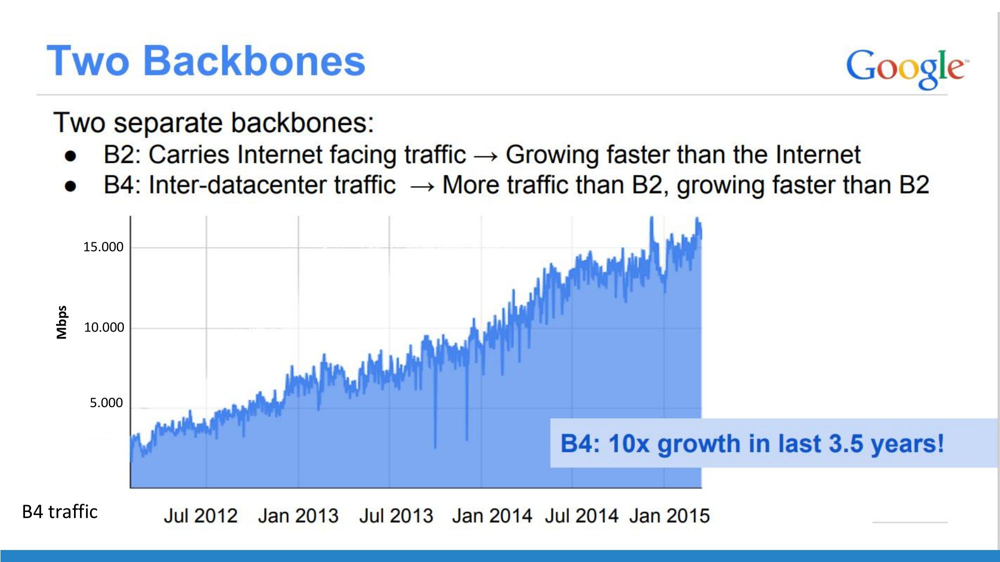
*Fig. — Traffico B4 dal 2012 al 2015: crescita di 10x in 3.5 anni, con B4 che supera B2 per volume.*

### Caratteristiche del traffico B4

Il traffico che percorre B4 non è omogeneo. Le slide distinguono tre categorie principali, ordinate per sensibilità alla latenza e volume:

| Tipo di traffico | Volume | Sensibilità latenza | Priorità |
|---|---|---|---|
| Replicazione dati utente verso datacenter remoti | Basso | Alta | Alta |
| Accesso remoto a storage per computazione distribuita | Medio | Media | Media |
| Sincronizzazione di stato tra datacenter (bulk transfer) | Alto | Bassa | Bassa |

Questa eterogeneità è cruciale: il traffico di tipo 3 è elastico — tollera riduzioni temporanee di banda e persino fallimenti — e costituisce la maggior parte del volume. Questo rende B4 **adatto al traffic engineering aggressivo**: si può rimandare o rallentare il traffico a bassa priorità per fare spazio a quello critico.

> [!tip] L'insight chiave di B4
>
> Il traffico inter-datacenter è prevalentemente *bulk* ed *elastico*. A differenza del traffico utente, non ha bisogno di garanzie di bassa latenza costante. Questo apre la strada a ottimizzazioni aggressive della banda che sarebbero impossibili su una WAN tradizionale.

### Caratteristiche di progetto di B4

B4 si distingue dalla WAN tradizionale per quattro proprietà fondamentali.

La prima è la **domanda di banda elastica**: le applicazioni tollerano failure temporanei e riduzioni di banda, il che permette di ottimizzare l'utilizzo senza sacrificare l'esperienza utente.

La seconda è il **numero moderato di siti**: poche decine di siti significa che le tabelle di routing restano piccole e gestibili — non serve la scalabilità da centinaia di migliaia di rotte tipica di un router ISP.

La terza è il **controllo fine-grained delle applicazioni**: le applicazioni stesse comunicano le loro priorità e possono controllare i burst, eliminando la necessità di overprovisioning dei link.

La quarta è la **sensibilità al costo**: i link intercontinentali privati sono estremamente costosi e devono essere utilizzati al 100% della capacità disponibile. Non ci si può permettere il lusso del 30–40% di utilizzo tipico delle WAN tradizionali.

---

### Architettura SDN di B4

La transizione di Google verso SDN è avvenuta in tre stadi progressivi, che illustrano perfettamente la metodologia di migrazione graduale.

#### Stadio 1 — Rete di partenza

Nella configurazione iniziale, i *site* (nodi WAN) comunicano tra loro tramite protocolli distribuiti tradizionali: iBGP e ISIS per il routing interno ai siti, eBGP tra i siti. I *cluster* (reti datacenter) sono collegati ai siti tramite router BGP. Il controllo è interamente distribuito — nessun controller centralizzato.

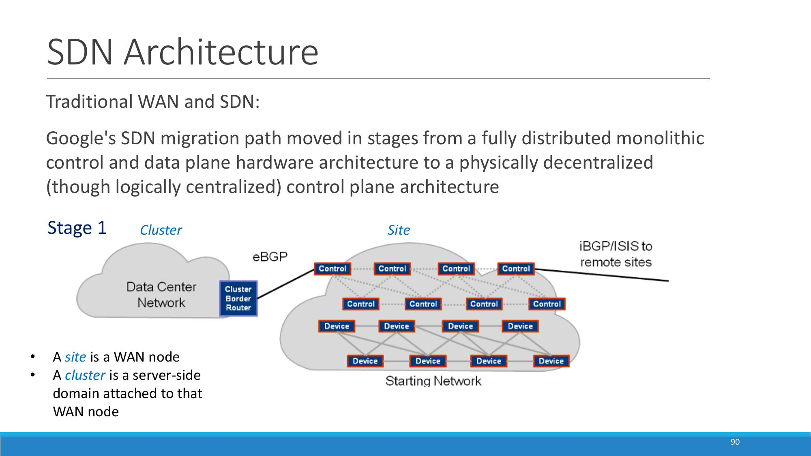
*Fig. — Stage 1: la rete di partenza, con controllo distribuito basato su BGP/ISIS. Un sito è un nodo WAN; un cluster è il dominio server collegato a quel nodo.*

#### Stadio 2 — Deployment parziale di OpenFlow

Nella fase intermedia, viene introdotto per alcuni switch il controller OpenFlow, affiancato da Quagga (il software di routing BGP/ISIS) e da un modulo "Glue" che coordina i due sistemi. Il consenso tra istanze ridondanti del controller è gestito tramite **Paxos**, garantendo fault tolerance. La rete è in uno stato ibrido: alcuni switch sono già controllati da OpenFlow, altri ancora dal piano di controllo distribuito tradizionale.

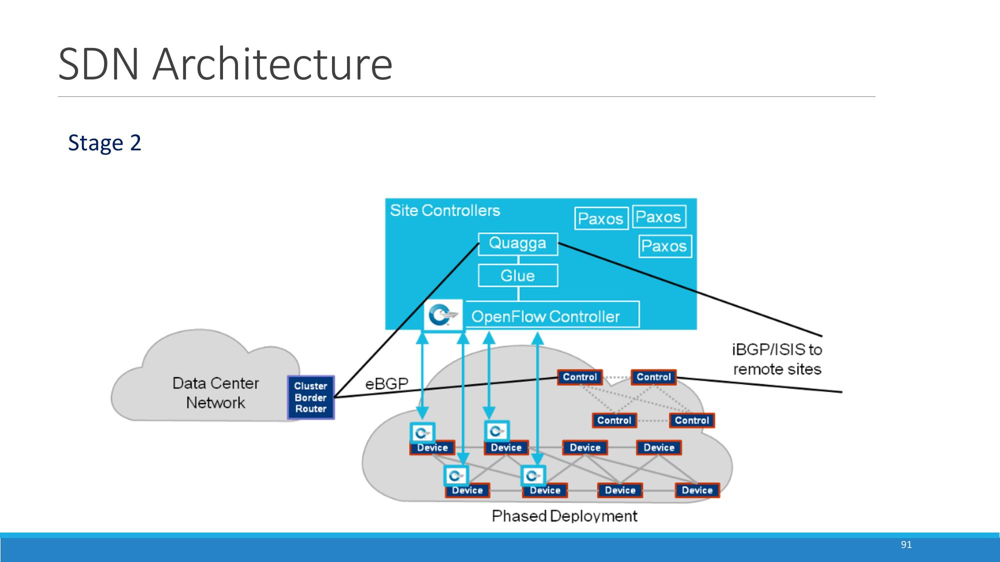
*Fig. — Stage 2: deployment graduale. I Site Controllers con OpenFlow coesistono con i nodi di controllo tradizionale. Paxos garantisce la fault tolerance del controller.*

#### Stadio 3 — Architettura target

Nella configurazione finale, tutti gli switch sono controllati da OpenFlow. Viene aggiunto il **Central TE Server** (Traffic Engineering Server) come applicazione globale che ottimizza l'intera rete. Il layer di controllo è fisicamente distribuito ma logicamente centralizzato.

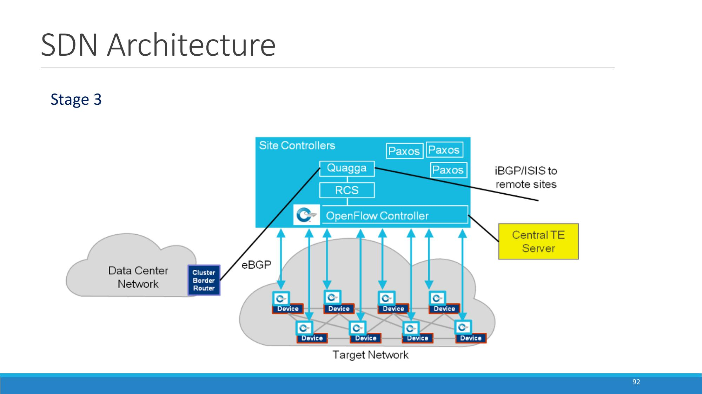
*Fig. — Stage 3: rete target. Tutti i dispositivi sono controllati via OpenFlow. Il Central TE Server fornisce ottimizzazione globale del traffico.*

#### Integrazione con BGP e piano di controllo tradizionale

Anche nell'architettura finale, BGP non scompare completamente. Ogni cluster mantiene router BGP che si appoggiano agli switch B4 tramite eBGP. BGP viene mantenuto per due ragioni pratiche: la familiarità degli operatori con il protocollo (già in uso prima di SDN) e la necessità di un deployment graduale e reversibile. BGP gestisce la *raggiungibilità* (reachability), mentre il **traffic engineering** — ovvero la selezione dei percorsi e l'allocazione della banda — è delegato interamente al sistema centralizzato SDN.

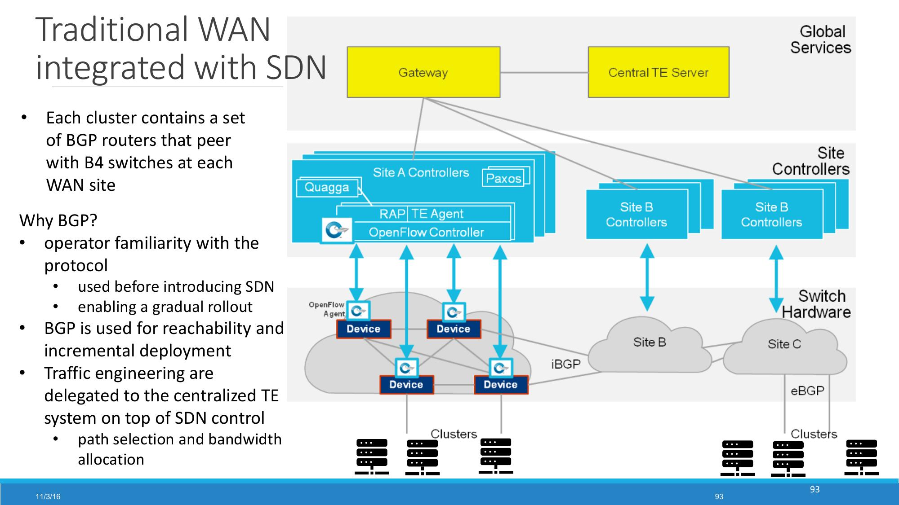
*Fig. — L'architettura completa: BGP per la raggiungibilità, TE Server centralizzato per l'ottimizzazione del traffico. Gateway, Site Controllers e Switch Hardware interagiscono tramite OpenFlow.*

> [!note] Perché mantenere BGP?
>
> BGP non è la scelta tecnicamente "più pulita" in un sistema SDN puro, ma è mantenuto per due motivi pragmatici: (1) gli operatori lo conoscono bene e lo usavano già prima di SDN, facilitando una transizione graduale; (2) permette un rollout incrementale — si può migrare un sito alla volta senza interrompere il servizio.

### Panoramica dell'architettura B4

L'architettura B4 si articola su tre layer sovrapposti.

Lo **Switch Hardware** è hardware custom di Google, progettato con silicio commodity ma senza software di controllo complesso. La riduzione del numero di siti elimina la necessità di grandi tabelle di forwarding; il controllo applicativo fine-grained riduce la necessità di grandi buffer.

Il **Control Layer** è composto da *Network Control Servers* (NCS) che ospitano sia gli **OpenFlow Controllers** (OFC) sia le **Network Control Applications** (NCA). Gli OFC mantengono lo stato della rete in base alle direttive delle NCA e agli eventi degli switch, e istruiscono gli switch ad aggiornare le tabelle di forwarding. Per la fault tolerance, un'istanza Paxos per sito elegge il controller primario tra più repliche fisiche su server differenti.

Il **Global Layer** contiene le applicazioni logicamente centralizzate: l'**SDN Gateway** e il **TE Server**. L'SDN Gateway astrae i dettagli di OpenFlow e dell'hardware degli switch per il TE Server — ogni sito B4 può avere centinaia di porte fisiche, ma il Gateway le aggrega in un'astrazione a livello di sito. Il TE Server opera su questa visione globale per calcolare path e allocazioni di banda.

---

### Traffic Engineering in B4

Il Traffic Engineering (TE) è il meccanismo attraverso cui B4 realizza l'utilizzo vicino al 100% dei link. L'obiettivo del TE Server è **condividere la banda tra applicazioni concorrenti**, possibilmente usando percorsi multipli.

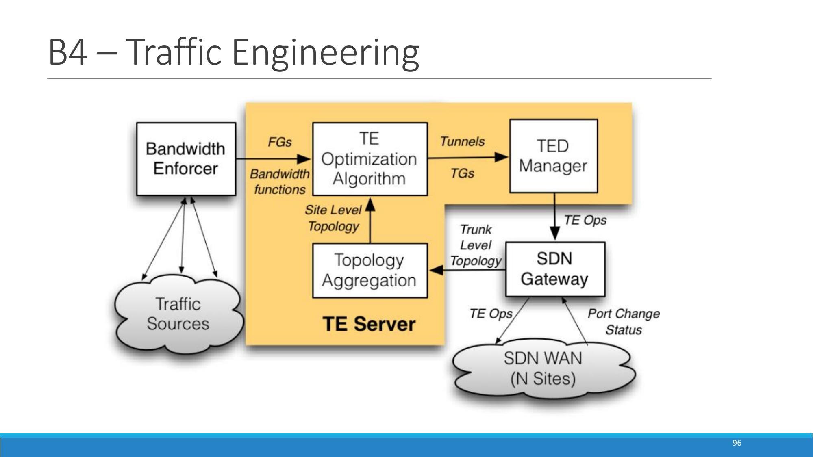
*Fig. — Il TE Server riceve Flow Groups e funzioni di banda dal Bandwidth Enforcer, ottimizza e produce Tunnels/Tunnel Groups che vengono poi installati nella rete via SDN Gateway e OFC.*

Il TE Server lavora su due astrazioni principali.

In **input** riceve: (1) la *topologia di rete* come grafo di siti e connessioni sito-a-sito, che riduce enormemente la dimensione del problema rispetto a una topologia a livello di porta; (2) i *flow group* (FG), ciascuno definito come una tupla composta da sito sorgente, sito destinazione e classe QoS. Il TE non lavora a livello di singola applicazione — aggrega il traffico per sito e classe di servizio. Il **Bandwidth Enforcer** è un componente esterno che specifica le funzioni di banda per ogni applicazione, derivate da pesi statici configurati dall'amministratore.

In **output** produce: *Tunnel* — percorsi a livello di sito come sequenze di siti (es. A→B→C), implementati tramite IP-in-IP encapsulation — e *Tunnel Group* (TG), che mappano i flow group sui tunnel disponibili.

> [!definition] Tunnel in B4
>
> Un Tunnel rappresenta un percorso a livello di sito nella rete. È una sequenza di siti (es. Amsterdam → Frankfurt → Warsaw) implementata con incapsulamento IP-in-IP. Non coincide con un link fisico: può attraversare più switch e link interni a ogni sito.

I Tunnel Group e i relativi Tunnel e Flow Group vengono inviati dall'SDN Gateway agli OFC, che li installano negli switch via OpenFlow.

#### Forwarding Multipath

Per sfruttare pienamente la banda disponibile, B4 utilizza il **forwarding multipath**: un flusso destinato a una subnet può essere distribuito su più tunnel in parallelo. Lo switch usa una funzione di hash sugli header del pacchetto (modulo il numero di entry ACL) per distribuire equamente i flussi tra i tunnel disponibili, garantendo che pacchetti dello stesso flusso seguano lo stesso percorso (evitando riordinamento).

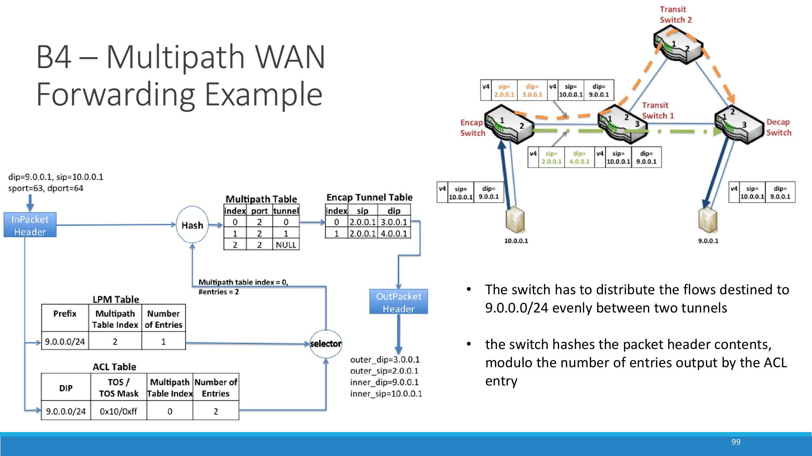
*Fig. — Esempio di forwarding multipath: i flussi verso 9.0.0.0/24 vengono distribuiti equamente tra due tunnel tramite hash degli header del pacchetto.*

> [!abstract] Risultati di B4
>
> Grazie all'architettura SDN, Google ha raggiunto un utilizzo dei link vicino al **100%** per i carichi elastici — contro il 30–40% delle WAN tradizionali. Questo ha permesso di ridurre costi e complessità dell'infrastruttura, eliminando il sovrapprovisionamento da 2–3x. Ulteriori miglioramenti successivi hanno introdotto topologie gerarchiche e algoritmi TE decentralizzati per migliorare scalabilità e disponibilità.

---

## Verso un Data Plane Programmabile

### Limiti di OpenFlow

OpenFlow ha dimostrato il valore della separazione tra control plane e data plane, ma presenta limiti intrinseci al crescere delle esigenze. Il protocollo è nato semplice — circa 12 header field — ma la specifica è cresciuta fino a ~40 campi, aumentando la complessità. Soprattutto, i datacenter moderni richiedono nuove forme di encapsulamento dei pacchetti (VXLAN, NVGRE, ecc.) che OpenFlow non supporta in modo flessibile.

Il problema più profondo è concettuale: la vera programmabilità di rete richiederebbe la capacità di definire e modificare sia gli algoritmi del control plane sia quelli del **data plane**. Gli operatori di rete dovrebbero poter definire entrambi autonomamente, senza coinvolgere i progettisti originali dell'hardware. OpenFlow permette di *installare regole* nel data plane, ma non di *riprogrammare* il data plane stesso.

> [!tip] La distinzione cruciale
>
> OpenFlow controlla *cosa fanno* le tabelle di un data plane fisso. P4 permette di definire *come è fatto* il data plane stesso — quali header riconoscere, come processarli, quali azioni eseguire.

---

## P4 Language

### Cos'è P4

**P4** (*Programming Protocol-Independent Packet Processors*) è un linguaggio di programmazione *domain-specific* progettato per dispositivi di rete. Il suo nome cattura l'essenza del progetto: permette di programmare il processamento dei pacchetti in modo indipendente dal protocollo sottostante.

P4 estende il paradigma match-action introdotto da OpenFlow, ma lo porta a un livello superiore: invece di installare regole in tabelle predefinite dall'hardware, con P4 il programmatore **definisce le tabelle stesse**, i campi degli header da estrarre, le azioni possibili e il flusso di controllo tra le tabelle.

> [!definition] P4 — Proprietà fondamentali
>
> Un programma P4 descrive integralmente il comportamento atteso nel data plane:
> - **Headers**: tutti gli header dei pacchetti e i campi rilevanti per il matching
> - **Actions**: l'insieme di tutte le azioni possibili supportate dalle tabelle
> - **Tables**: l'insieme delle tabelle di matching e il flusso di controllo tra esse
>
> In aggiunta agli header standard, i progettisti di rete possono definire header per protocolli personalizzati.

P4 è stato concepito nel 2013 da un team accademico-industriale e presentato all'ACM SIGCOMM 2014. La standardizzazione è coordinata dal **P4 Language Consortium** (specifiche su `p4.org/specs`).

### Vantaggi e applicazioni di P4

P4 permette di **personalizzare il processamento dei pacchetti senza modifiche hardware**, accelerando drasticamente il ciclo di innovazione dei protocolli di rete. Le applicazioni principali includono: SDN avanzato, monitoring e telemetria di rete, implementazioni custom di sicurezza e firewall.

Il vantaggio competitivo rispetto all'approccio tradizionale è la separazione tra il *cosa* (il programma P4, scritto dall'utente) e il *come* (l'hardware o il compilatore, forniti dal vendor): lo stesso programma può essere compilato per switch P4, SmartNIC, o software su host.

### Compilazione e target P4

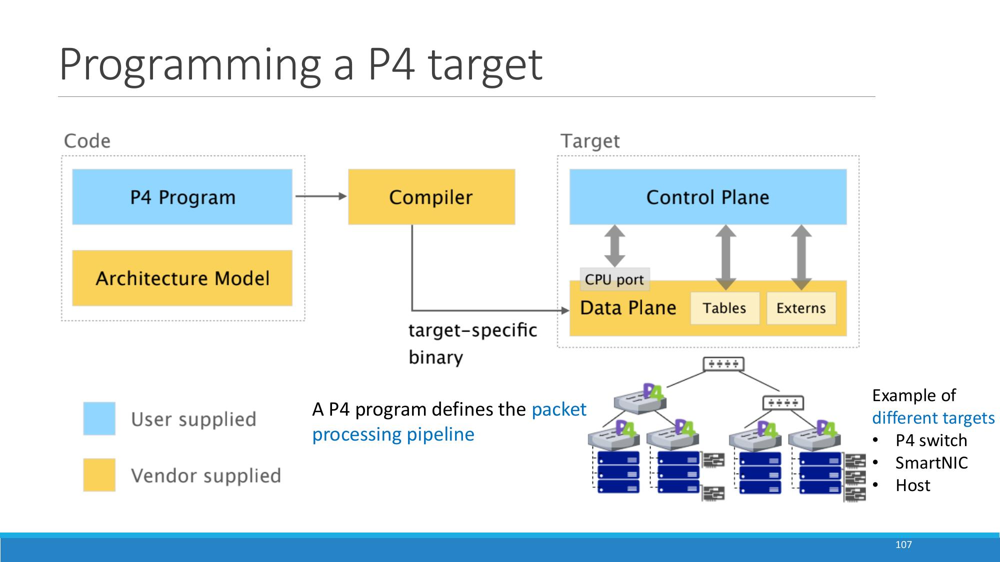
*Fig. — Il programmatore scrive un P4 Program; il compilatore vendor-specifico genera una configurazione del data plane e un'API per il control plane (P4Runtime).*

Un programma P4 viene scritto dal programmatore in termini dell'**Architecture Model** — una specifica astratta del target, fornita dal vendor. Il **compilatore P4**, anch'esso vendor-specifico, prende in input il programma e il modello architetturale e produce:

- Una **configurazione del data plane** che implementa la logica di forwarding descritta nel programma.
- Un'**API** per gestire lo stato degli oggetti del data plane dal control plane.

L'interazione a runtime tra control plane e data plane avviene tramite **P4Runtime**, una specifica standard per controllare gli elementi del data plane definiti da un programma P4. Il control plane popola le tabelle con le regole; quando arriva un match, l'azione selezionata viene eseguita con i parametri specificati dalla regola corrispondente.

I target supportati includono switch P4, SmartNIC e host software — la stessa logica di forwarding può essere eseguita su hardware diversissimi semplicemente ricompilando.

### Struttura di un programma P4

Un programma P4 è composto da tre componenti principali, che corrispondono alle tre fasi del ciclo di vita di un pacchetto nel data plane.

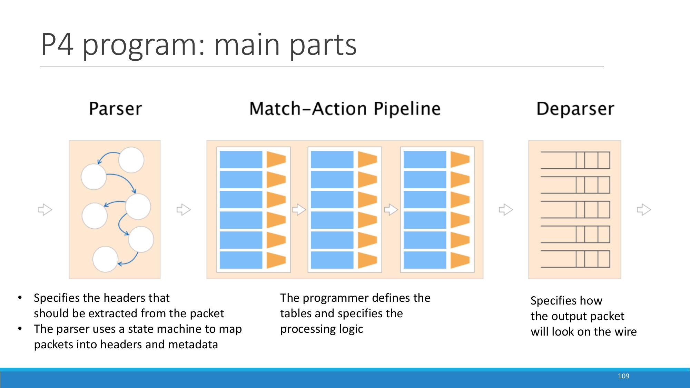
*Fig. — Pipeline P4: il Parser estrae gli header (state machine), la Match-Action Pipeline applica le regole, il Deparser ricostruisce il pacchetto per il wire.*

#### Parser

Il **Parser** specifica come estrarre gli header dai pacchetti in ingresso. Usa una **macchina a stati** per mappare il flusso di byte in strutture header e metadata. Per esempio, si parte dallo stato `start`, si estrae l'header Ethernet, e in base al campo `eth_type` si transita allo stato `parse_ipv4` (per pacchetti IP) oppure si accetta direttamente il pacchetto.

```p4
header ethernet_t {
    bit<48> dst_addr;
    bit<48> src_addr;
    bit<16> eth_type;
}

header ipv4_t {
    bit<4>  version;
    bit<4>  ihl;
    bit<8>  diffserv;
    bit<16> totalLen;
    bit<16> identification;
    bit<3>  flags;
    bit<13> fragOffset;
    bit<8>  ttl;
    bit<8>  protocol;
    bit<16> hdrChecksum;
    bit<32> srcAddr;
    bit<32> dstAddr;
}

parser MyParser(packet_in packet,
                out headers_t hdr,
                inout metadata_t meta) {

    state start {
        packet.extract(hdr.ethernet);
        transition select(hdr.ethernet.eth_type) {
            0x0800: parse_ipv4;
            default: accept;
        }
    }

    state parse_ipv4 {
        packet.extract(hdr.ipv4);
        transition accept;
    }
}
```

Gli header vengono dichiarati con campi a larghezza fissa (es. `bit<48>` per un MAC address). La struttura `headers_t` li raggruppa in un unico oggetto che attraversa tutta la pipeline.

#### Match-Action Pipeline

Il programmatore definisce le **tabelle di matching** e la logica di processamento. Ogni tabella specifica i campi su cui fare match, le azioni possibili, e la dimensione massima. Quando un pacchetto arriva, viene confrontato con le regole della tabella (installate dal control plane); se trova un match, l'azione associata viene eseguita con i parametri specificati dalla regola.

> [!note] Differenza rispetto a OpenFlow
>
> In OpenFlow, le tabelle sono fisse nell'hardware: l'operatore può solo popolarle con regole. In P4, le tabelle stesse sono definite nel programma: il programmatore decide quante tabelle ci sono, su quali campi fare match, e quali azioni sono disponibili. Questo abilita protocolli completamente nuovi senza modificare l'hardware.

#### Deparser

Il **Deparser** specifica come ricostruire il pacchetto per l'output sul wire. Definisce l'ordine in cui gli header modificati vengono serializzati nel flusso di byte in uscita, permettendo anche di aggiungere o rimuovere header (es. per encapsulamento/decapsulamento).

> [!abstract] Sintesi del modello P4
>
> P4 porta la programmabilità al data plane con un modello coerente: Parser (deserializzazione) → Match-Action Pipeline (processamento) → Deparser (serializzazione). Il control plane (via P4Runtime) si occupa solo di popolare le tabelle; tutta la logica di parsing e azione è definita staticamente nel programma P4 e compilata nell'hardware.

---

## Service Function Chaining

### Il problema: comporre funzioni di rete

Le reti moderne non applicano ai pacchetti una singola trasformazione, ma una sequenza di elaborazioni: un pacchetto che entra da Internet può dover attraversare un firewall, un sistema di intrusion detection (IDS), e un load balancer prima di raggiungere il server applicativo. Ciascuna di queste elaborazioni è una **Network Function** — una capacità di processamento dei pacchetti fornita da un dispositivo di rete.

> [!definition] Service Function Chaining (SFC)
>
> Il **Service Function Chaining** è il paradigma per definire e gestire servizi di rete come catene ordinate di funzioni di rete. Una catena definisce come un flusso di traffico deve essere processato per raggiungere obiettivi di sicurezza, performance o QoS.
>
> Esempi di funzioni di rete: NAT, firewall, IDS, DNS, caching, DDoS protection, load balancer.

Nelle reti tradizionali, le service chain sono implementate topologicamente: i dispositivi fisici sono cablati in sequenza, e il traffico li attraversa nell'ordine fisico. Questo rende l'aggiornamento o il cambiamento delle chain estremamente rigido e costoso.

### SFC con SDN

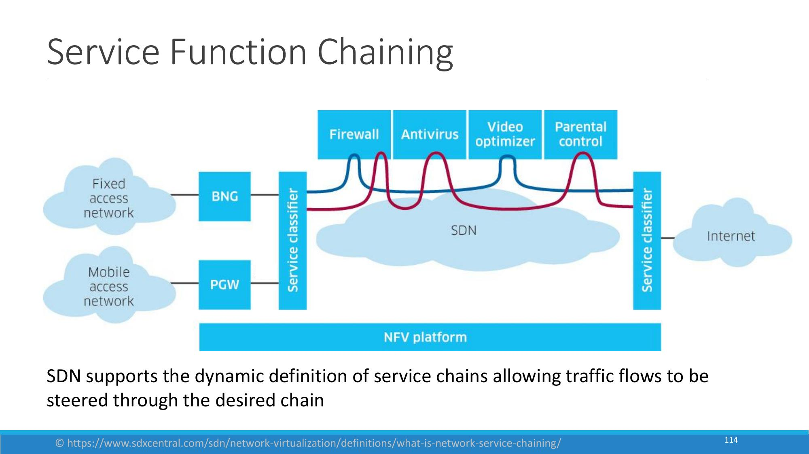
*Fig. — SDN permette la definizione dinamica di service chain: il traffico viene instradato dal Service Classifier attraverso le funzioni desiderate (Firewall, Antivirus, Video Optimizer, Parental Control) su una piattaforma NFV, senza richiedere ricablaggio fisico.*

SDN risolve il problema della rigidità. Con SDN, le service chain sono **definite programmaticamente**: il controller SDN configura le regole di forwarding affinché i pacchetti attraversino le funzioni desiderate nell'ordine corretto, indipendentemente dalla topologia fisica. Un **Service Classifier** identifica i flussi e li instrada sulla chain appropriata; alla fine della chain, un secondo classificatore rilascia il traffico verso la destinazione finale.

Questo approccio si integra naturalmente con la **Network Function Virtualization** (NFV): le funzioni di rete non devono essere implementate su hardware dedicato, ma possono girare come istanze software su una piattaforma NFV. SDN + NFV insieme abilitano chain completamente virtuali, modificabili in tempo reale senza intervento fisico.

> [!tip] SDN + NFV: perché si completano
>
> NFV virtualizza le funzioni di rete (le rende software). SDN controlla il forwarding e permette di comporre queste funzioni in catene dinamiche. Insieme, eliminano sia la dipendenza dall'hardware dedicato sia la rigidità topologica delle reti tradizionali.

---

## Sintesi

> [!abstract] Punti chiave della lezione
>
> Il routing tradizionale offre un controllo troppo grossolano: i pesi dei link e il forwarding destination-based non bastano per traffic engineering fine-grained e controllo delle policy.
>
> **B4** dimostra che SDN consente utilizzo vicino al 100% dei link WAN inter-datacenter, contro il 30–40% delle WAN tradizionali — abbattendo costi e complessità. L'architettura è fisicamente distribuita ma logicamente centralizzata, con un TE Server globale che ottimizza l'intera rete.
>
> **OpenFlow** è uno dei possibili meccanismi southbound di SDN — non è SDN stesso. I suoi limiti (data plane fisso, header predefiniti) hanno portato allo sviluppo di P4.
>
> **P4** estende la programmabilità al data plane: non solo installa regole, ma permette di definire il parser, le tabelle, le azioni e il deparser. Il risultato è un data plane completamente personalizzabile, compilato per hardware diversi tramite un compilatore vendor-specifico.
>
> **Service Function Chaining** con SDN permette di comporre funzioni di rete (firewall, IDS, load balancer...) in catene dinamiche, senza ricablaggio fisico — specialmente potente in combinazione con NFV.

```{=latex}
\newpage
```

# Protocolli MAC per Reti Wireless Multi-hop

## Il problema dell'efficienza energetica

Nei sistemi IoT e nelle reti di sensori wireless, il protocollo MAC non ha come unico obiettivo l'arbitrazione dell'accesso al mezzo: deve anche — e soprattutto — minimizzare il consumo energetico dei nodi. La ragione è semplice: i dispositivi sono tipicamente alimentati a batteria e devono operare per mesi o anni senza manutenzione. Il radio transceiver è di gran lunga il componente più energivoro, e la strategia fondamentale è ridurne il **duty cycle**, ovvero la frazione di tempo in cui rimane attivo.

> [!tip] Intuizione chiave
>
> Un nodo con la radio sempre accesa è connesso ma scarica la batteria rapidamente. Un nodo con la radio sempre spenta risparmia energia ma non può comunicare. Il protocollo MAC deve trovare il giusto compromesso.

Il tradeoff principale è tra **energia** da un lato e **latenza e banda** dall'altro: abbassare il duty cycle risparmia energia ma aumenta il tempo di attesa prima che i pacchetti possano essere trasmessi o ricevuti.

Esistono tre approcci fondamentali per ridurre il consumo:

| Approccio | Descrizione | Esempi |
|---|---|---|
| Sincronizzazione dei nodi | I nodi si svegliano contemporaneamente per comunicare | S-MAC, IEEE 802.15.4 |
| Preamble sampling | Il mittente invia un lungo preambolo; il ricevitore campiona periodicamente il canale | B-MAC, X-MAC, BoX-MAC |
| Polling | Un master coordina i nodi slave tramite beacon periodici | Bluetooth, IEEE 802.15.4 |

---

## Sincronizzazione: S-MAC

S-MAC (*Sensor MAC*) è un protocollo progettato per reti wireless multi-hop, disponibile in TinyOS per piattaforme come le mica motes (Iris, Tmote). La sua idea di base è che se i nodi vicini si svegliano nello stesso istante, possono comunicare durante la finestra di attività e poi tornare in stato di sleep, riducendo drasticamente il consumo complessivo.

> [!definition] Duty cycle in S-MAC
>
> Ogni nodo alterna periodi di **listen** (radio accesa, pronto a ricevere) e periodi di **sleep** (radio spenta). La finestra di ascolto è periodica e relativamente breve rispetto al periodo totale.

### Organizzazione della sincronizzazione

S-MAC non impone una sincronizzazione globale, ma solo **locale**: nodi adiacenti si accordano su un periodo di ascolto condiviso. Il meccanismo è il seguente:

- Ogni nodo trasmette periodicamente dei **frame SYNC** in broadcast, che annunciano la propria schedule (quando si sveglia, quando dorme).
- Un nodo che si avvia ascolta il canale per individuare frame SYNC dei vicini. Se trova vicini con una schedule già definita, la adotta. In caso contrario, sceglie autonomamente la propria schedule e la pubblicizza.
- Un nodo può successivamente cambiare la propria schedule se la maggior parte dei vicini ha adottato un'altra.

Questo approccio consente a sottoreti di adottare schedule diverse, creando delle **isole di sincronizzazione** locali. Il risultato non è una sincronizzazione globale uniforme, ma va bene per la maggior parte delle topologie pratiche.

### Comunicazione durante il periodo di ascolto

Un nodo può inviare un frame a un vicino solo durante il **periodo di ascolto del ricevitore**, non necessariamente durante il proprio. Ciò implica che il mittente deve conoscere le schedule di tutti i suoi vicini e tenere la radio accesa anche al di fuori del proprio periodo di ascolto quando deve trasmettere.

> [!note] Carrier sense e RTS/CTS
>
> Prima della trasmissione S-MAC esegue il **carrier sense**: se il canale è occupato, il frame viene posticipato al periodo di ascolto successivo. Per evitare collisioni usa RTS/CTS (come IEEE 802.11). Una piccola ottimizzazione chiamata *adaptive duty cycle*: se un nodo riceve un RTS o un CTS in sorveglianza, mantiene la radio accesa fino al termine della trasmissione, perché potrebbe essere il prossimo hop.

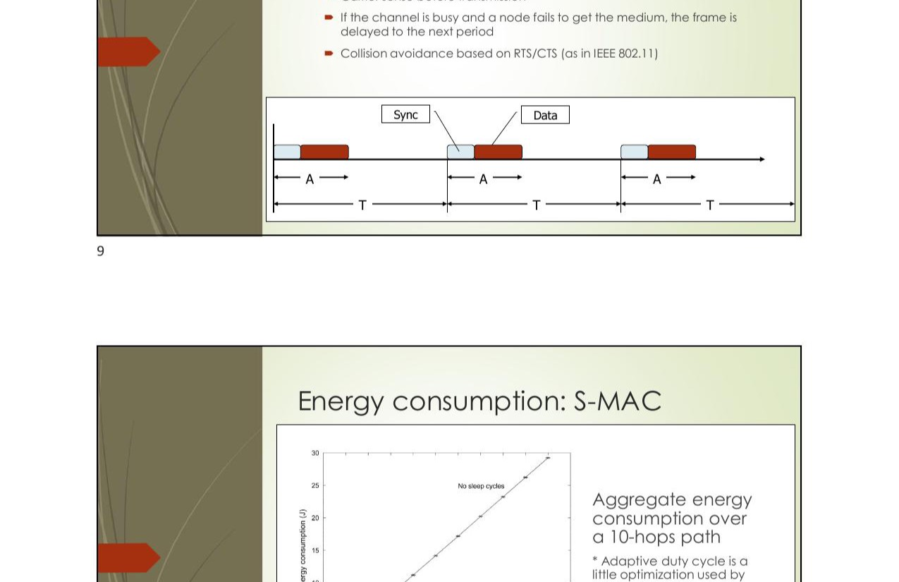
*Fig. — Il frame Sync e il frame Data vengono trasmessi durante il periodo di attività del ricevitore; i periodi di silenzio T separano le finestre di ascolto.*

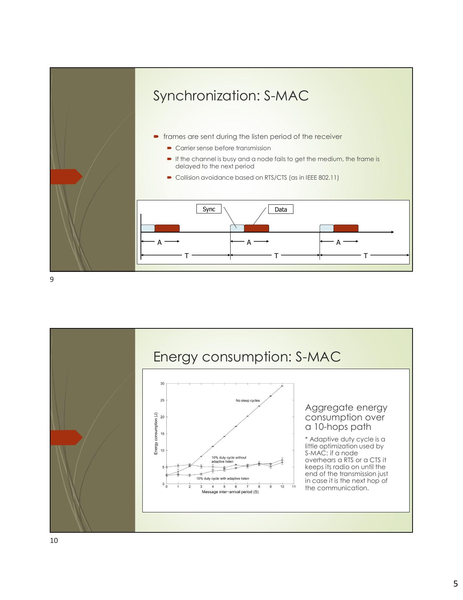
*Fig. — Consumo energetico totale in funzione del periodo inter-arrivo dei messaggi. La curva "No sleep cycles" è il riferimento; il duty cycle al 10% riduce drasticamente i consumi; l'adaptive duty cycle ottimizza ulteriormente.*

### Latenza nei percorsi multi-hop

La latenza è il tallone d'Achille di S-MAC. In un percorso multi-hop, un frame deve attraversare una sequenza di nodi intermedi: in ogni hop, nel caso peggiore, il frame deve attendere fino al successivo periodo di ascolto del nodo successivo. Se i nodi lungo il percorso hanno schedule diverse, questo attesa si accumula ad ogni salto.

> [!warning] Latenza nel worst case
>
> In una catena di $n$ hop con schedule non allineate, la latenza totale è proporzionale a $n \times T_{listen\_period}$. Con duty cycle bassi (periodo lungo), la latenza può diventare inaccettabile per applicazioni real-time.

Questa latenza è mitigata — ma non eliminata — dalla tendenza dei nodi a convergere verso schedule condivise nel loro vicinato. Se nodi consecutivi lungo un percorso di routing condividono la stessa schedule, il frame non deve attendere tra un hop e l'altro. Tuttavia, questo allineamento non è garantito.

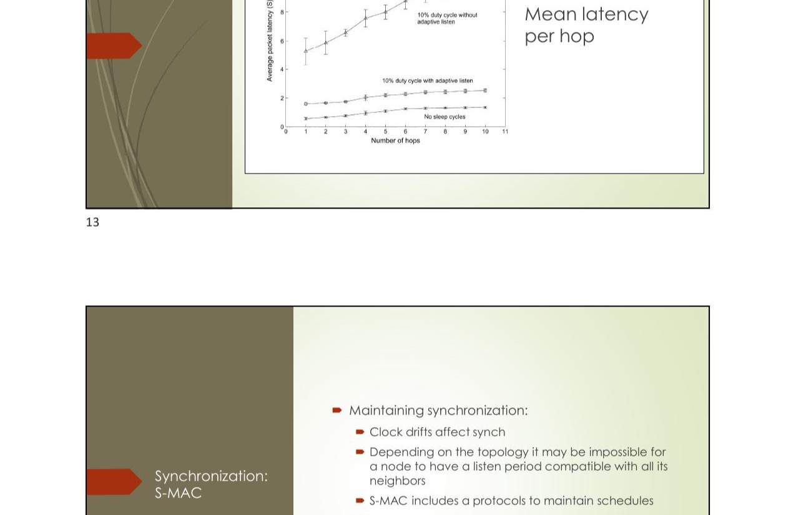
*Fig. — Latenza media per hop in funzione del numero di hop. Il duty cycle al 10% senza adaptive listen introduce latenze molto più elevate rispetto alla modalità senza sleep e alla variante con adaptive listen.*

### Mantenimento della sincronizzazione

Nel tempo, il **clock drift** (deriva dell'orologio hardware) può desincronizzare i nodi. S-MAC include un meccanismo per il mantenimento della sincronizzazione basato sui frame SYNC periodici. Inoltre, in topologie complesse, potrebbe essere impossibile per un nodo avere un periodo di ascolto compatibile con *tutti* i suoi vicini simultaneamente, e in quel caso S-MAC permette al nodo di cambiare schedule o di mantenerne più di una.

---

## Preamble Sampling: B-MAC

B-MAC (*Berkeley MAC*) rappresenta un approccio radicalmente diverso: invece di sincronizzare i nodi, **elimina del tutto la necessità di coordinazione temporale**. È disponibile in TinyOS per mica motes e si basa sul concetto di *Low-Power Listening* (LPL).

> [!definition] Low-Power Listening (LPL)
>
> Il ricevitore attiva periodicamente la radio per un brevissimo intervallo e controlla se c'è un preambolo sul canale. Se non rileva nulla, torna immediatamente in sleep. Se rileva un preambolo, mantiene la radio accesa per ricevere il frame.

Il mittente, dal canto suo, non deve aspettare il momento giusto: **trasmette quando vuole**, ma antepone al frame un **preambolo molto lungo** — più lungo dell'intervallo di sleep del ricevitore. In questo modo, qualunque sia il momento in cui il ricevitore esegue il campionamento (preamble sampling), il preambolo è ancora "in aria" e può essere rilevato.

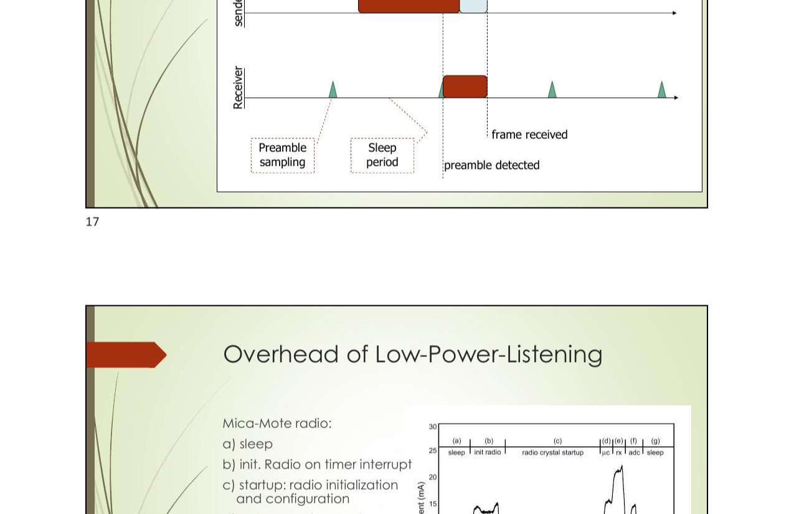
*Fig. — Il mittente trasmette un lungo preambolo seguito dal frame. Il ricevitore esegue campionamenti brevi e periodici (preamble sampling); quando rileva il preambolo, mantiene la radio accesa per ricevere il frame.*

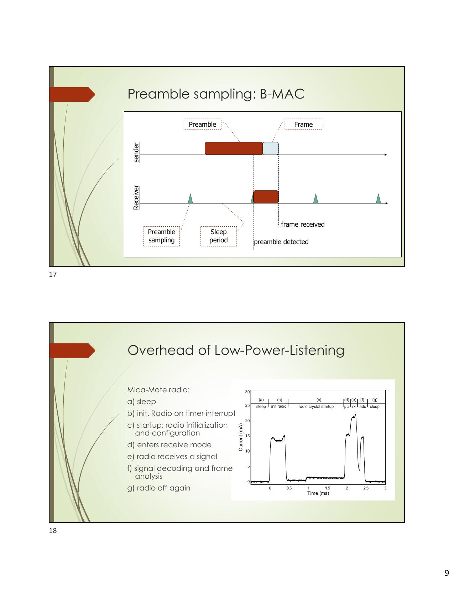
*Fig. — Profilo di corrente (mA) nel tempo (ms) durante un ciclo di Low-Power Listening: sleep → init → startup → receive mode → ricezione segnale → decoding → sleep. Le fasi (a)-(g) evidenziano i picchi di consumo durante l'attivazione.*

### Bilanciamento energetico

Il principio di B-MAC è spostare il costo energetico dalla ricezione alla trasmissione:

- **Ricevitore**: risparmia molto perché esegue solo brevi campionamenti periodici (molto economici) invece di tenere la radio sempre accesa.
- **Trasmittente**: spende di più perché deve trasmettere un preambolo lunghissimo (dell'ordine di 113 ms per il CC1000) prima di ogni frame dati.

> [!tip] Intuizione chiave
>
> Il preambolo deve essere più lungo del periodo di sleep! Se il ricevitore dorme per $T_{sleep}$, il preambolo deve durare almeno $T_{sleep}$ per garantire che il ricevitore lo intercetti durante il suo campionamento.

### Modello energetico

Definiamo i parametri:
- $f_d$ = frequenza di trasmissione dei dati (Hz)
- $f_c$ = frequenza di campionamento del preambolo (preamble sampling rate)
- $p_t$ = potenza in trasmissione
- $p_r$ = potenza in ricezione
- $p_i$ = potenza in idle (radio accesa ma non trasmette né riceve)

Per il **trasmittente**, il duty cycle è:

$$DC_{data} = f_d \cdot (t_{preamble} + t_{frame})$$
$$DC_{check} = f_d \cdot t_{check}$$

L'energia consumata in $t$ secondi è:

$$E_T(t) = t \left[ p_t \cdot DC_{data} + p_r \cdot DC_{check} + p_i \cdot (1 - DC_{data} - DC_{check}) \right]$$

Per il **ricevitore**:

$$DC_{data} = f_c \cdot (t_{listen} + t_{data})$$
$$DC_{check} = f_c \cdot t_{check}$$

$$E_R(t) = t \left[ p_r \cdot DC_{data} + p_r \cdot DC_{check} + p_i \cdot (1 - DC_{data} - DC_{check}) \right]$$

Da questi, la **lifetime** della batteria è:

$$lifetime_T = \frac{battery}{E_T(1)}, \quad lifetime_R = \frac{battery}{E_R(1)}$$

### Parametri reali (CC1000 radio)

| Parametro | Valore |
|---|---|
| $p_t$ (trasmissione) | 60 mW |
| $p_r$ (ricezione) | 45 mW |
| $p_i$ (idle) | 0,09 mW |
| Lunghezza preambolo | 271 byte (113 ms) |
| Frame dati | 36 byte (15 ms) |
| Durata check | 0,35 ms |

L'analisi numerica mostra che la lifetime sia del trasmittente sia del ricevitore dipende fortemente dall'**intervallo di check** (il periodo di sleep tra un campionamento e l'altro) e dal **traffico nella cella**. Esiste un intervallo di check ottimale che massimizza la lifetime per ciascun tasso di campionamento dei dati: campionamenti radi dei dati permettono check interval più lunghi (e quindi meno campionamenti del preambolo), massimizzando la durata della batteria.

> [!note] Nota sulla scalabilità
>
> Il modello mostra che anche considerando più trasmittenti contemporanei, il trend della lifetime non cambia qualitativamente. La lifetime dipende principalmente dall'intervallo di check e dalla quantità di traffico nella cella radio.

### Punti di forza e limiti di B-MAC

**Punti di forza:**
- Non è un protocollo di organizzazione di rete (non impone strutture topologiche).
- Semplicissimo da configurare: un solo parametro, l'intervallo di check.
- Trasparente ai livelli superiori dello stack.

**Limiti:**
- Preamboli lunghi hanno un costo energetico elevato per il trasmittente.
- All'aumentare dell'intervallo di check (per risparmiare in ricezione), il preambolo deve allungarsi, aumentando il costo in trasmissione.
- In scenari con traffico elevato può risultare meno efficiente della sincronizzazione.

---

## Preamble Sampling: X-MAC

X-MAC è un'evoluzione diretta di B-MAC che risponde alla domanda: *si può ridurre il costo del lungo preambolo?* La risposta è sì, inserendo nel preambolo l'**indirizzo del destinatario**.

Il meccanismo funziona così:

1. Il mittente inizia a trasmettere preamboli brevi ripetuti, ciascuno contenente l'ID del ricevitore target.
2. I nodi che non sono il destinatario ignorano il preambolo.
3. Il destinatario, al primo campionamento, riconosce il proprio ID, **interrompe il preambolo** inviando un acknowledgement, e richiede il frame.
4. Il mittente smette di trasmettere il preambolo e invia direttamente il frame.

> [!tip] Intuizione chiave
>
> In B-MAC il preambolo deve durare almeno $T_{sleep}$ indipendentemente da quando il ricevitore si sveglia. Con X-MAC, la durata effettiva del preambolo è solo il tempo che intercorre tra l'inizio della trasmissione e il momento in cui il ricevitore fa il campionamento: in media $T_{sleep}/2$.

Simulazioni su reti a stella (un ricevitore, più trasmittenti) mostrano che X-MAC riduce significativamente il duty cycle totale rispetto a B-MAC, specialmente con intervalli di check più lunghi.

---

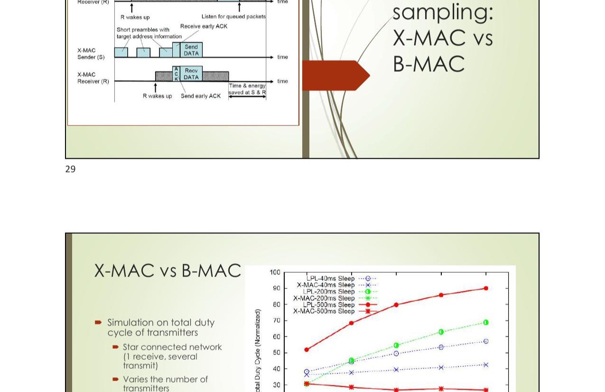
*Fig. — In B-MAC il preambolo dura per tutta la finestra di sleep del ricevitore. In X-MAC il preambolo è una sequenza di frame corti con l'ID del destinatario: il ricevitore interrompe la trasmissione appena si sveglia, riducendo tempo ed energia spesi.*

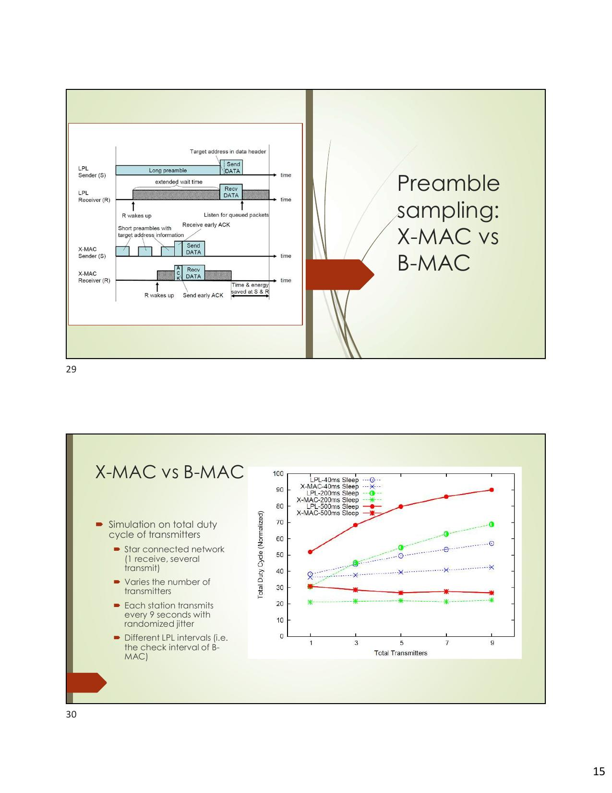
*Fig. — Simulazione su rete a stella. X-MAC (curve in basso) mantiene un duty cycle significativamente inferiore rispetto a B-MAC (curve in alto) per tutti gli intervalli LPL e al crescere del numero di trasmittenti.*

## Preamble Sampling: BoX-MAC

BoX-MAC (*Backoff X-MAC*) è un ulteriore sviluppo di X-MAC. L'idea chiave è che il preambolo stesso diventa una **sequenza ripetuta del frame dati reale**.

Il funzionamento è il seguente:

1. Il mittente trasmette ripetutamente l'intero frame (header + payload).
2. Il ricevitore, al campionamento, intercetta un'istanza del frame.
3. Se è il destinatario, aspetta il boundary del frame successivo, lo riceve completamente, invia un ACK per fermare il trasmittente.

Questa strategia elimina la distinzione tra preambolo e frame: il "preambolo" è il frame stesso, e il ricevitore non deve aspettare la fine del preambolo per ricevere i dati — basta aspettare il prossimo frame della sequenza. Funziona bene con **frame di piccole dimensioni**, che è il caso tipico nelle reti di sensori.

In scenari multi-hop, BoX-MAC mostra comportamenti interessanti: i nodi intermedi possono eventualmente "sentire" i frame ripetuti e anticipare il routing, riducendo ulteriormente la latenza end-to-end.

---

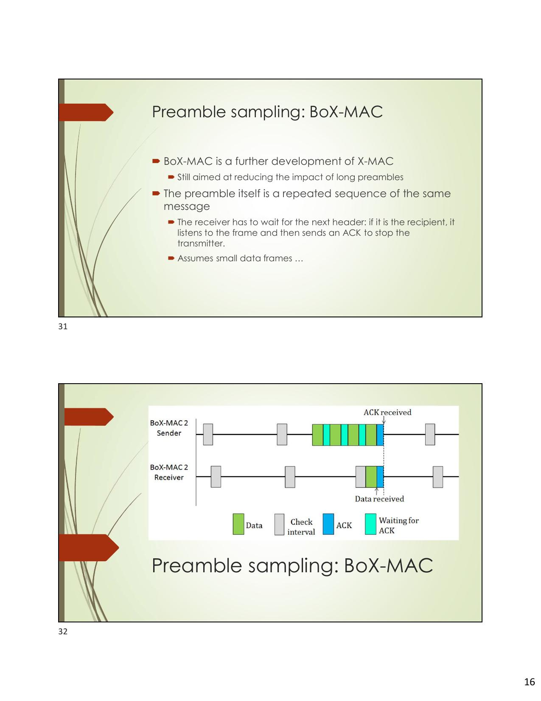
*Fig. — Il mittente ripete il frame più volte. Il ricevitore, al campionamento, aspetta il boundary del frame successivo, lo riceve, e invia un ACK per fermare la trasmissione. La legenda mostra Data TX, Data RX, ACK, y (sync) e channel sampling.*

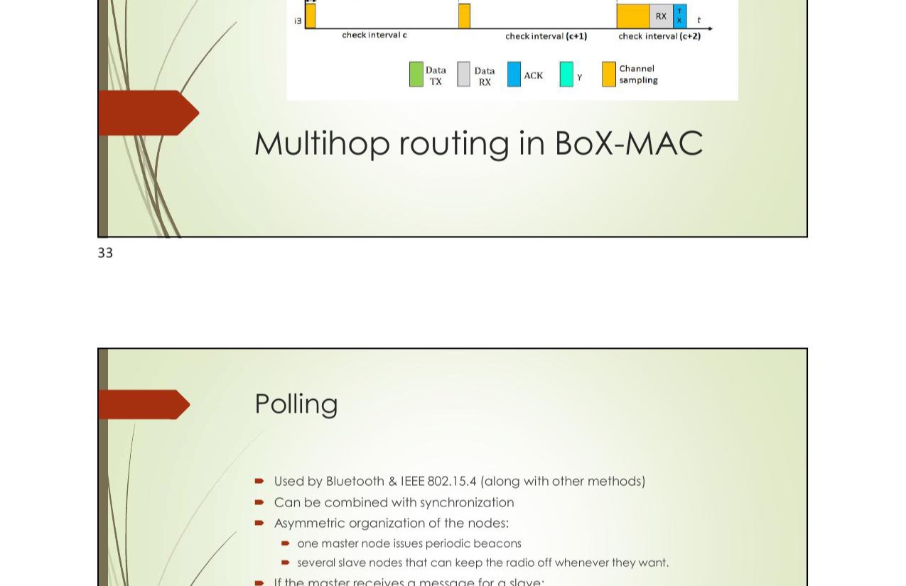
*Fig. — Tre nodi i1, i2, i3 in cascata. Il nodo i1 trasmette ripetutamente; i2 riceve nel proprio check interval e ritrasmette a i3; i3 riceve nel check interval successivo. Il DUTY_ON_TIME mostra il tempo totale di attività della radio per ciascun nodo.*

## Polling

Il polling è il terzo approccio all'efficienza energetica, usato da **Bluetooth** e **IEEE 802.15.4** (in combinazione con la sincronizzazione). Richiede un'**organizzazione asimmetrica** della rete:

- Un nodo **master** trasmette periodicamente dei **beacon**.
- I nodi **slave** possono tenere la radio spenta quando vogliono, senza coordinazione.

Il meccanismo per la consegna dei messaggi verso uno slave è il seguente:

1. Se il master riceve un messaggio destinato a uno slave, lo memorizza.
2. Il master annuncia nel beacon che c'è un messaggio in attesa per quello slave.
3. Quando lo slave si sveglia, aspetta il beacon, riconosce il pending message, e invia una richiesta esplicita al master.
4. Il master consegna il frame.

> [!note] Nota
>
> Il polling è intrinsecamente compatibile con la sincronizzazione: i beacon del master possono servire anche da segnale di sincronizzazione per i nodi slave. IEEE 802.15.4 usa esattamente questa combinazione nella sua modalità con beacon.

---

## Domande d'esame

```{=latex}
\newpage
```

# Lo Standard IEEE 802.15.4

Lo standard IEEE 802.15.4 definisce le specifiche del **physical layer** e del **MAC layer** per le **Low-Rate Wireless Personal Area Network** (*LR-WPAN*, reti personali senza fili a bassa velocità). L'obiettivo è fornire un protocollo radio standardizzato per dispositivi a risorse limitate — sensori, attuatori, nodi IoT — che richiedono bassi consumi energetici piuttosto che elevate velocità di trasmissione.

> [!definition] IEEE 802.15.4
>
> Specifica del physical layer e del MAC layer per reti LR-WPAN (*Low-Rate Wireless Personal Area Network*). Supporta comunicazioni a corto raggio, bassa velocità di trasmissione e coesistenza con IEEE 802.11 (Wi-Fi) e IEEE 802.15.1 (Bluetooth).

Una caratteristica progettuale importante è la coesistenza con altri standard wireless: il physical layer è disegnato per poter operare nello stesso ambiente fisico di IEEE 802.11 e IEEE 802.15.1 senza causare interferenze reciproche devastanti.

## Bande di Frequenza

Lo standard opera su tre bande di frequenza libere da licenza (*licence-free*):

| Banda | Regione | Data rate | Canali |
|---|---|---|---|
| 868–868.6 MHz | Europa | 20 kbps | 1 (canale 0) |
| 902–928 MHz | Nord America | 40 kbps | 10 (canali 1–10) |
| 2400–2483.5 MHz | Mondiale | 250 kbps | 16 (canali 11–26) |

La banda a 2.4 GHz è quella più diffusa perché disponibile a livello globale e garantisce la velocità di trasmissione più alta. La banda a 868 MHz — tipicamente utilizzata in Europa — è quella con il data rate più basso ma offre maggiore robustezza in ambienti con SNR basso.

> [!example] Esempio: banda 868 MHz
>
> - Frequenza centrale: 868.3 MHz
> - Data rate: 20 kbps
> - Modulazione: simboli binari
> - Un solo canale disponibile
> - Dimensione massima del pacchetto: 127 byte

---

## Physical Layer

Il **physical layer** di IEEE 802.15.4 eroga due categorie di servizi verso lo strato superiore: servizi dati e servizi di gestione.

### Servizi del Physical Layer

Il **Data Service** è responsabile della trasmissione e ricezione delle **PPDU** (*PHY Protocol Data Unit*) attraverso il mezzo fisico. Quando una trasmissione fallisce, il physical layer riporta all'upper layer il motivo del fallimento: il ricetrasmettitore potrebbe essere guasto, in modalità ricezione, oppure già impegnato in un'altra operazione.

Il **Management Service** comprende un insieme più ampio di funzionalità:

- Attivazione e disattivazione del ricetrasmettitore radio, per implementare politiche di risparmio energetico.
- **Energy Detection** (ED): misura del livello di energia sul canale.
- **Link Quality Indicator** (LQI): stima della qualità dei pacchetti ricevuti.
- **Channel Selection**: selezione del canale operativo.
- **Clear Channel Assessment** (CCA): verifica se il canale è libero prima di trasmettere.
- Configurazione della **PHY-PIB** (*PHY PAN Information Base*), la struttura dati che mantiene i parametri di configurazione del physical layer.

### Prestazioni del Physical Layer

*Fig. — Confronto di Bit Error Rate (BER) in funzione del SNR tra IEEE 802.15.4 (zona "More Robust"), Bluetooth e altri standard. Lo standard mostra eccellenti prestazioni in ambienti a basso SNR.*

Il grafico mostra che IEEE 802.15.4 mantiene un BER molto basso anche in condizioni di SNR negativo, dove altri standard (come Bluetooth) già soffrono di errori frequenti. Questa robustezza è fondamentale per i tipici ambienti IoT industriali o domestici, dove il canale radio è spesso disturbato.

### Energy Detection

L'**Energy Detection** (ED) è il meccanismo utilizzato per trovare un canale libero e per il *carrier sense*. Il physical layer misura la potenza del segnale sul canale su un intervallo di **8 simboli** e confronta il risultato con una soglia fissata a **10 dB sopra il livello di sensibilità** del ricevitore. Il risultato della rilevazione è restituito come un valore a un byte.

> [!definition] Energy Detection (ED)
>
> Stima del livello di energia media sul canale su una finestra di 8 simboli. Se l'energia supera la soglia (10 dB sopra la sensibilità), il canale è considerato occupato.

### Link Quality Indicator

Il **Link Quality Indicator** (LQI) misura la qualità dei pacchetti dati ricevuti da un nodo. Viene valutato ogni volta che si riceve un pacchetto e il suo valore viene propagato verso i layer di rete e applicazione, dove può essere impiegato nel routing multi-hop — ad esempio in ZigBee — per scegliere il percorso di qualità migliore.

> [!definition] Link Quality Indicator (LQI)
>
> Indicatore di qualità del collegamento radio stimato su ogni pacchetto ricevuto. Basato sull'ED, sul rapporto segnale/rumore o su una combinazione di entrambi. Deve avere almeno 8 livelli distinti.

### Clear Channel Assessment

Il **Clear Channel Assessment** (CCA) determina se il canale è occupato prima di trasmettere. Esistono tre modalità operative:

- **Modalità 1**: usa l'Energy Detection — se l'energia supera la soglia, il canale è occupato.
- **Modalità 2**: usa il *Carrier Sense* — il canale è occupato se il segnale rilevato ha le stesse caratteristiche del trasmettitore.
- **Modalità 3**: combinazione delle modalità 1 e 2 in AND o OR.

### Struttura della PPDU

Il frame del physical layer — la **PPDU** (*PHY Protocol Data Unit*) — è strutturato in tre sezioni principali:

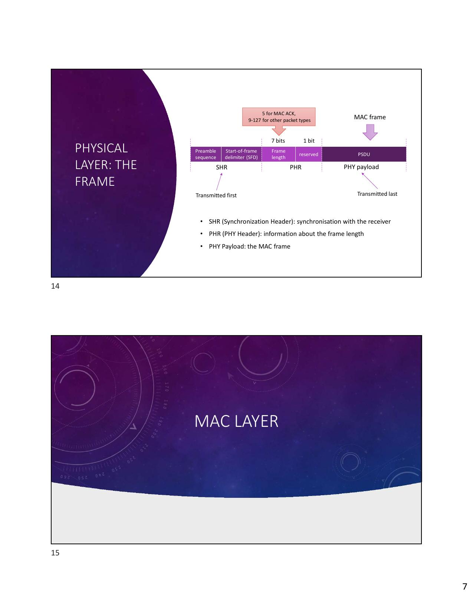
*Fig. — Struttura della PPDU: SHR (Synchronization Header), PHR (PHY Header) e PHY Payload (PSDU). Il frame viene trasmesso da sinistra (preamble) a destra (payload MAC).*

- **SHR** (*Synchronization Header*): contiene la sequenza di preambolo e il delimitatore di inizio frame (SFD, *Start-of-Frame Delimiter*). Permette al ricevitore di sincronizzarsi con il trasmettitore.
- **PHR** (*PHY Header*): contiene la lunghezza del frame su 7 bit più 1 bit riservato. Il campo *Frame length* può valere 5 (per i MAC ACK) oppure da 9 a 127 per gli altri tipi di pacchetto.
- **PHY Payload** (PSDU): il MAC frame incapsulato.

---

## MAC Layer

Il **MAC layer** di IEEE 802.15.4 si sovrappone al physical layer e fornisce i meccanismi per l'accesso al mezzo condiviso, la sincronizzazione, la formazione della rete e la sicurezza di base.

### Servizi del MAC Layer

**Data services**: trasmissione e ricezione di **MPDU** (*MAC Protocol Data Unit*) attraverso il physical layer.

**Management services**: sincronizzazione delle comunicazioni, accesso al canale, gestione dei **Guaranteed Time Slot** (GTS), associazione e disassociazione dei dispositivi alla rete.

**Security services**: cifratura dei dati, controllo degli accessi, integrità dei frame, garanzie di freschezza sequenziale.

### Tipi di Dispositivi

> [!definition] Reduced Function Device (RFD)
>
> Dispositivo con capacità ridotte di elaborazione, memoria e comunicazione. Tipicamente sensori o attuatori semplici (interruttori, lampade). Implementa solo un sottoinsieme del MAC layer: può associarsi a una rete esistente, ma dipende da un FFD per comunicare. Ogni RFD può essere associato a un solo FFD alla volta.

> [!definition] Full Function Device (FFD)
>
> Implementa il MAC layer completo. Può fungere da coordinatore di PAN (*PAN coordinator*) o da coordinatore generico di un gruppo di RFD. Il PAN coordinator seleziona l'identificatore di PAN e gestisce le associazioni e disassociazioni dei dispositivi.

### Topologie di Rete

Il MAC layer supporta due topologie fondamentali.

**Topologia a stella (Star)**: un unico FFD funge da PAN coordinator; tutti gli altri nodi — compresi eventuali FFD usati come router — comunicano esclusivamente con lui e si comportano come RFD. Il PAN coordinator sincronizza tutte le comunicazioni nella rete. PAN diverse hanno identificatori distinti e sono indipendenti.

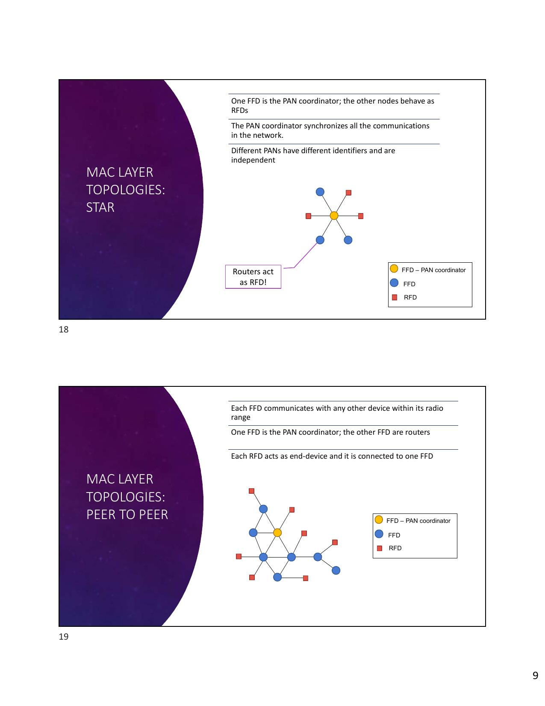
*Fig. — Topologia Star: il PAN coordinator (arancione) al centro; FFD blu e RFD rossi collegati direttamente. Anche i router agiscono come RFD in questa topologia.*

**Topologia peer-to-peer**: ogni FFD può comunicare con qualunque altro dispositivo nel suo raggio radio. Un FFD è il PAN coordinator, gli altri FFD sono router; ogni RFD è un end-device connesso a un FFD. Questa topologia permette la formazione di reti mesh e alberi.

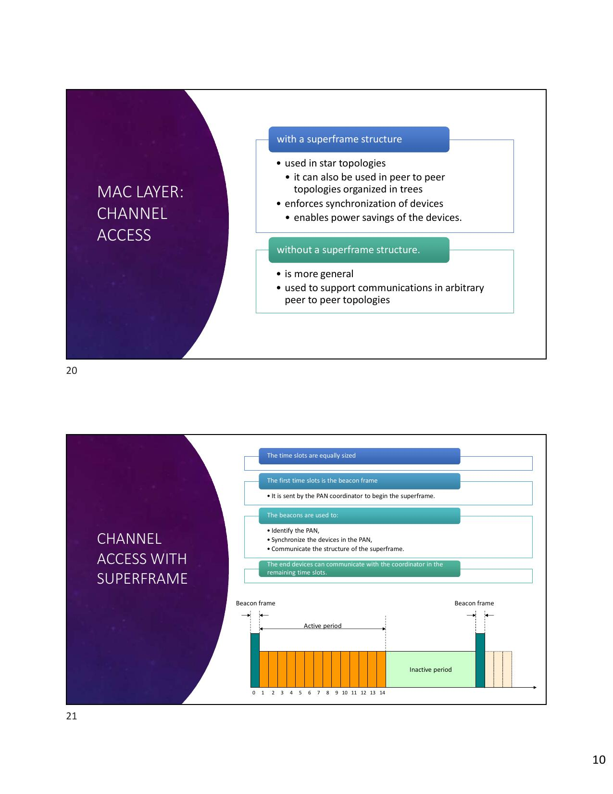
*Fig. — Topologia Peer-to-Peer: gli FFD (blu) si interconnettono tra loro; gli RFD (rosso) sono end-device connessi ciascuno a un FFD. Il PAN coordinator è in arancione.*

### Accesso al Canale con Superframe

La modalità *beacon-enabled* struttura il tempo in **superframe**, delimitati dall'invio periodico di un frame beacon da parte del PAN coordinator. Il superframe divide il tempo in due porzioni: una **active period** e una **inactive period**. Durante il periodo inattivo il PAN coordinator e i dispositivi connessi possono entrare in modalità a basso consumo (sleep).

La **active period** comprende fino a **16 time slot** di uguale dimensione, suddivisi in:

- **CAP** (*Contention Access Period*): fino a 15 slot. I dispositivi competono per il canale usando il protocollo **CSMA-CA a slot** (*slotted CSMA-CA*). Un dispositivo attende un numero casuale di slot; se il canale è occupato riprova dopo un altro backoff casuale; se è libero trasmette e mantiene il canale fino alla fine del frame.
- **CFP** (*Contention Free Period*): opzionale, occupa gli ultimi slot del periodo attivo. Diviso in **GTS** (*Guaranteed Time Slot*), ciascuno assegnato dal PAN coordinator a una specifica applicazione. Il GTS è accessibile senza CSMA-CA, garantendo latenza deterministica. Ogni CFP può contenere al massimo 7 GTS, ciascuno composto da uno o più slot.

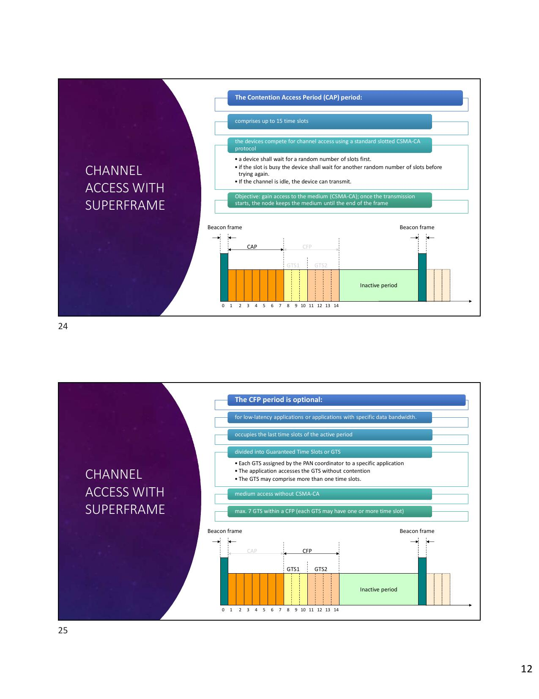
*Fig. — Struttura del superframe: il beacon apre il periodo attivo, diviso in CAP (accesso CSMA-CA, arancione) e CFP opzionale con GTS (verde). Segue il periodo inattivo.*

> [!warning] Il CAP non può essere eliminato
>
> Anche quando è presente il CFP, il CAP è necessario per il mantenimento della rete: gestione di associazioni/disassociazioni, richieste di GTS, ecc. Tutte le transazioni basate su contesa devono completarsi prima dell'inizio del CFP. Un dispositivo che trasmette in un GTS deve completare la trasmissione entro il suo GTS assegnato.

> [!tip] Intuizione: CAP vs CFP
>
> Il CAP è come un incrocio senza precedenza fissa (tutti attendono il proprio turno casuale). Il CFP è come una corsia riservata (accede solo chi ha la prenotazione). Le applicazioni real-time o ad alta priorità richiedono GTS nel CFP; le comunicazioni ordinarie usano il CAP.

### Accesso al Canale senza Superframe

Nella modalità *non beacon-enabled*, non esiste struttura a superframe. L'accesso al canale usa **CSMA-CA non a slot** (*unslotted CSMA-CA*). I coordinatori devono essere sempre attivi per ricevere dati dagli end-device.

Il trasferimento in direzione coordinatore → end-device è basato su polling: l'end-device si sveglia periodicamente e interroga il coordinatore per verificare se ci sono messaggi in attesa. Il coordinatore risponde con il messaggio pendente o segnala che non ve ne sono.

---

## Modalità di Trasferimento Dati

IEEE 802.15.4 definisce tre direzioni di trasferimento dati:

1. **End-device → coordinatore (o router)**
2. **Coordinatore (o router) → end-device**
3. **Peer-to-peer**

La topologia a stella usa solo le modalità 1 e 2. La peer-to-peer le supporta tutte e tre.

### Trasferimento in Reti Beacon-Enabled

**Da end-device a coordinatore**: il dispositivo attende il beacon per sincronizzarsi. Se possiede un GTS lo usa senza contesa; altrimenti trasmette nel CAP usando CSMA-CA a slot. Il coordinatore può inviare un ACK opzionale.

**Da coordinatore a end-device**: il coordinatore memorizza il messaggio e segnala nel beacon che c'è un messaggio pendente. L'end-device, che dorme la maggior parte del tempo, ascolta occasionalmente il beacon. Quando rileva un messaggio pendente invia un *Data request* nel CAP (con ACK immediato dal coordinatore). Il coordinatore trasmette il messaggio in uno slot successivo del CAP; l'end-device invia un ACK obbligatorio. Infine il coordinatore rimuove il messaggio dalla lista.

**Peer-to-peer**: tra coordinatore/router e end-device si applicano gli schemi precedenti. Due end-device non possono comunicare direttamente. La comunicazione tra due coordinatori o tra coordinatore e router richiede che il mittente si sincronizzi con il beacon del destinatario — ma le modalità per farlo sono fuori dallo scope dello standard.

### Trasferimento in Reti Non Beacon-Enabled

**Da end-device a coordinatore**: il dispositivo trasmette direttamente con CSMA-CA non a slot; il coordinatore deve essere sempre attivo. L'ACK è opzionale.

**Da coordinatore a end-device**: il coordinatore memorizza il messaggio; l'end-device interroga periodicamente il coordinatore con una *Data request* (CSMA-CA non a slot), riceve ACK, poi il messaggio, poi invia l'ACK finale. Se non ci sono messaggi pendenti il coordinatore risponde con un messaggio vuoto.

**Peer-to-peer**: ogni dispositivo può comunicare con ogni altro nel suo raggio radio. I dispositivi devono restare sempre attivi oppure sincronizzarsi tra loro — ma la sincronizzazione è delegata ai layer superiori.

---

## Servizi e Primitive del MAC Layer

Il MAC layer comunica con il network layer attraverso un modello a **primitive** di tipo SAP (*Service Access Point*). Le quattro primitive sono:

- **Request**: il network layer chiede un servizio al MAC layer.
- **Indication**: il MAC layer notifica un evento al network layer.
- **Response**: il network layer risponde a un'indication.
- **Confirm**: il MAC layer riporta il risultato di una request precedente.

### Data Service

Il **Data Service** usa solo request, confirm e indication:

- **DATA.request**: invocata dal network layer per spedire un messaggio a un altro dispositivo.
- **DATA.confirm**: riporta al network layer il risultato della trasmissione — successo o codice di errore.
- **DATA.indication**: generata dal MAC layer alla ricezione di un messaggio dal physical layer; consegna il messaggio al network layer.

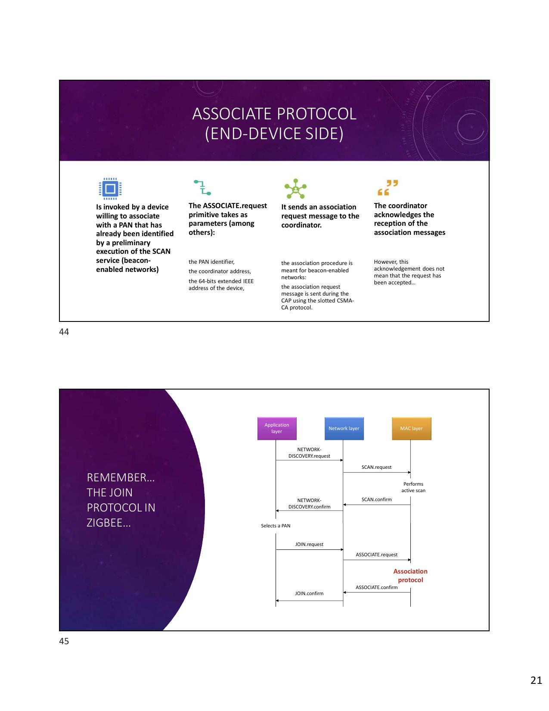
*Fig. — In alto: lato end-device del protocollo ASSOCIATE con i passi della primitiva ASSOCIATE.request. In basso: come il Join Protocol di ZigBee (NWK layer) si appoggia al SCAN + ASSOCIATE del MAC 802.15.4.*

### Management Service

Il **Management Service** include le seguenti primitive principali:

| Primitiva | Funzionalità |
|---|---|
| ASSOCIATE | Richiesta di associazione di un nuovo dispositivo a una PAN |
| DISASSOCIATE | Abbandono di una PAN |
| BEACON-NOTIFY | Fornisce al network layer il beacon ricevuto |
| GET / SET | Lettura/scrittura dei parametri della MAC-PIB |
| GTS | Richiesta di un GTS al coordinatore |
| SCAN | Ricerca di PAN attive |
| COMM-STATUS | Notifica al network layer dello stato di una transazione |
| START | Avvia una PAN e inizia a inviare beacon; usato anche per la device discovery |
| POLL | Richiesta di messaggi pendenti al coordinatore |

Le primitive marcate "O" nella specifica sono opzionali per gli RFD.

---

## Protocollo di Associazione

L'associazione è il processo con cui un dispositivo entra a far parte di una PAN. È pensata per reti beacon-enabled e si compone di una fase sul lato end-device e una sul lato coordinatore.

### Lato End-Device

Il dispositivo che vuole associarsi deve aver identificato in anticipo la PAN di destinazione attraverso il servizio **SCAN** (scansione attiva). Invoca poi la primitiva **ASSOCIATE.request**, che prende come parametri l'identificatore di PAN, l'indirizzo del coordinatore e il proprio indirizzo IEEE a 64 bit esteso. La richiesta viene inviata nel CAP usando CSMA-CA a slot. Il coordinatore invia un ACK immediato — ma questo non implica che la richiesta sia stata accettata.

> [!note] Connessione con ZigBee
>
> Il protocollo di JOIN dello stack ZigBee si appoggia esattamente a SCAN + ASSOCIATE del MAC 802.15.4: il NWK layer invoca NETWORK-DISCOVERY.request → il MAC esegue SCAN → il NWK seleziona una PAN → invoca JOIN.request → il MAC esegue il protocollo ASSOCIATE.

### Lato Coordinatore

Dopo aver ricevuto la richiesta, il MAC layer del coordinatore emette **ASSOCIATE.indication** verso il network layer (NWK), che decide se accettare o rifiutare. In caso di accettazione, il NWK layer:

1. Seleziona un **indirizzo a 16 bit** che il dispositivo utilizzerà in futuro al posto dell'indirizzo a 64 bit.
2. Invoca **ASSOCIATE.response**, passando come parametri l'indirizzo a 64 bit del dispositivo, il nuovo indirizzo a 16 bit e lo status della richiesta.
3. Il MAC layer invia la risposta di associazione usando **trasmissione indiretta** (il dispositivo deve fare polling per recuperarla).

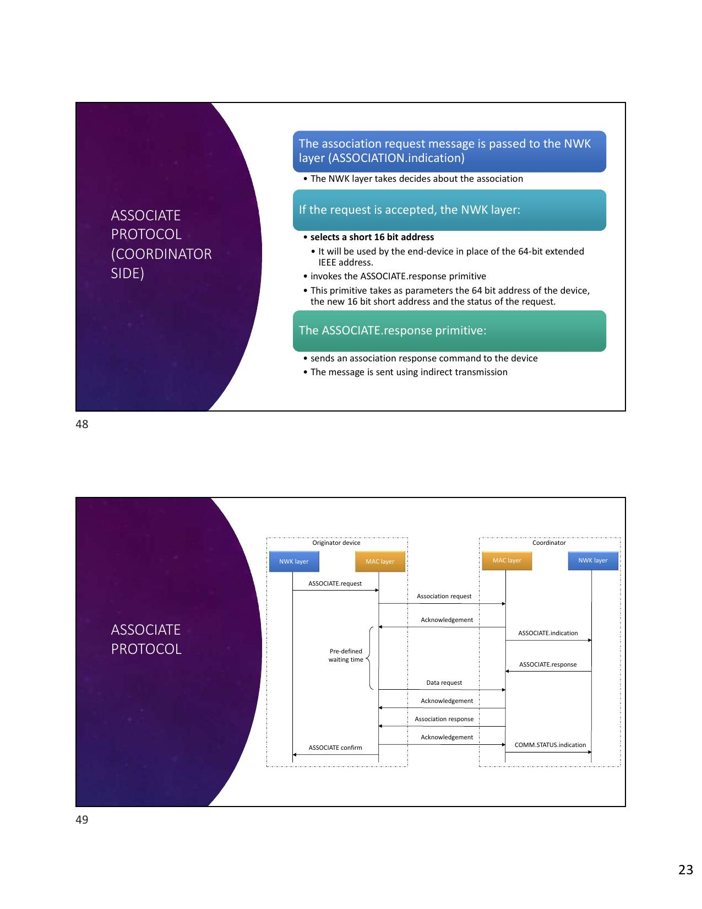
*Fig. — Diagramma di sequenza completo del protocollo ASSOCIATE: flusso tra NWK/MAC del dispositivo originatore e NWK/MAC del coordinatore. Dopo il pre-defined waiting time, il dispositivo invia una Data request per recuperare la risposta.*

### Completamento del Protocollo

Dopo che il dispositivo ha recuperato la risposta (tramite Data request → ACK → Association response → ACK):

- Il **MAC layer dell'end-device** emette **ASSOCIATE.confirm** al NWK layer.
- Il **MAC layer del coordinatore** emette **COMM-STATUS.Indication** al NWK layer, segnalando che l'associazione è conclusa — con successo o con un codice di errore.

---

## Sicurezza del MAC Layer

IEEE 802.15.4 fornisce un supporto di base alla sicurezza direttamente nel MAC layer. Le funzionalità avanzate — come la gestione delle chiavi e l'autenticazione dei dispositivi — sono delegate ai layer superiori. I servizi di sicurezza sono opzionali. Tutti i servizi di sicurezza si basano su **crittografia simmetrica**; le chiavi crittografiche sono fornite dai layer superiori.

### Controllo degli Accessi

Ogni dispositivo mantiene un **ACL** (*Access Control List*) che elenca i dispositivi con cui può comunicare. I frame ricevuti da dispositivi non presenti nell'ACL vengono scartati.

### Cifratura dei Dati

La cifratura simmetrica si applica ai dati, ai comandi e ai payload dei beacon. La chiave può essere:

- una **group key** condivisa da un gruppo di dispositivi;
- una **link key** condivisa solo tra due peer specifici.

### Integrità dei Frame

L'integrità protegge i frame da modifiche non autorizzate e garantisce che il frame provenga da un dispositivo in possesso della chiave crittografica. Usa la stessa chiave della cifratura e si applica a frame dati, beacon e comandi.

### Freschezza Sequenziale

La **Sequential Freshness** ordina la sequenza dei frame in ingresso per garantire che ogni frame ricevuto sia più recente dell'ultimo frame ricevuto — difesa contro gli attacchi di replay.

> [!abstract] Sintesi della Lezione
>
> IEEE 802.15.4 specifica il physical layer e il MAC layer per reti LR-WPAN. Il physical layer opera su tre bande di frequenza (868 MHz, 902 MHz, 2.4 GHz), con eccellenti prestazioni in ambienti a basso SNR. Il MAC layer distingue due tipi di dispositivi (RFD e FFD), supporta topologie a stella e peer-to-peer, e gestisce l'accesso al canale con o senza superframe. Il superframe è diviso in CAP (accesso CSMA-CA) e CFP opzionale (GTS deterministici). Il protocollo di associazione permette ai dispositivi di unirsi a una PAN esistente. La sicurezza di base — cifratura simmetrica, controllo accessi, integrità, freschezza — è integrata nel MAC layer.

```{=latex}
\newpage
```

# Case Study: Biologging e Activity Recognition

Il biologging rappresenta uno dei casi d'uso più concreti e affascinanti dell'IoT applicato al mondo naturale. La lezione sviluppa questo tema attraverso un caso di studio reale: il progetto **Tortoise@**, che automatizza il rilevamento delle attività di nidificazione delle tartarughe con tecniche di machine learning embedded su dispositivi a bassa potenza.

---

## Dal monitoraggio diretto al monitoraggio sensoriale

L'osservazione diretta degli animali (e degli esseri umani) è uno strumento efficace per raccogliere informazioni sulle loro attività, ma è per sua natura limitata: richiede la presenza fisica di un osservatore, non può essere continua e copre solo una frazione ridotta della vita del soggetto. L'impiego di sensori miniaturizzati — accelerometri, GPS, sensori di pressione, luce, temperatura — trasforma questa limitazione: il monitoraggio diventa **continuo**, **automatizzato** e capace di coprire quasi tutti gli aspetti della vita del soggetto.

I dispositivi vengono fisicamente applicati agli animali in libertà (*free-range animals*). A questo punto si apre una distinzione fondamentale tra due approcci:

> [!definition] Biotelemetria vs Bio-logging
>
> **Biotelemetria**: i dati raccolti dai sensori vengono trasmessi in tempo reale a una stazione remota tramite un'interfaccia wireless. Non c'è memorizzazione locale.
>
> **Bio-logging**: i dati vengono memorizzati nella memoria interna del dispositivo. Il ricercatore deve fisicamente recuperare il dispositivo per accedere ai dati. I dispositivi più moderni possono anche trasmettere remotamente quando le condizioni lo permettono.

Il terzo elemento del quadro è l'**activity recognition** (*riconoscimento dell'attività*): un sistema che, a partire dai segnali registrati durante l'attività dell'animale, riconosce automaticamente le azioni compiute. Questo trasforma dati grezzi in informazioni semanticamente ricche.

## Pipeline del Biologging

Il flusso completo del biologging si articola in tre fasi: raccolta dei dati → elaborazione dei dati → classificazione dell'attività.

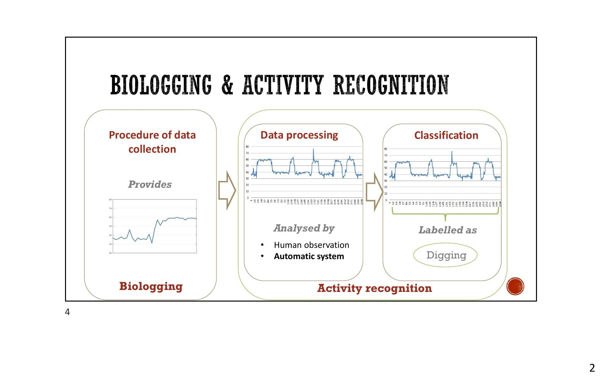
*Fig. — Il flusso completo: il dispositivo di biologging fornisce serie temporali, che vengono analizzate (da un osservatore umano o da un sistema automatico) e infine classificate in attività specifiche (es. "digging").*

---

## Punti di forza e debolezza

L'approccio sensoriale ha vantaggi importanti rispetto all'osservazione tradizionale, ma introduce anche nuove sfide operative.

| Punti di forza | Debolezze |
|---|---|
| Osservazioni puntuali tramite sensori | È necessario applicare il dispositivo al soggetto |
| Funziona in ambienti domestici e selvatici | Necessità di recuperare fisicamente il dispositivo |
| Enorme quantità di dati (serie temporali) | Quando la memoria si riempie o la batteria si esaurisce, i dati vengono persi |
| — | Vita limitata del dispositivo in monitoraggi intensivi |
| — | Spesso solo analisi off-line |

> [!warning] Il problema della durata della batteria
>
> Nei dispositivi di biologging, il consumo energetico è il vincolo progettuale più critico. Un monitoraggio continuo che raccoglie e trasmette serie temporali grezze porta rapidamente all'esaurimento della batteria, limitando la durata utile del dispositivo a periodi ben inferiori alle stagioni di osservazione necessarie.

---

## Prospettiva del dispositivo: approccio convenzionale vs approccio innovativo

### Approccio convenzionale

Nel paradigma classico, il dispositivo è un semplice *data logger* a bassa potenza: raccoglie enormi quantità di dati di serie temporali e deve poi o trasmetterli a una stazione remota o essere fisicamente recuperato. Entrambe le opzioni hanno costi alti:

- **Comunicare** le serie temporali grezze è estremamente oneroso dal punto di vista energetico
- **Recuperare** fisicamente il dispositivo è altamente invasivo per l'animale e per l'ecosistema

### Approccio innovativo: on-board intelligence

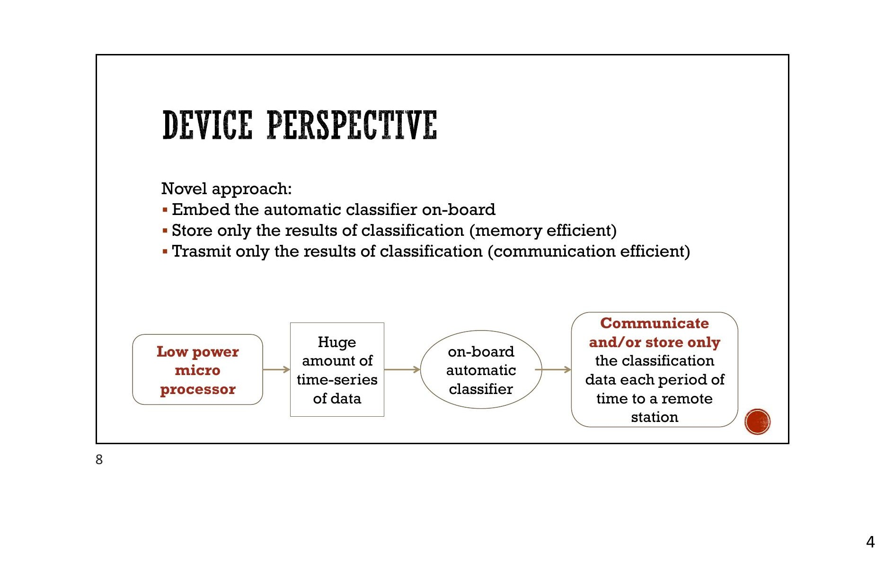
*Fig. — Il nuovo paradigma: un micro-processore a bassa potenza incorpora un classificatore automatico. Invece delle serie temporali grezze, vengono memorizzati e trasmessi solo i risultati della classificazione, riducendo drasticamente il traffico dati e il consumo energetico.*

L'idea chiave è **spostare l'elaborazione sul dispositivo stesso**:

1. Incorporare il classificatore automatico direttamente nel dispositivo (*on-board*)
2. Memorizzare solo i risultati della classificazione (efficienza di memoria)
3. Trasmettere solo i risultati della classificazione (efficienza di comunicazione)

Questo approccio richiede classificatori leggeri, capaci di girare su microcontrollori con risorse molto limitate, ma porta a vantaggi enormi in termini di autonomia e invasività.

---

## Caso di studio: Tortoise@

Il progetto di riferimento è:

> Barbuti R., Chessa S., Micheli A., and Pucci R.; *"Localizing tortoise nests by neural networks"*; PloS One 2016.

### Il problema

I programmi di protezione delle tartarughe mirano a raccogliere le uova e portarle in centri protetti, dove i piccoli vengono custoditi durante il periodo più vulnerabile. Il problema è che **identificare i nidi in natura è estremamente difficile**: le tartarughe sono molto abili nel nasconderli. Il progetto **Tortoise@** automatizza questo processo riconoscendo in tempo reale l'attività di scavo e comunicando la posizione GPS agli erpetologi.

> [!tip] Perché il riconoscimento dell'attività funziona
>
> Le tartarughe scavano i nidi con le zampe posteriori. Questo comportamento produce un pattern caratteristico nel segnale dell'accelerometro, distinguibile dall'attività di camminata o di alimentazione. La chiave è che lo scavo lascia una firma temporale riconoscibile — e questa firma può essere appresa da un modello di ML.

### Idea del sistema

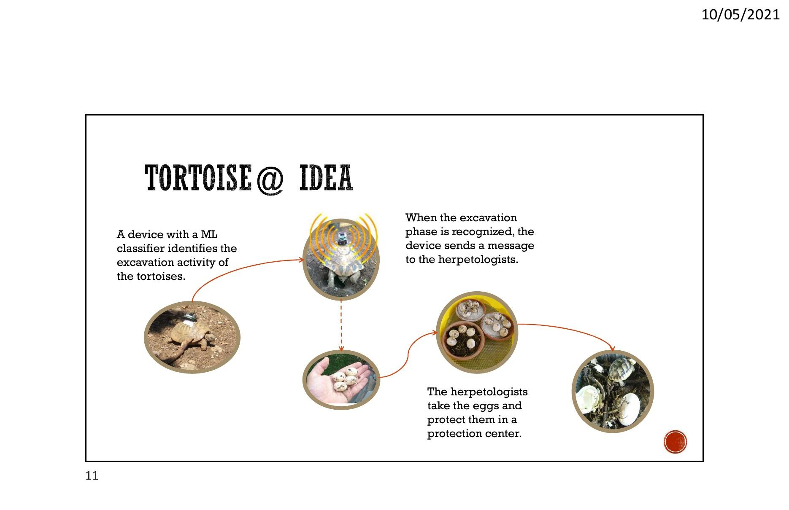
*Fig. — Il sistema Tortoise@: un dispositivo con classificatore ML identifica l'attività di scavo, invia un messaggio agli erpetologi che recuperano le uova e le portano in un centro di protezione.*

### Vincoli biologici e scelte progettuali

La biologia delle tartarughe guida direttamente le scelte ingegneristiche:

- Le tartarughe depongono le uova in primavera, in un periodo di circa **4 mesi**
- Una singola tartaruga può deporre più volte (generalmente 3-4 volte)
- La nidificazione avviene di giorno, in luoghi caldi e ben illuminati
- La nidificazione dura **più di un'ora**
- Le tartarughe scavano il nido con le zampe posteriori

Da queste osservazioni derivano direttamente i requisiti tecnici:

- Il dispositivo deve durare **almeno 4 mesi**
- L'attività di scavo è rilevabile con gli accelerometri
- I sensori ambientali (luce e temperatura) possono limitare l'uso degli accelerometri ai soli momenti potenzialmente rilevanti

### Architettura per l'efficienza energetica

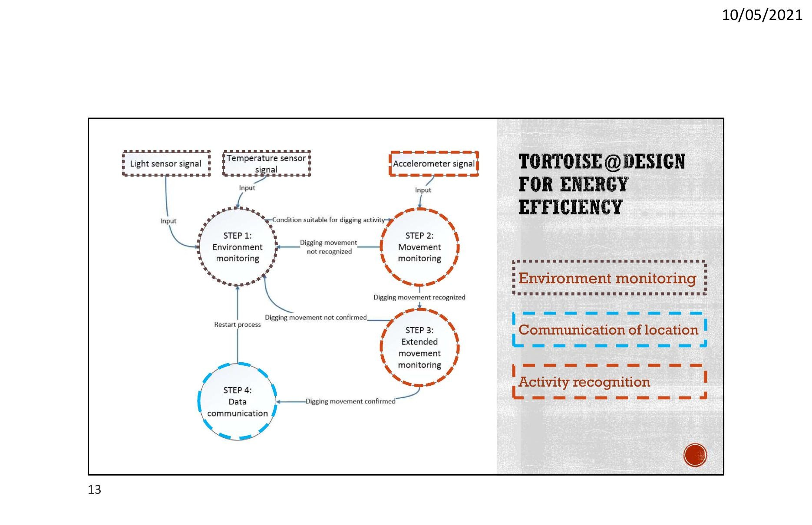
*Fig. — Il design di Tortoise@ per l'efficienza energetica: la macchina a stati usa sensori ambientali a bassa frequenza come gate per attivare il campionamento dell'accelerometro, minimizzando il consumo complessivo.*

La logica di controllo del dispositivo è progettata per minimizzare l'uso dell'accelerometro (il sensore più energivoro):

1. **Step 1 — Environment monitoring**: i sensori ambientali (luce e temperatura) vengono campionati a frequenza molto bassa (0,01 Hz). Il campionamento notturno viene evitato completamente.
2. **Step 2 — Movement monitoring**: solo quando le condizioni ambientali sono adatte si attiva il campionamento dell'accelerometro a 1 Hz per 5 minuti.
3. **Step 3 — Extended movement monitoring**: se la risposta è negativa, il dispositivo sospende per almeno mezz'ora (lo scavo dura almeno un'ora, quindi non si perde nessun evento rilevante).
4. **Step 4 — Data communication**: se il classificatore è certo che la tartaruga stia scavando, trasmette la posizione GPS. Per confermare, il ciclo di campionamento viene ripetuto 3 volte, riducendo i falsi positivi. La trasmissione radio avviene solo poche volte nell'arco di diversi mesi.

> [!info] Efficienza di sistema
>
> Questo design a cascata è un esempio di **duty cycling intelligente**: invece di campionare continuamente, si usa un sensore economico (luce/temperatura) come trigger per attivare il sensore costoso (accelerometro). Il risultato è un'autonomia molto più lunga rispetto a un campionamento naïve.

---

## Dataset e classificazione

### Raccolta dati

Il dataset è stato raccolto presso il «Centro di protezione tartarughe Mediterranee» di Massa Marittima, Italia. Gli animali coinvolti sono femmine adulte di *Testudo hermanni*, *Testudo graeca* e *Testudo marginata*. Le attività registrate sono tre: **digging** (scavo), **eating** (alimentazione), **walking** (camminata).

Il sensore utilizzato è un accelerometro a un asse (asse X) con un dispositivo **MicaZ**, campionato a 1 Hz.

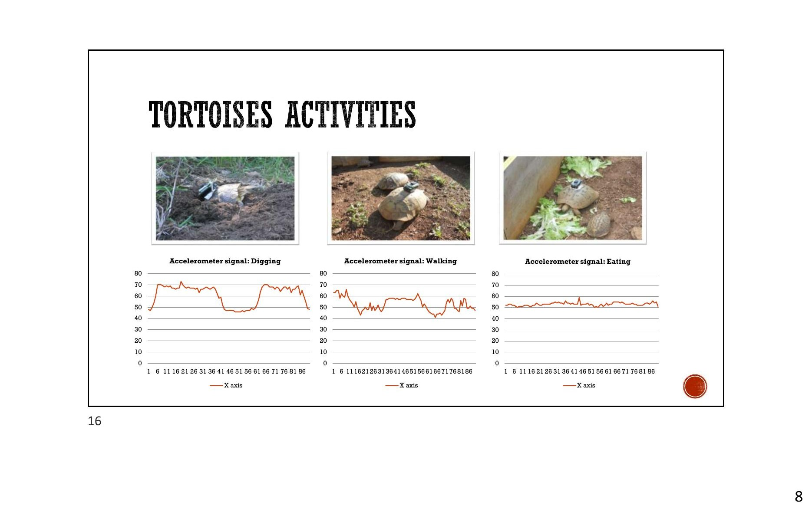
*Fig. — I segnali dell'accelerometro (asse X) per le tre attività: lo scavo (digging) mostra un pattern oscillatorio caratteristico con ampiezza maggiore e periodicità regolare rispetto alla camminata e all'alimentazione.*

### Struttura del dataset

Il dataset è organizzato in due strutture complementari:

**Sequences dataset** (task asincrono):
- Sequenze di 300 secondi, campionamento a 1 Hz
- 126 sequenze totali con classificazione positiva e negativa
- 56 sequenze nel test set, le rimanenti per training e validazione

**Patterns dataset** (task sincrono):
- Sequenze di 90 secondi a 1 Hz
- 67 pattern con classificazione positiva e 67 negativa per la selezione del modello
- 10 pattern positivi e 10 negativi per la validazione

> [!note] Perché due granularità?
>
> La scelta della dimensione della finestra dipende dalla forma del segnale di scavo. La finestra di 300 secondi (5 minuti) cattura un'intera sequenza di scavo, mentre quella di 90 secondi è sufficiente a riconoscere un *pattern* caratteristico. Le finestre più piccole abilitano la classificazione sincrona (in streaming), quelle più grandi quella asincrona (per batch).

### Approcci di classificazione

Vengono valutati **SVM** (*Support Vector Machine*) e diversi modelli di reti neurali:

> [!definition] Modelli considerati
>
> - **IDNN** (Input-Delay Neural Network): rete neurale feedforward con delay di input
> - **CNN** (Convolutional Neural Network): rete convoluzionale
> - **ESN** (Echo State Network): rete neurale ricorrente con reservoir fisso
> - **SVM**: classificatore a vettori di supporto

I due paradigmi di classificazione sono:

**Task asincrono**: classificazione di finestre singole (IDNN, CNN, SVM, ESN). L'output della rete dipende dall'intera finestra.

**Task sincrono**: classificazione step-by-step su uno stream di dati (solo ESN). L'output non richiede l'intera finestra; si basa sugli ultimi 90 secondi di campioni.

---

## Risultati

### Task asincrono

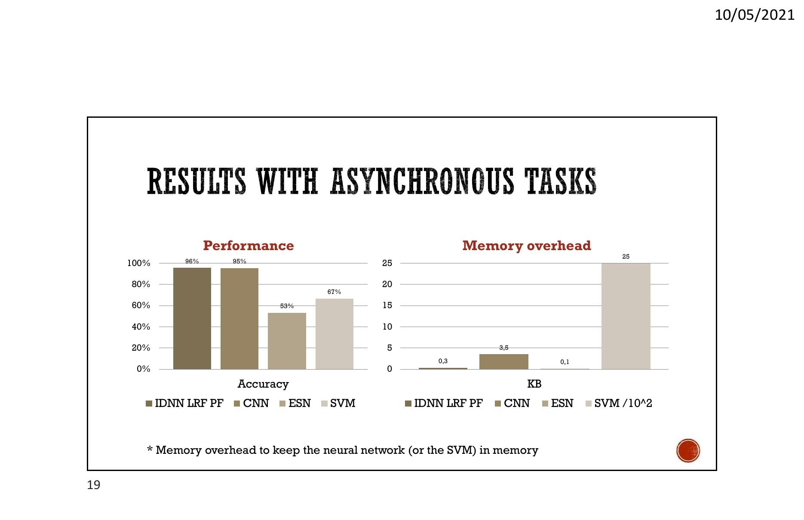
*Fig. — Confronto tra modelli per il task asincrono: accuratezza (sinistra) e overhead di memoria per mantenere il modello in RAM (destra). IDNN e CNN raggiungono ~95% di accuratezza, ma con overhead molto diverso.*

| Modello | Accuratezza | Overhead memoria |
|---------|------------|-----------------|
| IDNN LRF PF | ~96% | 0,3 KB |
| CNN | ~95% | 3,5 KB |
| ESN | ~67% | 0,1 KB |
| SVM | ~53% | 25 KB / 10² |

> [!tip] Trade-off chiave
>
> IDNN e CNN raggiungono la stessa accuratezza (~95%), ma IDNN richiede solo **0,3 KB** contro i **3,5 KB** di CNN. Su microcontrollori con pochi KB di RAM, questa differenza è determinante. L'SVM, nonostante la sua semplicità concettuale, ha un overhead di memoria molto alto a causa della necessità di memorizzare i vettori di supporto.

### Task sincrono (ESN)

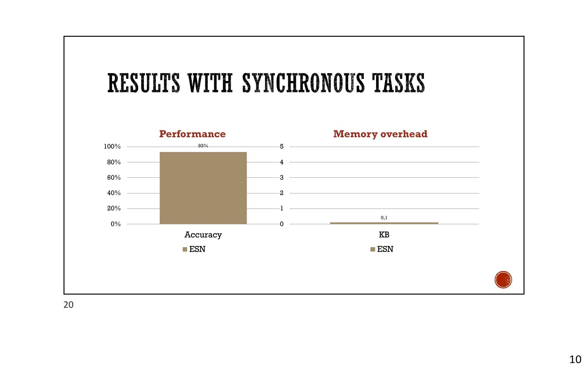
*Fig. — L'ESN nel task sincrono raggiunge il 93% di accuratezza con soli 0,1 KB di overhead — risultato notevole per un modello in streaming.*

Il task sincrono con ESN è la **prima applicazione di ESN per il riconoscimento di attività animali**. Il modello raggiunge il 93% di accuratezza con un overhead di soli 0,1 KB, adatto a microcontrollori estremamente vincolati.

---

## Confronto cloud vs elaborazione locale

La tabella seguente mostra il risparmio ottenibile spostando l'elaborazione on-device rispetto all'approccio cloud-based tradizionale (su un periodo di 4 mesi):

| | Elaborazione cloud | Elaborazione locale |
|---|---|---|
| Posizione GPS trasmessa | ogni mezz'ora (46 KB totali) | solo quando rilevato scavo (poche volte) |
| Dati accelerometro | 13 MB (4 mesi a 1 Hz) | max 3 KB (una finestra temporale) |
| Analisi | off-line dopo recupero | in tempo reale sul dispositivo |
| Invasività | alta (recupero fisico) | bassa (trasmissione radio rara) |

> [!abstract] Sintesi del risparmio
>
> L'approccio locale riduce il dato memorizzato da **13 MB a 3 KB** per l'accelerometro, e limita le trasmissioni GPS a **poche eventi** in 4 mesi invece di una ogni 30 minuti. Questo si traduce direttamente in una durata della batteria molto più lunga e in un'invasività drasticamente ridotta.

---

## Strutture dati in memoria

Il dispositivo utilizza due strutture dati:

1. **Struttura per il modello**: memorizza i pesi della rete neurale o i vettori di supporto dell'SVM (0,1–3,5 KB a seconda del modello).
2. **Struttura per i campioni**: memorizza al massimo una finestra di **300 campioni** (nel caso peggiore), ovvero circa 3 KB a 10 bit per campione. Con ESN, la finestra utile è di soli 90 campioni.

```{=latex}
\newpage
```

# Network Function Virtualization

La **Network Function Virtualization** (NFV) rappresenta uno dei cambiamenti di paradigma più significativi nell'ingegneria delle reti degli ultimi anni. L'idea fondamentale è semplice ma rivoluzionaria: spostare le funzioni di rete — firewall, bilanciatori di carico, gateway — dall'hardware proprietario dedicato a software eseguito su infrastruttura virtualizzata generica. Questa lezione ripercorre il problema che NFV risolve, i suoi benefici, la sua architettura e come i servizi di rete vengono effettivamente composti e distribuiti.

---

## Il problema: middlebox e rigidità hardware

### Un mondo di middlebox

Le reti tradizionali non sono composte solo da router e switch. Accanto a questi elementi "trasparenti" proliferano i **middlebox**: dispositivi che eseguono funzioni di elaborazione avanzata oltre al semplice inoltro dei pacchetti. Firewall, sistemi di rilevamento delle intrusioni (NIDS), media gateway, load balancer, proxy, VPN gateway, WAN optimizer — in una grande impresa con oltre 80.000 utenti su decine di siti, questi apparati possono essere addirittura più numerosi dei router tradizionali.

> [!example] Dati da una grande enterprise (Sekar et al., 2011)
>
> | Tipo di apparato | Numero |
> |---|---|
> | Firewall | 166 |
> | NIDS | 127 |
> | Media gateway | 110 |
> | Load balancer | 67 |
> | Proxy | 66 |
> | VPN gateway | 45 |
> | WAN Optimizer | 44 |
> | **Totale middlebox** | **636** |
> | Totale router | ~900 |
>
> I middlebox sono quasi pari in numero ai router: la rete è molto più di semplice forwarding.

### Il modello tradizionale e i suoi limiti

Nell'industria delle telecomunicazioni tradizionale, ogni funzione di rete corrisponde a un **apparato hardware proprietario** dedicato. Il firewall è un box fisico, il load balancer è un altro box fisico, e così via. Questo modello impone vincoli severi:

- Le funzioni devono essere concatenate in un ordine preciso, riflesso nella topologia fisica della rete (es. il traffico deve passare prima per il firewall e poi per il load balancer — non si può cambiare senza ricablare).
- I fornitori devono garantire alti standard di qualità, performance e conformità ai protocolli, con cicli di sviluppo prodotto molto lunghi.
- Il risultato è una **scarsa agilità**: aggiungere una nuova funzione o scalare una esistente richiede acquisto di nuovo hardware, deployment manuale e formazione del personale.

Contemporaneamente, gli utenti richiedono servizi sempre più diversificati e di breve durata. Ogni nuovo servizio richiede nuovo hardware, deployment manuale e nuove competenze. Le reti diventano complesse, difficili da scalare e costose da operare: i costi **CAPEX** (*Capital Expenditure*, l'investimento in hardware e infrastruttura fisica) e **OPEX** (*Operational Expenditure*, i costi operativi di energia, manutenzione e personale) crescono, ma i ricavi no.

> [!warning] Il nodo del problema
>
> Il modello hardware-based è per natura *lento e rigido*. I provider di servizi Internet (Google, Amazon, Facebook) hanno invece dimostrato che un approccio *software-based* è *veloce e flessibile*. NFV nasce dalla volontà di portare questo modello software dentro le reti di telecomunicazione.

---

## NFV: l'idea fondamentale

Nel 2012, i principali operatori globali (AT&T, Telefónica, Verizon e altri) avviarono un'iniziativa presso **ETSI** (European Telecommunications Standards Institute), dando vita all'Industry Specification Group for NFV. L'obiettivo: trasformare le reti attraverso la virtualizzazione.

### Decoupling tra funzioni e hardware

Il principio cardine di NFV è il **disaccoppiamento** (*decoupling*) tra le funzioni di rete e l'hardware su cui girano. Le funzioni non sono più implementate in appliance fisiche dedicate, ma come **software** eseguito su infrastruttura virtualizzata standard (macchine virtuali o container su server COTS — *Commercial Off-The-Shelf*).

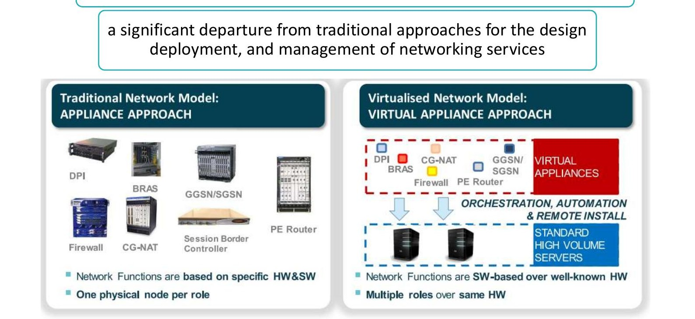
*Fig. — A sinistra, il modello tradizionale: ogni funzione (DPI, Firewall, BRAS, CG-NAT...) richiede HW specifico e un solo ruolo per nodo. A destra, il modello NFV: le stesse funzioni girano come software su server standard ad alto volume, orchestrate in modo automatico e remoto.*

Nel modello tradizionale le funzioni di rete sono basate su HW e SW proprietari, con un nodo fisico per ogni ruolo. Nel modello NFV le funzioni sono implementate in software su hardware commodity, e più ruoli possono coesistere sullo stesso server fisico.

---

## Vantaggi di NFV

NFV introduce tre famiglie di benefici fondamentali:

**Flessibilità**: le funzioni possono essere deployate ovunque nell'infrastruttura e spostate dinamicamente in base alle esigenze, grazie all'allocazione flessibile delle risorse hardware condivise (*hardware pool*).

**Scalabilità ed efficienza**: la capacità dedicata a ciascuna funzione può essere modificata dinamicamente (*scaling up/down*) in base al carico effettivo, migliorando l'utilizzo delle risorse. Non è più necessario acquistare hardware ridondante per gestire i picchi: si alloca più capacità software quando serve e la si riduce quando non serve.

**Innovazione accelerata**: il ciclo di sviluppo di un nuovo servizio di rete si accorcia drasticamente, perché non richiede procurement hardware ma soltanto deployment software.

> [!note] NFV introduce anche nuove sfide
>
> La virtualizzazione porta con sé problemi nuovi: gestione del ciclo di vita delle funzioni, orchestrazione, performance (overhead della virtualizzazione), sicurezza dell'infrastruttura condivisa, e il complesso problema del *placement* delle funzioni virtualizzate.

---

## Da funzioni di rete a servizi di rete

### Composizione di funzioni

Una singola funzione (es. un firewall) non è sufficiente a realizzare un servizio reale. I servizi richiedono la **composizione di più funzioni** applicate in sequenza al traffico. In un servizio tipico, un utente che accede a Internet deve attraversare: firewall → antivirus → video optimizer → parental control. Sequenze diverse possono applicarsi a traffici diversi.

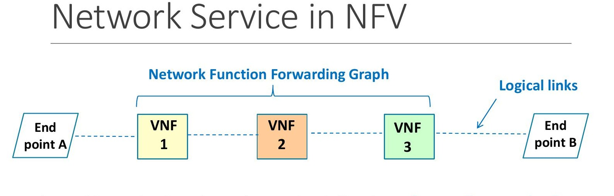
*Fig. — Un servizio di rete minimo: il traffico dell'utente attraversa in sequenza Firewall, NAT e Load Balancer prima di raggiungere il Web Service.*

In un'infrastruttura reale, non tutto il traffico segue la stessa catena: il servizio non è una pipeline fissa ma una composizione flessibile di funzioni, dipendente dai requisiti del flusso. Questo pone la domanda: come modificare le rotte per applicare trattamenti differenziati a flussi diversi? La risposta è [[Software Defined Networking]] (SDN), che fornisce il piano di controllo per il service chaining.

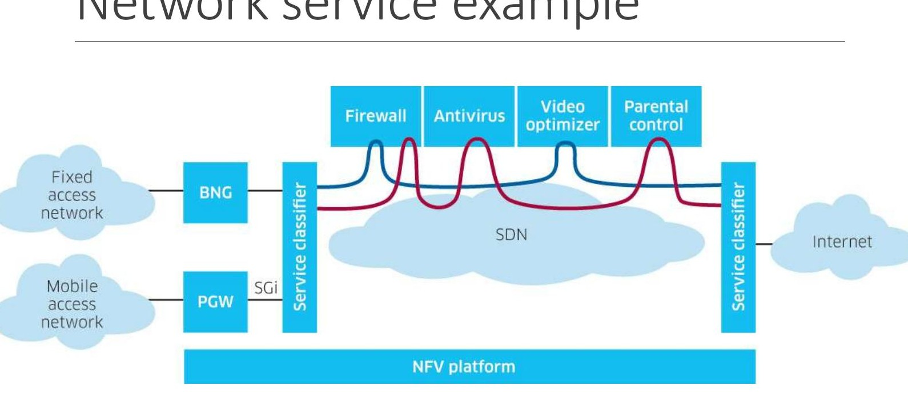
*Fig. — Le reti fissa e mobile convergono su una piattaforma NFV. Un service classifier instrada il traffico attraverso funzioni diverse (Firewall, Antivirus, Video optimizer, Parental control) via SDN, prima di raggiungere Internet.*

### Network Function Forwarding Graph (NF-FG)

In NFV, un servizio di rete end-to-end è formalizzato come un **grafo di forwarding** di funzioni di rete e punti terminali. Questo è ciò che un operatore fornisce ai propri clienti.


*Fig. — Un servizio end-to-end è un grafo: l'endpoint A è connesso all'endpoint B attraverso VNF 1, VNF 2 e VNF 3 via link logici.*

> [!definition] VNF — Virtualized Network Function
>
> Una **Virtualized Network Function** (VNF) è l'implementazione software di una funzione di rete tradizionalmente realizzata in hardware dedicato (firewall, load balancer, NAT, ecc.), eseguita su risorse virtualizzate (VM o container).

La separazione fondamentale introdotta da NF-FG è tra:
- la **definizione logica del servizio**: il grafo descrive quali funzioni servono e come sono connesse (link logici)
- il **deployment fisico**: i link logici sono supportati da percorsi fisici attraverso reti di infrastruttura distinte

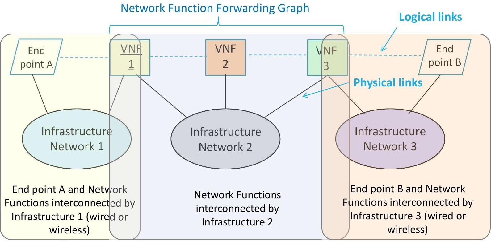
*Fig. — Il grafo logico del servizio (VNF 1, VNF 2, VNF 3 con link tratteggiati) è mappato su tre reti di infrastruttura fisiche distinte. La separazione logico/fisico è il principio chiave.*

### VNF-FG nidificati e PoP

Le VNF girano su nodi fisici chiamati **PoP** (*Points of Presence*). I grafi di forwarding possono essere nidificati: un VNF-FG può essere costruito componendo altri VNF-FG (esempio: VNF-FG-2 composto da VNF-2A, VNF-2B e VNF-2C), consentendo la definizione di servizi gerarchici e riutilizzabili.

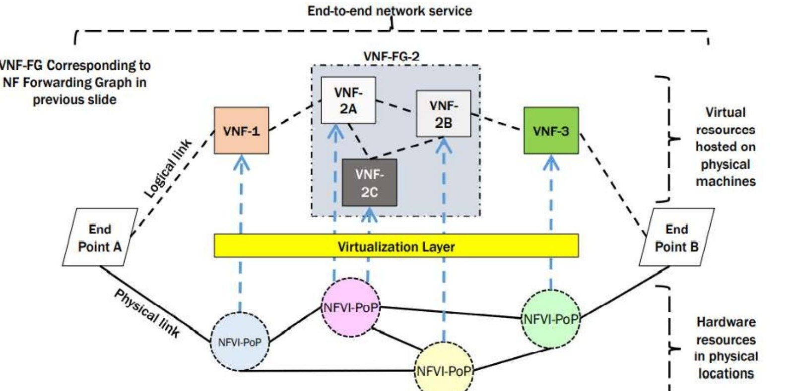
*Fig. — Il servizio end-to-end (tra End Point A e B) è un VNF-FG composto da VNF-1, dal sotto-grafo VNF-FG-2 (con VNF-2A, VNF-2B, VNF-2C) e VNF-3. Le VNF girano su PoP fisici (NFVI-PoP) tramite un livello di virtualizzazione.*

---

## Il problema del VNF Placement

Dato un servizio di rete composto da più VNF, occorre decidere **dove deployare ciascuna funzione** nell'infrastruttura fisica. Questo è il problema del *VNF chain placement*, uno dei problemi di ottimizzazione centrali in NFV.

Gli obiettivi di ottimizzazione tipici sono:
- minimizzare la latenza end-to-end
- minimizzare i costi di deployment
- massimizzare la banda residua
- risparmiare energia

Soggetti ai vincoli di:
- capacità computazionale dei nodi
- banda disponibile sui link
- requisiti di QoS (latenza massima, banda minima)

> [!tip] VNF placement e 5G Network Slicing
>
> Il VNF placement è particolarmente rilevante nel contesto del [[5G]] e del **network slicing**: ogni slice deve avere una catena di VNF dedicata con garanzie di isolamento e QoS. L'orchestratore deve risolvere il problema di placement per ogni slice contemporaneamente, spesso con obiettivi conflittuali.

Gli approcci risolutivi spaziano dalla **programmazione matematica** (ILP, MILP) alle **euristiche** e **metaeuristiche** (Algoritmi Genetici), fino al **Deep Reinforcement Learning** per scenari dinamici.

### Nuove sfide: hardware programmabile

Le VNF possono essere deployate non solo su server, ma anche su **dispositivi di rete programmabili**, ciascuno con un profilo prestazionale diverso:

| Dispositivo | Latenza per pacchetto | Caratteristiche |
|---|---|---|
| Programmable switch | 1–2 µs | Velocissimo, ma memoria e flessibilità limitate |
| Server (COTS) | 1–10 µs | Flessibile, ma più lento |
| SmartNIC | 10–100+ µs | Soluzione intermedia |

La scelta del dispositivo su cui deployare ciascuna VNF aggiunge una dimensione ulteriore al problema di placement.

---

## L'architettura NFV

L'architettura di riferimento NFV, standardizzata da ETSI, è organizzata in tre blocchi principali: l'**infrastruttura** (NFVI), le **funzioni virtualizzate** (VNF) e il **sistema di gestione e orchestrazione** (NFV-MANO).

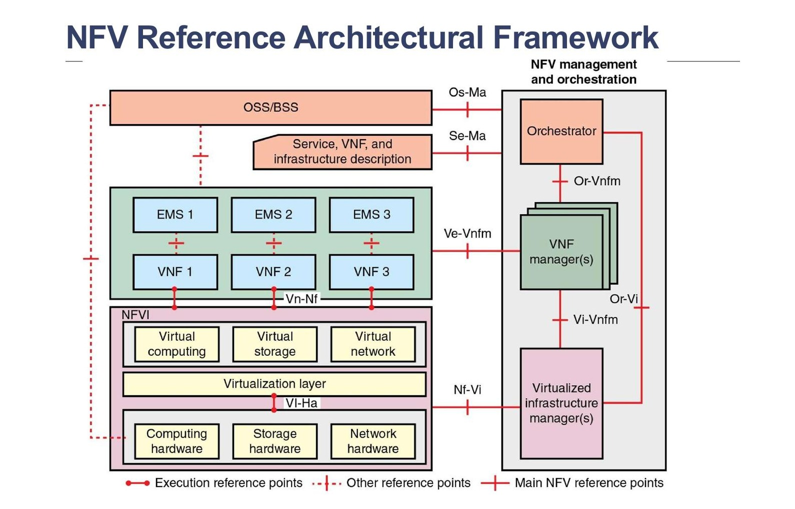
*Fig. — Il framework architetturale di riferimento NFV secondo ETSI/Stallings. Le frecce indicano i reference point: Or-Vi, Or-Vnfm, Ve-Vnfm, Vi-Vnfm, Nf-Vi, Se-Ma, Os-Ma.*

### NFV Infrastructure (NFVI)

L'**NFVI** è la totalità delle risorse hardware e software che costituiscono l'ambiente di esecuzione delle VNF. Virtualizza risorse fisiche di computing, storage e networking raggruppandole in *resource pool*.

È composta da tre domini:

- **Compute domain**: fornisce server COTS ad alto volume e storage.
- **Hypervisor domain**: media le risorse del compute domain alle VM (o container) delle VNF, fornendo un'astrazione dell'hardware. Oggi le VNF sono spesso eseguite in container → **Cloud Native Functions (CNF)**.
- **Infrastructure network domain**: switch generici ad alto volume interconnessi in una rete configurabile per erogare servizi di rete.

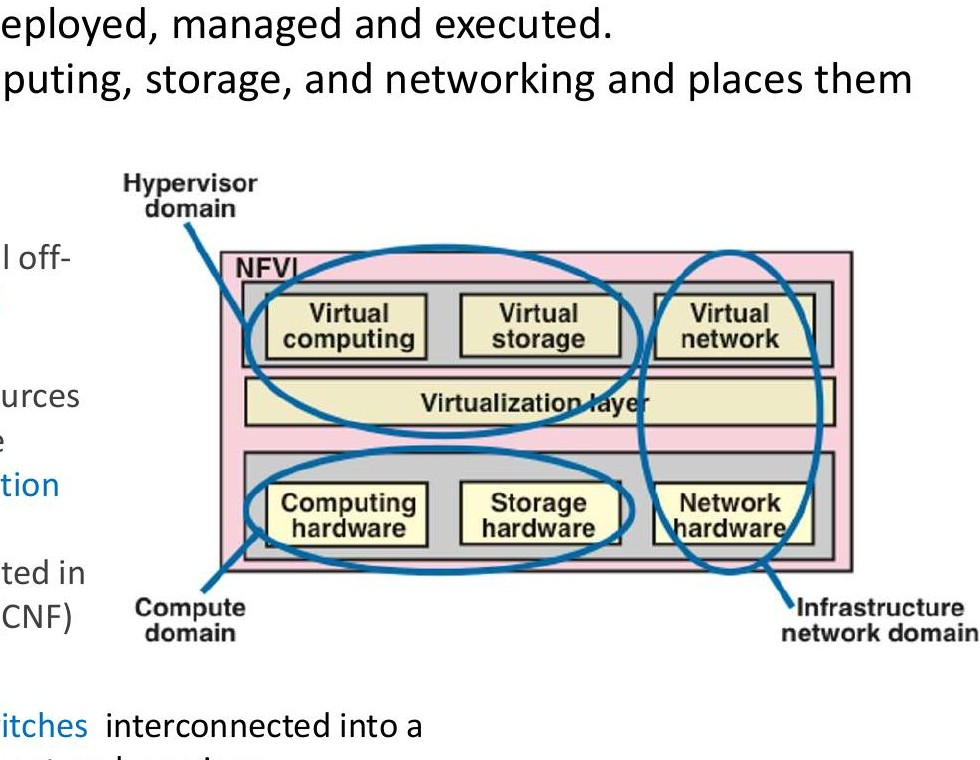
*Fig. — L'NFVI si stratifica in tre livelli: hardware fisico (compute, storage, network hardware), virtualizzazione (hypervisor/virtualization layer) e risorse virtuali (virtual computing, storage, network).*

L'NFVI può distribuirsi su più **NFVI-PoP** (*Network Function Virtualization Infrastructure Point of Presence*): posizioni fisiche dove sono deployate le risorse di infrastruttura NFV. Due tipi di rete interconnettono i PoP:
- **NFVI-PoP network**: connette le risorse all'interno di un PoP.
- **Transport network**: interconnette i vari NFVI-PoP tra loro e verso l'esterno.

#### vSwitch

All'interno di un PoP, le VM sono collegate a interfacce virtuali (**VIF**). Un **virtual switch** (vSwitch) è un programma software che emula uno switch di livello 2, fornendo connettività tra le VIF e le interfacce fisiche (PIF), oltre a gestire il traffico tra VIF sullo stesso host fisico. L'esempio più noto è **Open vSwitch** (OVS), che supporta OpenFlow e può integrarsi con switch fisici.

#### Opzioni di virtualizzazione

Le VNF possono essere eseguite in **macchine virtuali** (VM) o in **container**. La differenza fondamentale:

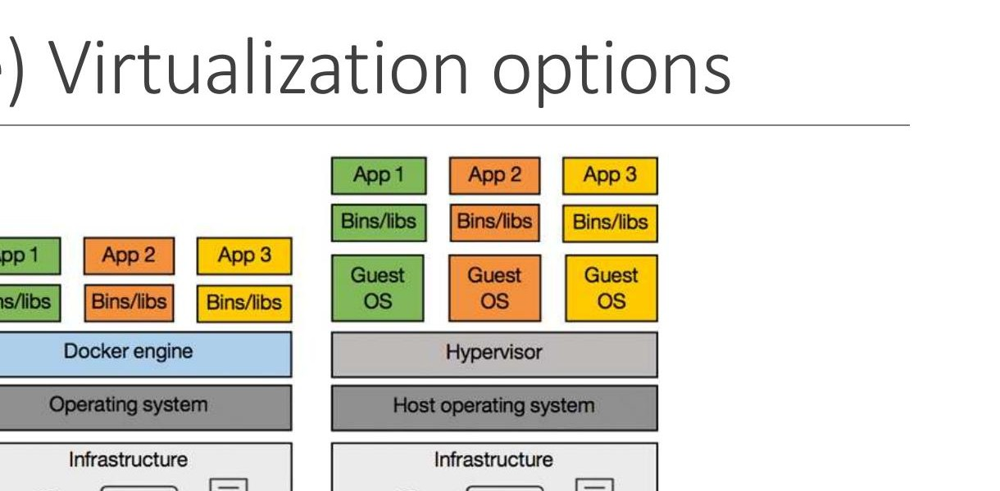
*Fig. — A sinistra i container: condividono il kernel dell'host, isolati in userspace tramite Docker engine. A destra le VM: includono un guest OS completo sopra l'hypervisor.*

> [!definition] Container vs VM
>
> I **container** includono l'applicazione e le sue dipendenze ma condividono il kernel dell'host OS, girando come processi isolati in userspace. Le **VM** includono invece l'applicazione, le librerie necessarie e un intero guest OS, con un overhead maggiore ma un isolamento più forte.

### NFV Management and Orchestration (NFV-MANO)

Il **MANO** è il framework che gestisce e orchestra tutte le risorse nell'ambiente NFV. Comprende:

#### NFV Orchestrator (NFVO)

Responsabile di installare e configurare nuovi **Network Service (NS)** e pacchetti VNF, gestire il ciclo di vita dei servizi di rete e le risorse globali. Opera su due piani:
- **Network services orchestration**: gestisce/coordina la creazione di servizi end-to-end tra VNF diverse, può istanziare nuovi VNFM.
- Esempi di implementazioni open source: **OSM MANO** (ETSI) e **ONAP** (Linux Foundation).

#### VNF Manager (VNFM)

Gestisce il **ciclo di vita delle istanze VNF**:
- istanziazione (con configurazione iniziale se richiesta dal deployment template)
- scaling out/in e up/down
- raccolta di misure di performance dell'NFVI e correlazione con eventi/fault VNF
- healing automatico o assistito
- terminazione dell'istanza

#### Virtualized Infrastructure Manager (VIM)

Il **VIM** controlla e gestisce l'interazione delle VNF con le risorse fisiche (computing, storage, network) e la loro virtualizzazione, tipicamente all'interno del dominio infrastrutturale di un singolo operatore. Piattaforme IaaS come **OpenStack** fungono da VIM. Un MANO può orchestrare più VIM.

### Repository MANO

Il sistema MANO utilizza quattro repository:

| Repository | Contenuto |
|---|---|
| **Network services catalog** | Template di deployment dei network service in termini di VNF e virtual link |
| **VNF catalog** | VNF Descriptor (VNFD): descrive deployment e behavior di ogni VNF |
| **NFVI resources** | Lista delle risorse NFVI utilizzate per i servizi NFV attivi |
| **NFV instances** | Dettagli sulle istanze di network service e VNF in esecuzione |

---

## Network Service Descriptor: un esempio

Il deployment di un network service è descritto tramite un **Network Service Descriptor (NSD)**, un documento strutturato (tipicamente JSON/YAML) che specifica la composizione del servizio.

> [!example] NSD per un servizio iperf (client-server)
>
> ```json
> {
>   "name": "iperf-NSD",
>   "vendor": "fokus",
>   "version": "0.1-ALPHA",
>   "vnfd": [ ... ],
>   "vld": [ { "name": "private" } ],
>   "vnf_dependency": [
>     {
>       "source": { "name": "iperf-server" },
>       "target": { "name": "iperf-client" },
>       "parameters": ["private"]
>     }
>   ]
> }
> ```
>
> | Campo | Significato |
> |---|---|
> | `name` | Nome del Network Service |
> | `vendor` | Provider del servizio |
> | `vnfd` | Lista delle VNF che compongono il servizio |
> | `vld` | Virtual Link: connettività tra VNF |
> | `vnf_dependency` | Dipendenza tra VNF: l'iperf-server deve fornire il proprio IP all'iperf-client |

Il VNFD per ogni VNF specifica: immagine VM, risorse (flavour), virtual link, lifecycle events (script da eseguire all'istanziazione: `install.sh`, `start-srv.sh`) e configurazione.

---

## Casi d'uso

NFV è applicabile sia alle funzioni del **piano dati** che a quelle del **piano di controllo** nelle reti mobili e fisse:

- **Traffic analysis**: DPI (*Deep Packet Inspection*), misurazione QoE
- **Application-level optimization**: cache server, load balancer, application accelerator
- **Sicurezza**: firewall, virus scanner, IDS, spam protection, gateway IPsec/SSL VPN
- **Nodi di rete mobile**: HLR/HSS, MME, SGSN, PDN-GW, eNodeB (sia il core EPC che la RAN possono essere in larga parte virtualizzati)
- **Infrastruttura di rete**: broadband gateway, CG-NAT, router
- **Edge & Home**: home router, set-top box
- **Controllo & Gestione**: AAA server, policy control, sistemi di charging

---

## Sintesi

> [!abstract] NFV in sintesi
>
> Nelle reti tradizionali, ogni dispositivo è deployato su piattaforme proprietarie/chiuse. Gli elementi di rete sono box chiusi, l'hardware non può essere condiviso, e ogni device richiede hardware aggiuntivo per aumentare la capacità — hardware che rimane inattivo quando il sistema è sotto carico.
>
> Con NFV, gli elementi di rete sono **applicazioni indipendenti** deployate in modo flessibile su una piattaforma unificata di server standard, storage e switch commodity. Software e hardware sono disaccoppiati, e la capacità per ogni applicazione viene aumentata o ridotta aggiungendo o riducendo risorse virtuali.
>
> I benefici principali: **flessibilità**, **innovazione più rapida**, possibilità di **scalare i servizi rapidamente** su/giù secondo le necessità.

```{=latex}
\newpage
```

# Lezione 21 — (Lab) Network Emulator con ComNetsEmu

## Laboratorio: Network Emulator con ComNetsEmu

Questa lezione di laboratorio introduce **ComNetsEmu**, un emulatore di reti progettato per sperimentare ambienti [[SDN]] ([[Software-Defined Networking]]) e [[NFV]] ([[Network Function Virtualization]]) su un singolo computer. Prima di avviare gli esperimenti è necessario installare e configurare l'ambiente: questa guida accompagna passo per passo dall'installazione fino all'esecuzione del primo esempio funzionante.

---

### Cos'è ComNetsEmu

**ComNetsEmu** è un ambiente software-based progettato come *testbed* e emulatore di reti, sviluppato da TU Dresden e Università di Trento come progetto open source. Il suo obiettivo principale è rendere possibile l'emulazione di scenari significativi di SDN e NFV su un singolo laptop, abbassando la barriera di accesso alla sperimentazione su reti programmatiche.

> [!info] Caratteristiche chiave
>
> - **Semplicità**: setup leggero, rapido e automatizzato
> - **Riproducibilità e condivisibilità**: usa template human-friendly (Vagrantfile)
> - **Tecnologie state-of-the-art senza complessità aggiuntiva**: permette di testare concetti avanzati in modo accessibile
> - **Estensibilità**: progettato per essere ampliato con nuovi esempi e applicazioni

ComNetsEmu è costruito come un'estensione di **Mininet**, il popolare emulatore di reti per Linux, al quale aggiunge il supporto per container Docker come unità di elaborazione virtuali. La combinazione di Mininet (per l'emulazione del piano dati) e Docker (come soluzione NFVI) in un unico framework integrato è il tratto distintivo di ComNetsEmu.

---

### Fondamenti: Mininet

Prima di installare ComNetsEmu è utile capire come funziona Mininet, su cui si basa.

**Mininet** è un emulatore di rete che fa girare un insieme di host, switch, router e link su un singolo kernel Linux. Utilizza la virtualizzazione leggera per fare sembrare una macchina singola come una rete completa. Supporta [[OpenFlow]] per l'emulazione di reti SDN.


*Fig. — Il sito ufficiale di Mininet (http://mininet.org/) con la sua documentazione, walkthrough e API di riferimento.*

#### Come funziona internamente Mininet

Gli host di Mininet sono **processi** che condividono lo stesso kernel OS, gli stessi PID e file system. Ogni host ha però uno stack di rete **indipendente**, realizzato tramite i *network namespace* di Linux.

> [!definition] Network Namespace
>
> Un *network namespace* fornisce uno stack di rete isolato. I processi al suo interno hanno il proprio set di risorse di rete: interfacce virtuali, tabelle ARP, tabelle di routing. Un nodo virtuale di rete è semplicemente una shell in un network namespace.

#### Topologie in Mininet

Una topologia Mininet è composta da entità come `Host`, `Switch`, `Controller` e `Link`. È possibile creare topologie custom tramite script Python estendendo la classe `mininet.topo.Topo` e sovrascrivendo il metodo `build()`.

Il comando più semplice per avviare Mininet con una topologia di default è:

```bash
sudo mn
```

Questo inizializza una topologia predefinita e lancia la CLI interattiva.

##### Esempio: SimpleSwitchTopology

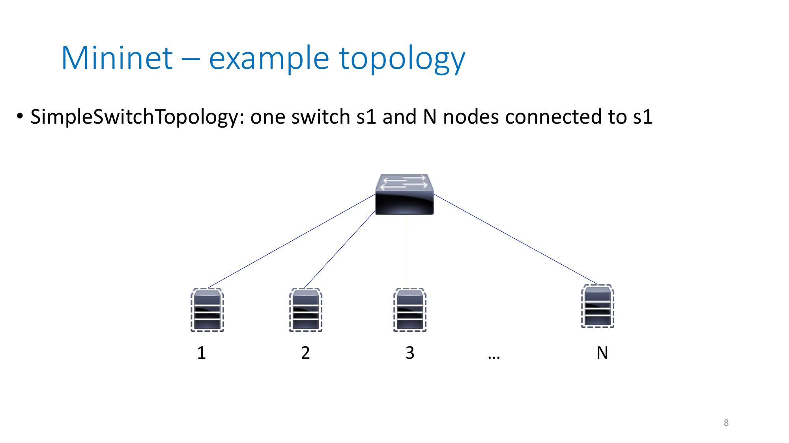
*Fig. — SimpleSwitchTopology: uno switch centrale connesso a N host tramite link individuali.*

> [!tip] Principali classi e metodi Mininet
>
> - `Topo.addSwitch()` — aggiunge uno switch alla topologia
> - `Topo.addHost()` — aggiunge un host alla topologia
> - `Topo.addLink()` — aggiunge un link bidirezionale
> - `Mininet.start()` / `Mininet.stop()` — avvia/ferma la rete
> - `Mininet.pingAll()` — testa la connettività fra tutti i nodi
> - Documentazione API: http://mininet.org/api/annotated.html

#### CLI di Mininet

La **CLI** di Mininet è uno strumento interattivo molto utile durante gli esperimenti. Si invoca passando l'oggetto rete al costruttore `CLI(net)`. I comandi principali sono:

```
mininet> net             # mostra la topologia
mininet> pingall         # testa la connettività tra tutti i nodi
mininet> h1 ping h2      # ping da h1 verso h2
mininet> h1 ip a         # mostra le interfacce di h1
mininet> iperf h1 h2     # misura il throughput tra h1 e h2
mininet> links           # mostra tutti i link attivi
mininet> h1 ip link show type veth   # mostra le interfacce veth di h1
mininet> sh ovs-vsctl show           # mostra la configurazione del virtual switch
```

#### Veth pairs e piano dati

Ogni host Mininet può avere un'interfaccia Ethernet virtuale chiamata **veth** (*Virtual Ethernet Device*). I dispositivi veth vengono sempre creati in coppie interconnesse: i pacchetti trasmessi su un'interfaccia sono immediatamente ricevuti dall'altra. Si può pensare a un veth come a un cavo Ethernet reale che collega due dispositivi.

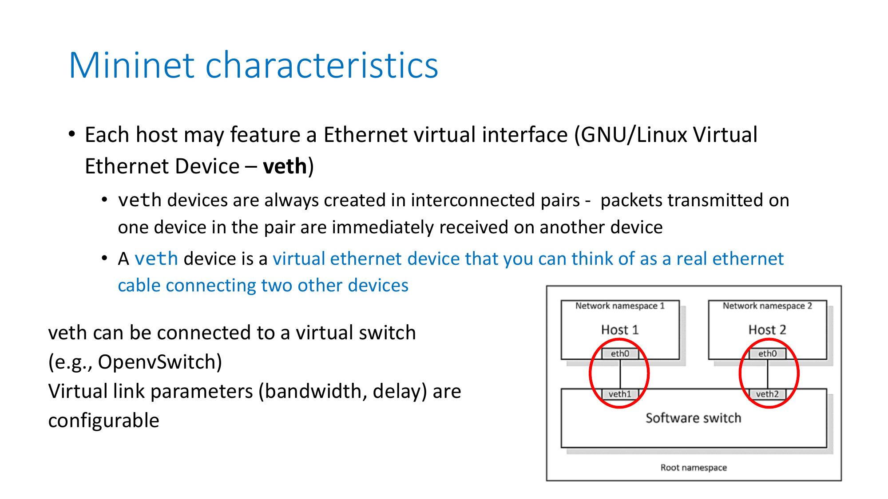
*Fig. — Architettura delle veth pairs: Host 1 e Host 2 hanno ciascuno il proprio network namespace con interfacce veth collegate tramite un software switch nel Root Namespace.*

Le coppie veth possono essere connesse a un virtual switch (ad esempio **OpenvSwitch**). I parametri del link virtuale come bandwidth e delay sono configurabili.

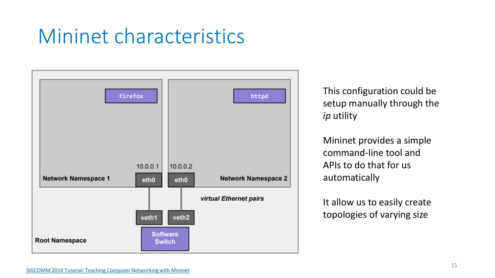
*Fig. — Il piano dati di Mininet: due namespace separati collegati tramite virtual Ethernet pairs e un Software Switch nel Root Namespace. Mininet gestisce automaticamente questa configurazione al posto dell'utility `ip`.*

##### Linux Traffic Control (tc)

Mininet usa `tc` (*traffic control*) per configurare le caratteristiche dei link virtuali:

```bash
## Aggiunge 100ms di delay + jitter di ±10ms sull'interfaccia eth0
tc qdisc add dev eth0 root netem delay 100ms 10ms

## Da dentro Mininet, su h1:
h1 tc qdisc add dev h1-eth0 root netem delay 100ms 10ms
h1 tc qdisc show dev h1-eth0
h1 tc qdisc del dev h1-eth0 root
```

---

### Architettura di ComNetsEmu

ComNetsEmu estende Mininet sostituendo il tipo di host di default con **container Docker**. Questo approccio si chiama *Docker-in-Docker* (o *sibling containers*): si ha un `DockerHost` con container Docker interni che emulano host fisici che eseguono applicazioni containerizzate.

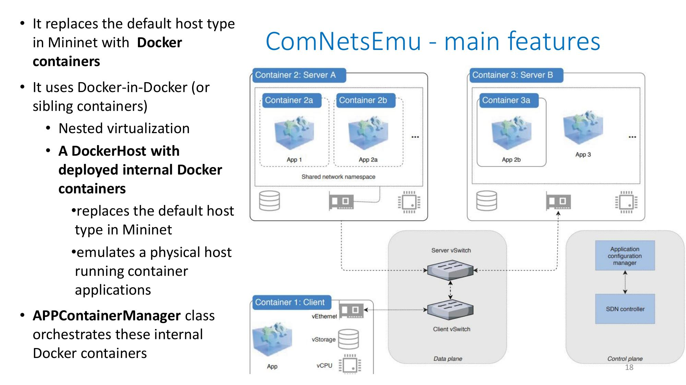
*Fig. — Architettura ComNetsEmu: i container rappresentano applicazioni su host virtuali; il piano dati è gestito da virtual switch; il control plane è affidato a un SDN controller.*

La classe `APPContainerManager` orchestra i container Docker interni. Ogni `DockerHost` rimpiazza il tipo host di Mininet ed emula un host fisico che gira applicazioni containerizzate.

#### Struttura del repository

| Cartella/File | Contenuto |
|---|---|
| `comnetsemu/` | Modulo Python che estende Mininet |
| `examples/` | Esempi per iniziare con le API ComNetsEmu |
| `app/` | Esempi di network slicing, SDN, ecc. |
| `util/` | Script per la gestione dell'ambiente |
| `test_containers/` | Dockerfile per i programmi di esempio |
| `Vagrantfile` | File Vagrant per il setup della VM |

---

### Setup dell'ambiente

> [!warning] Prerequisiti da installare prima del laboratorio
>
> L'installazione richiede circa **15 minuti** la prima volta. Completala prima della lezione di laboratorio.

#### Dipendenze

ComNetsEmu viene eseguito in una VM gestita da **Vagrant**. Le dipendenze da installare sul proprio sistema host sono:

- **Vagrant** >= v2.2.5 — https://developer.hashicorp.com/vagrant/downloads
- **VirtualBox** >= v6.0 — https://www.virtualbox.org/wiki/Downloads

Una volta avviata la VM, al suo interno saranno già presenti:
- Mininet + OpenVswitch + Wireshark
- Ryu SDN controller
- Docker Engine

#### Installazione su Linux e Windows

Segui le istruzioni ufficiali:
https://stevelorenz.github.io/comnetsemu/installation.html#option-1-install-in-a-vagrant-managed-vm-highly-recommended

```bash
cd ~
git clone https://git.comnets.net/public-repo/comnetsemu.git
cd ./comnetsemu
```

Prima di avviare la VM, è necessario modificare un Dockerfile.

#### Modifica obbligatoria: Dockerfile.dev_test

> [!warning] Passo critico — da non saltare
>
> Prima di eseguire `vagrant up`, devi modificare il file `Dockerfile.dev_test` aggiungendo `netcat` alle dipendenze. Senza questa modifica il client TCP dell'esempio non funzionerà.

```bash
cd test_containers
## Apri il file Dockerfile.dev_test e aggiungi la riga "netcat \\" come mostrato nell'immagine
```

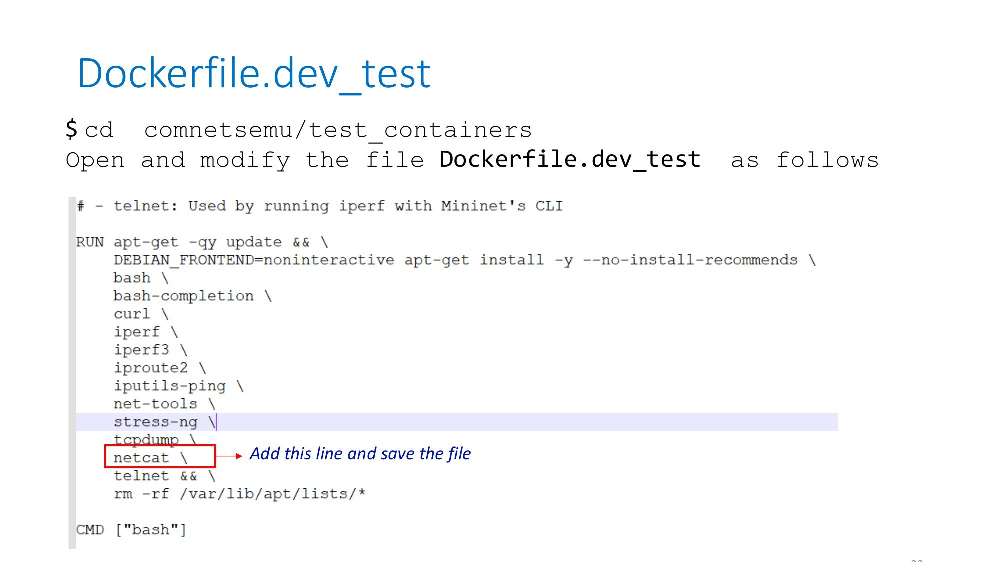
*Fig. — Il file `Dockerfile.dev_test`: aggiungere la riga `netcat \\` prima di `telnet \\` nella lista dei pacchetti da installare con `apt-get`.*

Il file modificato deve includere `netcat \` nella lista dei pacchetti `apt-get install`. Dopo la modifica, salva il file e torna nella directory principale.

#### Avvio della VM

```bash
cd ..
vagrant up comnetsemu
## Attendi circa 15 minuti la prima volta
```

Quando la VM è pronta, il banner di ComNetsEmu viene stampato a schermo. A quel punto:

```bash
## Accedi alla VM via SSH
vagrant ssh comnetsemu

## Quando hai finito, ferma la VM sul terminale locale
vagrant halt
```

#### Installazione su Mac

> [!note] Mac — Percorso alternativo con Multipass
>
> L'installazione con Vagrant potrebbe non funzionare su host Mac. In quel caso usa **Multipass**, un gestore di VM leggero sviluppato da Canonical.
> Segui le istruzioni al punto **B** di: https://www.granelli-lab.org/researches/relevant-projects/comnetsemu-labs

#### Installazione su Windows

Per host Windows, usa **MobaXterm** come console. Se l'apertura di xterm nell'emulatore non funziona:

```bash
## Salva la configurazione SSH in un file
vagrant ssh-config > vagrant-ssh

## Connettiti con forwarding X11 abilitato
ssh -F vagrant-ssh -Y comnetsemu

## Testa il forwarding X11
xeyes
## oppure
xterm
```

---

### Primo esempio: Echo Server

L'esempio `echo_server` mostra l'uso base dell'emulatore: due host emulati connessi tra loro tramite due switch, dove uno fa da client e l'altro ospita un server TCP che rimanda indietro ciò che riceve.

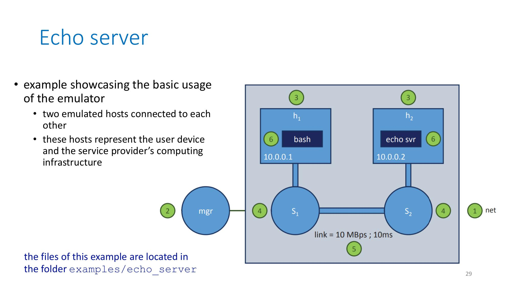
*Fig. — Topologia dell'echo server: `h1` (10.0.0.1) con container `bash` e `h2` (10.0.0.2) con container `echo_server`, collegati da due switch con link da 10 Mbps e 10ms di delay.*

#### Struttura del progetto

```bash
cd ~/comnetsemu/examples
mkdir echoMCPS
cd echoMCPS
```

Il progetto richiede quattro file:

| File | Scopo |
|---|---|
| `server.py` | Applicazione server TCP (echo) |
| `Dockerfile` | Containerizza l'applicazione server |
| `build_docker_image.sh` | Script per costruire l'immagine Docker |
| `topology.py` | Definisce la topologia ComNetsEmu |

#### File 1: server.py

Il server apre un socket TCP sulla porta 65000, accetta connessioni e rimanda indietro ogni segmento ricevuto (echo):

```python
import socket

## Crea un socket TCP/IP
sock = socket.socket(socket.AF_INET, socket.SOCK_STREAM)

## Bind sulla porta 65000 (su tutte le interfacce)
server_address = ("", 65000)
print("starting up on {} port {}".format(*server_address))
sock.bind(server_address)

## In ascolto per connessioni in ingresso
sock.listen(1)

while True:
    print("waiting for a connection")
    connection, client_address = sock.accept()
    try:
        print("connection from", client_address)
        while True:
            data = connection.recv(16)
            print("received {!r}".format(data))
            if data:
                print("sending data back to the client")
                connection.sendall(data)
            else:
                print("no data from", client_address)
                break
    finally:
        connection.close()
```

#### File 2: Dockerfile

```dockerfile
FROM python:3.6-alpine3.9
COPY ./server.py /home/server.py
CMD python /home/server.py
```

#### File 3: build_docker_image.sh

```bash
docker build -t echo_server --file ./Dockerfile .
```

Per costruire l'immagine:

```bash
bash build_docker_image.sh
```

#### File 4: topology.py

```python
from comnetsemu.net import Containernet, VNFManager
from comnetsemu.cli import spawnXtermDocker
from mininet.node import Controller
from mininet.link import TCLink
from mininet.log import info
from mininet.cli import CLI

net = Containernet(controller=Controller, link=TCLink, xterms=False)
mgr = VNFManager(net)

try:
    info("*** Add controller\n")
    net.addController("c0")

    info("*** Creating hosts\n")
    h1 = net.addDockerHost("h1", dimage="dev_test",
         ip="10.0.0.1", docker_args={"hostname": "h1"})
    h2 = net.addDockerHost("h2", dimage="dev_test",
         ip="10.0.0.2", docker_args={"hostname": "h2"})

    info("*** Adding switch and links\n")
    switch1 = net.addSwitch("s1")
    switch2 = net.addSwitch("s2")
    net.addLink(switch1, h1, bw=10, delay="10ms")
    net.addLink(switch1, switch2, bw=10, delay="10ms")
    net.addLink(switch2, h2, bw=10, delay="10ms")

    info("\n*** Starting network\n")
    net.start()

    # Avvia i container applicativi
    srv1 = mgr.addContainer("srv1", "h1", "dev_test", "bash", docker_args={})
    srv2 = mgr.addContainer("srv2", "h2", "echo_server",
           "python /home/server.py", docker_args={})

    # spawnXtermDocker("srv1")
    CLI(net)

finally:
    info("*** Cleanup\n")
    mgr.removeContainer("srv1")
    mgr.removeContainer("srv2")
    net.stop()
    mgr.stop()
```

> [!note] dev_test vs echo_server
>
> `h1` usa l'immagine `dev_test` (che ha bash e netcat) come client. `h2` usa `echo_server` (che ha solo Python e il server). Per questo non è possibile aprire un xterm su `srv2`: l'immagine non include bash.

#### Avvio dell'emulazione

```bash
sudo python3 topology.py
```

---

### Test dell'echo server

Una volta avviata la topologia, si apre un xterm sul container `srv1` (il client). Da lì è possibile eseguire i test.

#### Verifica connettività

```bash
h1:/# ip a                  # mostra le interfacce del container
h1:/# ping 10.0.0.2         # verifica che h2 sia raggiungibile
```

#### Test con netcat

**netcat** (`nc`) è uno strumento da riga di comando che legge e scrive dati attraverso la rete. Lo usiamo come client TCP:

```bash
h1:/# nc 10.0.0.2 65000
Hello server
Hello server        # il server rimanda indietro il messaggio
```

> [!tip] Come funziona
>
> `nc` si connette all'indirizzo IP 10.0.0.2 sulla porta TCP 65000, invia il testo digitato e stampa qualsiasi risposta ricevuta. Se tutto funziona correttamente, la parola "Hello server" comparirà due volte: una per l'input locale e una per l'echo del server.

#### Cattura del traffico

Per ispezionare il traffico TCP generato, si può usare `tcpdump` direttamente nel container:

```bash
## Trova il container_id (h1 o h2)
docker ps -a

## Accedi al container
docker exec -it <container_id> bash

## Cattura il traffico TCP
tcpdump tcp

#Comando d'oro per cancellare pod e pulire la memoria e rifar partire topology
  sudo mn -c && sudo docker rm -f $(sudo docker ps -aq) && sudo python3 topology.py
```

---

### Uscire e spegnere la VM

Quando hai finito con gli esperimenti:

```bash
## 1. Esci dalla CLI di Mininet
mininet> exit

## 2. Esci dalla VM (shell SSH)
$ exit

## 3. Ferma la VM sul terminale locale
$ vagrant halt
```

---

### Comandi Docker utili

Durante i laboratori è utile avere familiarità con i comandi base di Docker.

| Comando | Descrizione |
|---|---|
| `ip link list` | Mostra le interfacce di rete disponibili sull'host |
| `sudo lsns -t net` | Elenca i network namespace attivi |
| `sudo ip netns add <name>` | Crea un nuovo namespace |
| `ip netns list` | Elenca i namespace |
| `docker pull <image>` | Scarica un'immagine dal registry |
| `docker run -it -d <image>` | Crea ed avvia un container |
| `docker ps -a` | Elenca tutti i container (anche fermi) |
| `docker exec -it <id> bash` | Accede a un container in esecuzione |
| `docker stop <id>` | Ferma un container in esecuzione |
| `docker kill <id>` | Ferma immediatamente un container |
| `docker images` | Elenca tutte le immagini locali |
| `docker rm <id>` | Elimina un container fermo |
| `docker rmi <image-id>` | Elimina un'immagine locale |
| `docker build <path>` | Costruisce un'immagine da un Dockerfile |
| `docker commit <id> <name>` | Crea una nuova immagine da un container modificato |

```{=latex}
\newpage
```

# Multi-Access Edge Computing (MEC)

## Dal Cloud all'Edge

Il paradigma del **cloud computing** si basa sull'idea che le risorse computazionali possano essere fisicamente delocalizzate e connesse remotamente all'utente finale. L'**edge computing** estende questo paradigma portando le risorse elaborative ai margini della rete, fisicamente più vicine all'utente. Con l'edge computing, il traffico utente viene terminato in prossimità dell'utente stesso, creando un ambiente caratterizzato da latenza ridotta e throughput più elevato.

### Perché la latenza conta: la formula di Mathis

Per capire perché la vicinanza fisica all'utente sia importante, occorre capire come la latenza influenzi le prestazioni TCP. La **formula di Mathis** (1997) stabilisce che, per un tasso di perdita inferiore all'1%, il throughput massimo raggiungibile da una connessione TCP è limitato da:

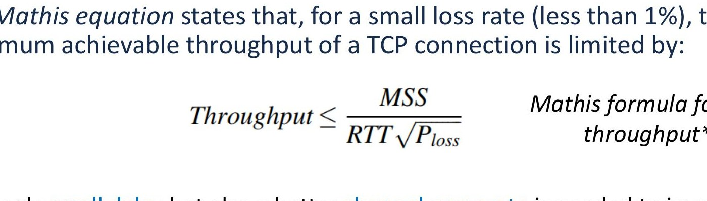
*Fig. — La formula di Mathis: il throughput TCP è inversamente proporzionale all'RTT e alla radice quadrata della probabilità di perdita.*

dove $MSS$ è la *Maximum Segment Size*, $RTT$ è il *Round-Trip Time* e $P_{loss}$ è la probabilità di perdita dei pacchetti. La formula mostra come il throughput TCP sia limitato da due fattori strettamente legati alla rete: non basta ridurre il ritardo, ma serve anche migliorare il tasso di errore del canale. Questo motiva l'adozione di meccanismi di **QoS** implementati come elaborazione del traffico all'edge, finalizzati a ridurre la perdita di pacchetti.

> [!tip] Intuizione chiave
>
> Portare il server vicino all'utente riduce l'RTT; terminare il traffico radio all'edge riduce anche $P_{loss}$. Entrambi i fattori si combinano per migliorare il throughput TCP in modo significativo.

### La latenza nella pratica: misurazioni reali

Un aspetto spesso controintuitivo è che la latenza end-to-end non è necessariamente proporzionale alla distanza geografica. Misurazioni effettuate in abitazioni distanti meno di 1 miglio quadrato mostrano differenze enormi di latenza, specialmente quando sono coinvolti ISP diversi.

I grafici CDF (Cumulative Distribution Function) illustrano il confronto tra *nearby cloudlet* (bordo della rete, scenario MEC) e *distant cloudlet* (cloud tradizionale) per tre diverse applicazioni:

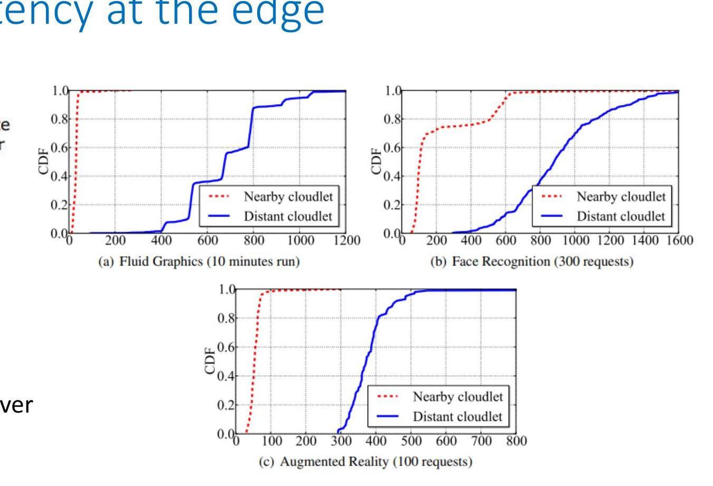
*Fig. — CDF del tempo di risposta per Fluid Graphics, Face Recognition e Augmented Reality: il cloudlet vicino (linea rossa tratteggiata) mostra latenze significativamente inferiori.*

> [!note] Evidenza empirica
>
> Il risultato chiave è che la latenza end-to-end dipende dall'infrastruttura di rete (numero di hop, ISP attraversati) molto più che dalla distanza fisica. Questo rende l'edge computing essenziale per applicazioni sensibili alla latenza.

---

## MEC: definizione e standard

**ETSI MEC** (*Multi-Access Edge Computing*) è il principale standard internazionale nell'area dell'edge computing. La definizione ufficiale ETSI recita:

> [!definition] Multi-Access Edge Computing (MEC)
>
> MEC offre a sviluppatori di applicazioni e provider di contenuti capacità di cloud computing e un ambiente di servizi IT al margine della rete.

Il termine **"multi-access"** indica che lo standard è agnostico rispetto alla tecnologia di accesso: è applicabile in linea di principio a reti 4G/5G, Wi-Fi o accesso fisso. Il "core business" dello standard ETSI MEC è la pubblicazione di **API standardizzate** che le applicazioni virtualizzate all'edge possono utilizzare per accedere a informazioni di rete.

### Standard di riferimento

Esistono due principali corpi di standardizzazione nel dominio dell'edge computing:

| Standard | Focus | Note |
|----------|-------|-------|
| **ETSI MEC** | Edge computing da prospettiva IT, access-agnostic | Definisce le API e le specifiche per piattaforme MEC |
| **3GPP** | Tecnologie radio e core network | Integra edge computing dal Release 15 (5G) in poi |

---

## Il concetto di "edge": dove si trova?

Il concetto di *edge* non è definito in modo rigido dallo standard ETSI, proprio per poter includere molte opzioni di deployment basate su requisiti diversi (costi, traffico, presenza di utenti, tariffe). L'edge può essere:

- **Base Station** (stazione radio base)
- **WiFi Access Point**
- **Data center** o micro-data center a uffici centrali, siti di aggregazione
- **Locali del cliente** (*customer premises*)

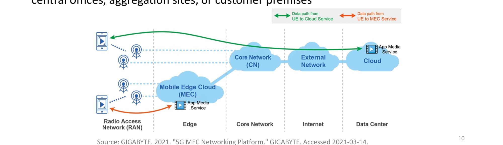
*Fig. — Confronto tra il percorso dati UE→Cloud (verde, attraverso core network, internet e data center) e UE→MEC Service (arancione, terminato al Mobile Edge Cloud). Fonte: GIGABYTE, 2021.*

---

## Benefici di MEC

I due abilitatori chiave forniti da MEC sono:

1. **Prossimità agli utenti finali**: riduzione della latenza end-to-end a livello del piano utente (UP – *User Plane*).
2. **Accesso alle informazioni radio locali** (piano di controllo, CP – *Control Plane*): permette di implementare meccanismi per migliorare il tasso di errore del canale.

A questi si aggiungono benefici supplementari:

- possibilità di eseguire elaborazioni locali sfruttando grandi quantità di dati locali (sensori, dispositivi);
- supporto al **task offloading** da dispositivi finali con capacità di elaborazione limitata;
- facilitazione delle garanzie di **sicurezza e privacy**, ad esempio anonimizzando informazioni personali all'edge e trasmettendo solo dati aggregati al cloud centrale.

---

## Scenari di servizio MEC

### Analisi di flussi video

Un caso d'uso emblematico è il sistema di monitoraggio video con algoritmi di riconoscimento immagini, ad esempio per il riconoscimento di targhe o il controllo degli accessi in aree urbane.

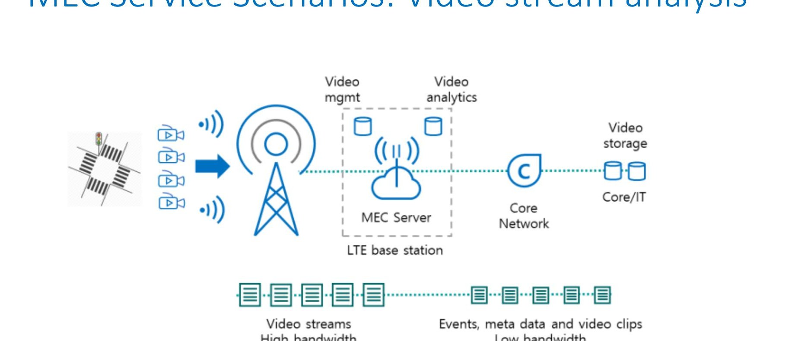
*Fig. — Il MEC Server, co-locato con la base LTE, esegue video management e analytics localmente. Verso la core network vengono trasmessi solo eventi, metadati e clip rilevanti (bassa banda), anziché stream video ad alta banda.*

Eseguire il video analytics sul **MEC host** consente di:
- evitare la trasmissione di stream video ad alta banda attraverso la core network verso servizi cloud remoti;
- inviare alla rete solo i dati estratti dall'elaborazione (risultati, metadati, clip rilevanti);
- ottenere prestazioni migliori rispetto sia a processare il video sulle telecamere stesse sia a processarlo su un server remoto.

### IoT Gateway

MEC può fungere da **gateway IoT** intelligente, aggregando il traffico proveniente da dispositivi eterogenei (veicoli, sensori, attuatori industriali, dispositivi consumer) e applicando analytics verticali prima di trasmettere dati verso la core network e Internet.

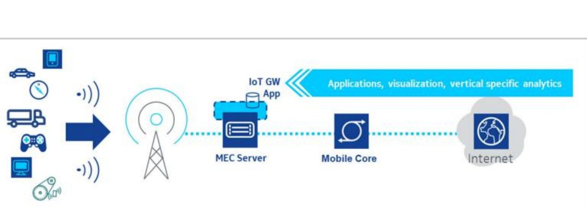
*Fig. — Un'applicazione IoT GW App gira sul MEC Server, raccogliendo traffico da dispositivi IoT eterogenei via radio. Verso la core network vengono propagate solo analisi aggregate e eventi rilevanti.*

---

## Architettura MEC

### Il sistema MEC

Un **sistema MEC** include i MEC host e la gestione MEC necessaria per eseguire applicazioni MEC all'interno di una rete operatore.

### Il MEC Framework

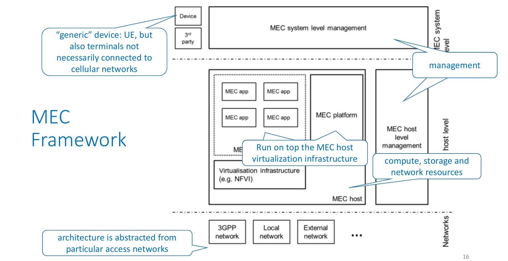
*Fig. — Il MEC Framework: i MEC host ospitano la virtualization infrastructure (NFV) con le MEC app e la MEC platform. La gestione è strutturata su due livelli: system-level e host-level.*

I componenti principali dell'architettura sono:

> [!definition] MEC Host
>
> Include una **MEC platform** e una **virtualization infrastructure** che fornisce risorse di calcolo, storage e rete per le MEC application. È il server fisico che ospita la piattaforma e le applicazioni.

> [!definition] MEC Platform
>
> Raccolta delle funzionalità essenziali per eseguire le MEC application su una particolare infrastruttura di virtualizzazione, abilitandole a consumare e offrire **MEC services**. La piattaforma può essa stessa offrire servizi.

> [!definition] MEC Application
>
> Applicazione che gira sopra la virtualization infrastructure fornita dal MEC host. Può interagire con la MEC platform per consumare e fornire MEC services.

> [!definition] MEC Management
>
> Divisa in *system-level* e *host-level*, gestisce l'orchestrazione dell'intero sistema MEC.

L'architettura è volutamente **astratta dalla tecnologia di accesso specifica**: le reti sottostanti possono essere 3GPP (4G/5G), Wi-Fi, rete fissa o qualsiasi combinazione. I dispositivi terminali non sono necessariamente UE cellulari, ma qualsiasi terminale connesso all'infrastruttura d'accesso.

---

## Categorie di casi d'uso

I casi d'uso MEC si raggruppano in tre categorie principali:

| Categoria | Esempi |
|-----------|--------|
| **Consumer-oriented services** | Gaming, remote desktop, assistenza cognitiva, servizi in tempo reale per stadi/retail, offloading computazionale |
| **Operator and third-party services** | Tracciamento posizione dispositivi, big data, video analytics, veicoli connessi, sicurezza |
| **Network performance & QoE improvements** | Content/DNS caching, ottimizzazione prestazioni, ottimizzazione e accelerazione video |

---

## MEC Service APIs

MEC standardizza un insieme di **API di servizio** che consentono alle applicazioni virtualizzate all'edge di accedere a informazioni di rete e utente dal nodo locale. Le API principali sono:

| API | Funzionalità |
|-----|-------------|
| **Radio Network Info API (RNIS)** | Condizioni radio attuali, Cell ID, intensità segnale, bearer UE |
| **Location API** | Posizione geografica/logica degli UE, lista UE in un'area, movimenti in/out |
| **UE Identity API** | Identificazione dei terminali |
| **Bandwidth Management API** | Gestione della banda |
| **App Lifecycle Management API** | Ciclo di vita delle applicazioni |
| **WLAN Info API** | Informazioni sulle reti Wi-Fi |
| **V2X Info Service API** | Comunicazioni vehicle-to-everything |
| **Service Discovery API** | Scoperta dei servizi disponibili |
| **Mobility API** | Gestione della continuità di servizio durante la mobilità |
| **MultiAccess Traffic Steering API** | Steering, splitting e duplicazione del traffico su accessi multipli |

### Radio Network Information API (RNIS)

La RNIS fornisce informazioni aggiornate sulle condizioni radio: Cell ID, intensità del segnale, misurazioni relative al piano utente, contesto degli UE connessi ai nodi radio associati al MEC host. È utile sia per le MEC app che vogliono ottimizzare i propri servizi (ad esempio guidare il throughput video adattativamente) sia per la MEC platform per ottimizzare le procedure di mobilità.

### Location API

La Location API espone informazioni di localizzazione con due tipi di rappresentazione:
- **Geolocalizzazione**: coordinate geografiche GPS.
- **Localizzazione logica**: Cell ID, identificativi di settore radio.

Le informazioni includono: posizione di UE specifici, lista degli UE in un'area geografica, notifiche di ingresso/uscita da un'area, posizione dei nodi radio associati all'host.

---

## MultiAccess Traffic Steering (MTS) API

Nessuna singola tecnologia di accesso wireless è in grado di soddisfare simultaneamente tutti i requisiti di comunicazione umana e machine-type: massima velocità di trasmissione da un lato, massima affidabilità dall'altro. La **MTS API** nasce per sfruttare la presenza di connessioni multiple combinandole intelligentemente.

### Il trade-off fondamentale

L'idea di base è semplice: se si dispone di $N$ link wireless, ciascuno con data rate $R$ Mbps e affidabilità $p$, combinando i link si può ottenere:

- **Split traffic** (traffico suddiviso): data rate aggregato $N 	imes R$ Mbps, stessa affidabilità $p$ — si guadagna in throughput ma non in affidabilità.
- **Duplicate traffic** (traffico duplicato): stesso data rate $R$, affidabilità $p^N$ — si guadagna in affidabilità ma non in throughput.

> [!warning] Trade-off esclusivo
>
> Il miglioramento del data rate e il miglioramento dell'affidabilità non si ottengono contemporaneamente. Le due strategie (split e duplicate) sono mutuamente esclusive in termini di beneficio primario.

La tabella seguente mostra un esempio numerico con $N$ link da 100 Mbps e affidabilità $10^{-3}$:

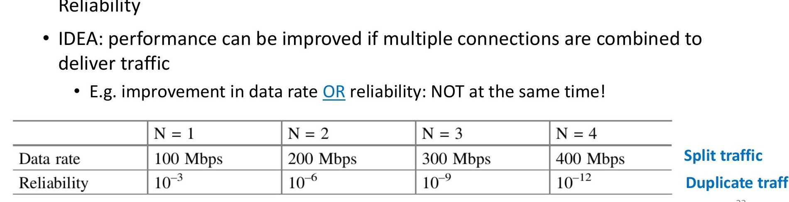
*Fig. — Con N=4 link: data rate aggregato 400 Mbps (split) oppure affidabilità $10^{-12}$ (duplicate). Le due colonne "Split traffic" e "Duplicate traffic" evidenziano il trade-off.*

### Operazioni MTS supportate

| Operazione | Logica | Caso d'uso tipico |
|------------|--------|-------------------|
| **Low Cost** | Usa la rete non misurata (Wi-Fi) quando disponibile | Email, backup in background |
| **Low Latency** | Usa la connessione con latenza minore | Controllo remoto, gaming |
| **High Throughput** | Usa la rete con throughput maggiore, o più reti simultaneamente | Video streaming HD |
| **Redundancy** | Duplica i pacchetti su più connessioni | Controllo robotico (URLLC) |

> [!example] Esempi pratici di MTS
>
> - **Email/Dropbox**: applicazione data-centric in background, non sensibile a latenza né throughput → preferisce Wi-Fi (Low Cost).
> - **Controllo robot** (URLLC): richiede altissima affidabilità e bassa latenza → Redundancy, pacchetti duplicati su più connessioni simultaneamente.
> - **Video HD real-time**: richiede alto throughput → High Throughput con bandwidth aggregation (traffic split su più link).

### Esercizio: applicabilità MTS

```{=latex}
\newpage
```

# Embedded Programming e Arduino

Gli **sistemi embedded** (*embedded systems*) rappresentano una categoria fondamentale nell'informatica moderna, specialmente nel contesto dei sistemi cyber-fisici e dell'IoT. A differenza dei personal computer, progettati per eseguire un insieme arbitrario e variabile di applicazioni, un sistema embedded è costruito per svolgere **una funzione dedicata e specifica**. Questa differenza non è solo funzionale ma architetturale: hardware e software vengono progettati insieme in parallelo, in quello che si chiama **co-design hardware-software**.

## Sistemi Embedded e Microcontrollori

> [!definition] Sistema Embedded
>
> Un sistema embedded è un sistema computazionale progettato per svolgere una funzione dedicata. Hardware e software sono co-progettati, e il sistema può includere anche componenti meccanici. Il cuore di un sistema embedded è tipicamente un **microcontrollore**.

Il microcontrollore è un singolo chip che integra al suo interno un microprocessore, memoria e interfacce di I/O. È ottimizzato per il controllo di periferiche e interagisce con il dispositivo elettromeccanico nel quale è "embedded" per fornire controllo. Proprio per questo scopo di controllo, un sistema embedded ha spesso vincoli di **real-time**: la correttezza temporale è importante quanto quella funzionale.

I microcontrollori possono essere classificati in base alla loro flessibilità:

| Tipo | Descrizione | Esempi |
|---|---|---|
| General purpose | Adattabili a più applicazioni embedded | Arduino Uno (ATmega328) |
| ASIC | *Application-Specific Integrated Circuits*, progettati per prodotti specifici | Chip in elettrodomestici |
| SoC | *System on a Chip*, termine più ampio, include anche processori per smartphone | Qualcomm Snapdragon |

I microcontrollori sono usati in una vasta gamma di applicazioni: allarmi, wearable, giocattoli, sensori industriali, e molte altre. Le piattaforme più popolari per prototyping e didattica sono **Arduino** e **Raspberry Pi**.

---

## Sfide della Programmazione su Sistemi Embedded

Programmare per sistemi embedded introduce vincoli che non esistono nello sviluppo software tradizionale. Comprendere queste sfide è fondamentale per scrivere codice corretto ed efficiente.

### Risorse Hardware Limitate

La prima differenza rispetto ai PC tradizionali riguarda la memoria: un tipico microcontrollore dispone di pochissima RAM (es. Arduino Uno ha solo 2 KB di SRAM per i dati e 32 KB di memoria Flash per il programma). Non esiste in genere un filesystem, e l'interfaccia utente è ridotta a pochi LED o bottoni. In molti casi **non è presente un sistema operativo** (sistemi *bare-metal*): esiste una sola applicazione che gestisce direttamente gli interrupt.

### Correttezza Temporale

> [!warning] Real-Time è un requisito funzionale
>
> In molti sistemi embedded la correttezza temporale è parte integrante dei requisiti funzionali, non solo una questione di prestazioni. Un sistema GPS che identifica correttamente tutti i waypoint ma li segnala in ritardo è **inutile**.

### Alta Affidabilità

I sistemi embedded operano spesso in ambienti ostili o imprevedibili. Un requisito comune è la disponibilità *four nines* (99.99%), che corrisponde a non più di 9 secondi di downtime al giorno. Questo è particolarmente difficile da garantire quando eventi ambientali imprevedibili possono alterare la sequenza di esecuzione.

### Gestione Efficiente della Memoria

La memoria è costosa in termini economici e fisici. Un programmatore embedded deve riuscire a far stare il proprio codice nello spazio disponibile, il che richiede un approccio particolarmente creativo e disciplinato.

### Power Management

In molti sistemi embedded, specialmente quelli alimentati a batteria, la gestione dell'energia è critica. La capacità di entrare in uno stato di basso consumo quando il sistema è inattivo è una caratteristica imprescindibile.

---

## Sistemi Operativi per Sistemi Embedded

Le funzionalità del sistema operativo variano enormemente in base alle capacità hardware del dispositivo. Nello scenario più semplice (*bare-metal*), il supporto real-time è fornito da librerie collegate staticamente al codice applicativo. In sistemi più potenti si può usare Linux embedded o un RTOS (*Real-Time Operating System*) come ROS.

### Cross-Compilazione

Poiché il microcontrollore non ha le risorse per eseguire un compilatore, lo sviluppo avviene su un PC host tramite **cross-compilazione**: il codice viene scritto e compilato su un PC per la piattaforma di destinazione. Il programmatore specifica la piattaforma target (es. Arduino Uno, MicaZ, T-Mote) e il codice viene compilato e collegato staticamente alle librerie del sistema operativo.


*Fig. — Pipeline di sviluppo per sistemi embedded: dal codice sorgente all'eseguibile nel firmware.*

L'eseguibile finale include il codice del programmatore, le librerie del sistema operativo e tutta la logica di inizializzazione. La funzione `main` è tipicamente fornita dall'OS e si occupa di invocare le funzioni di inizializzazione scritte dal programmatore, dopodiché attiva i task che implementano le funzionalità del dispositivo.

---

## Organizzazione del Software Embedded

Il lavoro di un sistema embedded è **ciclico** per natura, il che definisce un **duty cycle**. Il ciclo tipico consiste in:

1. Lettura dai trasduttori (sensori)
2. Presa di decisione
3. Controllo degli attuatori
4. Eventuale comunicazione con altri dispositivi

Questi passi vengono eseguiti in un **control loop**, una funzione invocata dal main dopo l'inizializzazione e ripetuta indefinitamente. A basso livello, il codice interagisce con l'hardware tramite **comandi** e **interrupt**: un comando attiva l'hardware (es. avvia una lettura da un sensore), mentre un interrupt segnala che il comando è stato completato.

> [!tip] Differenza nei sistemi convenzionali vs embedded
>
> In un OS convenzionale, i comandi sono system call: se c'è da aspettare, il thread viene sospeso e il kernel gestisce gli interrupt riattivando i thread sospesi. Questo richiede uno stack per ogni thread. In un sistema embedded con poca RAM (es. Arduino 1 ha 4 KB), salvare il contesto di più thread diventa un problema critico.

---

## Modelli di Programmazione per Embedded

Il problema della gestione dell'I/O con memoria limitata ha portato allo sviluppo di diversi modelli di programmazione. I due esempi principali sono il **modello Arduino** (event loop sincrono) e il **modello TinyOS** (eventi + task asincroni).

### Il Modello Arduino

Arduino adotta un approccio estremamente semplice: il lavoro è definito in una singola funzione `loop()`, eseguita ripetutamente da **un unico thread**. Non c'è sospensione del thread, non ci sono context switch. Se un'operazione di I/O richiede tempo, si aspetta semplicemente che si completi. Se serve un ritardo, si usa `delay()` che mette il thread in attesa per il tempo specificato.

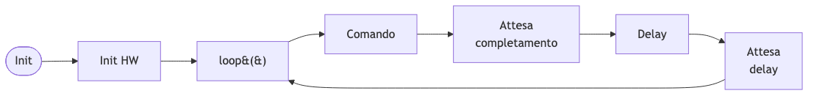
*Fig. — Modello di esecuzione Arduino: singolo thread, nessuna sospensione, polling sincrono.*

> [!note] Pro e contro del modello Arduino
>
> Il modello è semplice e si adatta bene ad attività di sensing e controllo. Include librerie per molti attuatori. Tuttavia non è stato pensato per le comunicazioni asincrone, anche se le versioni recenti includono librerie (e hardware) per questo scopo. Per le comunicazioni via linea seriale, Arduino offre anche la gestione asincrona tramite **interrupt**.

### Il Modello TinyOS

[[TinyOS]] adotta un approccio diverso, progettato per massimizzare l'efficienza energetica e gestire attività indipendenti senza sprecare memoria per i contesti dei thread. Il modello si basa su tre elementi:

> [!definition] Comandi, Eventi e Task in TinyOS
>
> - **Comandi**: funzioni per programmare e attivare l'hardware (verso il basso nella gerarchia).
> - **Eventi**: astrazioni degli interrupt sotto forma di *upcall* — il programmatore definisce un handler per ogni evento. Gli eventi possono pre-emptare i task.
> - **Task**: unità di elaborazione non-preemptive eseguite sequenzialmente. Un task non aspetta mai (salva memoria). Se un event handler richiede elaborazione complessa, posta un task.

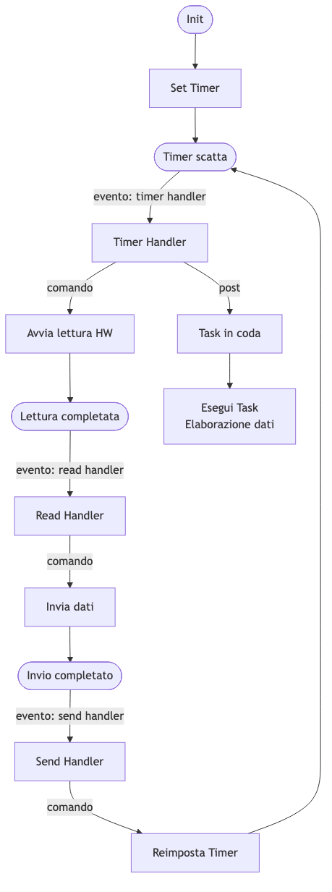
*Fig. — Flusso di esecuzione TinyOS: eventi gestiti immediatamente, elaborazione delegata ai task.*

### Il Modello degli Eventi: Tre Livelli

Il modello a eventi in TinyOS (e per analogia in Arduino con gli interrupt) si struttura in tre livelli:

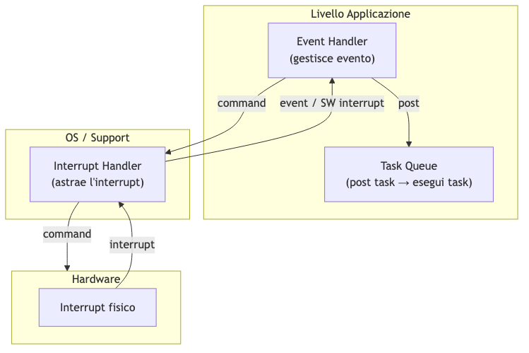
*Fig. — Modello a tre livelli: hardware genera interrupt, OS li astrae in eventi, l'applicazione li gestisce con handler e task.*

> [!warning] Rischio di interferenza
>
> Un event handler opera in contesto di interrupt, quindi ha accesso diretto alle strutture dati dell'OS/support. Bisogna fare molta attenzione a non corrompere queste strutture. Per questo gli event handler devono essere **il più corti possibile**: aggiornano strutture dati, inviano comandi all'HW, e se serve altro lavoro postano un task.

---

## Arduino: Case Study

### La Scheda Arduino Uno

Arduino è una piattaforma open-source di prototipazione elettronica basata su hardware flessibile e software facile da usare. Il concetto "Arduino" comprende il **dispositivo** (la scheda), l'**IDE** di sviluppo e il **forum** della community.

La versione più diffusa è **Arduino Uno**, basata sul microcontrollore AVR **ATmega328**:

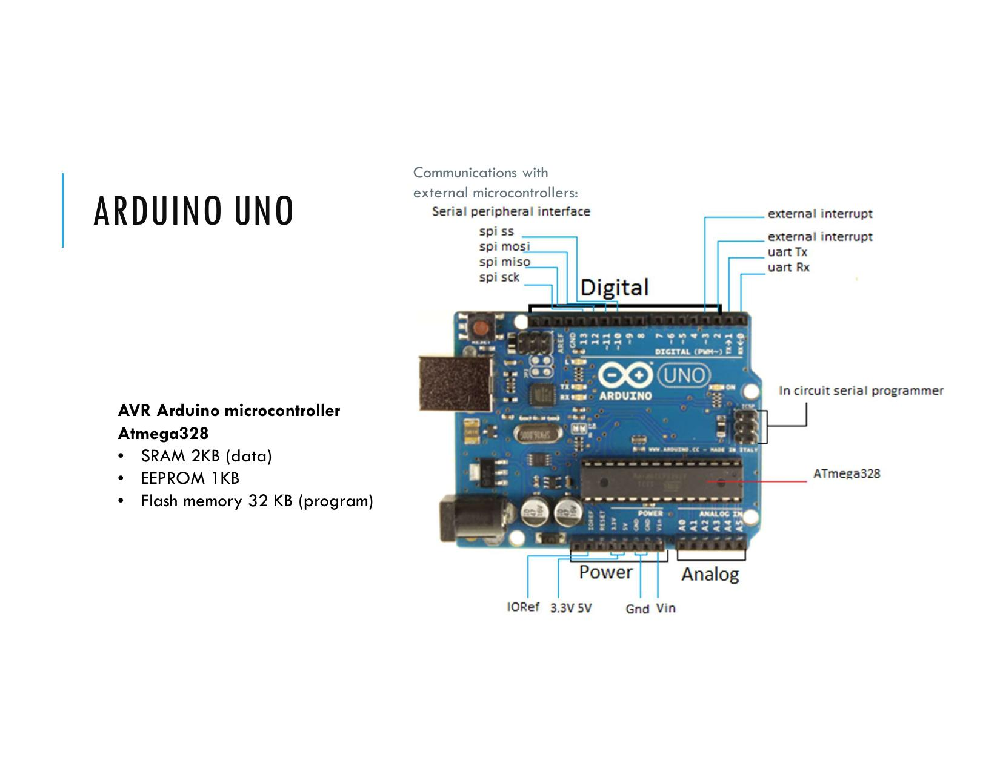
*Fig. — Arduino Uno: microcontrollore ATmega328 con connettori digitali, analogici, SPI, UART e interrupt esterni.*

| Memoria | Dimensione | Uso |
|---|---|---|
| SRAM | 2 KB | Dati (variabili, stack) |
| EEPROM | 1 KB | Dati non volatili |
| Flash | 32 KB | Programma (firmware) |

La scheda espone pin **digitali** (con supporto PWM), pin **analogici** (input), pin per la comunicazione **SPI** (*Serial Peripheral Interface*), linee **UART** (TX/RX) e due pin dedicati agli **interrupt esterni** (pin 2 e 3, corrispondenti a INT0 e INT1).

### L'IDE Arduino e la Cross-Compilazione

L'ambiente di sviluppo Arduino (scaricabile da arduino.cc) è scritto in Java e si basa su Processing, avr-gcc e altri tool open-source. Per configurare un nuovo progetto è necessario:

1. Scaricare e installare il software Arduino
2. Collegare il dispositivo via USB
3. Selezionare il tipo di scheda (`Tools → Board`)
4. Selezionare la porta di connessione (`Tools → Port`)
5. Scrivere il codice (*sketch*) e caricarlo

### Linguaggio e Struttura degli Sketch

> [!definition] Terminologia Arduino
>
> - **Sketch**: un programma scritto per girare su una scheda Arduino
> - **Pin**: un ingresso o uscita connesso a qualcosa (es. output verso un LED, input da un potenziometro)
> - **Digital**: valore binario HIGH o LOW (on/off)
> - **Analog**: valore in un range, tipicamente 0–1023 (es. luminosità LED, velocità motore)

Il linguaggio Arduino è derivato dal **C** ed è strutturato in tre parti principali:

```cpp
void setup() {
  // Codice di inizializzazione: eseguito UNA sola volta
  // all'avvio o dopo un reset
}

void loop() {
  // Codice principale: eseguito ripetutamente
  // per tutta la durata del funzionamento
}
```

La funzione `setup()` viene invocata una volta sola all'avvio e serve per configurare i pin (input/output), inizializzare la linea seriale, ecc. La funzione `loop()` implementa il control loop discusso in precedenza ed è il cuore dell'applicazione.

### Funzioni Principali della Libreria Arduino

| Categoria | Funzioni |
|---|---|
| I/O Digitale | `pinMode()`, `digitalRead()`, `digitalWrite()` |
| I/O Analogico | `analogReference()`, `analogRead()`, `analogWrite()` |
| I/O Avanzato | `tone()`, `shiftOut()`, `shiftIn()`, `pulseIn()` |
| Tempo | `millis()`, `micros()`, `delay()`, `delayMicroseconds()` |
| Matematica | `min()`, `max()`, `abs()`, `sin()`, `cos()`, `random()` |
| Bit/Byte | `lowByte()`, `highByte()`, `bitRead()`, `bitWrite()` |
| Interrupt | `attachInterrupt()`, `detachInterrupt()`, `interrupts()`, `noInterrupts()` |
| Comunicazione | `Serial`, `Stream` |

### Esempio: Lettura Analogica e Digitale

Il codice seguente legge un segnore analogico dal pin A0 e lo converte in tensione; controlla il pin digitale 2 (button); se il button è premuto, accende il LED sul pin 13 e stampa la tensione sulla seriale.

```cpp
const int buttonPin = 2;   // pin del pulsante
const int ledPin = 13;     // pin del LED
int buttonState = 0;       // stato del pulsante

void setup() {
  Serial.begin(9600);           // inizializza seriale a 9600 bps
  pinMode(ledPin, OUTPUT);      // LED come output
  pinMode(buttonPin, INPUT);    // pulsante come input
}

void loop() {
  buttonState = digitalRead(buttonPin);

  if (buttonState == HIGH) {        // se il pulsante è premuto
    digitalWrite(ledPin, HIGH);      // accende il LED
    int sensorValue = analogRead(A0);            // legge [0, 1023]
    float voltage = sensorValue * (5.0 / 1023.0); // converte in [0, 5V]
    Serial.println(voltage);
  } else {
    digitalWrite(ledPin, LOW);       // spegne il LED
  }
}
```

> [!example] Calcolo del Duty Cycle
>
> Dato il seguente loop:
> ```cpp
> void loop() {
>   int sensorValue = analogRead(A0);  // 2 ms
>   Serial.println(sensorValue);       // 5 ms
>   delay(100);                        // 100 ms
> }
> ```
> - Tempo attivo = 2 + 5 = **7 ms**
> - Periodo totale = 2 + 5 + 100 = **107 ms**
> - **Duty cycle = 7/107 ≈ 6.5%**
>
> Il sistema è attivo solo per circa il 7% del tempo — spazio per ottimizzare il consumo energetico.

---

## Interrupt in Arduino

Sebbene il modello base di Arduino sia la lettura sincrona dei sensori nel loop, Arduino offre anche un'interfaccia per gli **interrupt**, che abilita l'accesso asincrono a sensori e attuatori.

### Tipi di Interrupt

Arduino prevede tre tipi di interrupt:

- **External**: segnale esterno connesso a un pin
- **Timer**: interno ad Arduino, gestito dal runtime
- **Device**: segnale interno proveniente da un dispositivo (ADC, seriale, ecc.)

Gli interrupt interni (Timer e Device) sono gestiti direttamente dal runtime di Arduino. Il programmatore si occupa principalmente degli **interrupt esterni**.

### Interrupt Esterni: `attachInterrupt()`

```cpp
attachInterrupt(interrupt#, func-name, mode);
```

Arduino Uno dispone di **soli due pin per interrupt esterni**: INT0 (pin 2) e INT1 (pin 3). Le modalità di trigger disponibili sono:

| Modalità | Descrizione |
|---|---|
| `RISING` | L'interrupt scatta quando il pin passa da LOW a HIGH |
| `FALLING` | L'interrupt scatta quando il pin passa da HIGH a LOW |
| `CHANGE` | L'interrupt scatta ad ogni cambio di stato |
| `LOW` | L'interrupt scatta continuamente finché il pin è LOW |
| `HIGH` | L'interrupt scatta continuamente finché il pin è HIGH |

> [!warning] `LOW` e `HIGH` non richiedono un cambio di stato
>
> Con le modalità `LOW` e `HIGH`, l'interrupt si attiva **ripetutamente** finché il pin rimane in quello stato, anche senza variazioni. Usarle con cautela.

### Esempio con Interrupt Esterno

Il circuito collega un pulsante al pin digitale 2 (con resistore da 10 KΩ) e un LED verde al pin digitale 7 (con resistore da 220 Ω):

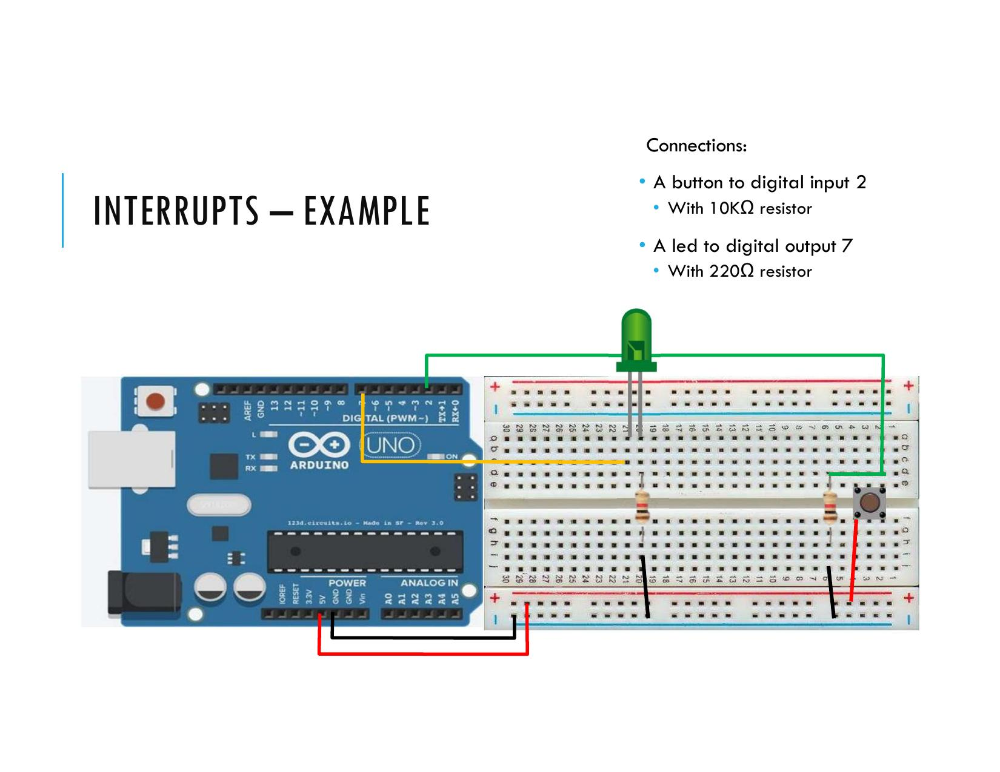
*Fig. — Circuito di esempio: pulsante sul pin 2 (INT0) con resistore pull-down 10KΩ, LED verde sul pin 7 con resistore 220Ω.*

```cpp
volatile int greenLed = 7;
volatile int count = 0;

void setup() {
  Serial.begin(9600);
  pinMode(greenLed, OUTPUT);
  digitalWrite(greenLed, LOW);
  attachInterrupt(0, interruptSwitchGreen, RISING); // 0 = pin 2
}

void loop() {
  count++;
  delay(1000);
  // Gli interrupt vengono ricevuti anche dentro delay!
  Serial.print("waiting:");
  Serial.println(count);
  if (count == 10) {
    count = 0;
    digitalWrite(greenLed, LOW);
    Serial.println("now off");
  }
}

void interruptSwitchGreen() {
  digitalWrite(greenLed, HIGH);
  count = 0;
  Serial.print("now on");
}
```

> [!warning] Regole per gli interrupt handler
>
> - `delay()` **non funziona** dentro un interrupt handler
> - `millis()` **non viene incrementato** dentro un interrupt handler  
> - Tutte le variabili condivise tra il loop e l'interrupt handler devono essere dichiarate `volatile` — questa direttiva al compilatore forza la lettura dalla RAM anziché da un registro, garantendo la coerenza del valore
> - I handler devono essere **il più brevi possibile**: solo aggiornamento di strutture dati e comandi all'HW
> - Per disabilitare tutti gli interrupt: `noInterrupts()` / `interrupts()`
> - Per rimuovere un interrupt specifico: `detachInterrupt()`

---

## Gestione Energetica in Arduino

I microcontrollori come l'ATmega328P (cuore di Arduino Uno) offrono diversi **sleep mode** per ridurre il consumo energetico quando il sistema è inattivo. Questi possono essere attivati tramite la libreria **Low Power** (`#include "LowPower.h"`).

I meccanismi di wake-up disponibili sono: interrupt interni, interrupt esterni o reset di sistema.

### Modalità di Sleep dell'ATmega328P

| Modalità | Cosa rimane attivo | Wake-up |
|---|---|---|
| **Idle** | SPI, UART, I2C, watchdog, contatori, comparatore analogico | Qualsiasi interrupt esterno o interno |
| **ADC Noise Reduction** | ADC, interrupt esterno, UART, I2C, watchdog, contatori | Reset, interfaccia seriale, interrupt specifici |
| **Power-Down** | Solo I2C, watchdog, interrupt esterno | Reset, interfaccia seriale, interrupt specifici (no timer) |
| **Power-Save** | Come Power-Down + timer/counter se abilitato | Come Power-Down + timer overflow |
| **Standby** | Come Power-Down + oscillatore esterno attivo | Come Power-Down |
| **Extended Standby** | Come Power-Save + oscillatore esterno attivo | Come Power-Save |

### Idle Sleep Mode

```cpp
#include "LowPower.h"

// Nessun setup richiesto per la libreria

void loop() {
  // ... lavoro utile ...
  LowPower.idle(SLEEP_8S, ADC_OFF, TIMER2_OFF, TIMER1_OFF,
                TIMER0_OFF, SPI_OFF, USART0_OFF, TWI_OFF);
  // si risveglia automaticamente dopo 8 secondi
}
```

I periodi di sleep predefiniti disponibili vanno da `SLEEP_15MS` fino a `SLEEP_FOREVER`. Non è obbligatorio spegnere tutto: si può lasciare attivo ciò che serve con `ADC_ON`, `TIMER0_ON`, ecc.

### Power-Down Mode

La modalità Power-Down è quella a minor consumo: ferma tutti i clock generati e lascia attivi solo i moduli asincroni.

```cpp
#include "LowPower.h"

void loop() {
  // ... lavoro utile ...
  
  // Sleep fisso (wake-up automatico dopo 8s)
  LowPower.powerDown(SLEEP_8S, ADC_OFF, BOD_OFF);
  
  // oppure: sleep fino a interrupt esterno
  attachInterrupt(0, wakeUp, LOW);
  LowPower.powerDown(SLEEP_FOREVER, ADC_OFF, BOD_OFF);
  detachInterrupt(0);
  
  // ripresa dell'esecuzione qui
}
```

> [!tip] Quando usare Power-Down vs Power-Save
>
> Se il timer/counter non è necessario, preferire sempre **Power-Down** rispetto a Power-Save: consuma meno e la differenza ha senso solo se si ha bisogno di wake-up da timer overflow.

---

```{=latex}
\newpage
```

# Energy Harvesting IoT

Il problema di fondo dei dispositivi IoT è energetico: alimentarli con una batteria di capacità finita costringe a scegliere tra prestazioni e durata. Una batteria grande permette lunga vita, ma aumenta dimensioni, peso e costo; un processore a basso consumo estende la vita ma limita potenza di calcolo e portata radio. L'**energy harvesting** (raccolta di energia) rappresenta un'alternativa strutturale: invece di ottimizzare il consumo, si raccoglie energia dall'ambiente e si elimina — o si riduce drasticamente — il vincolo della batteria finita.

Se la sorgente è abbondante e disponibile in modo continuo o periodico, il dispositivo può funzionare «per sempre». Questa prospettiva sposta l'obiettivo del progettista dalla massimizzazione della vita utile alla massimizzazione delle prestazioni a parità di disponibilità energetica.

---

## Definizioni fondamentali

Tre concetti strutturano l'intero dominio:

- **Energy source** (sorgente di energia): la fonte primaria (sole, vento, vibrazioni, ecc.) da cui l'energia viene estratta.
- **Harvesting source** (tecnologia di raccolta): il componente fisico — cella solare, turbina, cristallo piezoelettrico, antenna — che converte la sorgente in energia elettrica. La produzione varia nel tempo e in funzione delle condizioni ambientali, ed è generalmente al di fuori del controllo del progettista.
- **Load** (carico): l'energia consumata dal dispositivo per le proprie attività. Un dispositivo IoT ha molteplici sottosistemi (processore, radio, storage, trasduttori/ADC), ciascuno con stati propri e consumi differenti; il carico varia quindi nel tempo a seconda delle attività in esecuzione.

> [!definition] Harvesting System
>
> Un sistema che supporta un carico variabile alimentato da una sorgente di harvesting variabile, anche quando la potenza istantanea della sorgente non corrisponde al carico.

Il problema chiave è il **disaccoppiamento** tra produzione e consumo: la sorgente produce quando l'ambiente lo consente, il dispositivo consuma quando deve eseguire i propri task.

### Bilanciamento tra offerta e domanda

Esistono due approcci principali per adeguare produzione e consumo:

1. **Adattare il carico** alla disponibilità energetica — ad esempio riducendo la frequenza di campionamento.
2. **Usare un buffer energetico** — una batteria ricaricabile o un supercapacitore che accumula l'eccesso e lo cede nei momenti di deficit.

In pratica nessuno dei due approcci è sufficiente da solo: il carico non può essere ridotto arbitrariamente senza compromettere la funzionalità, e il buffer è fisicamente limitato e non ideale (ha perdite ed efficienza di carica $< 1$).

---

## Architetture di harvesting

### Harvest-Use

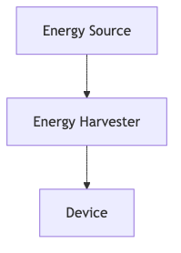
*Fig. — Architettura Harvest-Use: la sorgente alimenta direttamente il dispositivo senza buffer.*

Nell'architettura **Harvest-Use** l'energia è raccolta esattamente quando serve. Non esiste un buffer: la potenza prodotta $P_s(t)$ viene consumata istantaneamente. Il dispositivo è operativo solo se:

$$P_s(t) \geq P_c(t)$$

Questo comporta due forme di spreco:
- Quando $P_s(t) < P_c(t)$: il dispositivo si spegne per mancanza di energia.
- Quando $P_s(t) > P_c(t)$: l'eccesso $P_s(t) - P_c(t)$ va perduto.

Variazioni brusche della produzione possono causare oscillazioni accensione/spegnimento. Esempi tipici: mulini ad acqua, tag RFID passivi.

### Harvest-Store-Use

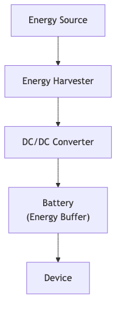
*Fig. — Architettura Harvest-Store-Use: l'energia in eccesso viene accumulata nel buffer e prelevata nei momenti di deficit.*

Nell'architettura **Harvest-Store-Use** l'energia raccolta viene immagazzinata nel buffer ogni volta che è disponibile e prelevata quando la produzione è insufficiente o i task del dispositivo richiedono più energia. Il buffer disaccoppia temporalmente produzione e consumo.

#### Buffer ideale

Un buffer ideale ha capacità infinita, nessuna perdita ed efficienza di carica $\eta = 1$. In queste condizioni il dispositivo è sempre operativo se, per ogni intervallo $(0, T]$:

$$\int_0^T P_c(t)\,dt \leq \int_0^T P_s(t)\,dt + B_0 \qquad \forall T \in (0, \infty)$$

dove $B_0$ è la carica iniziale del buffer. La batteria accumula la potenza prodotta in eccesso $[P_s(t) - P_c(t)]^+$ e cede quella prodotta in difetto $[P_c(t) - P_s(t)]^+$.

#### Buffer non ideale

Un buffer reale ha capacità massima $B_{\mathrm{max}}$, efficienza di carica $\eta < 1$ e potenza di leakage $P_{\mathrm{leak}}(t)$. La carica $B_T$ al tempo $T$ deve soddisfare due equazioni:

**Conservazione dell'energia (necessaria e sufficiente):**

$$B_T = B_0 + \eta\int_0^T [P_s - P_c]^+\,dt - \int_0^T [P_c - P_s]^+\,dt - \int_0^T P_{\mathrm{leak}}\,dt \geq 0$$

**Capacità finita (sufficiente, non necessaria):**

$$B_{\mathrm{max}} \geq B_0 + \eta\int_0^T [P_s - P_c]^+\,dt - \int_0^T [P_c - P_s]^+\,dt - \int_0^T P_{\mathrm{leak}}\,dt$$

> [!note] Asimmetria tra le due condizioni
>
> La condizione di capacità finita è sufficiente ma non necessaria: un dispositivo può sprecare energia in eccesso (se la sorgente produce più di quanto il buffer possa contenere) senza violare la conservazione dell'energia.

> [!example] Esercizio sul buffer non ideale
>
> Dispositivo con $\eta = 95\%$, $B_0 = 400\,\mathrm{mAh}$, leakage trascurabile.
>
> Intervallo $[0, 4s]$: $P_s = 80\,\mathrm{mA}$, $P_c = 150\,\mathrm{mA}$ — il consumo supera la produzione.
> - Produzione: $80 \times \frac{4}{3600} = 0.089\,\mathrm{mAh}$; Consumo: $150 \times \frac{4}{3600} = 0.167\,\mathrm{mAh}$
> - $B_4 = 400 + 0.089 - 0.167 = 399.922\,\mathrm{mAh}$
>
> Intervallo $[4s, 10s]$: $P_s = 80\,\mathrm{mA}$, $P_c = 20\,\mathrm{mA}$ — la produzione supera il consumo, il buffer si ricarica.
> - Produzione: $80 \times \frac{6}{3600} = 0.133\,\mathrm{mAh}$; Consumo: $20 \times \frac{6}{3600} = 0.033\,\mathrm{mAh}$
> - $B_{10} = 399.922 + 0.95(0.133 - 0.033) = 400.017\,\mathrm{mAh}$

---

## Fonti di energia e classificazione

Le sorgenti si classificano su due assi: **controllabilità** e **prevedibilità**.

| Controllabilità | Descrizione | Esempi |
|---|---|---|
| Completamente controllabile | L'energia è disponibile su richiesta | Torcia shake-to-power, sorgenti RF dedicate |
| Parzialmente controllabile | Influenzabile ma non deterministica | Tag RFID in ambiente RF non uniforme |
| Non controllabile | Raccolta solo quando disponibile | Sole, vento, termica ambientale |

Le sorgenti non controllabili si classificano ulteriormente in:

| Prevedibilità | Descrizione | Esempi |
|---|---|---|
| Prevedibile | Esistono modelli affidabili | Sole (ciclo giorno/notte, stagioni, meteo) |
| Non prevedibile | Nessun modello affidabile | Vibrazioni da terremoti |

> [!tip] Implicazione progettuale
>
> La prevedibilità è fondamentale per la pianificazione energetica: se la sorgente è prevedibile si possono pianificare le attività del dispositivo. Se non lo è, è difficile garantire qualsiasi livello di prestazione.

### Tabella comparativa delle sorgenti principali

| Sorgente | Caratteristiche | Energia disponibile | Tecnologia | Efficienza | Energia raccolta |
|---|---|---|---|---|---|
| Solare | Amb., non contr., prevedibile | 100 mW/cm² | Celle solari | 15% | 15 mW/cm² |
| Vento | Amb., non contr., prevedibile | — | Anemometro | — | 1200 mWh/day |
| Vibrazioni (industria) | Controllabile | — | Piezoelettrico, induzione | — | 100 μW/cm² |
| Movimento umano | Controllabile | 19 mW – 67 W | Piezoelettrico | 7.5–11% | 2.1 mW – 5 W |
| Termica (umana) | Non contr., prevedibile | 20 mW/cm² | Termocoppia | — | 30 μW/cm² |
| Termica (industriale) | Controllabile | 100 mW/cm² | Termocoppia | — | 1–10 mW/cm² |
| RF (stazione base) | Controllabile | 0.3 μW/cm² | Antenna | — | 0.1 μW/cm² |
| Radioattività | — | 60 mW/cm³ | Decadimento radioattivo | — | — |

### Radio Frequency (RF) harvesting

Quando un campo RF attraversa una bobina antenna, si genera una tensione AC. I **tag RFID passivi** si alimentano esclusivamente con l'energia RF del reader: il reader trasmette il segnale, il tag raccoglie l'energia sufficiente per elaborare e rispondere. Non richiedono alcuna batteria.

### Piezoelettrico

I materiali piezoelettrici convertono la deformazione meccanica in differenza di potenziale:
- **PVDF** (PolyVinylidene Fluoride): film flessibili, adatti a superfici dinamiche.
- **PZT** (Lead Zirconate Titanate): ceramiche rigide, alta resa.

Applicazioni pratiche: solette per scarpe che alimentano un tag RFID attivo durante la camminata; pulsanti wireless che trasmettono a 15 m con una singola pressione, senza batteria.

### Energia eolica per IoT

Le micro-turbine per IoT hanno raggio di pochi centimetri, massa ~100 g e operano a velocità del vento basse. La potenza generata è massima quando la resistenza del carico eguaglia la resistenza interna del generatore (principio del massimo trasferimento di potenza). A 10 m/s una micro-turbina tipica eroga ~40 mW.

### Energia solare

La produzione di un pannello dipende dall'irradianza solare, che varia con la latitudine, il giorno dell'anno e le condizioni meteorologiche.

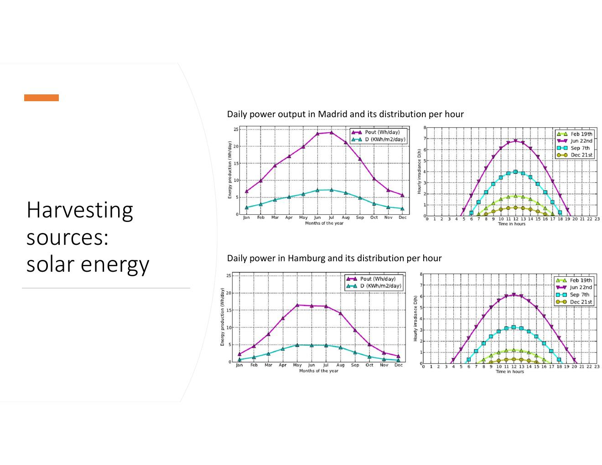
*Fig. — Produzione solare giornaliera (Wh/day) e irradianza oraria a Madrid e Amburgo per le quattro stagioni. Madrid raggiunge ~25 Wh/day in estate; Amburgo è più attenuata e stagionalmente più variabile.*

La variabilità stagionale è estrema: la **soluzione classica** è sovradimensionare il pannello e la batteria per coprire il caso peggiore (tipicamente dicembre alle latitudini settentrionali).

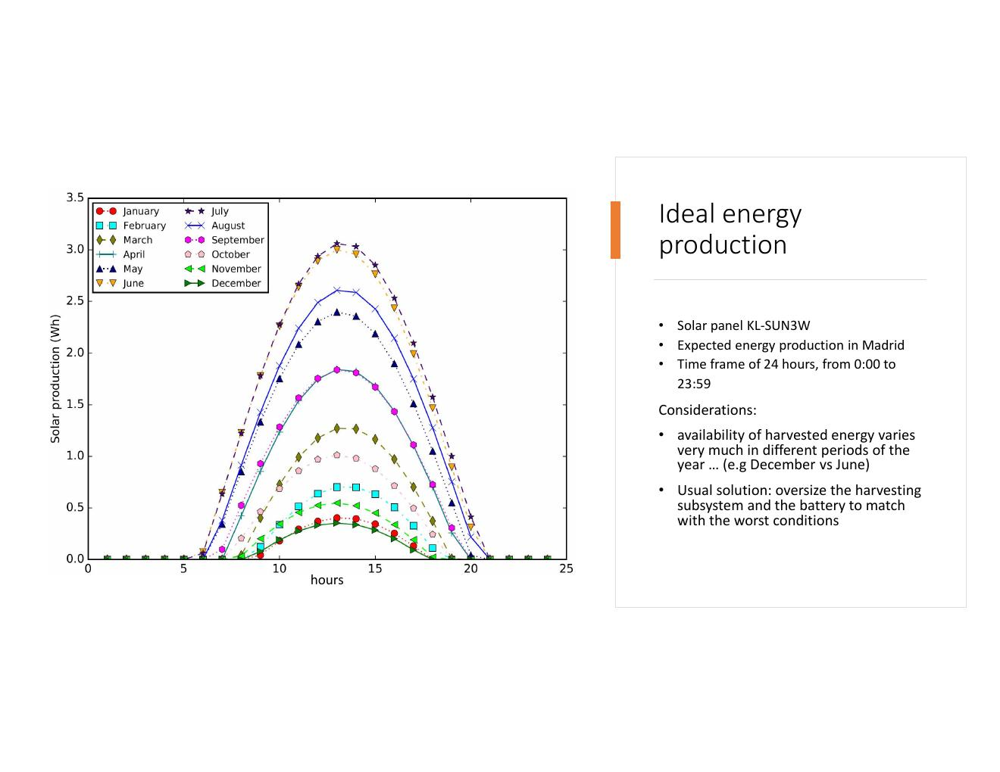
*Fig. — Produzione oraria stimata del pannello KL-SUN3W a Madrid, mese per mese (0–24 h). I mesi estivi raggiungono ~3 Wh per slot orario; dicembre e gennaio sono quasi trascurabili.*

Nella realtà, la produzione effettiva diverge nettamente dalla stima nelle giornate nuvolose:

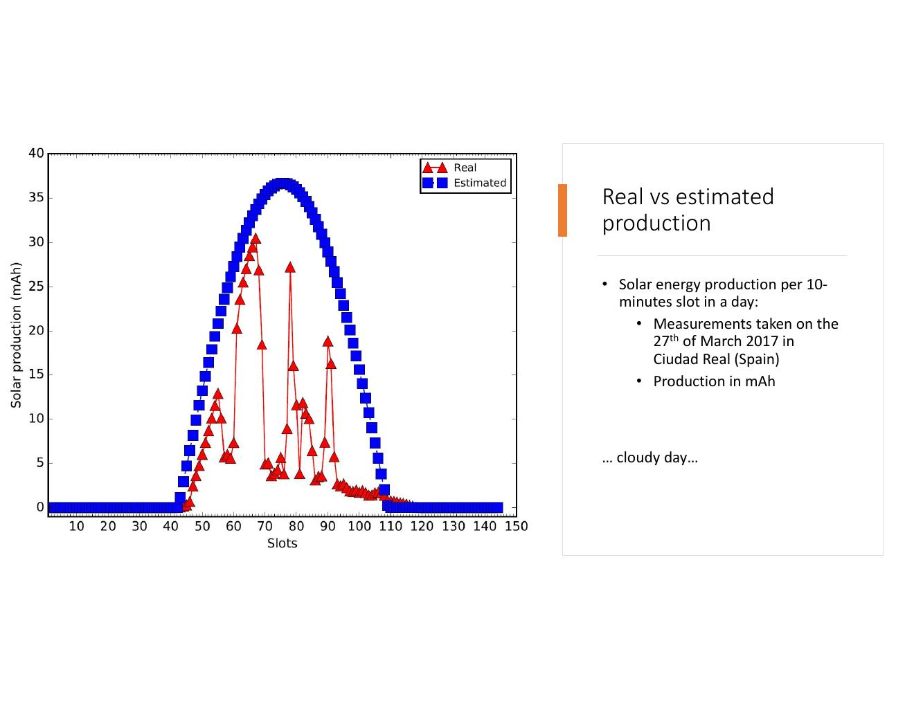
*Fig. — Produzione reale (triangoli rossi) vs stimata EWMA (quadrati blu), per slot da 10 minuti. Giornata molto nuvolosa: la produzione reale è fortemente discontinua e inferiore alla stima.*

> [!warning] Complementarità sole–vento
>
> Il sole produce continuamente ma solo di giorno; il vento produce in modo irregolare ma anche di notte. La combinazione delle due sorgenti aumenta la copertura temporale.

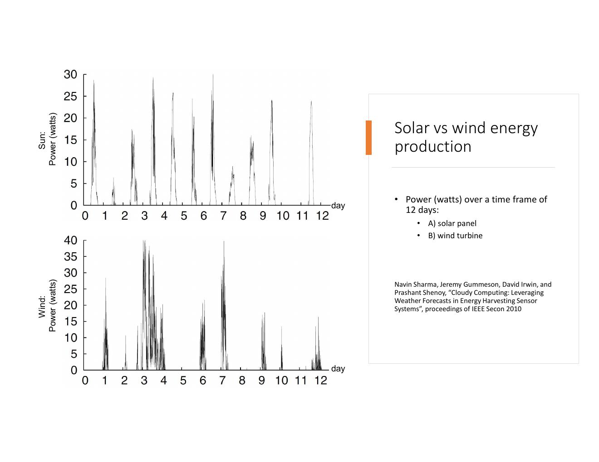
*Fig. — Potenza (watt) su 12 giorni: sopra, pannello solare (picchi giornalieri regolari); sotto, turbina eolica (picchi irregolari, anche notturni). Fonte: Sharma et al., IEEE Secon 2010.*

> [!warning] Energia harvesting ≠ operatività garantita
>
> Una notte senza vento con batteria quasi scarica può causare lo spegnimento del dispositivo. Il progettista deve dimensionare il sistema per il caso peggiore ragionevole, non per il caso medio.

---

## Tecnologie di storage

### Batterie ricaricabili

Le batterie sono celle di immagazzinamento in cui la reazione chimica interna è reversibile (si può ricaricare invertendo il flusso di corrente).

| Tipo | Tensione nom. (V) | Densità energetica (Wh/kg) | Efficienza (%) | Self-discharge (%/mese) | Cicli |
|---|---|---|---|---|---|
| SLA (Sealed Lead Acid) | 6 | 26 | 70–92 | 20 | 500–800 |
| NiCd | 1.2 | 42 | 70–90 | 10 | 1500 |
| NiMH | 1.2 | 100 | 66 | 20 | 1000 |
| **Li-ion** | 3.7 | 165 | **99.9** | <10 | 1200 |

La Li-ion è la tecnologia preferita per IoT: altissima efficienza, bassissimo self-discharge, elevata densità energetica.

### Supercapacitori

| Parametro | Valore |
|---|---|
| Densità energetica | 5 Wh/kg |
| Efficienza | 97–98% |
| Self-discharge | 5.9%/giorno |
| Cicli di ricarica | **Infiniti** |

I supercapacitori non richiedono circuiti di carica complessi. Sono ideali quando l'energia è disponibile a intervalli regolari o quando la sorgente è molto variabile (*jitter*). La modalità **trickle charge** mantiene il condensatore pieno caricandolo alla stessa velocità con cui si scarica.

---

## Misurare la carica della batteria

Tutte le tecniche di power management richiedono informazioni fresche sulla carica attuale della batteria e sulla produzione energetica. Entrambe sono quantità non direttamente osservabili e devono essere stimate.

### Relazione tensione–carica

La tensione a circuito aperto di una batteria decresce al diminuire della carica. Nell'intervallo operativo la relazione è approssimativamente **lineare** (la dipendenza dalla tecnologia specifica è reale: non sempre vale).

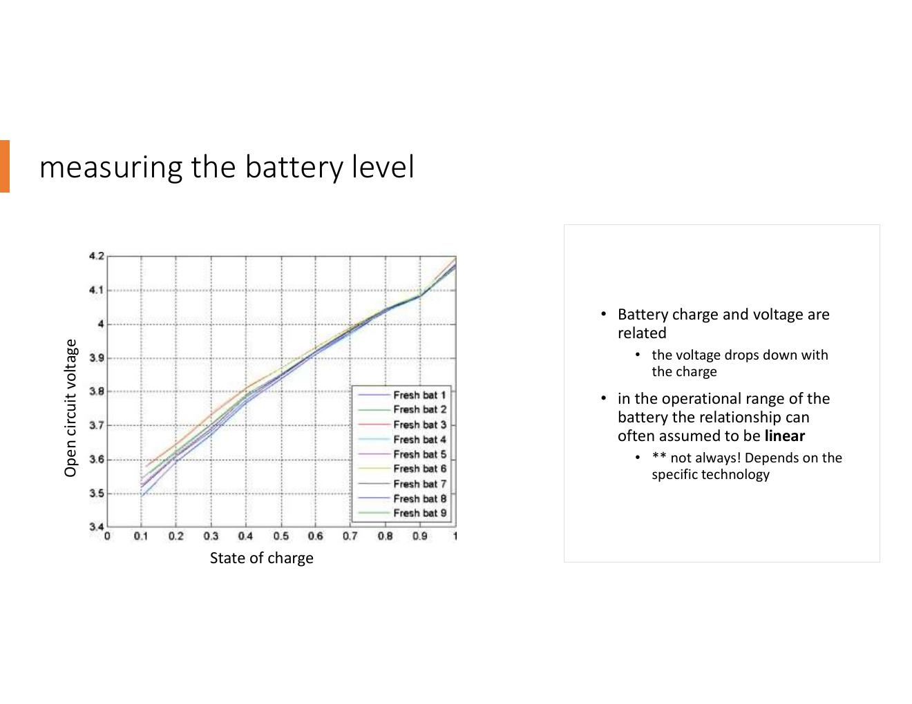
*Fig. — Tensione a circuito aperto (V) vs stato di carica (0–1) per nove batterie Li-ion nuove. La relazione è quasi lineare tra 3.4 V e 4.2 V.*

Sfruttando la linearità, si usa un **ADC** a $d$ bit per leggere la tensione e risalire alla carica. Dati $v_{\mathrm{min}}, v_{\mathrm{max}}$ (tensioni corrispondenti a $B_{\mathrm{min}}, B_{\mathrm{max}}$) e la tensione di riferimento $v_{\mathrm{ref}}$:

$$x_{\mathrm{max}} = 2^d - 1 \qquad x_{\mathrm{min}} = \mathrm{ROUND}\!\left(\frac{v_{\mathrm{min}}}{v_{\mathrm{ref}}}(2^d - 1)\right)$$

Per una tensione misurata $v$, il valore ADC è:

$$x = \mathrm{ROUND}\!\left(\frac{v}{v_{\mathrm{ref}}}(2^d - 1)\right)$$

e la carica corrispondente:

$$B = B_{\mathrm{min}} + \frac{B_{\mathrm{max}} - B_{\mathrm{min}}}{x_{\mathrm{max}} - x_{\mathrm{min}}}(x - x_{\mathrm{min}})$$

> [!example] Esempi su piattaforme reali ($B_{\mathrm{min}} = 300\,\mathrm{mAh}$)
>
> | Piattaforma | $v_{\mathrm{min}}$ | $v_{\mathrm{max}}$ | $v_{\mathrm{ref}}$ | ADC (bit) | $x_{\mathrm{min}}$ | $x_{\mathrm{max}}$ | Battery (mAh) | Campione $x$ | Carica (mAh) |
> |---|---|---|---|---|---|---|---|---|---|
> | Raspberry Pi | 3.5 V | 5 V | 0.00488 V | 10 | 716 | 1023 | 3000 | 1000 | 2798 |
> | Arduino | 7 V | 9 V | 0.00879 V | 10 | 795 | 1023 | 3000 | 800 | 359 |
> | Tmote | 1.8 V | 3 V | 0.000732 V | 12 | 2457 | 4095 | 3000 | 3277 | 1652 |

> [!example] Esercizio — Stima della carica da output ADC
>
> Un dispositivo campiona la tensione della batteria con un ADC a **10 bit**. La batteria ha una carica massima di **2000 mAh** e una tensione massima (batteria piena) di **10 V**. Quando la tensione scende a **8 V** la carica residua è **200 mAh** e il dispositivo non è più alimentabile.
>
> Calcolare la carica della batteria quando l'ADC restituisce: **920**, **830**, **1023**.
>
> **Soluzione**
>
> Con $d = 10$ bit si ha $2^d - 1 = 1023$ e $v_{\mathrm{ref}} = v_{\mathrm{max}} = 10\,\mathrm{V}$.
>
> $$x_{\mathrm{max}} = 1023 \qquad x_{\mathrm{min}} = \mathrm{ROUND}\!\left(\frac{8}{10} \times 1023\right) = \mathrm{ROUND}(818{,}4) = 818$$
>
> La carica si ricava per interpolazione lineare tra $(x_{\mathrm{min}},\, B_{\mathrm{min}})$ e $(x_{\mathrm{max}},\, B_{\mathrm{max}})$:
>
> $$B = B_{\mathrm{min}} + \frac{x - x_{\mathrm{min}}}{x_{\mathrm{max}} - x_{\mathrm{min}}} \cdot (B_{\mathrm{max}} - B_{\mathrm{min}})$$
>
> | $x$ | Calcolo | $B$ (mAh) |
> |---|---|---|
> | 920 | $200 + \dfrac{920 - 818}{1023 - 818} \times 1800 = 200 + \dfrac{102}{205} \times 1800$ | **≈ 1096** |
> | 830 | $200 + \dfrac{830 - 818}{1023 - 818} \times 1800 = 200 + \dfrac{12}{205} \times 1800$ | **≈ 305** |
> | 1023 | $200 + \dfrac{1023 - 818}{1023 - 818} \times 1800 = 200 + 1800$ | **2000** |

### Stima della produzione energetica

Se si conosce il consumo $p_c(t)$ in un intervallo $[t_1, t_2]$ e si misura la carica agli estremi, la produzione $E_s$ si stima come:

$$E_s = \int_{t_1}^{t_2} p_c(t)\,dt + [E(t_2) - E(t_1)]^+$$

Questo presuppone un buffer ideale. I limiti sono: errori di misura della carica si propagano sulla stima di $E_s$; intervalli troppo lunghi non distinguono quando l'energia era disponibile; la stima di $p_c(t)$ può non essere precisa. Il metodo alternativo è misurare direttamente corrente e tensione all'uscita della sorgente con circuiti elettronici dedicati.

---

## Neutralità energetica

> [!definition] Dispositivo energy-neutral
>
> Un dispositivo è **energy neutral** se riesce a mantenere il livello di prestazione desiderato indefinitamente, senza mai esaurire la batteria.

Questo obiettivo è radicalmente diverso dalla classica massimizzazione della vita utile: qui si mira a prestazioni indefinitamente sostenute, modulando il carico in funzione della disponibilità energetica.

Nascono due sotto-problemi complementari:
1. **Energy-Neutral Operation**: come pianificare le attività in modo che, in qualsiasi finestra temporale, l'energia consumata non superi quella raccolta?
2. **Maximum Performance**: dato l'ambiente di harvesting, qual è il massimo livello di prestazione sostenibile garantendo la neutralità energetica?

In sistemi IoT distribuiti il problema si complica: le prestazioni globali dipendono dalla distribuzione spazio-temporale dell'energia raccolta da ciascun nodo, e dalle dipendenze tra nodo e server nella elaborazione dei dati.

---

## Approccio di Kansal alla neutralità energetica

Kansal affronta il caso di sorgenti **non controllabili ma prevedibili** (tipicamente il sole). L'idea è pianificare dinamicamente il duty cycle del dispositivo slot per slot, sfruttando previsioni sulla produzione futura.

L'approccio si concentra su fonti non controllabili ma prevedibili perché:
- Le fonti non prevedibili rendono impossibile qualsiasi garanzia di prestazione.
- Le fonti controllabili rendono il problema banale (si produce energia quando serve).

### Condizioni formali

**Condizione 1 — Produzione:** l'energia prodotta in $[0, T]$ è vincolata linearmente:


$$\rho_s T - \sigma \leq E_s(T) \leq \rho_s T + \sigma$$

**Condizione 2 — Carico:** l'energia consumata in $[0, T]$ è vincolata superiormente:


$$E_c(T) \leq \rho_c T + \delta$$

> [!theorem] Teorema di Kansal
>
> Se valgono le Condizioni 1 e 2, e il buffer ha efficienza $\eta$ e leakage $\rho_l$, sono condizioni **sufficienti** per la neutralità energetica:
> 1. $\eta\,\rho_s \geq \rho_c + \rho_l$ — il tasso di produzione netta supera consumo più leakage.
> 2. $B_0 \geq \sigma + \delta$ — la carica iniziale copre le oscillazioni nel caso peggiore.
> 3. $B_{\mathrm{max}} \geq B_0$ — la carica iniziale è fisicamente ammissibile.

---

## Riepilogo

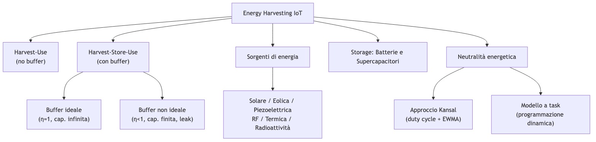
*Fig. — Mappa concettuale della lezione.*

```{=latex}
\newpage
```

# Teoria dei Segnali: Introduzione e Serie di Fourier

## Perché la Teoria dei Segnali?

I sistemi moderni — reti mobili 4G/5G, dispositivi IoT, sistemi audio — elaborano **segnali** per rappresentare e trasmettere informazione. Capire come questi segnali sono strutturati, come vengono disturbati dal canale trasmissivo, e come possono essere analizzati e trasformati è il fondamento dell'ingegneria delle comunicazioni digitali.

La teoria dei segnali serve a quattro scopi pratici fondamentali. Il primo è **estrarre informazione**: identificare frequenze, pattern ed eventi rilevanti (es. riconoscimento vocale, analisi di segnali biomedici). Il secondo è **rimuovere effetti indesiderati**: filtrare il rumore, compensare distorsioni del canale, mitigare il fading multipath nelle reti wireless. Il terzo è **trasmettere efficientemente l'informazione**: codificare i segnali per il canale (es. OFDM in 4G/5G che distribuisce i dati su più frequenze). Il quarto è **abilitare l'elaborazione digitale**: convertire segnali analogici in forma digitale tramite campionamento e quantizzazione.

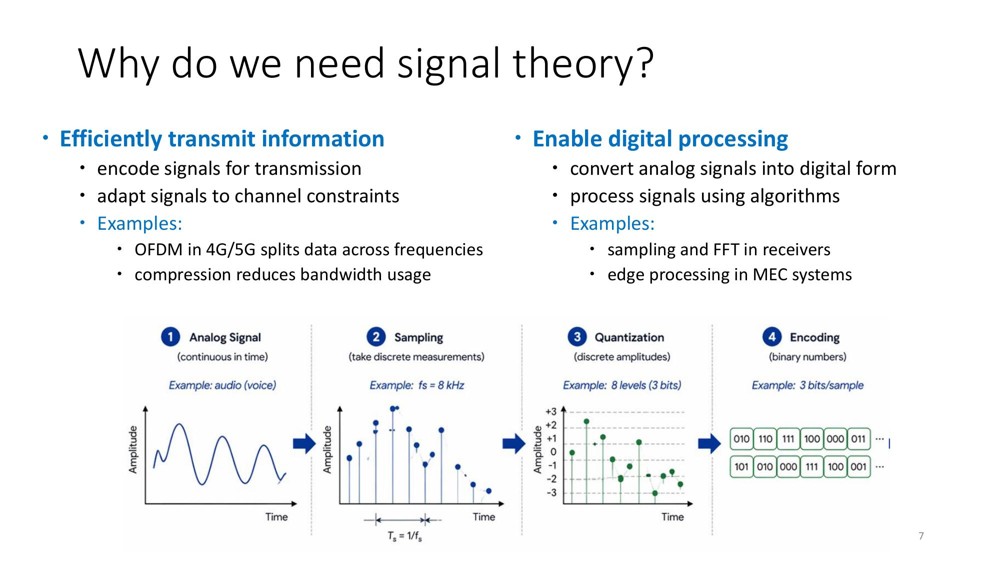
*Fig. — Dalla sorgente analogica ai bit: campionamento (discretizzazione nel tempo), quantizzazione (discretizzazione dell'ampiezza), codifica binaria.*

---

## Classificazione dei Segnali

> [!definition] Segnale
>
> Un segnale è una variazione di una grandezza fisica che porta informazione. Formalmente è una funzione $f(t): \mathfrak{D} \longrightarrow \mathfrak{C}$ dove il dominio $\mathfrak{D}$ può essere $\mathbb{R}$ (tempo continuo) o $\mathbb{Z}$ (tempo discreto), e il codominio $\mathfrak{C}$ può essere $\mathbb{R}$ (ampiezza continua) o un insieme discreto (ampiezza quantizzata).

Ci concentriamo su **segnali deterministici monodimensionali**: la variabile indipendente è il tempo, e il segnale è noto prima di essere prodotto (al contrario dei segnali aleatori, analizzati con metodi probabilistici).

### Segnali a Tempo Continuo

Quando il dominio è $\mathbb{R}$, il segnale è detto **analogico** (*analog*). Se anche il codominio è $\mathbb{R}$, l'ampiezza è continua; se il codominio è un insieme discreto (es. $\mathbb{Z}$), l'ampiezza è quantizzata.

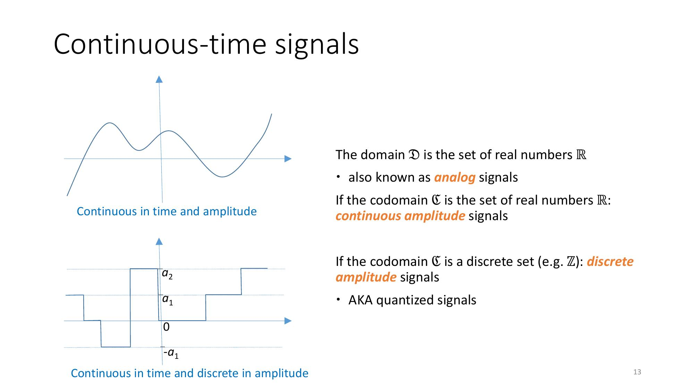
*Fig. — In alto: segnale analogico, continuo in tempo e ampiezza. In basso: segnale continuo in tempo ma quantizzato in ampiezza (segnale a gradini).*

### Segnali a Tempo Discreto

Quando il dominio è $\mathbb{Z}(T) = \{nT, \forall n \in \mathbb{Z}, T \in \mathbb{R}\}$, il segnale è detto **discreto**. Ad esempio $\mathbb{Z}(2) = \{\ldots, -4, -2, 0, 2, 4, \ldots\}$. Un segnale discreto con ampiezza presa da un insieme finito di simboli è detto **digitale** (*digital*), o sequenza simbolica.

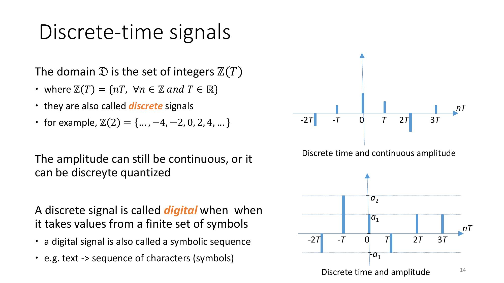
*Fig. — In alto: segnale discreto con ampiezza continua. In basso: segnale digitale, discreto sia nel tempo che nell'ampiezza.*

### Tabella Riepilogativa

| Tempo | Ampiezza | Tipo |
|---|---|---|
| Continuo ($\mathbb{R}$) | Continua ($\mathbb{R}$) | Segnale analogico |
| Continuo ($\mathbb{R}$) | Discreta ($\mathbb{Z}$) | Segnale quantizzato |
| Discreto ($\mathbb{Z}(T)$) | Continua ($\mathbb{R}$) | Segnale discreto |
| Discreto ($\mathbb{Z}(T)$) | Discreta (insieme finito) | Segnale digitale |

### Bitrate di una Sorgente Digitale

Quando un segnale analogico viene convertito in digitale con frequenza di campionamento $f_c$ campioni/secondo e ogni campione è codificato con $M$ bit:

$$\text{Bitrate} = f_c \cdot M \quad [\text{bit/secondo}]$$

Maggiori $f_c$ e $M$ producono migliore fedeltà ma richiedono maggiore capacità trasmissiva.

---

## Trasmissione e Canale

### Il Modello del Canale

Nella trasmissione di informazione, un trasduttore alla sorgente converte un messaggio in un segnale fisico (es. un'antenna converte energia elettrica in onde elettromagnetiche), il segnale si propaga attraverso il mezzo, e un trasduttore alla destinazione converte il segnale di ritorno in messaggio. Il **canale** non è un mezzo ideale: agisce come un sistema che modifica il segnale.

Le principali forme di degrado sono la **distorsione** (variazione della forma d'onda, es. attenuazione differenziata per frequenza), la **propagazione multipath** (il segnale raggiunge il ricevitore attraverso percorsi multipli con ritardi diversi, causando interferenza), e il **rumore** (segnale indesiderato sovrapposto a quello utile).

> [!definition] SNR — Signal-to-Noise Ratio
>
> Il rapporto segnale-rumore misura la qualità del segnale ricevuto rispetto al rumore di fondo:
> $$SNR_{dB} = 10 \log_{10} \frac{P_{signal}}{P_{noise}}$$

### Teorema di Shannon

Il risultato fondamentale della teoria dell'informazione stabilisce la capacità massima di un canale:

$$C = B \log_2 (1 + SNR)$$

dove $B$ è la banda disponibile in Hz, $SNR$ il rapporto segnale-rumore, e $C$ la capacità del canale in bit/secondo. Questo crea un trade-off inevitabile: ridurre la distorsione di quantizzazione alla sorgente aumenta la quantità di informazione da trasmettere, che deve rientrare entro la capacità $C$.

---

## Serie di Fourier: dal Tempo alla Frequenza

### L'Intuizione Fondamentale

Un segnale periodico può essere visto come una sovrapposizione di componenti sinusoidali, ciascuna con frequenza, ampiezza e fase specifiche. Questo cambio di prospettiva — dal dominio del tempo al **dominio della frequenza** — è cruciale perché il canale trasmissivo agisce in modo diverso su componenti a frequenza diversa. Per analizzare e predire tale comportamento, occorre identificare esplicitamente le componenti frequenziali di un segnale.

La serie di Fourier decompone una funzione come somma di infinite funzioni oscillanti a frequenze diverse. È formalmente un cambio di coordinate: dal dominio del tempo a quello della frequenza. La base di questa decomposizione è un insieme di funzioni $\varphi_n(t)$ ortogonali, analogamente alla decomposizione di un vettore in uno spazio vettoriale.

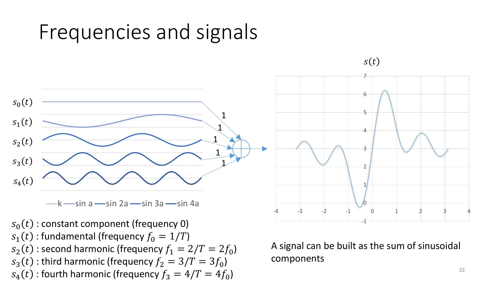
*Fig. — Un segnale si costruisce sommando componenti sinusoidali: la componente costante ($s_0$), la fondamentale ($s_1$) e le armoniche superiori ($s_2, s_3, s_4$). Cambiare i coefficienti cambia il segnale risultante.*

### Segnali Periodici Continui

Un segnale continuo $s(t): \mathbb{R} \to \mathbb{R}$ è **periodico con periodo $T$** se

$$s(t) = s(t + T) \quad \forall t \in \mathbb{R}$$

I segnali periodici si possono studiare interamente nell'intervallo $[0, T]$. La frequenza fondamentale è $f = 1/T$. Un segnale non periodico è detto **aperiodico**.

### Definizione della Serie di Fourier

> [!definition] Serie di Fourier (intervallo $[-\pi, \pi]$)
>
> Data una funzione continua $s(t): \mathbb{R} \to \mathbb{R}$ periodica in $[-\pi, \pi]$:
> $$s(t) = \frac{1}{2} a_0 + \sum_{n=1}^{\infty} \left( a_n \cos(nt) + b_n \sin(nt) \right)$$
> con coefficienti:
> $$a_0 = \frac{1}{\pi} \int_{-\pi}^{\pi} s(t)\, dt \qquad a_n = \frac{1}{\pi} \int_{-\pi}^{\pi} s(t) \cos(nt)\, dt \qquad b_n = \frac{1}{\pi} \int_{-\pi}^{\pi} s(t) \sin(nt)\, dt$$

Il termine $\frac{1}{2} a_0$ è la **componente continua** (media del segnale); i termini $a_n \cos(nt) + b_n \sin(nt)$ sono le **armoniche** di frequenza $n/T$.

### Condizioni di Dirichlet

La serie di Fourier non è definita per qualsiasi funzione. Non sono note le condizioni necessarie, ma esistono condizioni **sufficienti** (teorema di Dirichlet):

> [!theorem] Teorema di Dirichlet
>
> Se $s(t)$ è periodica e **piecewise continuous** (composta da un numero finito di pezzi continui su ogni sottointervallo finito, con limite finito nei punti di discontinuità), allora la serie di Fourier di $s(t)$ esiste e converge in $\mathbb{R}$.

### Esempio: Onda Quadra

Consideriamo il segnale periodico con periodo $2\pi$:

$$s(t) = \begin{cases} 2 & \text{se } -\pi < t < 0 \\ 1 & \text{se } 0 \le t \le \pi \end{cases}$$

Il calcolo dei coefficienti porta a:

$$a_0 = 3, \qquad a_n = 0, \qquad b_n = \begin{cases} 0 & \text{se } n \text{ pari} \\ -\frac{2}{n\pi} & \text{se } n \text{ dispari} \end{cases}$$

La serie risultante, ponendo $n = 2k-1$, è:

$$s(t) = \frac{3}{2} - \sum_{k=1}^{\infty} \frac{2}{(2k-1)\pi} \sin\bigl((2k-1)t\bigr)$$

Solo le armoniche **dispari** contribuiscono, e la loro ampiezza cala come $1/n$.

### Fenomeno di Gibbs

Quando la serie di Fourier approssima una funzione con discontinuità (come un'onda quadra), si osserva un **overshoot** intorno ai punti di salto che non scompare mai, per quanto si aumenti il numero di armoniche. Questo è il **fenomeno di Gibbs**: la serie converge in senso $L^2$, ma nelle vicinanze di ogni discontinuità l'errore rimane del ~9% del salto, indipendentemente dall'ordine di troncamento.

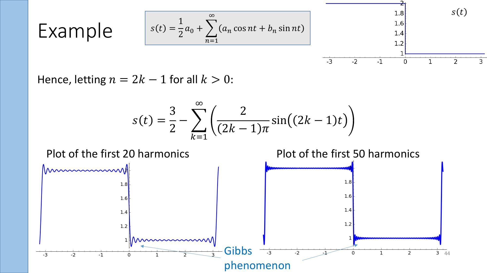
*Fig. — Fenomeno di Gibbs: aggiungere più armoniche riduce le oscillazioni nel tratto piatto, ma l'overshoot al salto rimane costante (~9% del salto).*

---

## Serie di Fourier con Periodo Arbitrario

La definizione si estende naturalmente a segnali con periodo generico $T$. Tramite la sostituzione $y = 2\pi t / T$, un segnale periodico in $[-T/2, T/2]$ si trasforma in uno periodico in $[-\pi, \pi]$, e i coefficienti diventano:

$$s(t) = \frac{1}{2} a_0 + \sum_{n=1}^{\infty} \left( a_n \cos\frac{2\pi n t}{T} + b_n \sin\frac{2\pi n t}{T} \right)$$

con

$$a_0 = \frac{2}{T} \int_{-T/2}^{T/2} s(t)\, dt \qquad a_n = \frac{2}{T} \int_{-T/2}^{T/2} s(t) \cos\frac{2\pi n t}{T}\, dt \qquad b_n = \frac{2}{T} \int_{-T/2}^{T/2} s(t) \sin\frac{2\pi n t}{T}\, dt$$

---

## Numeri Complessi e Formula di Eulero

Prima di passare alla forma esponenziale della serie, è necessario richiamare i **numeri complessi**. Un numero complesso $\bar{x} = a + jb$ ha parte reale $a$ e parte immaginaria $b$ (con $j = \sqrt{-1}$). Nel piano complesso è rappresentato come un vettore di modulo $|\bar{x}| = \sqrt{a^2 + b^2}$ e fase $\varphi = \tan^{-1}(b/a)$.

> [!definition] Formula di Eulero
>
> $$e^{\pm j\varphi} = \cos\varphi \pm j\sin\varphi$$
>
> Da cui si derivano le formule inverse:
> $$\cos\varphi = \frac{e^{j\varphi} + e^{-j\varphi}}{2} \qquad \sin\varphi = \frac{e^{j\varphi} - e^{-j\varphi}}{2j}$$

Usando l'esponenziale di Eulero, ogni numero complesso si scrive compattamente come $\bar{x} = |x| e^{j\varphi}$, che combina modulo e fase in un unico termine. Questo è particolarmente potente per rappresentare segnali: ampiezza e fase di ogni armonica vengono codificate in un unico coefficiente complesso.

---

## Serie di Fourier in Forma Esponenziale

### La Base Esponenziale

La serie di Fourier generalizzata al dominio complesso usa come base l'insieme di funzioni:

$$e^{j2\pi n F t} \quad \forall n \in \mathbb{Z}$$

poiché $e^{j2\pi n F t} = \cos(2\pi n F t) + j\sin(2\pi n F t)$, ogni elemento della base è una sinusoide complessa alla frequenza $nF$.

> [!definition] Serie di Fourier esponenziale
>
> Dato un segnale periodico $s(t) = s(t+T)$ con frequenza fondamentale $F = 1/T$:
> $$s(t) = \sum_{n=-\infty}^{+\infty} S_n \, e^{j2\pi n F t}$$
>
> dove i coefficienti $S_n$ (in generale complessi) si calcolano come:
> $$S_n = \frac{1}{T} \int_{0}^{T} s(t) \, e^{-j2\pi n F t}\, dt$$

I coefficienti $S_n$ codificano sia ampiezza che fase di ogni armonica: $S_n = |S_n| e^{j\phi_n}$, dove $|S_n|$ è l'ampiezza e $\phi_n = \arg(S_n)$ è la fase dell'armonica $n$-esima.

### Interpretazione Geometrica

Per $n = 0$: la componente continua (media del segnale), $S_0 = \frac{1}{T}\int_0^T s(t)\, dt$.  
Per $n = \pm 1$: frequenza fondamentale $F$, periodo $T$.  
Per $|n| > 1$: armoniche di frequenza $nF$, periodo $T/n$.

> [!tip] Perché la forma complessa?
>
> Con i numeri reali occorrono due coefficienti ($a_n$ e $b_n$) per descrivere ogni armonica. Con la forma complessa basta un solo coefficiente $S_n$ che ne racchiude entrambi. Questo semplifica enormemente la manipolazione matematica e consente di rappresentare segnali $s(t): \mathbb{R} \to \mathbb{C}$, generalizzando la serie per funzioni reali.

### Esempio: Onda Rettangolare con Base Esponenziale

Consideriamo il segnale di periodo $T$ e frequenza $F = 1/T$:

$$s(t) = \begin{cases} 1 & \text{se } |t| \le T/4 \\ 0 & \text{se } T/4 < |t| \le T/2 \end{cases}$$

Il calcolo dei coefficienti dà:

$$S_n = \begin{cases} 1/2 & n = 0 \\ 0 & n \text{ pari} \\ \dfrac{(-1)^k}{-(2k-1)\pi} & n = 2k-1 \end{cases}$$

La serie risultante è quindi:

$$s(t) = \frac{1}{2} + \sum_{k=-\infty}^{+\infty} -\frac{(-1)^k}{(2k-1)\pi} \cos\bigl(2\pi(2k-1)Ft\bigr)$$

Il grafico seguente mostra la convergenza della serie per $T=4$ con $k \in [-1,1]$ (verde), $k \in [-2,2]$ (rosso) e $k \in [-100,100]$ (blu):

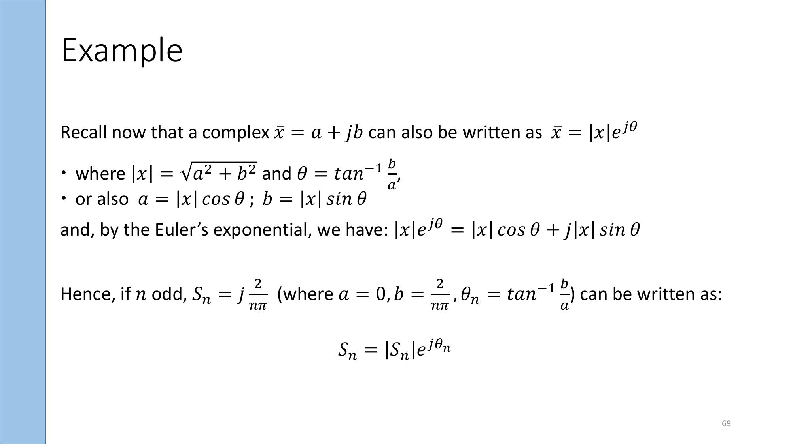
*Fig. — Al crescere del numero di armoniche considerate (verde → rosso → blu) la serie converge all'onda rettangolare. La forma in blu con k=100 è quasi perfetta, con il solo fenomeno di Gibbs ai salti.*

---

## Lo Spettro di un Segnale

La sequenza ordinata dei coefficienti $\{S_n\}_{n=-\infty}^{+\infty}$ è chiamata **spettro** del segnale. Conoscere lo spettro equivale a conoscere il segnale (dove $s(t)$ è continua; nei punti di discontinuità vale la media dei limiti laterali, per il teorema di Dirichlet).

Poiché i coefficienti $S_n$ sono in generale numeri complessi anche quando $s(t)$ è reale, lo spettro non può essere rappresentato con un singolo grafico 2D. Si usano invece due diagrammi separati, sfruttando la rappresentazione $S_n = |S_n| e^{j\theta_n}$:

- **Spettro di ampiezza**: il grafico di $|S_n|$ in funzione di $n$ (o della frequenza $nF$)
- **Spettro di fase**: il grafico di $\theta_n = \arg(S_n)$ in funzione di $n$

> [!example] Spettro dell'onda quadra antisimmetrica
>
> Per il segnale $s(t) = -1$ se $0 < t \le T/2$, $s(t) = 1$ se $T/2 < t \le T$, i coefficienti sono:
> $$S_n = \begin{cases} 0 & n \text{ pari} \\ \dfrac{2}{n\pi} e^{j\pi/2} & n > 0, \text{ dispari} \\ -\dfrac{2}{n\pi} e^{-j\pi/2} & n < 0, \text{ dispari} \end{cases}$$
> Lo spettro di ampiezza decade come $2/(|n|\pi)$ per gli indici dispari; lo spettro di fase è costante a $+\pi/2$ per $n > 0$ e $-\pi/2$ per $n < 0$.

---

## Segnali Aperiodici e Supporto Limitato

Anche per i segnali aperiodici con supporto limitato a $[a, b)$ — cioè $s(t) = 0$ per $t \notin [a,b)$ — è possibile calcolare la serie di Fourier. Tuttavia, la serie assume implicitamente che il segnale sia periodico con periodo $T = b - a$. La conseguenza è che, invertendo la serie (da $S_n$ a $s(t)$), si ottiene l'**estensione periodica** del segnale originale, non il segnale aperiodico stesso.

$$s^*(t) = \sum_{n=-\infty}^{+\infty} s(t - nT)$$

Questo passaggio è cruciale: la serie di Fourier non può rappresentare segnali davvero aperiodici. Per questi occorre la **Trasformata di Fourier** (argomento delle lezioni successive), che è in un certo senso il limite della serie di Fourier per $T \to \infty$.

---

```{=latex}
\newpage
```

# Lezione 26 — (Lab) Network Slicing

## (Lab) Network Slicing con SDN e ComNetsEmu

Questa lezione hands-on mette in pratica il concetto di **network slicing** partendo dalla teoria del 5G per arrivare a un'implementazione funzionante basata su [[Lezione 15 - (Lab) SDN Architecture|SDN]] con il controller Ryu e l'emulatore ComNetsEmu. L'obiettivo centrale è dimostrare come sia possibile partizionare una singola infrastruttura fisica in sotto-reti logicamente isolate, ciascuna con garanzie proprie di banda e connettività.

---

### Contesto: il 5G e la necessità del Network Slicing

Il 5G non è semplicemente un incremento di velocità rispetto al 4G: è una riprogettazione fondamentale dell'architettura di rete, motivata dalla coesistenza di tre categorie di servizio con requisiti radicalmente diversi tra loro.

> [!definition] mMTC — massive Machine Type Communications
>
> Comunicazione tra un numero elevatissimo di dispositivi (fino a 200.000/km²), tipicamente sensori a bassa potenza e costo. I requisiti dominanti sono la **massima efficienza energetica** e la **scalabilità della connessione**, non la latenza o la banda.

> [!definition] URLLC — Ultra-Reliable Low-Latency Communications
>
> Servizi che richiedono simultaneamente **bassa latenza** (≤ 5 ms per sistemi di trasporto intelligenti, ≤ 1 ms per motion control industriale) e **alta affidabilità**. Esempi: guida autonoma, robot industriali, smart grid.

> [!definition] eMBB — Enhanced Mobile Broadband
>
> Servizi ad alta densità di dati: streaming 4K/8K, realtà aumentata e virtuale, ologrammi. Il requisito primario è la **capacità di trasmissione** e la copertura ampia.

La coesistenza di questi tre profili rende impossibile ottimizzare un'unica rete per tutti contemporaneamente. La soluzione è il **network slicing**: invece di una rete monolitica con compromessi su tutto, si creano più reti virtuali end-to-end sopra la stessa infrastruttura fisica, ognuna ottimizzata per il proprio caso d'uso.

---

### Network Slicing: il concetto

Il network slicing sfrutta le risorse dell'infrastruttura fisica per creare multiple **sotto-reti virtuali** (slice), ciascuna delle quali si comporta come una rete indipendente dal punto di vista delle applicazioni che vi girano sopra.

Ogni slice è definita in termini di:
- **funzionalità** — quali funzioni di rete sono presenti
- **QoS** — banda garantita, latenza massima, tasso di perdita tollerato
- **isolamento** — le slice non interferiscono tra loro né in termini di prestazioni né di sicurezza

#### Ruolo di NFV e SDN

Le due tecnologie abilitanti del network slicing sono [[Lezione 20 - (Lab) Network Function Virtualization|NFV]] e [[Lezione 15 - (Lab) SDN Architecture|SDN]], con ruoli complementari.

**NFV** (Network Function Virtualization) si occupa di *implementare* le funzioni di rete di ogni slice come Virtual Network Functions (VNF) eseguite su hardware commodity. L'isolamento tra slice è garantito dalla virtualizzazione: ogni VNF vede solo le risorse assegnatele, indipendentemente dalle altre slice sulla stessa macchina fisica.

**SDN** (Software-Defined Networking) si occupa di *governare* il comportamento del traffico all'interno di ogni slice. Una volta definita la slice, il controller SDN monitora e impone i requisiti di QoS installando le flow rule appropriate sugli switch.

#### Architettura generica per il Network Slicing

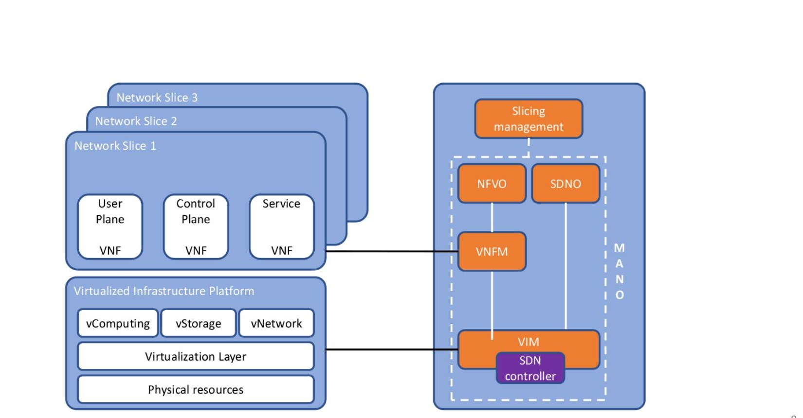

*Fig. — Architettura generica per il network slicing: le slice (sinistra) poggiano sull'infrastruttura virtualizzata, gestita dal framework MANO (destra).*

Il piano di gestione (MANO) si articola su più livelli:

- **Slicing Management**: punto di ingresso per la definizione delle slice
- **NFVO** (NFV Orchestrator): orchestra le risorse NFV a livello di sistema
- **SDNO** (SDN Orchestrator): orchestra le risorse SDN
- **VNFM** (VNF Manager): gestisce il ciclo di vita di ogni singola VNF (creazione, scaling, terminazione)
- **VIM** (Virtualized Infrastructure Manager): controlla direttamente le risorse virtualizzate (compute, storage, network)
- **SDN Controller**: implementa la logica di forwarding sugli switch

#### Il caso d'uso 5G con RAN

In un deployment 5G reale, l'architettura a slice percorre tutta la rete dall'accesso radio al core cloud. La **Radio Access Network (RAN)** è scomposta in tre unità funzionali:

- **Radio Unit (RU)**: l'hardware radio fisico, tipicamente sull'antenna
- **Distributed Unit (DU)**: elabora i livelli MAC e Fisico, distribuita vicino alla RU
- **Centralized Unit (CU)**: gestisce i protocolli di livello superiore (RRC, PDCP) e può essere ospitata nel cloud

Slice diverse (UHD, Phone, Massive IoT, Mission-critical IoT) attraversano la stessa RAN ma mantengono path di dati separati sia nell'Edge Cloud (NFV) sia nel Core Cloud (NFV), con controller SDN dedicati a ogni livello.

---

### Topologia dell'esperimento

L'esperimento implementa il network slicing su scala ridotta usando **ComNetsEmu** come emulatore e **Ryu** come controller SDN. La rete è organizzata come segue.

#### Descrizione della rete fisica

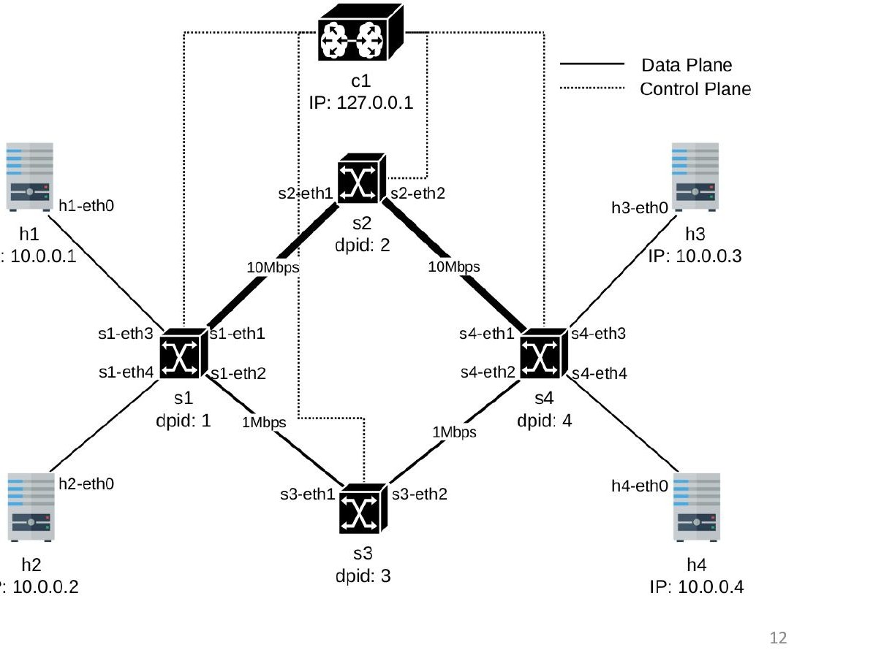

*Fig. — Topologia ad anello: il percorso superiore (S1→S2→S4) a 10 Mbps è destinato alla slice video; quello inferiore (S1→S3→S4) a 1 Mbps alla slice HTTP. Le linee tratteggiate rappresentano il control plane.*

La topologia è un **anello di quattro switch** (S1, S2, S3, S4) con host alle estremità:

- S1 ha quattro porte: eth1 verso S2, eth2 verso S3, eth3 verso h1, eth4 verso h2
- S4 ha la stessa struttura speculare: eth1 verso S2, eth2 verso S3, eth3 verso h3, eth4 verso h4
- S2 e S3 sono semplicemente di transito: due porte, una verso S1 e una verso S4
- I link superiori (via S2) hanno banda 10 Mbps; quelli inferiori (via S3) hanno banda 1 Mbps

#### Obiettivo: il Topology Slicing

L'obiettivo non è realizzare un instradamento tradizionale (dove tutti gli host si raggiungono), ma imporre un **partizionamento rigido** della topologia:

- **Upper Slice**: h1 ↔ h3, interconnessi esclusivamente tramite i link a 10 Mbps (via S2)
- **Lower Slice**: h2 ↔ h4, interconnessi esclusivamente tramite i link a 1 Mbps (via S3)

> [!warning] Isolamento completo
>
> h1 e h2 non possono comunicare tra loro, anche se sono entrambi collegati a S1. Il controller impone che il traffico entrante da eth3 (h1) esca solo da eth1 (verso S2), e il traffico da eth4 (h2) esca solo da eth2 (verso S3). La separazione è logica, non fisica.

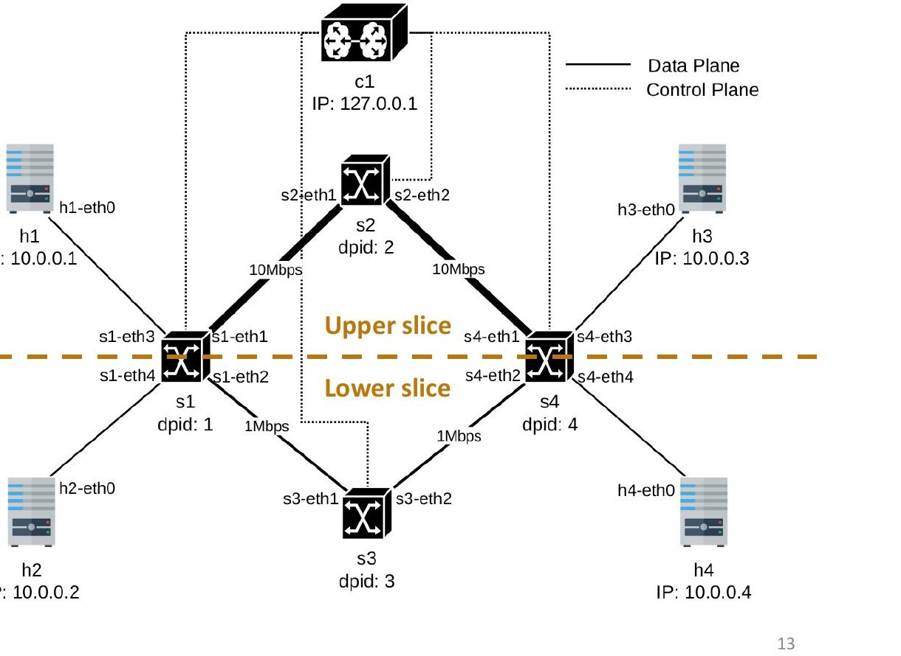
*Fig. — Le due slice risultanti: la linea arancione separa l'Upper Slice (S1-eth1/eth3 ↔ S2 ↔ S4-eth1/eth3) dalla Lower Slice (S1-eth2/eth4 ↔ S3 ↔ S4-eth2/eth4).*

Ogni host ha quindi una propria **vista della rete**: dal punto di vista di h1, la rete è semplicemente un collegamento diretto verso h3 a 10 Mbps; h2 e h4 sono invisibili.

---

### Implementazione con Ryu e Mininet

Il laboratorio si basa su due script Python nella directory `comnetsemu/app/realizing_network_slicing/`:

1. `network.py` — definisce la topologia e avvia Mininet
2. `topologyslicing.py` — applicazione Ryu che programma il comportamento degli switch

#### network.py: definizione della topologia

Lo script costruisce la topologia usando le API di Mininet. I punti chiave sono la configurazione dei link con limitazione di banda (`TCLink`) e l'assegnazione di DPID univoci agli switch.

```python
host_config = dict(inNamespace=True)
http_link_config = dict(bw=1)   # 1 Mbps
video_link_config = dict(bw=10) # 10 Mbps

## Switch con DPID esplicito
for i in range(4):
    sconfig = {"dpid": "%016x" % (i + 1)}
    self.addSwitch("s%d" % (i + 1), **sconfig)

## Link tra switch: ordine importante per i numeri di porta!
self.addLink("s1", "s2", **video_link_config)  # s1-eth1 ↔ s2-eth1
self.addLink("s2", "s4", **video_link_config)  # s2-eth2 ↔ s4-eth1
self.addLink("s1", "s3", **http_link_config)   # s1-eth2 ↔ s3-eth1
self.addLink("s3", "s4", **http_link_config)   # s3-eth2 ↔ s4-eth2

## Host: h1,h2 su s1; h3,h4 su s4
self.addLink("h1", "s1")  # → s1-eth3
self.addLink("h2", "s1")  # → s1-eth4
self.addLink("h3", "s4")  # → s4-eth3
self.addLink("h4", "s4")  # → s4-eth4
```

> [!tip] Ordine dei link = numeri di porta
>
> In Mininet, le porte di uno switch vengono numerate nell'ordine in cui i link vengono aggiunti. Poiché S1 ottiene prima il link verso S2 (eth1), poi verso S3 (eth2), poi h1 (eth3) e h4 (eth4), le porte hanno esattamente questi numeri. Lo stesso vale per S4. Questo dettaglio è fondamentale per capire la tabella `slice_to_port` in `topologyslicing.py`.

La rete viene avviata con un **controller remoto** (Ryu) in ascolto su `127.0.0.1:6633`, e `autoStaticArp=True` per evitare che i pacchetti ARP broadcast debbano essere gestiti dalla logica di slicing.

#### Programmare una rete SDN con Ryu

**Ryu** è un framework per controller SDN scritto in Python. Si basa su un modello a **eventi**: l'applicazione si registra per ricevere notifiche di specifici eventi di rete (arrivo di un pacchetto, connessione/disconnessione di uno switch, cambio di link) e reagisce installando o modificando le flow rule.

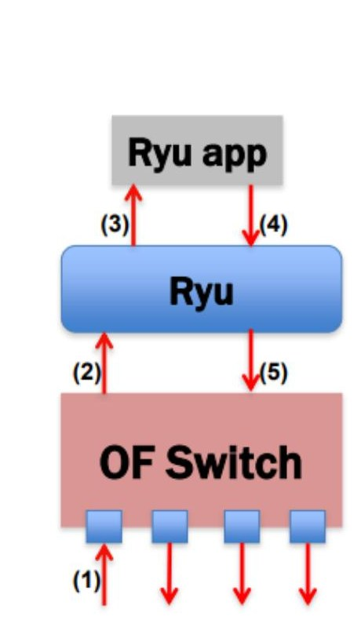

*Fig. — Stack Ryu: la Ryu app riceve eventi (frecce ③) e invia comandi (frecce ④) al layer Ryu, che comunica con l'OF Switch tramite OpenFlow (frecce ②⑤).*

Una **Ryu app** è una classe Python che:
1. Estende `ryu.base.app_manager.RyuApp`
2. Dichiara la versione di OpenFlow supportata (`OFP_VERSIONS`)
3. Registra handler per specifici eventi con il decoratore `@set_ev_cls`

#### topologyslicing.py: la logica del controller

##### Inizializzazione e slice_to_port

Il cuore della logica di slicing è il dizionario `slice_to_port`, che mappa per ogni switch (identificato dal DPID) quale porta di uscita usare a seconda della porta di ingresso:

```python
self.slice_to_port = {
    1: {1: 3, 3: 1, 2: 4, 4: 2},  # S1: eth1↔eth3 (upper), eth2↔eth4 (lower)
    4: {1: 3, 3: 1, 2: 4, 4: 2},  # S4: stesso schema di S1
    2: {1: 2, 2: 1},               # S2: forwarding diretto
    3: {1: 2, 2: 1},               # S3: forwarding diretto
}
```

> [!example] Lettura della tabella per S1
>
> Per S1 (dpid=1): se un pacchetto arriva su eth1 (da S2, upper path), viene inoltrato su eth3 (verso h1). Se arriva su eth3 (da h1), torna su eth1 (verso S2). Specularmente, eth2 (da S3, lower path) ↔ eth4 (verso h2). Il traffico di h1 non può mai raggiungere eth2 o eth4, garantendo l'isolamento.

La separazione è quindi **esclusivamente statistica su S1 e S4**: S2 e S3 non devono fare nulla di speciale, perché non ricevono mai traffico cross-slice (la separazione avviene prima di loro).

##### Gestione degli eventi OpenFlow

La classe gestisce due eventi principali:

**`switch_features_handler`** (evento `EventOFPSwitchFeatures`, fase `CONFIG_DISPATCHER`): viene invocato quando uno switch si connette al controller per la prima volta. Installa la **table-miss flow entry** con priorità 0 e match vuoto (corrisponde a qualsiasi pacchetto): l'azione è inviare al controller con `OFPP_CONTROLLER`. Questa regola garantisce che i primi pacchetti di ogni flusso vengano consegnati all'applicazione.

**`_packet_in_handler`** (evento `EventOFPPacketIn`, fase `MAIN_DISPATCHER`): viene invocato ogni volta che uno switch riceve un pacchetto senza una flow rule corrispondente e lo manda al controller. La logica è:

1. Legge il DPID dello switch e la porta di ingresso
2. Consulta `slice_to_port` per determinare la porta di uscita
3. Installa una **flow rule permanente** con `add_flow` (così i pacchetti successivi dello stesso flusso non passeranno più dal controller)
4. Invia immediatamente il pacchetto corrente con `_send_package`

```python
def _packet_in_handler(self, ev):
    msg = ev.msg
    datapath = msg.datapath
    in_port = msg.match["in_port"]
    dpid = datapath.id

    out_port = self.slice_to_port[dpid][in_port]

    actions = [datapath.ofproto_parser.OFPActionOutput(out_port)]
    match = datapath.ofproto_parser.OFPMatch(in_port=in_port)
    self.add_flow(datapath, 1, match, actions)
    self._send_package(msg, datapath, in_port, actions)
```

**`add_flow`** costruisce e invia un messaggio `OFPFlowMod` al datapath (lo switch), che modifica la flow table installando la nuova regola. Da quel momento in poi, i pacchetti che corrispondono al match vengono gestiti direttamente dallo switch senza coinvolgere il controller.

> [!note] Reactive vs Proactive flow installation
>
> Questa applicazione usa l'approccio **reattivo**: le regole vengono installate al primo pacchetto. In alternativa, un controller **proattivo** potrebbe installare tutte le regole all'avvio (`switch_features_handler`) senza aspettare traffico reale. Per questo schema di slicing statico, l'approccio proattivo sarebbe più efficiente poiché elimina la latenza del primo pacchetto.

---

### Esercizi

#### Esercizio A: esecuzione e verifica

L'avvio richiede due terminali distinti (il controller e Mininet devono girare in parallelo):

```bash
## Terminale 1 — avvia il controller Ryu
ryu-manager topology_slicing.py

## Terminale 2 — avvia Mininet (richiede sudo)
sudo python3 network.py
```

Una volta avviata la rete, si possono eseguire le verifiche:

**1. Verifica dell'isolamento (ping)**

Il ping deve avere successo solo tra host della stessa slice. Se la slicing funziona correttamente:
- `h1 ping h3` → successo (upper slice)
- `h2 ping h4` → successo (lower slice)
- `h1 ping h2` → fallimento (cross-slice, non esiste path)

**2. Verifica della banda (iperf)**

```bash
## Nel terminale Mininet
mininet> iperf h1 h3   # deve mostrare ~10 Mbps
mininet> iperf h2 h4   # deve mostrare ~1 Mbps
```

**3. Ispezione delle flow rule installate**

```bash
mininet> sh ovs-ofctl dump-flows s1
```

Dopo il primo ping tra h1 e h3, devono essere visibili due flow entry su S1:
- match `in_port=1` → action `output:3`
- match `in_port=3` → action `output:1`

La regola di default (table-miss, priorità 0) ha action `CONTROLLER`, visibile anche prima del ping.

**4. Cattura e analisi dei messaggi OpenFlow**

Per osservare il ciclo completo di comunicazione controller-switch, si può catturare il traffico sulla porta 6633 con tcpdump e analizzarlo in Wireshark:

```bash
## Apri un nuovo terminale
sudo tcpdump -i any port 6633 -w ofcapturedel.pcap

## Cancella le flow rule su s1 per forzare nuovi PACKET_IN
mininet> sh ovs-ofctl del-flows s1 table=0,in_port="s1-eth1"
mininet> sh ovs-ofctl del-flows s1 table=0,in_port="s1-eth3"

## Genera traffico e osserva i messaggi
mininet> h1 ping h3
```

In Wireshark si possono distinguere tre tipi di messaggi OpenFlow rilevanti:
- `PACKET_IN`: lo switch invia il pacchetto al controller (manca la flow rule)
- `PACKET_OUT`: il controller risponde con l'azione immediata per il pacchetto corrente
- `FLOW_MOD`: il controller installa la regola permanente sullo switch

```{=latex}
\newpage
```

# Teoria dei Segnali: Trasformata di Fourier, Campionamento e DFT

Questa lezione è la continuazione diretta della [[Lezione 25 - (Lab) Teoria dei Segnali - Introduzione e Serie di Fourier|Lezione 25]], che ha introdotto la classificazione dei segnali, la trasmissione, la serie di Fourier e lo spettro. Qui si affronta il salto concettuale fondamentale: estendere l'analisi in frequenza ai segnali **non periodici** mediante la Trasformata di Fourier, poi si passa al problema pratico della conversione analogico-digitale e all'analisi spettrale di segnali campionati tramite la DFT.

---

## Trasformata di Fourier

### Dal Discreto al Continuo: Passaggio dalla Serie alla Trasformata

La serie di Fourier, vista nella lezione precedente, funziona bene per segnali periodici: rappresenta il segnale come somma di armoniche a frequenze discrete $nF = n/T$. Ma la stragrande maggioranza dei segnali reali di interesse — impulsi, transitori, frammenti audio, burst radio — non sono periodici. Come estendere l'analisi in frequenza a questi segnali?

L'idea è elegante: si considera il segnale non periodico come il limite di un segnale periodico il cui periodo $T$ tende all'infinito. Quando $T$ cresce, la frequenza fondamentale $F = 1/T$ diminuisce, e le armoniche discrete $nF$ si avvicinano sempre di più tra loro. Nel limite $T \to \infty$, la spaziatura tra le armoniche $\Delta_f = 1/T \to 0$ e lo spettro discreto diventa uno **spettro continuo**.

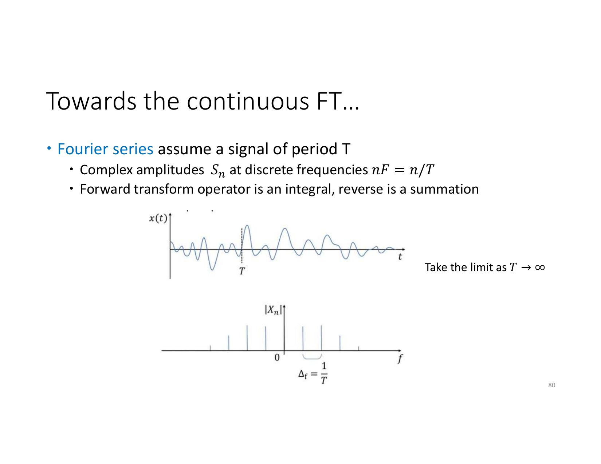
*Fig. — Segnale periodico e relativo spettro discreto. All'aumentare di T, le righe spettrali si avvicinano. Prendendo il limite T→∞ si ottiene lo spettro continuo.*

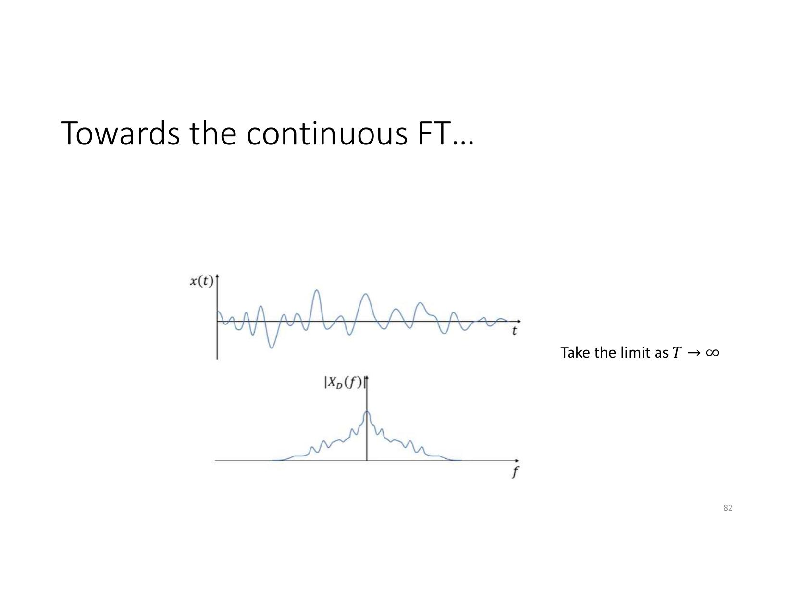
*Fig. — Quando T→∞, il segnale "dimentica" la propria periodicità e lo spettro |X_D(f)| diventa una funzione continua della frequenza.*

> [!definition] Trasformata Continua di Fourier (CFT)
>
> Un segnale non periodico $s(t)$ può essere espresso come:
>
> $$s(t) = \int_{-\infty}^{+\infty} S(f)\, e^{j2\pi ft}\, df$$
>
> dove $S(f)$ è la **densità spettrale complessa**, data dalla trasformata diretta:
>
> $$S(f) = \mathcal{F}(s(t)) = \int_{-\infty}^{+\infty} s(t)\, e^{-j2\pi ft}\, dt$$
>
> Si scrive in forma compatta $s(t) \Longleftrightarrow S(f)$.

A differenza della serie di Fourier — che produce un insieme **discreto** di coefficienti $S_n$ — la CFT produce uno spettro **continuo** $S(f)$ definito su tutte le frequenze reali $f \in (-\infty, +\infty)$.

### Esempio: Segnale Pulsato

Consideriamo il segnale rettangolare:

$$s(t) = \begin{cases} 1 & \text{se } |t| \leq T/2 \\ 0 & \text{altrimenti} \end{cases}$$

La sua trasformata continua di Fourier si calcola analiticamente:

$$S(f) = \int_{-T/2}^{T/2} e^{-j2\pi ft}\, dt = T \cdot \text{sinc}(\pi f T) = \frac{\sin(\pi f T)}{\pi f}$$

Il risultato è una funzione **sinc** nel dominio della frequenza. Un fatto cruciale è che all'aumentare di $T$ (impulso più largo nel tempo), lo spettro si restringe in frequenza, e viceversa. Questo è il principio di **incertezza tempo-frequenza**: un segnale non può essere contemporaneamente concentrato sia nel tempo che in frequenza.

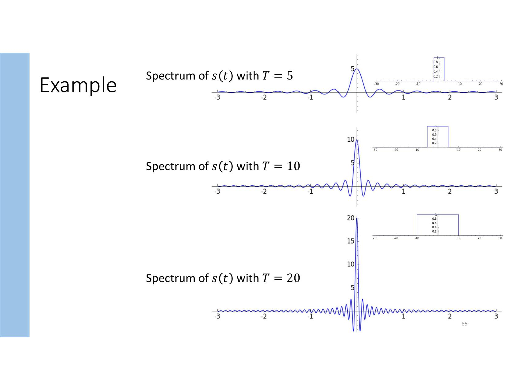
*Fig. — Spettri del segnale pulsato al variare della durata T. All'aumentare di T il lobo principale della sinc si restringe, riflettendo il principio di incertezza tempo-frequenza.*

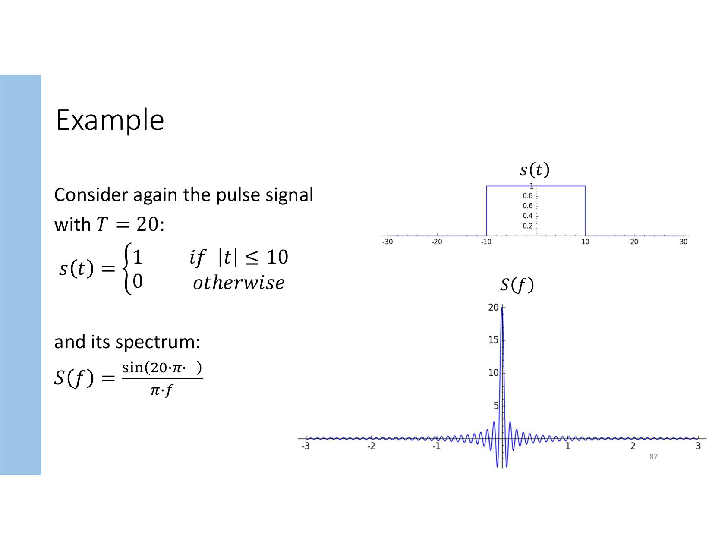
*Fig. — Segnale pulsato con T=20: il segnale nel dominio del tempo (rettangolo di ampiezza 1 e durata 20) e il corrispondente spettro S(f)=sin(20πf)/(πf).*

### Banda di un Segnale e Filtraggio

Lo spettro di un segnale generico si estende su tutte le frequenze in $(-\infty, +\infty)$. Tuttavia, nella pratica non tutte le componenti frequenziali sono ugualmente utili o necessarie. Filtrare un segnale significa **selezionare un sottoinsieme delle sue componenti spettrali**. Le motivazioni principali sono:

- alcune frequenze contengono l'informazione rilevante, altre corrispondono a rumore o interferenze
- i canali di comunicazione hanno banda disponibile limitata
- si vuole separare segnali che si sovrappongono in frequenza

I filtri principali sono:
- **Filtro passa-basso** (*low-pass*): lascia passare le frequenze sotto una soglia $f_c$, blocca le alte frequenze
- **Filtro passa-alto** (*high-pass*): lascia passare le frequenze sopra $f_c$, blocca le basse
- **Filtro passa-banda** (*band-pass*): lascia passare le frequenze in un intervallo $[f_1, f_2]$

> [!example] Filtraggio del segnale pulsato
>
> Consideriamo il segnale rettangolare con $T=20$ e il suo spettro $S(f) = \sin(20\pi f)/(\pi f)$.

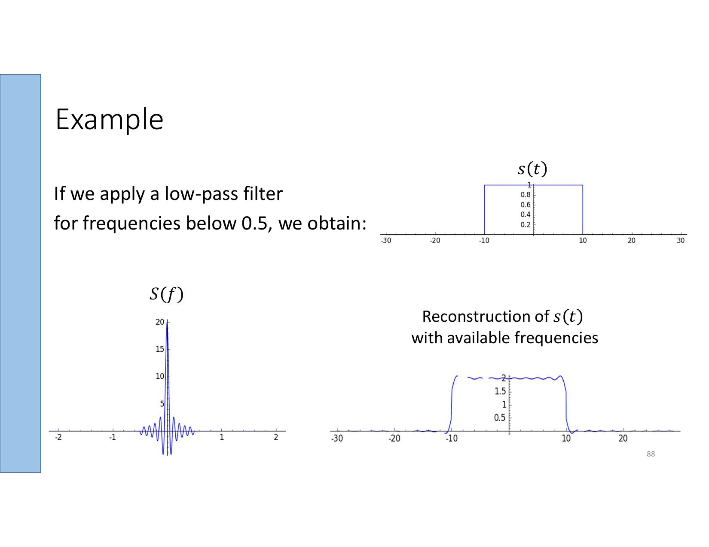
*Fig. — Filtro passa-basso (soglia 0.5 Hz): lo spettro viene troncato alle basse frequenze. La ricostruzione nel dominio del tempo riproduce approssimativamente la forma del rettangolo, con arrotondamento agli spigoli.*

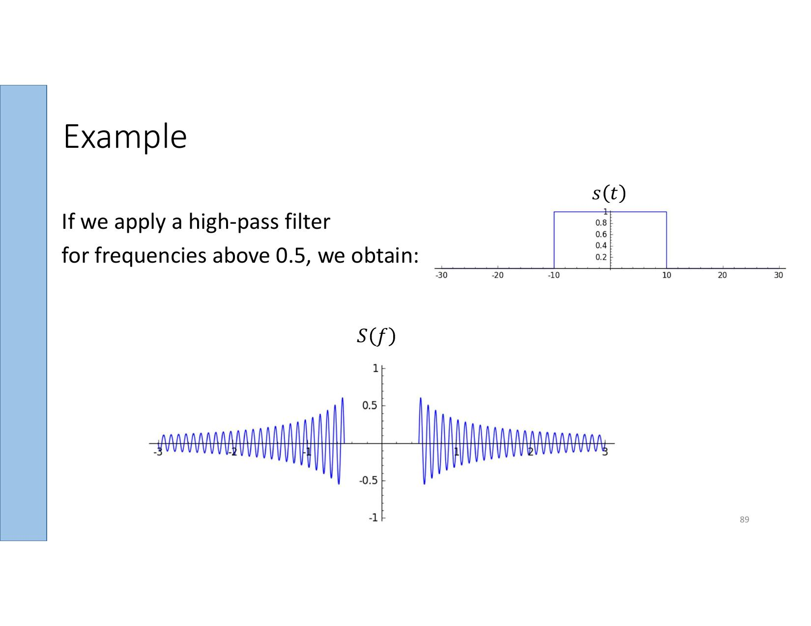
*Fig. — Filtro passa-alto (soglia 0.5 Hz): rimangono solo le componenti ad alta frequenza dello spettro. Il segnale ricostruito ha una forma oscillatoria concentrata ai bordi del rettangolo originale.*

![Applicazione di un filtro passa-banda per f∈[0.1, 0.5]](images/lezione-27-lab-teoria-dei-segnali-trasformata-di-fourier-campionamento-e-dft-img-07.jpg)
*Fig. — Filtro passa-banda (intervallo [0.1, 0.5] Hz): vengono selezionate le componenti in una fascia di frequenze. Il risultato è un segnale oscillante.*

> [!tip] Intuizione sul filtraggio
>
> Applicare un filtro nel dominio della frequenza equivale a moltiplicare lo spettro $S(f)$ per la risposta del filtro $H(f)$. Nel dominio del tempo questo corrisponde a una convoluzione del segnale con la risposta impulsiva del filtro. Le basse frequenze determinano il "contorno grossolano" del segnale; le alte frequenze determinano i dettagli fini e gli spigoli.

### Confronto: Serie di Fourier vs Trasformata

| | Serie di Fourier | Trasformata di Fourier |
|---|---|---|
| Tipo di segnale | Periodico | Non periodico |
| Spettro | Discreto (coefficienti $S_n$) | Continuo ($S(f)$) |
| Output | Insieme di coefficienti | Funzione continua di frequenza |
| Esempi tipici | Onda quadra, sinusoidi | Impulsi, transienti, frammenti audio |

---

## Da Segnale Analogico a Digitale: Campionamento e Quantizzazione

I sistemi digitali moderni (computer, smartphone, dispositivi IoT) lavorano esclusivamente con dati discreti. Un segnale analogico continuo, come una voce o un sensore di temperatura, deve essere convertito in una sequenza di valori discreti. Questo processo si articola in due fasi: **campionamento** e **quantizzazione**.

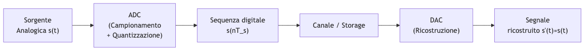
*Fig. — Pipeline di conversione analogico-digitale e digitale-analogica. L'ADC introduce inevitabilmente un errore di quantizzazione; il DAC ricostruisce un'approssimazione del segnale originale.*

### Campionamento

**Campionare** un segnale $s(t)$ significa estrarre i valori che il segnale assume a istanti discreti regolarmente spaziati. Il parametro chiave è il **periodo di campionamento** $T_s$ (o equivalentemente la **frequenza di campionamento** $f_s = 1/T_s$):

$$g(nT_s) = s(nT_s), \quad n \in \mathbb{Z}$$

Il risultato è una sequenza di numeri reali. A differenza della quantizzazione, il campionamento — sotto opportune ipotesi — non introduce perdita di informazione.

### Quantizzazione

Mentre il campionamento opera sull'asse del tempo, la quantizzazione opera sull'asse dell'ampiezza: trasforma ogni campione reale $x \in \mathbb{R}$ in un valore intero $y \in [0, 2^R - 1]$, dove $R$ è il numero di bit del quantizzatore. Si usa un **quantizzatore scalare a $R$ bit**:

- la **risoluzione** per un segnale con valori in $[0, M]$ è $M / 2^R$
- il **bitrate** di una sorgente campionata a $f_s$ e quantizzata a $R$ bit è: $B = R \cdot f_s$ bit/s

> [!warning] Errore di quantizzazione
>
> La quantizzazione introduce un errore irreversibile: due valori analogici diversi possono essere mappati allo stesso livello digitale. Aumentare $R$ riduce l'errore (migliore fedeltà), ma aumenta il bitrate da trasmettere o memorizzare.

> [!example] Sistema telefonico analogico
>
> La voce umana ha un contenuto informativo utile fino a circa 4 kHz (limite telefonico accettabile). Quindi:
> - frequenza di campionamento: $f_s = 8$ kHz (doppio di 4 kHz, come vedremo con Nyquist)
> - quantizzazione su $R = 8$ bit per campione
> - bitrate risultante: $B = 8 \times 8000 = 64$ kbps

### Interpolazione e Ricostruzione

Dato un insieme di campioni, esistono vari metodi di ricostruzione del segnale analogico:
- **Zero-order hold**: ogni campione viene "tenuto" fino al successivo (segnale a gradini)
- **First-order hold**: interpolazione lineare tra campioni adiacenti
- **Interpolazione con seno cardinale** (*sinc interpolation*): metodo ottimale, usato nella dimostrazione del teorema di Nyquist

---

## Il Teorema di Campionamento di Nyquist-Shannon

La domanda centrale della conversione A/D è: **a quale frequenza minima devo campionare per poter ricostruire perfettamente il segnale originale?**

> [!theorem] Teorema di Nyquist-Shannon
>
> Sia $s(t)$ un segnale con spettro nullo per frequenze superiori a $f_M$ (segnale **a banda limitata**). Allora $s(t)$ è completamente determinato dai suoi campioni presi all'intervallo:
>
> $$T_s \leq \frac{1}{2f_M}$$
>
> ovvero con frequenza di campionamento $f_s \geq 2f_M$. La frequenza minima $f_N = 2f_M$ è chiamata **frequenza di Nyquist** o **tasso di Nyquist**.
>
> La ricostruzione esatta si ottiene tramite interpolazione con seno cardinale:
> $$s(t) = \sum_{n=-\infty}^{+\infty} s(nT_s) \cdot \frac{\sin(\pi f_s (t - nT_s))}{\pi f_s (t - nT_s)}$$

Il teorema richiede che il segnale sia **strettamente a banda limitata** — condizione che, come vedremo, non è mai soddisfatta dai segnali reali.

---

## Aliasing: Il Problema del Sottocampionamento

Per capire cosa succede quando si campiona troppo lentamente, bisogna guardare allo spettro del segnale campionato nel dominio della frequenza.

### FT del Segnale Campionato

Quando si campiona un segnale $s(t)$ con frequenza $f_s$, la trasformata di Fourier del segnale campionato **consiste in infinite repliche** dello spettro originale $S(f)$, centrate alle frequenze multiple di $f_s$:

$$S_c(f) = f_s \sum_{k=-\infty}^{+\infty} S(f - kf_s)$$

La spaziatura tra le repliche è pari a $f_s$: **più veloce è il campionamento, più distanti sono le repliche**.

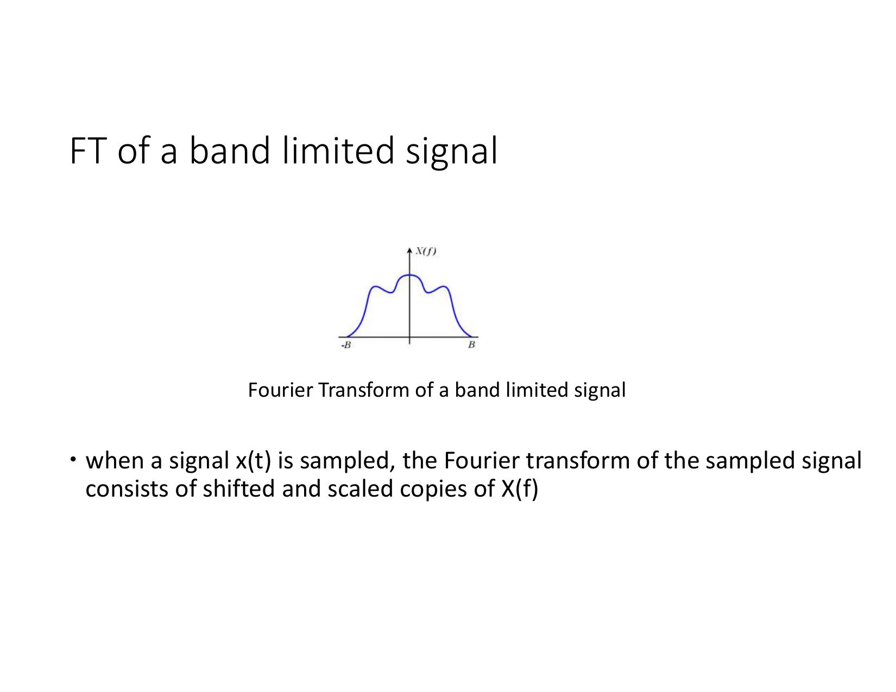
*Fig. — Trasformata di Fourier di un segnale a banda limitata B. Quando il segnale viene campionato, lo spettro si "replica" attorno a multipli della frequenza di campionamento fs.*

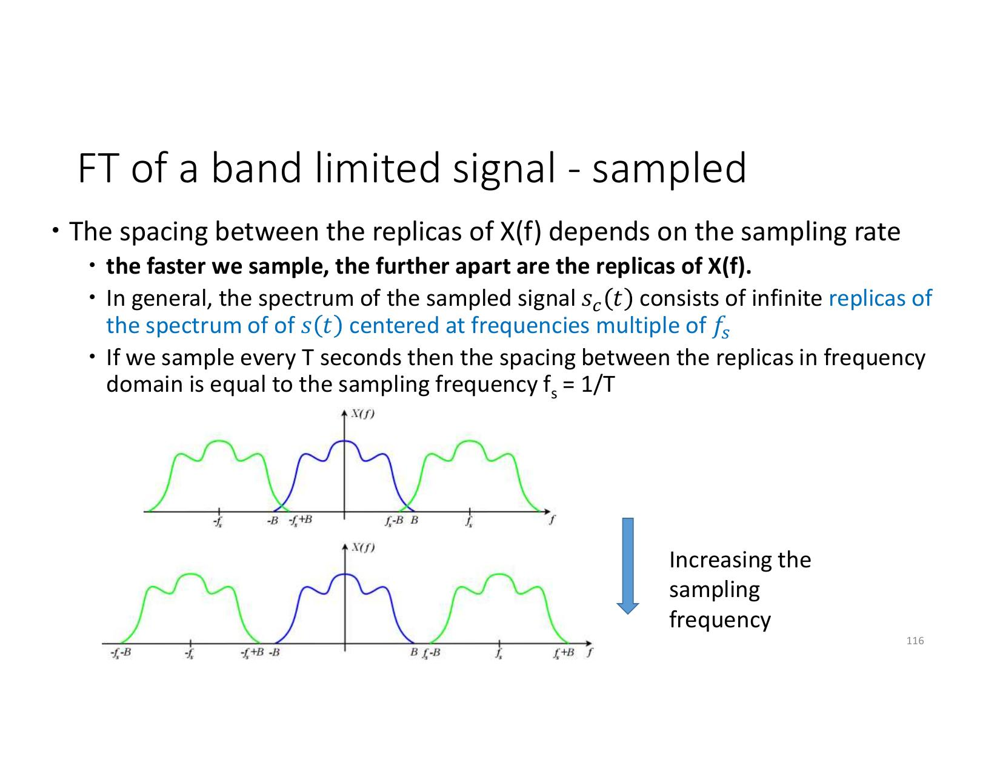
*Fig. — Aumentando la frequenza di campionamento, le repliche dello spettro si allontanano. Con campionamento sufficientemente veloce (in basso), le repliche non si sovrappongono e il segnale originale è recuperabile applicando un filtro passa-basso.*

> [!definition] Aliasing
>
> L'**aliasing** è la distorsione che si verifica quando le repliche spettrali generate dal campionamento si **sovrappongono** tra loro. Quando c'è sovrapposizione, le componenti frequenziali si mescolano e il segnale originale non può più essere ricostruito univocamente.

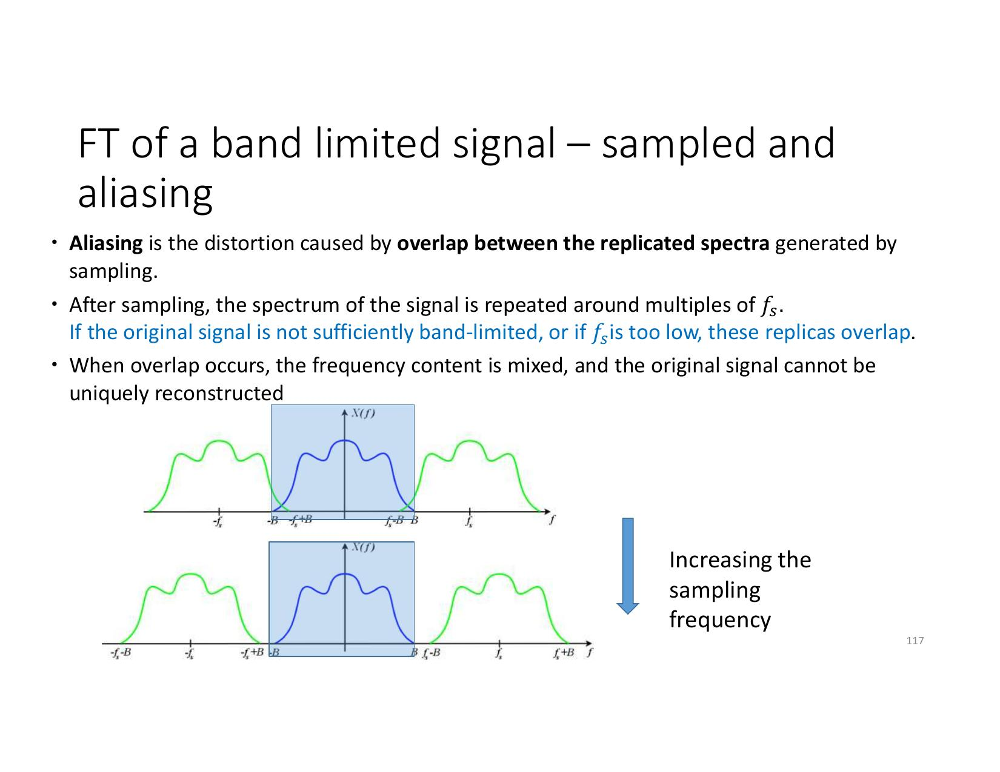
*Fig. — Aliasing per frequenza di campionamento insufficiente: la spaziatura tra repliche è minore di 2B e le code degli spettri si sovrappongono, rendendo impossibile la ricostruzione.*

La condizione di Nyquist garantisce che **non ci sia sovrapposizione**: se $f_s \geq 2f_M$, le repliche distano almeno $2B$ e possono essere separate con un filtro passa-basso ideale.

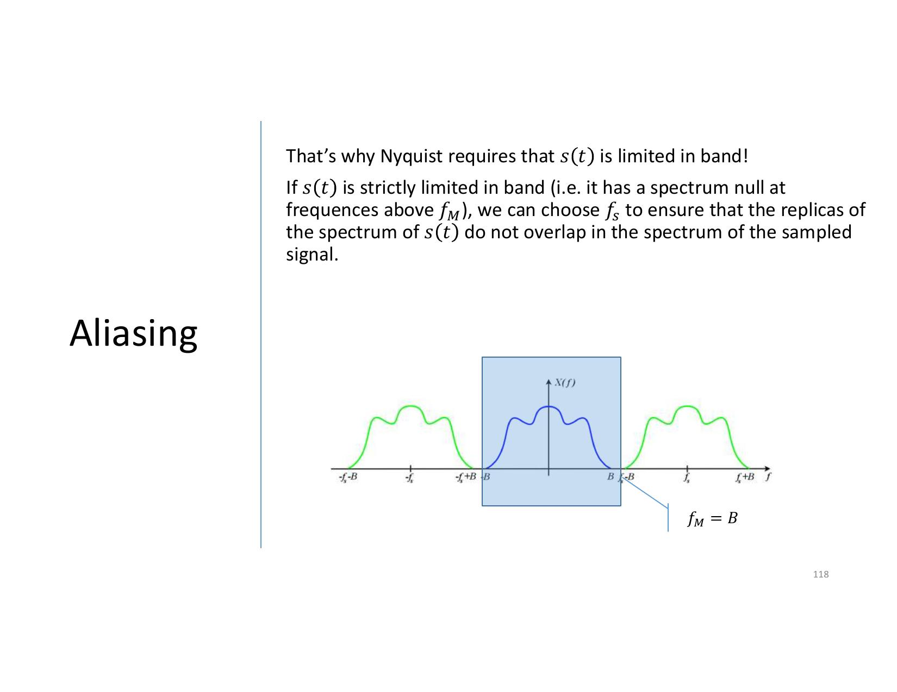
*Fig. — Quando la condizione di Nyquist è soddisfatta (fs = 2B = 2fM), le repliche dello spettro si toccano esattamente senza sovrapporsi: il segnale originale è recuperabile con un filtro ideale.*

### Cosa Nyquist Non Ha Detto

Il teorema di Nyquist è spesso mal interpretato nella pratica. Ecco le trappole più comuni:

> [!warning] Limiti pratici del teorema di Nyquist
>
> 1. **Nessun segnale reale è strettamente a banda limitata.** Un segnale a banda strettamente limitata deve estendersi infinitamente nel tempo, il che è fisicamente impossibile. In pratica, i segnali hanno uno spettro che decade ma non si azzera mai.
>
> 2. **Campionare a $2f_M$ non basta se non si usa un filtro anti-aliasing perfetto.** I filtri reali non hanno una risposta rettangolare ideale: frequenze superiori a $f_M$ passano, seppur attenuate. Il risultato è un aliasing residuo non trascurabile.
>
> 3. **La soluzione pratica è l'oversampling**: campionare a una frequenza significativamente superiore a $2f_M$, e applicare un filtro anti-aliasing con taglio a $f_M$ (anche se non ideale, l'attenuazione supplementare è sufficiente).

> [!example] Oversampling nel telefono (old analog)
>
> Il telefono analogico tradizionale tagliava la voce a ~3 kHz (non 4 kHz) e campionava a 8 kHz: non il doppio del taglio (che sarebbe 6 kHz), ma un oversampling moderato. La differenza copre l'imperfezione del filtro e le componenti residue tra 3 e 4 kHz.

> [!note] Downsampling e segnali periodici
>
> Una curiosità: per segnali **strettamente periodici** e stabili, si può addirittura *sottocampionare* ($f_s < 2f_M$). Ogni campione cade in una fase diversa del ciclo (perché il periodo di campionamento non è un multiplo del periodo del segnale). Raccogliendo abbastanza campioni nel tempo, si coprono tutte le fasi del segnale e la ricostruzione diventa possibile. Questo funziona **solo** se il segnale non varia nel tempo.

---

## Trasformata Discreta di Fourier (DFT)

Nel contesto del **digital signal processing**, né la serie di Fourier (richiede un segnale periodico continuo) né la CFT (richiede un'integrazione continua) sono direttamente applicabili: si ha sempre un numero finito di campioni. La **DFT** è lo strumento adatto.

### Motivazione

Data una sequenza finita di $N$ campioni $s_k$ (con $k = 0, 1, \ldots, N-1$), ottenuta campionando un segnale a frequenza $f_s$ per un tempo $T = N/f_s$, si tratta il segnale discreto come se fosse **periodico con periodo $T$** e si calcola la serie di Fourier corrispondente. I coefficienti risultanti formano la DFT.

### Definizione della DFT

> [!definition] Trasformata Discreta di Fourier (DFT)
>
> Data una sequenza $s_k$ di $N$ valori ($k = 0, 1, \ldots, N-1$):
>
> **Trasformata diretta:**
> $$S_n = \sum_{k=0}^{N-1} s_k \, e^{-j2\pi nk/N}, \quad n = 0, 1, \ldots, N-1$$
>
> **Trasformata inversa:**
> $$s_k = \frac{1}{N} \sum_{n=0}^{N-1} S_n \, e^{j2\pi nk/N}$$
>
> La frequenza del bin $n$-esimo è $f_n = n \cdot \Delta f$, dove la **risoluzione in frequenza** è:
> $$\Delta f = \frac{f_s}{N} = \frac{1}{T}$$

La DFT prende in input un array di $N$ valori e restituisce un array di $N$ valori complessi: entrambe le operazioni sono **somme** (non integrali), quindi direttamente implementabili su un computer.

> [!example] Esempio DFT
>
> Sequenza di 8 campioni: $s[n] = 1$ per $n = 0,1,2,3$ e $s[n] = 0$ per $n = 4,5,6,7$.
>
> I coefficienti DFT risultano:
> - $S_0 = 4$ (componente DC)
> - $S_1 = 1 - j2.414$
> - $S_2 = 1 - j0.414$  
> - $S_3 = 1 + j0.414$
> - $S_4 = 1 + j2.414$
> - $S_5 = S_6 = S_7 = 0$ (per parità)

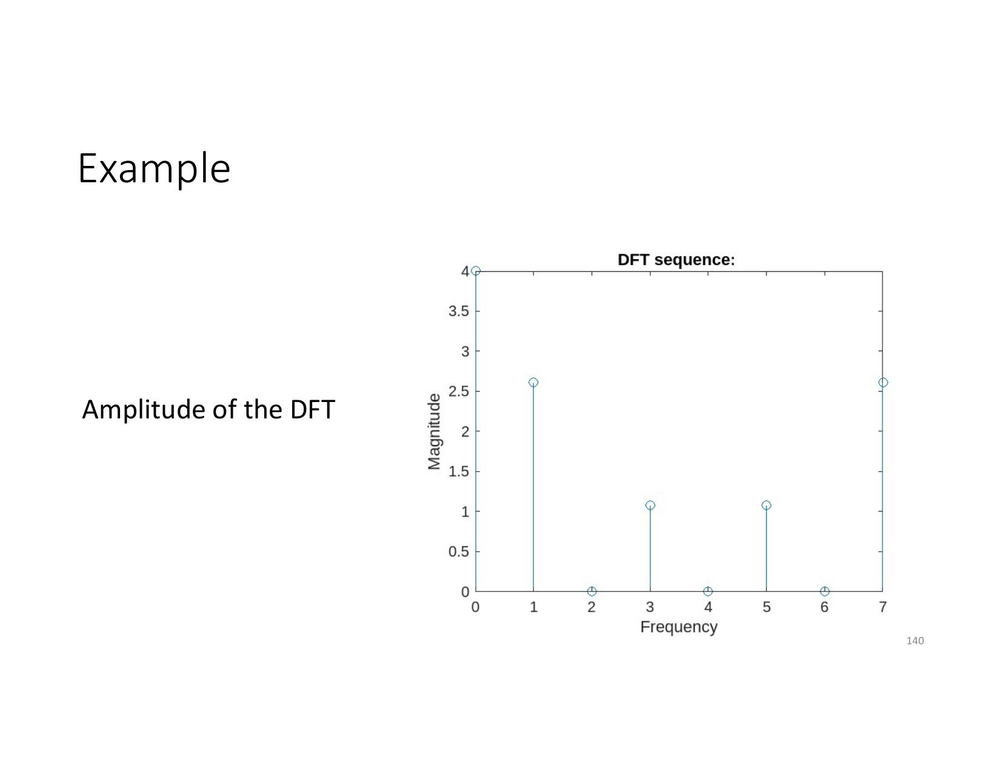
*Fig. — Spettro di ampiezza |S_n| della DFT dell'esempio. Il valore DC (n=0) vale 4, poi i bin hanno ampiezze che decrescono. La simmetria attorno a N/2 è caratteristica della DFT di segnali reali.*

### Fast Fourier Transform (FFT)

Il calcolo diretto della DFT richiede $O(N^2)$ operazioni. Per sequenze lunghe (audio HD: $N = 44100$ o più), questo è proibitivo. La **FFT** (Fast Fourier Transform) è una famiglia di algoritmi che sfruttano la struttura periodica dell'esponenziale complesso per ridurre la complessità a $O(N \log N)$.

> [!note] Condizione sulla lunghezza
>
> Per la FFT più efficiente (algoritmo di Cooley-Tukey), $N$ deve essere una potenza di 2: $N = 2^k$. Per questo le frequenze di campionamento standard come 44100 Hz vengono spesso arrotondate a $N = 32768$ o $65536$ campioni per la trasformazione.

### Commenti sulla DFT

**Risoluzione in frequenza.** La DFT non ha una risoluzione arbitraria: i "bin" sono spaziati di $\Delta f = f_s / N$. Se una componente del segnale cade tra due bin, la sua energia si spalma su più bin adiacenti (**spectral leakage**). Per migliorare la risoluzione si deve aumentare $N$ (osservare il segnale più a lungo).

**Frequenza di Nyquist nella DFT.** L'analisi spettrale affidabile tramite DFT è possibile solo per frequenze $f < f_s/2$: le componenti oltre la frequenza di Nyquist vengono mappate a frequenze errate (aliasing). Filtri anti-aliasing vengono applicati prima del campionamento per rimuovere le componenti fuori banda.

```{=latex}
\newpage
```

# Kansal's Problem: Energy Neutrality nei Sistemi IoT

## Il Contesto del Problema

Il problema di **energy management** per dispositivi IoT alimentati da sorgenti rinnovabili è intrinsecamente legato alla natura della sorgente di energia. Kansal considera il caso di sorgenti **prevedibili ma non controllabili**: fonti come l'energia solare sono soggette a variazioni giornaliere e stagionali, ma il loro andamento nel tempo può essere stimato con buona precisione. L'approccio non si estende a sorgenti imprevedibili (problema troppo difficile, impossibile garantire performance) né a sorgenti controllabili (problema banale: basta produrre energia su richiesta).

L'obiettivo del power management è triplice:
- mantenere il sistema **energy neutral**, cioè fare in modo che la batteria non si esaurisca mai;
- **evitare che il dispositivo si spenga** prima del prossimo ciclo di ricarica;
- **massimizzare le prestazioni** del nodo, ossia la sua utility.

L'approccio consiste nel tener conto del livello attuale e atteso della batteria, modulare dinamicamente le prestazioni del dispositivo (e quindi il carico energetico), garantendo che il dispositivo non scenda sotto le performance minime.

---

## Modello Formale: le Due Condizioni

### Condizione 1 — Produzione di Energia

La quantità totale di energia prodotta nell'intervallo $[0, T]$ è definita come:

$$
E_T = \int_T P_s(t) \, dt
$$

dove $P_s(t)$ è la potenza istantanea della sorgente. Kansal assume che questa quantità sia **bounded** da un corridoio lineare: esistono due costanti reali $\rho_s$ e $\sigma$ tali che:

$$
\rho_s \cdot T - \sigma \leq E_T \leq \rho_s \cdot T + \sigma
$$

Il parametro $\rho_s$ rappresenta il **trend medio** di produzione (la pendenza), mentre $\sigma$ è il **burst bound** che cattura la variabilità a breve termine attorno alla retta di tendenza.

![Grafico Condizione 1 – Energia prodotta nell'intervallo [0,T] bounded tra due rette](images/lezione-28-kansal-problem-e-energy-neutrality-img-01.jpg)
*Fig. 1 — La curva blu mostra l'energia prodotta cumulativa $E_T$ che oscilla tra le due rette tratteggiate $\rho_s T \pm \sigma$.*

### Condizione 2 — Consumo (Load)

Analogamente, il consumo totale $L_T$ nell'intervallo $[0, T]$ è:

$$
L_T = \int_T P_c(t) \, dt
$$

e si assume anch'esso bounded (da sopra) da una retta lineare parametrizzata da $\rho_c$ e $\delta$:

$$
0 \leq L_T \leq \rho_c \cdot T + \delta
$$

Il consumo può essere modulato dal sistema (è una variabile controllata), mentre la produzione è data dalla natura.

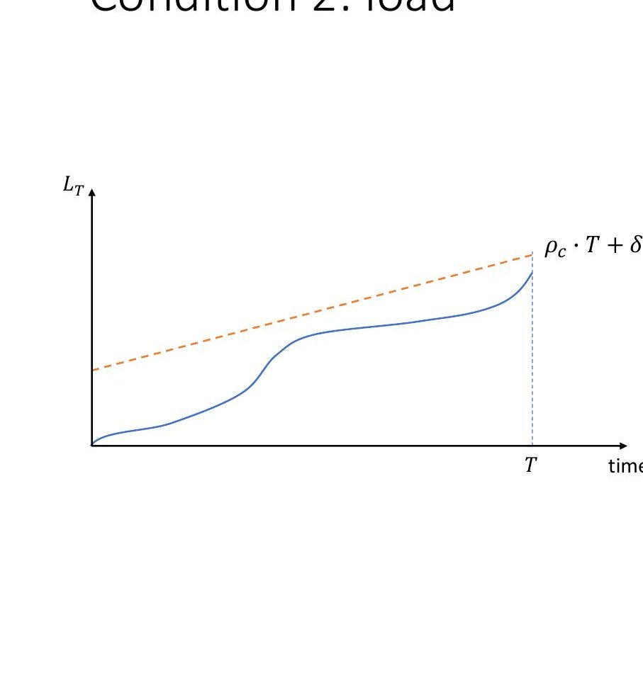
*Fig. 2 — Il consumo cumulativo $L_T$ rimane al di sotto della retta $\rho_c T + \delta$.*

---

## Il Teorema di Kansal

> [!theorem] Condizione sufficiente per Energy Neutrality
>
> Se le assunzioni sulle condizioni 1 e 2 valgono, e la batteria è caratterizzata da:
> - **efficienza di carica** $\eta$ (frazione dell'energia prodotta effettivamente immagazzinata)
> - **leakage** $\rho_{leak}$ (perdita di energia per autoscarica)
>
> allora una condizione **sufficiente** per la neutralità energetica del sistema è:
>
> $$
> \begin{cases}
> \eta \rho_s \geq \rho_c + \rho_{leak} \\
> B_0 \geq \eta\sigma + \delta \\
> B_{max} \geq B_0
> \end{cases}
> $$
>
> Le tre condizioni garantiscono rispettivamente che: (1) il trend di produzione (con efficienza) superi il trend di consumo più la perdita; (2) la carica iniziale sia sufficiente nel caso peggiore; (3) la carica iniziale richiesta sia ammissibile rispetto alla capacità massima.

---

## Utility e Duty Cycle

L'approccio pratico di Kansal per soddisfare la condizione 2 è modulare il **duty cycle** del dispositivo. Ridurre il duty cycle riduce il consumo energetico (relazione quasi lineare), ma un duty cycle del 0% non ha senso operativo. Si definisce quindi una funzione di **utility** $u(dc)$ che misura il valore applicativo del duty cycle:

$$
u(dc) = \begin{cases}
0 & \text{se } dc < dc_{min} \\
\alpha \cdot dc + \beta & \text{se } dc_{min} \leq dc \leq dc_{max} \\
u_M & \text{se } dc > dc_{max}
\end{cases}
$$

La funzione è piatta a zero sotto $dc_{min}$ (il dispositivo non funziona abbastanza bene da essere utile), lineare nella zona operativa, e satura a $u_M$ sopra $dc_{max}$ (aumentare il duty cycle non porta ulteriori benefici). Il sistema quindi non vuole azzerare il consumo, ma trovare un duty cycle che massimizzi l'utility pur rimanendo energy neutral.

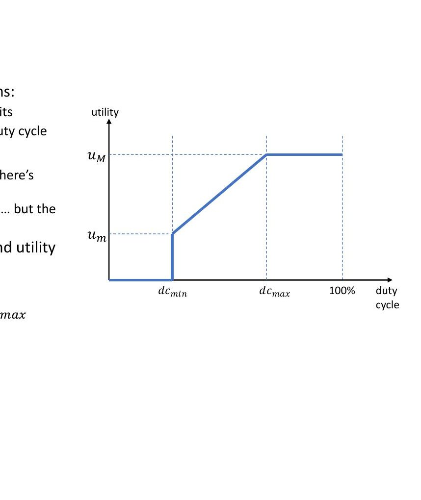
*Fig. 3 — La funzione $u(dc)$: segmento piatto a $u_m$, rampa lineare, plateau a $u_M$.*

> [!example] Calcolo dei parametri α e β
>
> Dati: $dc_{max} = 90\%$, $dc_{min} = 50\%$, $u_M = 100$, $u_m = 10$.
>
> $$
> \alpha = \frac{u_M - u_m}{dc_{max} - dc_{min}} = \frac{90}{40} = 2.25
> $$
>
> $$
> \beta = u_m - \alpha \cdot dc_{min} = 10 - 2.25 \cdot 50 = -102.5
> $$
>
> Quindi: $u(dc) = 2.25 \cdot dc - 102.5$ nella zona lineare.

Analogamente, se il consumo di potenza è lineare nel duty cycle — $p(dc) = \rho \cdot dc + \sigma$ — e si conoscono $p_{max}$ e $p_{min}$ corrispondenti a $dc_{max}$ e $dc_{min}$:

$$
\rho = \frac{p_{max} - p_{min}}{dc_{max} - dc_{min}} = \frac{4}{40} = 0.1, \quad \sigma = p_{min} - \rho \cdot dc_{min} = -4
$$

Con i valori dell'esempio ($p_{max} = 5\,\text{mA}$, $p_{min} = 1\,\text{mA}$): $p(dc) = 0.1 \cdot dc - 4$.

> [!tip] Esempio applicativo
>
> In un sistema di rilevamento di intrusi: campionare a frequenza più alta aumenta la capacità di rilevamento (utility alta), ma sotto una soglia minima il campionamento è troppo rado per essere utile. Sopra una soglia massima, l'intruso è comunque lento abbastanza da essere rilevato — ulteriore sampling è spreco.

---

## Il Problema di Ottimizzazione

Il sistema è descrito da tre grandezze che variano nel tempo in modo interdipendente:
- la **produzione** varia in modo non controllato ma prevedibile;
- il **carico** varia in funzione del duty cycle (controllato);
- la **carica della batteria** varia di conseguenza.

L'obiettivo è trovare l'assegnamento di duty cycle che massimizzi l'utility totale mantenendo la neutralità energetica.

### Discretizzazione Temporale

Invece di lavorare in continuo, Kansal discretizza il tempo in **slot** (tipicamente 24 slot di 1 ora per una giornata). Questo semplifica lo scheduling e rende il sistema più stabile: si assegna un duty cycle per slot, lo scheduler gira una volta al giorno (es. a mezzanotte), e le previsioni meteorologiche forniscono le stime di produzione per ogni slot.

---

## Previsione della Produzione: EWMA

Per stimare la produzione futura, Kansal adotta un filtro **EWMA** (Exponentially Weighted Moving Average, *media mobile esponenzialmente pesata*): l'ipotesi è che la produzione nello stesso slot del giorno successivo sarà simile a quella del giorno corrente.

Definendo $p_j(i)$ la produzione misurata nello slot $i$ del giorno $j$, e $\tilde{p}_j(i)$ la produzione stimata, la previsione per il giorno successivo è:

$$
\tilde{p}_{j+1}(i) = \alpha \cdot p_j(i) + (1 - \alpha) \cdot \tilde{p}_j(i)
$$

con $\alpha < 1$ parametro (costante o adattivo). La stima è dunque una media pesata della misura più recente e della stima precedente: più $\alpha$ è vicino a 1, maggior peso si dà alla misura più recente.

> [!note] Esperimenti con Heliomote
>
> Gli esperimenti di Kansal su nodi sensori reali con pannello solare (un cosiddetto "Heliomote") mostrano che: la produzione giornaliera ha un profilo a campana centrato a mezzogiorno, l'errore EWMA è basso nelle ore notturne e massimo attorno a mezzogiorno (maggiore variabilità), e la produzione è altamente ripetibile giorno dopo giorno.

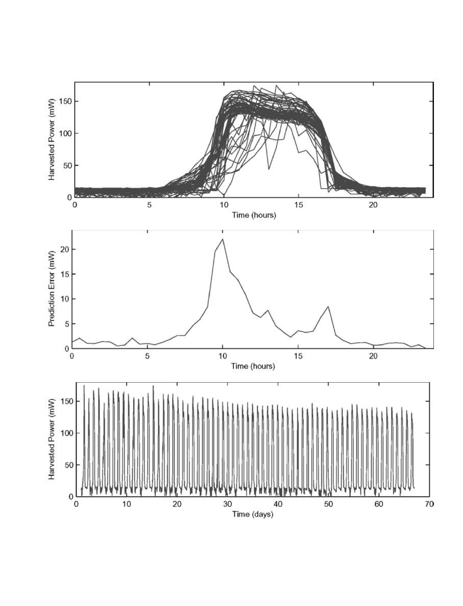
*Fig. 4 — Dall'alto: (1) profili di produzione giornaliera sovrapposti per molti giorni; (2) errore del predittore EWMA; (3) energia raccolta su 70 giorni consecutivi con ciclo giorno/notte visibile.*

---

## L'Algoritmo di Kansal

L'algoritmo assegna il duty cycle a ogni slot in base alla produzione attesa $\tilde{p}_s(i)$. Supponiamo di conoscere $p_{max}$ (consumo al duty cycle massimo) e $p_{min}$ (consumo al duty cycle minimo). Si definiscono due insiemi di slot:

$$
S = \{i : \tilde{p}_s(i) \geq p_{max}\} \quad \text{(slot "di sole" — produzione abbondante)}
$$
$$
D = \{i : \tilde{p}_s(i) < p_{max}\} \quad \text{(slot "bui" — produzione insufficiente)}
$$

**Prima assegnazione (soluzione iniziale):**

```
// Step 1: assegnamento iniziale
for each slot i:
    if i ∈ S:
        dc_i = dc_max   // massimo duty cycle nei sun slot
    else:
        dc_i = dc_min   // minimo duty cycle nei dark slot
```

A questo punto si calcola il **surplus residuo** $p_{res} = B(k+1) - B(1)$:

### Caso 1 — Sovraproduzione ($p_{res} > 0$)

C'è energia avanzata alla fine del giorno. L'algoritmo la usa per alzare il duty cycle in alcuni dark slot, partendo da quelli con indice più piccolo:

```c
// p_res > 0: surplus di energia
// p_diff = p_max - p_min (differenza di consumo tra dc_max e dc_min)

while (p_res > p_diff) {
    // prendi il dark slot con indice minore (ancora a dc_min)
    let i = min_index(D with dc_i == dc_min);
    dc_i = dc_max;
    p_res -= p_diff;
}

if (p_res > 0) {
    // p_res non basta per un altro slot al massimo:
    // alza parzialmente il dc del prossimo slot
    let i = min_index(D with dc_i == dc_min);
    dc_i = DutyCycle(p_min + p_res);
    // DutyCycle(p) = (p - sigma) / rho  [inversa di p(dc)]
}
```

### Caso 2 — Sottoproduzione ($p_{res} < 0$)

Manca energia alla fine del giorno. L'algoritmo riduce uniformemente il duty cycle in tutti i sun slot per compensare:

```c
// p_res < 0: underproduction
// |S| = numero di sun slot

if ((p_max - p_min) / |S| < abs(p_res) / |S|) {
    return -1;  // impossibile: anche riducendo tutti i sun slot non basta
}

for each i ∈ S {
    // abbassa il dc di ogni sun slot della stessa quantità
    dc_i = DutyCycle(p_max - abs(p_res) / |S|);
}
```

La riduzione è uniforme per mantenere equità tra le ore di luce.

> [!tip] Proprietà dell'algoritmo
>
> - **Ottimalità**: la soluzione prodotta è ottimale per il problema di massimizzazione dell'utility.
> - **Semplicità**: nessun solver di programmazione lineare richiesto — solo confronti e operazioni aritmetiche.
> - **Memoria ridotta**: adatto a processori a bassa potenza.
> - **Adattamento dinamico**: se la produzione reale si discosta significativamente dalla previsione durante la giornata, il ciclo di ottimizzazione viene rieseguito per i restanti slot con la stessa logica.

> [!warning] Limiti dell'algoritmo di Kansal
>
> - Basato su **scaling lineare del duty cycle**: le frequenze di campionamento risultanti sono in genere irregolari, il che può essere problematico per alcune applicazioni (es. serie temporali con campionamento non uniforme).
> - Modella solo la modulazione del duty cycle: **non è adatto** a scenari con scelte tra trasduttori alternativi, algoritmi di elaborazione diversi, o comportamenti più complessi.

---

## Esercizio Risolto — Esercizio 1

> [!example] Esercizio 1
>
> Dati: $dc_{max}=90\%$, $p_{max}=5\,\text{mA}$, $u(dc_{max})=100$; $dc_{min}=50\%$, $p_{min}=1\,\text{mA}$, $u(dc_{min})=10$.
>
> Dalle formule già calcolate:
> $$p(dc) = 0.1 \cdot dc - 4, \quad u(dc) = 2.25 \cdot dc - 102.5$$
>
> Produzione per slot: $\tilde{p}_s = [0, 0, 0, 2, 6, 11, 10, 7, 3, 0, 0, 0]$.

**Step 1 — Assegnamento iniziale:**

$S = \{5, 6, 7, 8\}$ (produzione $\geq p_{max} = 5$), $D = \{1,2,3,4,9,10,11,12\}$.

| Slot | 1 | 2 | 3 | 4 | 5 | 6 | 7 | 8 | 9 | 10 | 11 | 12 |
|------|---|---|---|---|---|---|---|---|---|----|----|-----|
| $\tilde{p}_s(i)$ | 0 | 0 | 0 | 2 | 6 | 11 | 10 | 7 | 3 | 0 | 0 | 0 |
| $dc_i$ | 50 | 50 | 50 | 50 | 90 | 90 | 90 | 90 | 50 | 50 | 50 | 50 |
| $u(\cdot)$ | 10 | 10 | 10 | 10 | 100 | 100 | 100 | 100 | 10 | 10 | 10 | 10 |
| $p(\cdot)$ | 1 | 1 | 1 | 1 | 5 | 5 | 5 | 5 | 1 | 1 | 1 | 1 |

Totale prodotto: 39. Totale consumato: $8 \times 1 + 4 \times 5 = 28$. **Surplus $p_{res} = 11 > 0$ → Caso 1.**

**Step 2 — Uso del surplus:**

$p_{diff} = 5 - 1 = 4$. Con $p_{res} = 11$: si possono portare $\lfloor 11/4 \rfloor = 2$ dark slot al massimo (slot 1 e 2). $p_{res}$ residuo: $11 - 8 = 3$.

**Step 3 — Residuo parziale:**

$p_{res} = 3 < 4$. Prossimo dark slot: slot 3. Nuovo consumo: $p_{min} + p_{res} = 1 + 3 = 4$.
$$dc = \frac{p - \sigma}{\rho} = \frac{4 + 4}{0.1} = 80\%, \quad u(80) = 2.25 \cdot 80 - 102.5 = 77.5$$

**Soluzione finale:**

| Slot | 1 | 2 | 3 | 4 | 5 | 6 | 7 | 8 | 9 | 10 | 11 | 12 |
|------|---|---|---|---|---|---|---|---|---|----|----|-----|
| $\tilde{p}_s(i)$ | 0 | 0 | 0 | 2 | 6 | 11 | 10 | 7 | 3 | 0 | 0 | 0 |
| $dc_i$ | **90** | **90** | **80** | 50 | 90 | 90 | 90 | 90 | 50 | 50 | 50 | 50 |
| $u(\cdot)$ | **100** | **100** | **77.5** | 10 | 100 | 100 | 100 | 100 | 10 | 10 | 10 | 10 |
| $p(\cdot)$ | **5** | **5** | **4** | 1 | 5 | 5 | 5 | 5 | 1 | 1 | 1 | 1 |

---

## Esercizio Risolto — Esercizio 2

> [!example] Esercizio 2 (variante con $p_{min} = 2\,\text{mA}$)
>
> Dati: $dc_{max}=90\%$, $p_{max}=5\,\text{mA}$; $dc_{min}=50\%$, $p_{min}=2\,\text{mA}$.
>
> Nuove formule:
> $$\rho = \frac{5-2}{90-50} = 0.075, \quad \sigma = 2 - 0.075 \cdot 50 = -1.75$$
> $$p(dc) = 0.075 \cdot dc - 1.75, \quad u(dc) = 2.25 \cdot dc - 102.5 \text{ (invariata)}$$
>
> Produzione per slot: $\tilde{p}_s = [0, 0, 1, 3, 5, 8, 4, 3, 2, 0, 0, 0]$.

**Step 1 — Assegnamento iniziale:**

$S = \{5, 6\}$ (produzione $\geq 5$), $D = \{1,2,3,4,7,8,9,10,11,12\}$.

| Slot | 1 | 2 | 3 | 4 | 5 | 6 | 7 | 8 | 9 | 10 | 11 | 12 |
|------|---|---|---|---|---|---|---|---|---|----|----|-----|
| $\tilde{p}_s(i)$ | 0 | 0 | 1 | 3 | 5 | 8 | 4 | 3 | 2 | 0 | 0 | 0 |
| $dc_i$ | 50 | 50 | 50 | 50 | 90 | 90 | 50 | 50 | 50 | 50 | 50 | 50 |
| $u(\cdot)$ | 10 | 10 | 10 | 10 | 100 | 100 | 10 | 10 | 10 | 10 | 10 | 10 |
| $p(\cdot)$ | 2 | 2 | 2 | 2 | 5 | 5 | 2 | 2 | 2 | 2 | 2 | 2 |

Totale prodotto: 26. Totale consumato: $10 \times 2 + 2 \times 5 = 30$. **$p_{res} = -4 < 0$ → Caso 2.**

**Step 2 — Caso 2:**

$|S| = 2$. Verifica ammissibilità: $(p_{max} - p_{min})/|S| = 3/2 = 1.5$. $|p_{res}|/|S| = 2$. Poiché $1.5 < 2$... attenzione: la verifica dell'algoritmo è $(p_{max} - p_{min})/|S| < |p_{res}|$ (non diviso $|S|$). $(5-2)/2 = 1.5 < 4$: la condizione di inammissibilità **non scatta**. L'algoritmo è ammissibile.

Per ogni sun slot: abbasso il consumo di $|p_{res}|/|S| = 4/2 = 2$ unità.
Nuovo consumo per sun slot: $p_{max} - 2 = 3$.
$$dc = \frac{3 + 1.75}{0.075} = \frac{4.75}{0.075} = 63.3\% \approx 63\%$$
$$u(63.3) = 2.25 \cdot 63.3 - 102.5 = 42.4$$

> [!note] Nota sulla soluzione delle slide
>
> Le slide approssimano a $dc = 70\%$ (arrotondamento). Con $dc = 70\%$: $p = 0.075 \cdot 70 - 1.75 = 3.5\,\text{mA}$, $u = 2.25 \cdot 70 - 102.5 = 55$. Questa non è un'approssimazione accurata del caso 2 (produce un residuo di $-1$ invece di 0). Il calcolo esatto dà $dc = 63.3\%$.

**Soluzione finale (esatta):**

| Slot | 1 | 2 | 3 | 4 | 5 | 6 | 7 | 8 | 9 | 10 | 11 | 12 |
|------|---|---|---|---|---|---|---|---|---|----|----|-----|
| $\tilde{p}_s(i)$ | 0 | 0 | 1 | 3 | 5 | 8 | 4 | 3 | 2 | 0 | 0 | 0 |
| $dc_i$ | 50 | 50 | 50 | 50 | **63.3** | **63.3** | 50 | 50 | 50 | 50 | 50 | 50 |
| $u(\cdot)$ | 10 | 10 | 10 | 10 | **42.4** | **42.4** | 10 | 10 | 10 | 10 | 10 | 10 |
| $p(\cdot)$ | 2 | 2 | 2 | 2 | **3** | **3** | 2 | 2 | 2 | 2 | 2 | 2 |

---

## Modello Task-Based per la Neutralità Energetica

Kansal modella il carico tramite duty cycle, ma le applicazioni IoT reali sono più complesse. Un'applicazione tipica esegue 4 fasi in ciclo: **Sensing → Storing → Processing → Transmitting**. Ciascuna fase può avere implementazioni alternative con diversi trade-off energia/performance.

> [!example] Alternative implementative
>
> - Scegliere tra **trasduttori diversi** (risoluzione differente, consumo diverso)
> - Disabilitare l'elaborazione locale e trasmettere i dati grezzi (risparmio di computazione, più traffico di rete)
> - Variare la frequenza di campionamento
> - Usare più trasduttori per aumentare l'utility
> - Comunicare con frequenza e affidabilità diverse

Si chiama **task** un'implementazione specifica dell'applicazione sul dispositivo IoT. Un dispositivo ha $n$ task alternative, ciascuna con costo energetico $c_j$ e utility $u_j$.

### Architettura del Sistema Task-Based

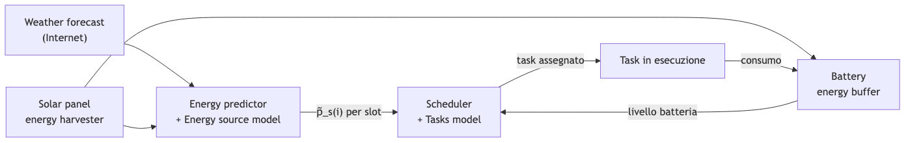
*Fig. 5 — Architettura del sistema: il predittore stima la produzione, lo scheduler assegna un task per slot ottimizzando utility e neutralità energetica.*

### Formulazione Matematica

Tempo slottato con $k$ slot (es. 24 ore, 1 slot/ora). Lo scheduler assegna **esattamente un task per slot**: $x_{i,j} = 1$ se il task $j$ è assegnato allo slot $i$.

Definizioni per ogni slot $i$:
- $\tilde{p}_s(i)$: produzione attesa (da previsione meteorologica)
- $p_c(i)$: consumo del task assegnato allo slot
- $p_s^+(i) = [p_s(i) - p_c(i)]^+$: eccesso di produzione → ricarica batteria
- $p_c^-(i) = [p_c(i) - p_s(i)]^+$: deficit → scarica batteria
- $\eta$: efficienza di carica della batteria

Il livello di batteria alla fine dello slot $i$ è:

$$
B(i+1) = \min\{B_{max},\; B(i) + \eta \cdot p_s^+(i) - p_c^-(i)\}
$$

Il capping a $B_{max}$ modella la saturazione della batteria.

### Problema di Ottimizzazione

$$
\max \sum_{i=1}^{k} \sum_{j=0}^{n} x_{i,j} \cdot u_j
$$

soggetto a:

| Vincolo | Significato |
|---------|-------------|
| $\sum_j x_{i,j} = 1 \; \forall i$ | Esattamente un task per slot |
| $B(1) \leq B(k+1)$ | Neutralità energetica |
| $B_{min} \leq B(i) \; \forall i$ | La batteria non scende mai sotto la soglia minima |
| $B(i+1) = \min\{B_{max}, B(i) + \eta p_s^+(i) - p_c^-(i)\} \; \forall i$ | Equazione di stato della batteria |

---

## Soluzione con Programmazione Dinamica

Il problema di ottimizzazione task-based è **NP-Hard** (si riduce a una variante del problema dello zaino). Tuttavia esiste una soluzione **pseudo-polinomiale** basata su programmazione dinamica, praticabile su piattaforme a bassa potenza.

### Ricorrenza

Lo stato del sistema è la coppia $(i, b)$: slot corrente e livello di batteria all'inizio di quello slot. La funzione $opt(i, b)$ è l'utility ottimale ottenibile dagli slot $i$ a $k$ partendo con livello $b$.

**Caso base** (ultimo slot $k$):

$$
opt(k, b) = \max_{j=1,\ldots,n} \{u_j : b + \eta \cdot p_s^+(k) - p_c^-(k) \geq B(1)\}
$$

Solo i task che garantiscono la neutralità energetica alla fine del giorno ($B(k+1) \geq B(1)$) sono ammissibili.

**Passo ricorsivo** (slot $i < k$):

$$
opt(i, b) = \max_{j=1,\ldots,n} \{u_j + opt(i+1, B^j(i+1)) : B^j(i+1) \geq B_{min}\}
$$

dove $B^j(i+1)$ è il livello di batteria residuo a fine slot $i$ se si assegna il task $T_j$. La ricorsione procede **all'indietro** dall'ultimo slot al primo (approccio backward).

### Complessità

| | Complessità |
|--|--|
| **Tempo** | $O(k \cdot \text{BatteryLevels})$ |
| **Memoria** | $O(\text{BatteryLevels})$ (con ottimizzazioni) |

Il livello di batteria in pratica è discretizzato dall'ADC. Con ADC a 10 bit e range operativo 3.4–4.2 V su batteria da 2000 mAh, i livelli discreti vanno da 828 a 1024 (197 livelli). La complessità è quindi controllabile scegliendo il numero di slot e la granularità della batteria.

> [!note] Praticabilità su hardware IoT
>
> Su Arduino Uno con 288 slot e ~200 livelli di batteria, il tempo di esecuzione è ~0.8 secondi. Su Raspberry Pi è nell'ordine dei decimi di secondo. Su Linux x86 è nell'ordine dei millisecondi. Tutti e tre i casi sono pienamente compatibili con una schedulazione giornaliera a mezzanotte.

---

## Risultati Sperimentali

### Tempi di Esecuzione

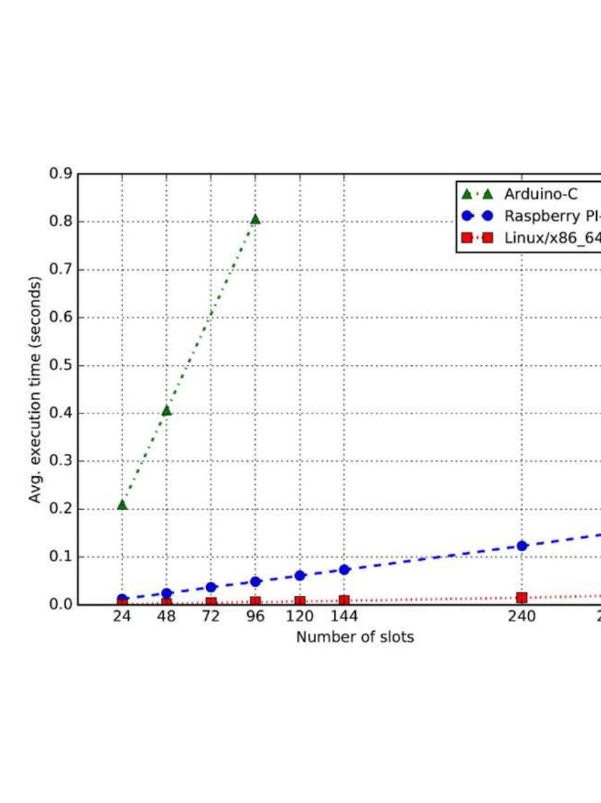
*Fig. 6 — Tempo medio di esecuzione del codice C in funzione del numero di slot. Arduino Uno (verde) scala più rapidamente; Raspberry PI (blu) rimane entro 0.15 s; Linux x86 (rosso) è pressoché piatto. Batteria da 2000 mAh, ADC 10 bit, 197 livelli.*

### Simulazioni (Piattaforma Tmote)

I test simulano applicazioni con duty cycle tra 2% e 46% su batteria KL-SUN3W da 2000 mAh, variando il numero di slot da 24 a 288, per tutti i mesi dell'anno.

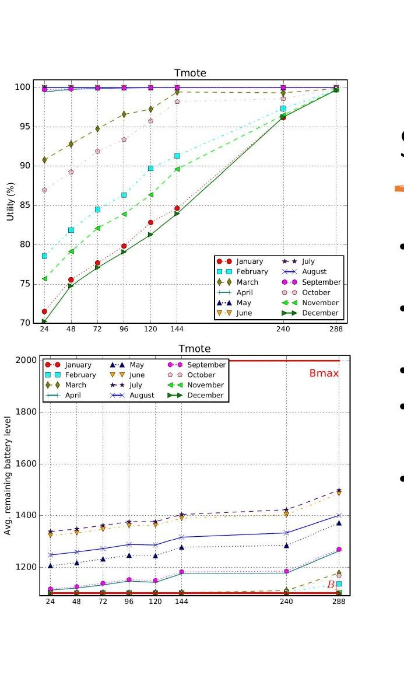
*Fig. 7 — In alto: utility percentuale per mese al variare del numero di slot (tutti i mesi convergono a 100% con slot sufficienti). In basso: livello medio di batteria residua (rimane ben sopra $B_{min}$, garantendo neutralità energetica).*

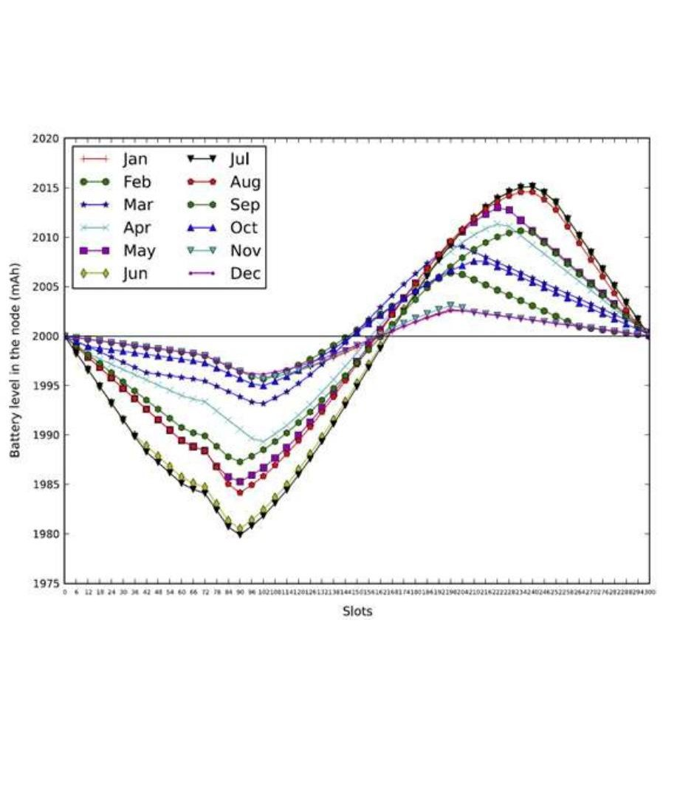
*Fig. 8 — Andamento del livello di batteria nel corso della giornata per mese: scende durante le ore notturne, risale durante le ore di sole. In estate l'escursione è minima; in inverno è massima ma rimane entro i limiti ammissibili.*

---

## Riferimenti

- Aman Kansal, Jason Hsu, Sadaf Zahedi, *Power management in energy harvesting sensor networks*, ACM Transactions on Embedded Computing Systems, 6(4), September 2007.
- A. Caruso, S. Chessa, S. Escolar, X. del Toro, J.C. Carlos López, *A Dynamic Programming Algorithm for High-Level Task Scheduling in Energy Harvesting IoT*, IEEE Internet of Things Journal, 5(3):2234–2248 (2018).

---

```{=latex}
\newpage
```

```{=latex}
\appendix
```

# Esame Chessa — Domande Orali

Documento di preparazione all'esame orale del corso **Mobile and Cyber-Physical Systems**, modulo del Prof. Stefano Chessa. Per ogni schema del documento originale viene fornita una risposta dettagliata, corredata dell'immagine di riferimento e dei link alle lezioni pertinenti.

---

## Interoperabilità


*Fig. — Rete IoT eterogenea: dispositivi di produttori diversi (colori diversi) comunicano attraverso gateway di integrazione.*

Lo schema mostra una rete in cui dispositivi appartenenti a ecosistemi diversi (rappresentati con colori diversi) devono comunicare tra loro. Il problema fondamentale è l'**interoperabilità**.

Il percorso storico delle soluzioni IoT "dal basso" porta spesso alla creazione di **vertical silos**: sistemi proprietari in cui i dispositivi di un fornitore comunicano solo con l'infrastruttura dello stesso produttore. Questa strategia risponde a un preciso modello di business chiamato **vendor lock-in**, che costringe il cliente a restare nell'ecosistema del fornitore pena una costosa migrazione.

La soluzione naturale è l'adozione di **standard condivisi** (Wi-Fi, ZigBee, Bluetooth, ecc.), ma la proliferazione degli standard sposta il problema al livello middleware e applicativo: oggi coesistono MQTT, CoAP, LWM2M e molti altri protocolli applicativi, incompatibili tra loro.

Per gestire questa eterogeneità si ricorre agli **application-level gateway**, che non si limitano a tradurre protocolli di basso livello ma mappano comportamenti applicativi differenti, operando come interpreti semantici tra ecosistemi.

Le architetture IoT si classificano in quattro tipi:

| Tipo | Fornitore | Protocollo | Gateway? |
|------|-----------|------------|----------|
| A | Unico | Unico | No |
| B | Multiplo | Unico condiviso | No / minimale |
| C | Multiplo | Diversi | Sì — traduzione |
| D | Multiplo | Eterogenei distribuiti | Sì — gateway multipli |

All'aumentare della complessità da A a D, il gateway deve gestire un numero esponenziale di mappature tra protocolli.

> [!note] Riferimento
> [[Lezione 3 - Interoperabilità e Standard]]

---

## IoT & Security


*Fig. — Architettura di sicurezza IoT: dispositivi vincolati (C), gateway (G), applicazioni (A) e relative misure di sicurezza per ogni livello.*

Lo schema mostra un'architettura IoT a strati in cui la sicurezza deve essere garantita a ogni livello: tra dispositivi periferici e gateway (autenticazione + trasferimento sicuro), e tra gateway e cloud/applicazione (sicurezza dei dati a riposo + autenticazione).

I dispositivi IoT sono spesso sistemi embedded economici, prodotti con forti incentivi a ridurre costi e tempi di immissione sul mercato, a discapito della sicurezza. La conseguenza sono centinaia di milioni di dispositivi vulnerabili, privi di meccanismi di patching efficaci.

La raccomandazione **ITU-T Y.2066** definisce tre aree fondamentali di sicurezza:

1. **Sicurezza della comunicazione** — riservatezza e integrità dei dati in transito tra dispositivi e piattaforme.
2. **Sicurezza della gestione dei dati** — protezione di riservatezza e integrità quando i dati sono archiviati o elaborati (*data at rest*).
3. **Sicurezza della fornitura del servizio** — prevenzione di accessi non autorizzati e protezione della privacy degli utenti.

A questi si aggiungono l'**autenticazione mutua** (entrambe le parti si verificano reciprocamente, più robusta dell'autenticazione a una via) e la capacità di audit di sicurezza.

Il **gateway** gioca un ruolo centrale:
- Gestisce identificazione e autenticazione di ogni dispositivo connesso.
- Protegge la privacy dei dispositivi periferici.
- Supporta manutenzione, aggiornamento firmware e autodiagnosi remota.
- Applica policy di configurazione dinamiche.

> [!warning] Dispositivi vincolati e limiti
>
> I *constrained devices* spesso non dispongono di hardware crittografico dedicato, rendendo impraticabile la cifratura dei dati archiviati. Con il *Massive IoT*, la privacy diventa critica per la grande mole di dati sensibili (medici, posizione, abitudini) raccolti.

> [!note] Riferimento
> [[Lezione 3 - Interoperabilità e Standard]] (sezione sicurezza)

---

## Publish/Subscribe & MQTT


*Fig. — Il paradigma publish/subscribe: i publisher inviano messaggi al broker tramite PUBLISH; i subscriber si registrano (SUBSCRIBE) e ricevono notifiche (PUBLISH dal broker); possono anche disdire (UNSUBSCRIBE).*

Il paradigma **publish/subscribe** è il cuore di MQTT. A differenza del modello client/server, il pub/sub è *loosely coupled* grazie a tre forme di disaccoppiamento:

- **Space decoupling**: publisher e subscriber non si conoscono, non condividono IP né porta.
- **Time decoupling**: non devono essere attivi contemporaneamente.
- **Synchronization decoupling**: le operazioni non sono bloccanti.

Il **broker** è il server dell'infrastruttura: riceve tutti i messaggi, li filtra per topic, li distribuisce ai subscriber interessati. Le operazioni fondamentali sono quattro: *Publish*, *Subscribe*, *Notify*, *Unsubscribe*.

**MQTT** (*Message Queuing Telemetry Transport*) implementa pub/sub con filtraggio basato su **topic** — stringhe gerarchiche separate da `/` (es. `home/firstfloor/bedroom/temperature`). I subscriber possono usare wildcard:
- `+` sostituisce un singolo livello: `home/+/temperature`
- `#` sostituisce tutti i livelli successivi: `home/#`

MQTT opera su TCP (porta 1883, o 8883 con TLS) e concentra la complessità sul broker, mantenendo i client semplici. È *data agnostic*: il payload può essere binario, testo, JSON o XML.

> [!note] Riferimento
> [[Lezione 4 - MQTT Part 1]]

---

## MQTT – II (QoS 2)


*Fig. — Handshake a quattro fasi del QoS 2 tra MQTT client e broker: PUBLISH → PUBREC → PUBREL → PUBCOMP.*

MQTT definisce tre livelli di **Quality of Service**:

| Livello | Nome | Garanzia | Meccanismo |
|---------|------|----------|------------|
| QoS 0 | At most once | Nessuna | Nessun ACK |
| QoS 1 | At least once | Almeno una consegna | PUBACK (possibili duplicati) |
| QoS 2 | Exactly once | Esattamente una consegna | 4-way handshake |

**QoS 2** è il livello più affidabile. Il handshake a quattro fasi serve a evitare sia la perdita che la duplicazione:

1. **PUBLISH**: il client invia il messaggio al broker (con packetId).
2. **PUBREC** (*Publish Received*): il broker conferma la ricezione e memorizza il messaggio.
3. **PUBREL** (*Publish Release*): il client autorizza il broker a procedere con la consegna effettiva.
4. **PUBCOMP** (*Publish Complete*): il broker conferma che la consegna ai subscriber è avvenuta e il messaggio può essere eliminato.

Il PUBREC garantisce che il messaggio non vada perso; PUBREL + PUBCOMP garantiscono che non venga consegnato due volte. Due fasi non sarebbero sufficienti perché, se il broker consegnasse immediatamente al PUBLISH senza aspettare PUBREL, e il client ritrasmettesse credendo di non aver ricevuto PUBREC, si avrebbero duplicati.

> [!note] Riferimento
> [[Lezione 4 - MQTT Part 1]]

---

## MQTT-III — Topic, Sessioni, Retained Messages, Last Will & Keep Alive

### Come il broker filtra i messaggi e cosa sono i topic

Il broker usa il **filtraggio basato su topic** (topic-based filtering): ogni messaggio PUBLISH porta un topic; il broker lo confronta con le sottoscrizioni attive e lo consegna ai subscriber che corrispondono. I topic sono stringhe gerarchiche; le wildcard `+` e `#` permettono iscrizioni a insiemi di topic. Il broker non ispeziona il payload (a differenza del content-based filtering), il che consente la cifratura end-to-end.

### Sessioni Persistenti

Quando un dispositivo IoT si disconnette (per sleep, copertura persa, reset), rischia di perdere le sottoscrizioni attive e i messaggi pubblicati durante l'assenza. Le **persistent session** risolvono questo: impostando `cleanSession = false` nel CONNECT, il broker conserva per quel `clientId`:
- Tutte le sottoscrizioni attive
- I messaggi non consegnati con QoS 1 o 2
- I messaggi in attesa di completamento del flusso QoS 2

Alla riconnessione con lo stesso `clientId`, la sessione viene ripristinata automaticamente. Il broker segnala la presenza di una sessione precedente tramite il flag *Session Present* nel CONNACK.

### Retained Messages

Nel pub/sub classico, un nuovo subscriber non sa quando arriverà il primo messaggio. I **retained message** risolvono questo: un messaggio pubblicato con `retainFlag = true` viene conservato dal broker (uno per topic). Ogni nuovo subscriber riceve immediatamente l'ultimo messaggio trattenuto al momento dell'iscrizione, senza aspettare la prossima pubblicazione.

> [!tip] Pattern potente
>
> Un dispositivo pubblica il proprio stato (`"ON"`) come retained message. Configura anche un testamento con payload `"OFF"` e retain flag attivo sullo stesso topic. Se va in crash, il broker pubblica automaticamente `"OFF"` come retained message — tutti i client (connessi e futuri) vedono lo stato corretto.

### Last Will & Testament

Quando un dispositivo si disconnette *normalmente* (DISCONNECT), può notificare gli altri esplicitamente. Per le **disconnessioni anomale** (crash, timeout, interruzione di rete) non esiste tale possibilità. Il **Last Will & Testament** consiste in un messaggio pre-configurato consegnato al broker al momento del CONNECT: se il broker rileva una disconnessione anomala, pubblica quel messaggio automaticamente. Il testamento ha topic, payload, QoS e retained flag propri.

Il broker invia il testamento quando: errore di I/O sulla connessione, mancato invio di PINGREQ entro il keep alive, chiusura brusca TCP senza DISCONNECT, o chiusura forzata per errore di protocollo. Se il client si disconnette con DISCONNECT regolare, il testamento viene scartato.

### Keep Alive

TCP può mantenere una connessione apparentemente attiva anche quando il peer è irraggiungibile. Il **Keep Alive** risolve: il client dichiara un intervallo (campo a 16 bit nel CONNECT) entro cui si impegna a inviare almeno un pacchetto. Se non lo fa, il broker chiude la connessione e invia il testamento. Il client invia **PINGREQ** se non ha altro traffico; il broker risponde con **PINGRESP**. Il valore `0` disabilita il meccanismo.

> [!note] Riferimento
> [[Lezione 4 - MQTT Part 1]], [[Lezione 8 - MQTT Part 2]]

---

## ZigBee - I (Join through Association)


*Fig. — Sequenza di primitives tra Application Layer, Network Layer e MAC Layer durante il processo di join di un dispositivo ZigBee.*

Lo schema mostra il processo con cui un dispositivo si unisce a una rete ZigBee esistente attraverso il meccanismo di **associazione**. Si tratta di un'interazione a tre livelli (Application, Network, MAC) tramite service primitives.

La sequenza è:

1. **Application layer** emette `NETWORK-DISCOVERY.request` al Network Layer.
2. **Network Layer** emette `SCAN.request` al MAC: viene eseguito un active scan per trovare le PAN disponibili.
3. **MAC** esegue lo scan e risponde con `SCAN.confirm`.
4. **Network Layer** risponde all'applicazione con `NETWORK-DISCOVERY.confirm`, che elenca le PAN trovate.
5. **Application layer** sceglie una PAN e invia `JOIN.request` al Network Layer.
6. **Network Layer** seleziona un nodo genitore P e avvia il protocollo di associazione MAC tramite `ASSOCIATE.request`.
7. **MAC** esegue il protocollo di associazione: il coordinatore/router assegna un **indirizzo breve a 16 bit** al nuovo dispositivo.
8. **MAC** risponde con `ASSOCIATE.confirm` → **Network Layer** risponde con `JOIN.confirm` all'applicazione.

Nelle reti a stella, P è necessariamente il coordinatore. Nelle reti ad albero o mesh, P può essere qualsiasi router raggiungibile.

> [!note] Riferimento
> [[Lezione 9 - The ZigBee Standard Part 1]]

---

## ZigBee – II (Application Layer Stack)


*Fig. — Stack protocollare ZigBee: dall'IEEE 802.15.4 (MAC) fino all'Application Layer, con Application Framework, ZDO e APS.*

ZigBee aggiunge sopra IEEE 802.15.4 (PHY + MAC) due livelli: **Network Layer** e **Application Layer**. Il livello applicativo si compone di tre elementi:

**Application Framework**: ospita fino a 240 **Application Objects (APO)**, ciascuno associato a un endpoint (numerato da 1 a 240). Ogni APO è identificato univocamente dalla coppia `<indirizzo di rete, endpoint>`. Più APO sullo stesso dispositivo possono corrispondere ad applicazioni diverse che operano simultaneamente.

**ZigBee Device Object (ZDO)**: occupa l'endpoint 0 ed è la componente gestionale del nodo. Fornisce:
- Device & Service Discovery (trova altri nodi e i loro servizi)
- Binding Management (crea/modifica le binding table dell'APS)
- Network Management (gestisce join/leave e routing table)

**Application Support Sublayer (APS)**: fa da intermediario tra APO/ZDO e il Network Layer. Fornisce:
- *Data Service*: trasmissione messaggi con acknowledgment end-to-end
- *Binding Service*: creazione di connessioni logiche tra endpoint
- *Group Management*: indirizzamento multicast tramite Group Table

L'APS filtra i pacchetti per endpoint e profile ID, scartando quelli non destinati ad applicazioni registrate.

> [!note] Riferimento
> [[Lezione 9 - The ZigBee Standard Part 1]], [[Lezione 12 - Application Layer of ZigBee]]

---

## ZigBee - III (Topologie di Rete)


*Fig. — Le tre topologie ZigBee: Star (sinistra), Tree (centro), Mesh (destra). Nodo giallo = coordinatore, nodi blu = router, nodi rossi = end-device.*

ZigBee supporta tre topologie di rete gestite dal Network Layer:

**Star (Stella)**: tutti i dispositivi comunicano direttamente con il coordinatore. Si mappa direttamente sulla struttura IEEE 802.15.4 e supporta il meccanismo del superframe/beacon. Semplice ma non scalabile: ogni dispositivo deve essere nel raggio radio del coordinatore.

**Tree (Albero)**: il coordinatore è la radice, i router sono nodi interni, gli end-device sono foglie. Può usare il superframe. Il routing segue la struttura gerarchica (tree routing): i pacchetti salgono verso la radice e poi scendono verso la destinazione. Il vantaggio è la semplicità; lo svantaggio è la rigidità e i percorsi spesso subottimali.

**Mesh**: topologia più flessibile in cui i router possono comunicare direttamente tra loro indipendentemente dalla struttura ad albero. Usa mesh routing (ispirato ad AODV): se non esiste un'entry nella routing table, viene avviato il Route Discovery Protocol (broadcast RREQ, unicast RREP). Non supporta il beaconing. È più robusto: percorsi alternativi sono disponibili se un link cade.

> [!tip] Coesistenza
>
> Tree routing e Mesh routing possono coesistere nella stessa rete: ogni router mantiene sia la logica ad albero che la routing table mesh, passando dinamicamente dall'uno all'altro.

> [!note] Riferimento
> [[Lezione 9 - The ZigBee Standard Part 1]]

---

## ZigBee - IV (Indirizzamento ad Albero)


*Fig. — Albero di indirizzi ZigBee con $R_m=2$, $D_m=2$, $L_m=3$: ogni nodo gestisce un intervallo di indirizzi calcolato con la formula $C_{skip}$.*

ZigBee assegna gli indirizzi di rete in modo completamente decentralizzato usando la struttura ad albero. Il coordinatore viene configurato con tre parametri:
- $R_m$: massimo numero di router figli per nodo
- $D_m$: massimo numero di end-device figli per nodo
- $L_m$: profondità massima dell'albero

La dimensione del blocco di indirizzi assegnato a un router a profondità $d$ è:

$$C_{skip}(d) = \begin{cases} 1 & \text{se } d = L_m \\ 1 + R_m \cdot C_{skip}(d+1) + D_m & \text{altrimenti} \end{cases}$$

Se un router ha indirizzo $A$ e si trova a profondità $d$, i suoi figli router ricevono: $A+1$, $A+1+C_{skip}(d+1)$, $A+1+2 \cdot C_{skip}(d+1)$, … Gli end-device ricevono gli indirizzi successivi a tutti i blocchi router.

> [!example] Nell'immagine: $R_m=2$, $D_m=2$, $L_m=3$
>
> - $C_{skip}(3)=1$, $C_{skip}(2)=5$, $C_{skip}(1)=13$, $C_{skip}(0)=29$
> - Coordinator (addr=0) gestisce [0–28]; primo figlio router addr=1 gestisce [1–13]; secondo figlio router addr=14 gestisce [14–26]; end-device 27 e 28.

**Vantaggio**: completamente decentralizzato, nessun rischio di collisione, nessun coordinamento distribuito necessario.

**Svantaggio**: rigido — se un sottoalbero è saturo, nuovi dispositivi non possono aggiungersi tramite quel nodo anche se ce ne fosse necessità.

> [!note] Riferimento
> [[Lezione 9 - The ZigBee Standard Part 1]]

---

## ZigBee - V (Tabella APS / Binding Table)


*Fig. — Esempio di APS Binding Table: ogni entry mappa un endpoint sorgente con cluster e destination address/endpoint.*

La tabella mostra la **APS Binding Table**, il meccanismo con cui ZigBee implementa l'**indirizzamento indiretto**. Un dispositivo sorgente (che conosce solo il proprio endpoint e il cluster di interesse) non ha bisogno di conoscere l'indirizzo di rete del destinatario: consulta la binding table.

Le colonne della tabella sono:
- **Src Addr (64 bit)**: indirizzo MAC a 64 bit del dispositivo sorgente.
- **Src EP**: endpoint sorgente (1–240).
- **Cluster ID**: il cluster di riferimento (es. `0x0006` = OnOff Cluster).
- **Dest Addr (16/64 bit)**: indirizzo di destinazione (short 16 bit o MAC 64 bit).
- **Addr/Grp**: `A` = indirizzo unicast, `G` = indirizzo di gruppo (multicast).
- **Dest EP**: endpoint destinazione (vuoto per i gruppi).

Nell'esempio, il dispositivo `0x3232...` endpoint 5 può inviare messaggi:
- All'indirizzo `0x1234...` endpoint 12 (unicast)
- All'indirizzo `0x796F...` endpoint 240 (unicast)
- Al gruppo `0x9999` (multicast, nessun endpoint specifico)
- All'indirizzo `0x5678...` endpoint 44 (unicast)

Questo meccanismo è fondamentale: se un dispositivo cambia indirizzo di rete (dopo un reset), l'APS usa la **Address Map Table** (che associa indirizzi 16-bit agli immutabili MAC 64-bit) per ripristinare i binding automaticamente.

> [!note] Riferimento
> [[Lezione 12 - Application Layer of ZigBee]]

---

## ZigBee - VI (Cluster e Binding tra Dispositivi)


*Fig. — Esempio di binding ZigBee: Configuration tool configura un on/off switch, che controlla una Simple lamp e un Dimmer switch, il quale controlla una Dimmable lamp.*

Lo schema illustra come il **binding** ZigBee colleghi dispositivi tramite cluster. Ogni rettangolo contiene le lettere C (Client) o S (Server) per ciascun cluster supportato.

Un **Cluster** è una collezione di comandi e attributi che definisce l'interfaccia per una funzionalità specifica. Ogni cluster ha un ID a 16 bit (es. `0x0006` = OnOff, `0x0008` = Level Control). Il cluster lato **server** ospita lo stato (attributi); il lato **client** invia comandi.

Nell'esempio:
- La **Configuration tool** (solo C) si lega all'**On/off switch** (S+C) per configurarlo.
- L'**On/off switch** (come client) controla la **Simple lamp** (S = solo server OnOff).
- Il **Dimmer switch** (S+C) riceve configurazioni (S) e controla la **Dimmable lamp** che implementa sia OnOff (S) che Level Control (S).

Il binding è unidirezionale: si va da client a server. Viene creato tramite `BIND.request` allo ZDO e memorizzato nella binding table dell'APS. Un singolo client può essere legato a più server (fan-out).

> [!note] Riferimento
> [[Lezione 12 - Application Layer of ZigBee]]

---

## Duty Cycle - I (Calcolo del Duty Cycle)


*Fig. — Codice Arduino che implementa il duty cycling selettivo dei componenti (sensore, radio) e tabella dei consumi in mA per componente e stato.*

Il **duty cycle** di un componente è la frazione di tempo in cui è attivo rispetto al periodo totale. La strategia fondamentale di risparmio energetico nei dispositivi IoT è attivare ogni componente **solo quando strettamente necessario**.

Il codice mostra il pattern classico:
```
turnOn(analogSensor)   → sensore acceso solo durante lettura
analogRead(A0)         → lettura
turnOff(analogSensor)  → sensore spento

turnOn(radioInterface) → radio accesa solo durante trasmissione
Serial.println(voltage)
turnOff(radioInterface)

idle(380)              → MCU in sleep 380ms
```

Usando i valori della tabella (es. Tmote Sky):
- Processore attivo: 8 mA, sleep: 15 μA
- Radio TX: 17.4 mA, RX: 19.7 mA, sleep: 20 μA
- Sensore: 5 mA, sleep: 5 μA

Se le operazioni di sensing + TX durano ~20 ms e il ciclo totale è 400 ms, il duty cycle della radio è 20/400 = 5%. La corrente media risultante è molto inferiore alla corrente di picco, estendendo la vita della batteria di ordini di grandezza.

La perdita di capacità della batteria del 3%/anno indica che anche con battery standby c'è un degrado nel tempo.

> [!note] Riferimento
> [[Lezione 23 - Embedded Programming e Arduino]]

---

## Duty Cycle - II (Impatto sulla Vita della Batteria)


*Fig. — Grafico log-log: vita della batteria (mesi) vs capacità della batteria (mAh) per duty cycle 100% (model1) e 5% (model2).*

Il grafico mostra l'impatto del duty cycle sulla vita della batteria in scala logaritmica. Due modelli a confronto:

- **Model 1 (100% DC)**: il dispositivo è sempre attivo. La vita della batteria scala linearmente con la capacità ma rimane nell'ordine dei mesi (0.01–0.3 mesi per capacità 500–3000 mAh).
- **Model 2 (5% DC)**: il dispositivo è attivo solo il 5% del tempo. La vita si estende di un fattore ~20: con la stessa batteria, si passa da 0.1 a circa 2–8 mesi.

La scala logaritmica rivela che la relazione vita-capacità non è lineare: il duty cycle agisce moltiplicativamente. Ridurre il duty cycle da 100% a 5% equivale a moltiplicare la capacità effettiva della batteria per 20.

**Conclusione progettuale**: per applicazioni IoT con autonomia di anni, ridurre il duty cycle è molto più efficace che aumentare la capacità della batteria. Una batteria da 3000 mAh a 5% DC dura circa 8 mesi; per durare anni si deve abbassare ulteriormente il duty cycle o usare energy harvesting.

> [!note] Riferimento
> [[Lezione 23 - Embedded Programming e Arduino]]

---

## Embedded Programming - I (Modello Arduino)


*Fig. — Modello di esecuzione Arduino: init → loop() ripetuto. I comandi attivano l'hardware; delay() aspetta; il timer fires avvia la ripetizione.*

Lo schema mostra il **modello di programmazione Arduino**, basato su un singolo thread di esecuzione:

1. **init**: la funzione `setup()` viene eseguita una sola volta all'avvio. Inizializza l'hardware, configura i pin, prepara le comunicazioni seriali.
2. **Main loop**: la funzione `loop()` viene invocata ripetutamente all'infinito dal runtime Arduino.
3. **Command**: dentro `loop()`, il codice interagisce con l'hardware tramite comandi sincroni (es. `analogRead()`, `Serial.println()`).
4. **Delay**: `delay(ms)` blocca l'esecuzione per il tempo specificato (busy waiting o sleep), poi il timer fires riavvia il loop.

Il modello è semplice ma **bloccante**: durante `delay()` il processore non può fare altro. Gli interrupt possono intervenire anche durante il delay (come mostrato nel codice Arduino interrupt), ma il thread principale rimane sospeso.

**Differenza con TinyOS**: nel modello Arduino tutto avviene sequenzialmente in un unico thread. In TinyOS (modello event-driven) il sistema reagisce ad eventi: non c'è un loop esplicito, ma handler che si concatenano tramite eventi hardware.

> [!note] Riferimento
> [[Lezione 23 - Embedded Programming e Arduino]]

---

## Embedded Programming - II (Modello TinyOS/Event-Driven)


*Fig. — Modello di esecuzione TinyOS: catena di eventi (Timer → Read → task → Send) senza loop bloccante. Il data processing avviene nel task asincrono.*

TinyOS usa un modello **event-driven** con componenti e interfacce. Non esiste un loop bloccante: il sistema è guidato dagli eventi hardware. Lo schema mostra una catena tipica:

1. **init**: configura timer e hardware.
2. **Timer handler** (evento): scatta quando il timer fires → avvia una lettura dal sensore (`Start read`).
3. **Read handler** (evento): scatta quando la lettura è completata (`Read done`) → posta un task per il processing.
4. **task**: elabora i dati (*Data processing happens here*) → avvia la trasmissione radio.
5. **Send handler** (evento): scatta quando la trasmissione è completa → riconfigura il timer per il prossimo ciclo.

**Vantaggi del modello event-driven**:
- Nessun busy waiting: il processore dorme tra un evento e l'altro.
- Nessuno stack multiplo: un unico stack (run-to-completion semantics).
- Efficienza energetica: il MCU è attivo solo durante gli handler.

**Confronto con Arduino**: Arduino è più semplice da programmare (loop sequenziale), ma meno efficiente in termini energetici. TinyOS è ottimale per nodi a basso consumo (mica motes, TMote Sky) dove ogni microsecondo di sleep conta.

> [!note] Riferimento
> [[Lezione 23 - Embedded Programming e Arduino]]

---

## Arduino - Interrupt


*Fig. — Esempio di programmazione con interrupt su Arduino: attachInterrupt() collega il pin 2 a interruptSwitchGreen(); count viene resettato e il LED acceso all'interrupt.*

Il codice mostra il meccanismo degli **interrupt hardware** su Arduino:

```cpp
volatile int count = 0;
attachInterrupt(0, interruptSwitchGreen, RISING);
```

`attachInterrupt(0, handler, RISING)` collega il pin 2 (interrupt 0 su Arduino Uno) alla funzione `interruptSwitchGreen`, eseguita automaticamente sul fronte di salita del segnale.

**Punti chiave**:
- La variabile `count` è dichiarata `volatile`: indica al compilatore di non ottimizzarla in registro, perché può essere modificata da handler fuori dal flusso normale.
- Gli interrupt sono ricevuti **anche durante `delay()`** (come nota il commento): il delay non disabilita gli interrupt, quindi l'handler può intervenire in qualsiasi momento.
- L'interrupt resetta `count=0` e accende il LED verde; il loop principale incrementa `count`, aspetta 1 secondo, e gestisce il timeout a 10.

**Utilizzo tipico negli embedded IoT**: gli interrupt sono usati per ricevere dati dal sensore (read done), notificare la fine di una trasmissione radio, o rispondere a eventi fisici (pressione di un pulsante) senza polling continuo, risparmiando energia.

> [!note] Riferimento
> [[Lezione 23 - Embedded Programming e Arduino]]

---

## SMAC (Sensor-MAC)


*Fig. — S-MAC: i nodi A–F hanno schedule sincronizzati (verde = listen, rosso = active/TX). La latenza multi-hop si accumula: il pacchetto da A deve aspettare i periodi di ascolto di ogni hop successivo.*

**S-MAC** (*Sensor MAC*) è un protocollo MAC per WSN che riduce il consumo energetico tramite **sincronizzazione locale**: nodi vicini si accordano su un periodo di ascolto comune (listen period) e dormono nel resto del tempo.

**Meccanismo**:
1. Ogni nodo trasmette periodicamente un pacchetto **SYNC** che annuncia il proprio schedule (quando si sveglierà).
2. I vicini che ricevono il SYNC adottano lo stesso schedule o mantengono il proprio e memorizzano quello del vicino.
3. Nel **listen period**: esecuzione di CSMA/CA con RTS/CTS prima di trasmettere.
4. Nel **sleep period**: la radio è spenta.

**Duty cycle**: definito come $DC = t_{listen} / (t_{listen} + t_{sleep})$, tipicamente 10% in S-MAC.

**Problema della latenza multi-hop**: come visibile nello schema, ogni nodo deve aspettare il periodo di ascolto del nodo successivo. La latenza totale si accumula: se ogni hop aggiunge un'attesa $\approx t_{sleep}$, un percorso di $n$ hop ha latenza $\approx n \cdot (t_{sleep}/2)$ in media.

**Adaptive duty cycle**: se un nodo riceve un RTS o CTS (anche non destinato a lui), capisce che c'è traffico nelle vicinanze e mantiene la radio accesa — potrebbe essere il prossimo hop e il messaggio arriverà presto.

> [!note] Riferimento
> [[Lezione 17 - MAC Protocols]]

---

## BMAC - I (Struttura del Protocollo)


*Fig. — B-MAC: il mittente (in alto) invia un lungo preamble seguito dai data; il ricevitore (in basso) si sveglia, ascolta, individua il preamble, rimane sveglio e riceve i data.*

**B-MAC** (*Berkeley MAC*) usa un approccio completamente diverso da S-MAC: **nessuna sincronizzazione** tra i nodi. Il principio è il **preamble sampling** (o Low Power Listening, LPL):

**Lato ricevitore**:
- Si sveglia periodicamente ogni $t_{check}$ millisecondi.
- Campiona il canale per un breve istante.
- Se rileva attività (preamble), rimane sveglio e riceve il pacchetto dati.
- Altrimenti, si riaddormenta immediatamente.

**Lato mittente**:
- Quando vuole trasmettere, invia un **preamble lungo** per una durata > $t_{check}$.
- Questo garantisce che, qualunque sia il momento in cui il ricevitore si sveglia per campionare, troverà il preamble ancora in corso.
- Dopo il preamble, invia i dati effettivi.

**Confronto con S-MAC**:
- B-MAC non richiede sincronizzazione → deployment più semplice.
- Il preamble lungo consuma energia extra dal mittente.
- Il ricevitore non spreca energia in lunghi listen period, ma solo in brevi campionamenti.

> [!note] Riferimento
> [[Lezione 17 - MAC Protocols]]

---

## BMAC - II (Trade-off t_check e Vita del Trasmettitore)


*Fig. — Grafico B-MAC: vita del trasmettitore (anni) vs intervallo di check t_check (ms), per diverse frequenze di campionamento (1 sample/min, 1/5 min, 1/10 min, 1/20 min).*

Il grafico mostra il trade-off fondamentale di B-MAC: come la frequenza di trasmissione e l'intervallo $t_{check}$ influenzano la vita della batteria del **trasmettitore**.

**Interpretazione**:
- Ogni curva rappresenta una diversa frequenza di campionamento dati (1 campione/minuto → consumo più alto, 1 campione/20 minuti → consumo più basso).
- Al crescere di $t_{check}$ (asse x), il preamble deve essere più lungo (per garantire che il ricevitore lo trovi), quindi il trasmettitore consuma di più per ogni trasmissione.
- Tuttavia, la vita del trasmettitore ha un **massimo** per un valore ottimale di $t_{check}$: troppo breve → il ricevitore si sveglia spesso ma il preamble è corto (basso overhead); troppo lungo → preamble lunghissimo, overhead alto.
- Per frequenze di trasmissione più basse (1/20 min), il trasmettitore vive molto più a lungo (fino a 7+ anni).

**Conclusione**: il parametro $t_{check}$ va ottimizzato in base al profilo di trasmissione dell'applicazione. Non esiste un valore universalmente ottimale.

> [!note] Riferimento
> [[Lezione 17 - MAC Protocols]]

---

## X-MAC / B-MAC (Confronto LPL vs X-MAC)


*Fig. — Confronto LPL (B-MAC, righe superiori) e X-MAC (righe inferiori): X-MAC usa preamble corti con indirizzo target; il ricevitore invia early ACK; mittente e ricevitore risparmiano tempo ed energia.*

**X-MAC** migliora B-MAC risolvendo lo spreco energetico del long preamble con i **short preamble strobes** con target address:

**LPL (B-MAC)**:
- Mittente: invia un unico preamble lungo > $t_{check}$, poi i dati.
- Ricevitore: si sveglia, trova il preamble, rimane sveglio per tutta la durata del preamble + dati.
- **Problema**: anche i nodi non destinatari che si svegliano durante il preamble restano svegli inutilmente (overhearing).

**X-MAC**:
- Mittente: invia una sequenza di **short preambles** contenenti ciascuno l'indirizzo del destinatario target.
- Ricevitore target: si sveglia, legge il proprio indirizzo nel preamble, invia immediatamente un **early ACK**.
- Mittente: riceve l'ACK → interrompe la sequenza di preamble → trasmette i dati direttamente.
- **Risparmio**: il mittente non deve completare tutta la sequenza di preamble; il ricevitore non aspetta un preamble lungo.
- **Risparmio per i non-destinatari**: vedono il proprio indirizzo assente nel preamble → si riaddormentano subito.

Il risultato è un risparmio sia per il mittente (preamble più corto in media) sia per il ricevitore (less idle listening), indicato nello schema come "Time & energy saved at S & R".

> [!note] Riferimento
> [[Lezione 17 - MAC Protocols]]

---

## IEEE 802.15.4 - I (Struttura del Superframe)


*Fig. — Struttura del superframe IEEE 802.15.4: Beacon frame → CAP (Contention Access Period, slot 0–6) → CFP (Contention Free Period, GTS1 e GTS2, slot 7–11) → Inactive period (slot 12–14) → prossimo Beacon.*

IEEE 802.15.4 definisce una struttura temporale chiamata **superframe** per organizzare l'accesso al canale in reti beacon-enabled:

**Beacon frame**: il coordinatore trasmette periodicamente un beacon che annuncia l'inizio del superframe, contiene i parametri della rete e la lista dei dispositivi con dati pendenti.

**CAP (Contention Access Period)**: periodo di accesso conteso tramite **CSMA/CA slottato**. Tutti i dispositivi competono per l'accesso al canale. Usato per traffico non deterministico (dati aperiodici).

**CFP (Contention Free Period)**: suddiviso in **GTS (Guaranteed Time Slots)**, assegnati dal coordinatore a specifici dispositivi per comunicazioni deterministiche a bassa latenza. Fino a 7 GTS per superframe. Usato per applicazioni real-time che richiedono garanzie temporali.

**Inactive period**: tutti i dispositivi (incluso il coordinatore) possono dormire per risparmiare energia. La durata del periodo inattivo determina il duty cycle della rete.

La durata del superframe è configurabile e determina il duty cycle: un inactive period lungo → basso duty cycle → lunga vita della batteria → latenza più alta.

> [!note] Riferimento
> [[Lezione 18 - The IEEE 802.15.4 Standard]]

---

## IEEE 802.15.4 - II (Indirect Data Transfer)


*Fig. — Trasferimento dati indiretto in IEEE 802.15.4: il dispositivo si sveglia al beacon, invia una Data request al coordinatore, riceve ACK e poi i dati.*

Il trasferimento **indiretto** è usato quando il destinatario è un dispositivo che dorme la maggior parte del tempo (RFD, end-device). Il coordinatore non può trasmettere dati in modo asincrono perché il dispositivo potrebbe essere in sleep.

**Sequenza**:
1. Il **coordinatore** trasmette un **Beacon** che include (nella lista *pending addresses*) l'indirizzo dei dispositivi per cui ha dati in coda.
2. Il **dispositivo** si sveglia al beacon, legge la lista, se vede il proprio indirizzo invia una **Data request** al coordinatore.
3. Il **coordinatore** risponde con un **Acknowledgement** immediato.
4. Il **coordinatore** trasmette i **dati** accodati.
5. Il **dispositivo** risponde con un **Acknowledgement**.

Il device può poi tornare in sleep. Il vantaggio è che il dispositivo non deve rimanere sveglio ad aspettare dati: si sveglia solo al beacon (duty cycle controllato), controlla se ci sono dati per lui, li recupera e dorme di nuovo.

> [!note] Riferimento
> [[Lezione 18 - The IEEE 802.15.4 Standard]]

---

## IEEE 802.15.4 - III (Protocollo di Associazione)


*Fig. — Protocollo di associazione IEEE 802.15.4: sequenza di messaggi tra NWK e MAC layer del dispositivo (sinistra) e del coordinatore/router (destra).*

Lo schema mostra il protocollo di **associazione** visto a livello di primitives NWK-MAC. È il meccanismo con cui un dispositivo entra nella rete:

1. Il NWK del dispositivo emette `ASSOCIATE.request` al proprio MAC layer.
2. Il MAC invia un **Association request** frame al coordinatore.
3. Il coordinatore MAC risponde con **Acknowledgement** immediato.
4. Il coordinatore NWK riceve `ASSOCIATE.indication` e prepara la risposta con `ASSOCIATE.response`.
5. Il dispositivo aspetta un **pre-defined waiting time** (il coordinatore deve elaborare la richiesta e decidere se accettarla).
6. Il dispositivo MAC invia una **Data request** per recuperare la risposta del coordinatore.
7. Il coordinatore MAC risponde con **Acknowledgement** + **Association response** (contenente l'indirizzo a 16 bit assegnato).
8. Il dispositivo MAC invia **Acknowledgement** finale.
9. Il dispositivo NWK riceve `ASSOCIATE confirm` con l'indirizzo assegnato.
10. Il coordinatore NWK riceve `COMM.STATUS.indication`.

Questo è il meccanismo di basso livello che corrisponde a `ASSOCIATE.request`/`ASSOCIATE.confirm` nelle primitive ZigBee viste nello schema ZigBee-I.

> [!note] Riferimento
> [[Lezione 18 - The IEEE 802.15.4 Standard]]

---

## Energy Harvesting — Domande Generali

> [!question] Domande del PDF
>
> - Explain the difference between an harvest-use and an harvest-store-use architecture
> - Explain the classification of sources in terms of controllability and predictability
> - Explain the concept of energy neutrality

### Harvest-Use vs Harvest-Store-Use

**Harvest-Use**: l'energia è raccolta e consumata istantaneamente. Non esiste un buffer. Il dispositivo funziona solo se $P_s(t) \geq P_c(t)$ (potenza sorgente ≥ potenza consumata). Se la sorgente produce meno del necessario il dispositivo si spegne; se produce di più l'eccesso va perduto. Esempi: mulini ad acqua, tag RFID passivi.

**Harvest-Store-Use**: un buffer energetico (batteria ricaricabile o supercapacitore) disaccoppia temporalmente produzione e consumo. L'energia in eccesso ($P_s > P_c$) viene accumulata nel buffer; l'energia in difetto ($P_c > P_s$) viene prelevata dal buffer. Un buffer ideale ha capacità infinita ed efficienza $\eta = 1$. Un buffer reale ha capacità massima $B_{max}$, efficienza $\eta < 1$, e una potenza di leakage $P_{leak}$.

### Classificazione delle Sorgenti

Le sorgenti si classificano su due assi:

**Controllabilità**:
- *Completamente controllabile*: energia disponibile su richiesta (torcia shake-to-power, sorgenti RF dedicate).
- *Parzialmente controllabile*: influenzabile ma non deterministica (RFID in ambiente RF non uniforme).
- *Non controllabile*: raccolta solo quando disponibile (sole, vento, calore ambientale).

**Prevedibilità** (per le sorgenti non controllabili):
- *Prevedibile*: esistono modelli affidabili (sole: ciclo giorno/notte + stagioni + meteo).
- *Non prevedibile*: nessun modello affidabile (vibrazioni da terremoti).

### Concetto di Energy Neutrality

Un dispositivo è **energy neutral** se, in qualsiasi intervallo di tempo, l'energia consumata non supera l'energia raccolta (più la carica iniziale del buffer):

$$\int_0^T P_c(t)\,dt \leq \int_0^T P_s(t)\,dt + B_0 \qquad \forall T$$

Il raggiungimento dell'energy neutrality richiede di adattare il carico in base alla disponibilità energetica prevista — obiettivo del problema di Kansal.

> [!note] Riferimento
> [[Lezione 24 - Energy Harvesting IoT]]

---

## Energy Harvesting - I (Grafico Ps vs Pc)


*Fig. — Grafico potenza/tempo: l'area tratteggiata in blu (Ps > Pc) è l'energia raccolta e accumulata nel buffer; l'area punteggiata (Pc > Ps) è l'energia prelevata dal buffer. La retta arancione mostra l'energia immediatamente consumata (Pc=Ps).*

Il grafico mostra due curve di potenza in funzione del tempo:
- $P_s(t)$: potenza prodotta dall'energy harvester (curva decrescente).
- $P_c(t)$: potenza consumata dal dispositivo (curva a forma di U).

Le due aree rappresentano:

$$\int_0^T [P_s(t) - P_c(t)]^+ dt$$

Area in blu (Ps > Pc, da t≈0 a t≈4): energia prodotta in eccesso → accumulata nel buffer. Il buffer si carica.

$$\int_0^T [P_c(t) - P_s(t)]^+ dt$$

Area punteggiata (Pc > Ps, da t≈4 a t≈8): il consumo supera la produzione → energia prelevata dal buffer. Il buffer si scarica.

La retta arancione indica la zona in cui $P_s = P_c$: energia prodotta e immediatamente consumata, senza passare dal buffer.

Il sistema è energy neutral se la prima integrale ≥ seconda integrale su tutto l'orizzonte temporale considerato.

> [!note] Riferimento
> [[Lezione 24 - Energy Harvesting IoT]]

---

## Energy Harvesting – II (Stima Stato di Carica)


*Fig. — Tabella con parametri di batteria per tre piattaforme (RPI, Arduino, Tmote): tensioni min/max/ref, livelli di quantizzazione, xmin/xmax e stima Battery charge.*

La tabella mostra come misurare lo **stato di carica** (SoC) di una batteria attraverso la sua tensione terminale, per tre piattaforme hardware.

Le colonne chiave:
- $v_{min}$, $v_{max}$: range operativo della batteria (es. Arduino: 7–9 V).
- $v_{ref}$: risoluzione della quantizzazione ADC (es. Arduino: 0.008789 V per LSB).
- **quantization levels (bit)**: risoluzione dell'ADC (10 o 12 bit).
- $x_{min}$, $x_{max}$: valori ADC corrispondenti a $v_{min}$ e $v_{max}$.
- **Battery charge (mAh)**: capacità totale della batteria stimata.

L'idea è che la tensione ai terminali di una batteria è approssimabile come monotona rispetto alla carica residua. Campionando la tensione tramite ADC e mappando il valore digitale $x$ nell'intervallo $[x_{min}, x_{max}]$, si ottiene una stima lineare della carica rimanente:

$$\text{SoC} \approx \frac{x - x_{min}}{x_{max} - x_{min}} \times B_{cap}$$

Questa stima è utile per il task scheduler: sa quanta energia ha disponibile e può pianificare i task di conseguenza (approccio Kansal).

> [!note] Riferimento
> [[Lezione 24 - Energy Harvesting IoT]]

---

## Energy Harvesting – III (Approccio Kansal all'Energy Neutrality)


*Fig. — Sistema Kansal: il Device (con Scheduler e Tasks energy model) è alimentato dall'Energy buffer (Battery + DC/DC converter), rifornito dall'Energy harvester. L'Energy predictor stima la disponibilità futura e informa lo Scheduler.*

L'approccio di **Kansal** all'energy neutrality mira a massimizzare le prestazioni del dispositivo garantendo al contempo che la batteria non si scarichi mai completamente (energy neutral operation).

Il sistema è composto da:

- **Energy harvester**: raccoglie energia dalla sorgente (es. pannello solare).
- **Energy buffer (Battery + DC/DC converter)**: accumula l'energia raccolta e la cede al dispositivo quando necessario.
- **Energy predictor** (con Energy source model): stima la quantità di energia che sarà disponibile nel futuro (ad es. usando previsioni meteo per un pannello solare).
- **Device** con **Scheduler** (e Tasks energy model): pianifica quali task eseguire e a quale frequenza, basandosi sia sullo stato attuale della batteria sia sulla predizione energetica futura.

**Idea centrale**: adattare il carico ($P_c$) alla disponibilità energetica prevista. Se le previsioni indicano un giorno soleggiato → il dispositivo può aumentare la frequenza di campionamento. Se le previsioni indicano bassa produzione → il dispositivo riduce l'attività.

**Condizione di energy neutrality di Kansal**:

$$B_T = B_0 + \eta \int_0^T [P_s - P_c]^+ dt - \int_0^T [P_c - P_s]^+ dt \geq B_{min} \quad \forall T$$

Il Kansal problem è quindi un problema di ottimizzazione: massimizzare le prestazioni (es. frequenza di campionamento) soggetto al vincolo di energy neutrality.

> [!note] Riferimento
> [[Lezione 28 - Kansal Problem e Energy Neutrality]]

---

## Energy Harvesting – IV (Task Model per l'Energy Neutrality)


*Fig. — Task model: lo Scheduler pianifica i task in base al Tasks model (energia per task) e alle previsioni energetiche dell'Energy predictor (alimentato da weather forecast e da un Solar panel harvester collegato alla Battery).*

Lo schema espande il sistema Kansal con il dettaglio del **task model**. Rispetto allo schema III, qui è esplicitato il ruolo delle previsioni meteorologiche esterne.

**Componenti**:

- **Tasks model**: specifica il costo energetico di ogni task (es. campionamento = X mJ, trasmissione = Y mJ). Il Scheduler usa questo modello per stimare quanta energia consumerà ogni operazione.
- **Scheduler**: dato il livello attuale della batteria e la previsione di energia futura, decide:
  - Quali task eseguire nel prossimo periodo.
  - A quale frequenza/duty cycle eseguirli.
  - Obiettivo: massimizzare la qualità del servizio senza violare l'energy neutrality.
- **Energy predictor + Energy source model**: riceve dati dal weather forecast (Internet) e dalle misurazioni del pannello solare per costruire un modello predittivo della produzione energetica futura.
- **Solar panel energy harvester → Battery**: flusso di potenza fisico (linea arancione); informazioni di stato (linea tratteggiata) comunicano il livello di carica allo Scheduler.

**Flusso informativo** (linee tratteggiate):
- Weather forecast → Energy source model → Energy predictor → Scheduler
- Battery state → Scheduler (per decisioni in tempo reale)
- Tasks model → Scheduler (per la stima del costo)

> [!note] Riferimento
> [[Lezione 28 - Kansal Problem e Energy Neutrality]]

---

## Directed Diffusion


*Fig. — Macchina a stati della Directed Diffusion: il nodo è Idle finché non riceve un interest; passa a Sampling e forward gli eventi corrispondenti verso il sink; torna Idle all'expire dell'interest.*

**Directed Diffusion** è un protocollo di routing **data-centric** per WSN, in cui i dati vengono nominati con coppie attributo-valore (non con indirizzi di rete).

**Fasi principali**:

1. **Interest propagation**: il sink diffonde in broadcast un **interest** (query) che descrive il tipo di dati desiderati (es. `type=temperature, area=sector-A, interval=30s`). Ogni nodo intermedio memorizza l'interest nella propria **interest cache** e imposta un **gradiente** verso il nodo da cui ha ricevuto l'interest (direzione verso il sink).

2. **Sampling** (stato attivo): un nodo che ha interest in cache e rileva dati corrispondenti (o riceve eventi corrispondenti da nodi vicini) li **forwarda verso il sink attraverso il gradiente** impostato.

3. **Expire e ritorno a Idle**: quando l'interest scade (`interest expires`), il nodo lo elimina dalla cache e torna allo stato Idle in attesa di nuovi interest.

**La macchina a stati del nodo**:
- **Idle** (waiting for interests): radio in ascolto, nessun sampling attivo.
- **Sampling**: il nodo è in fase di rilevamento e forwarding.
- Transizione Idle → Sampling: all'arrivo di un `interest received` → cache interest, set gradient.
- Transizione Sampling → Idle: `interest expires` → delete from cache.
- Permanenza in Sampling: se arriva un nuovo interest → aggiorna cache e gradiente.
- Evento in Sampling: se `event matching interest in cache` → forward al sink tramite gradiente.

**Reinforcement**: il sink può rinforzare il percorso migliore inviando un interest più frequente lungo il path ottimale, aumentando la frequenza di ricezione dati da quel percorso.

---

## GPSR - I (Greedy Forwarding e Void)


*Fig. — GPSR greedy: S forwarda verso x (più vicino a D); x incontra un void (nessun vicino è più vicino a D di x stesso) → attiva il perimeter routing attorno al void per raggiungere D.*

**GPSR** (*Greedy Perimeter Stateless Routing*) è un protocollo di routing geografico per WSN che usa le posizioni fisiche dei nodi. Ogni nodo conosce la propria posizione GPS e quella dei propri vicini immediati.

**Greedy Forwarding**:
- Ogni nodo forward il pacchetto al vicino **più vicino geograficamente alla destinazione D**.
- Esempio: S → a → e → x, perché in ogni hop si seleziona il vicino con distanza minima da D.
- Efficiente quando esiste sempre un vicino più vicino alla destinazione.

**Il problema del Void**:
- Un nodo $x$ si trova in un **void** quando nessuno dei suoi vicini è geograficamente più vicino a D di $x$ stesso.
- Il greedy routing si blocca in un void.
- Nell'immagine: $x$ è circondato da un void (area verde chiaro) → nessun vicino è più vicino a D.

**Soluzione — Perimeter Routing**:
- Quando si incontra un void, GPSR passa al **perimeter routing** (face routing).
- Il nodo $x$ inizia a navigare il confine del void usando la **right-hand rule** sul grafo planare.
- Il perimeter routing termina quando si raggiunge un nodo più vicino a D rispetto al punto in cui si è entrati nel void.
- Poi si torna al greedy forwarding.

---

## GPSR - II (Perimeter Routing / Face Traversal)


*Fig. — Perimeter routing: il pacchetto naviga il confine del void (obstacle rettangolare) passando per w→x→y→z→destination, con alcuni nodi che rimandano indietro il pacchetto durante la face traversal.*

Il **perimeter routing** di GPSR è basato sulla **right-hand rule** applicata a un grafo planare:

**Right-hand rule**: muovendo verso il prossimo hop, gira sempre verso l'arco più a destra disponibile rispetto alla direzione di provenienza. Questo garantisce di attraversare ogni faccia del grafo esattamente una volta.

**Nell'esempio**:
- Il pacchetto entra in modalità perimeter a x (che è nel void).
- Naviga seguendo la right-hand rule: x → y → z → destination, con possibili rimbalzi tra nodi adiacenti.
- L'obstacle rettangolare (area rossa) rappresenta la zona senza nodi.
- Le frecce mostrano il percorso che circumnaviga l'obstacle.
- Quando si raggiunge un nodo (y, z) con distanza da D minore di quella del nodo di ingresso nel perimeter (x), si torna al greedy forwarding.

**Importante**: il perimeter routing funziona solo su un **grafo planare** (senza archi che si incrociano). Per questo GPSR richiede una fase di planarizzazione del grafo.

---

## GPSR - III (Planarizzazione: Gabriel Graph e RNG)


*Fig. — Planarizzazione del grafo: GG (sopra) e RNG (sotto). Un arco (u,v) è incluso solo se nessun nodo w cade nell'area tratteggiata (cerchio per GG, lente per RNG).*

Per applicare il face routing, GPSR ha bisogno di un **grafo planare** (senza archi incrociati). Due algoritmi di planarizzazione distribuita sono usati:

**Gabriel Graph (GG)**:
- Un arco $(u, v)$ è incluso nel GG se e solo se il **cerchio** con diametro $\overline{uv}$ non contiene nessun altro nodo $w$.
- Formalmente: $|uw|^2 + |vw|^2 > |uv|^2$ per ogni $w$ vicino di entrambi $u$ e $v$.
- Nel diagramma superiore: il cerchio (area tratteggiata) deve essere vuoto per includere l'arco.

**Relative Neighborhood Graph (RNG)**:
- Un arco $(u, v)$ è incluso se la **regione a lente** (intersezione dei cerchi di raggio $|uv|$ centrati in $u$ e $v$) non contiene nessun altro nodo $w$.
- Formalmente: $|uw| < |uv|$ e $|vw| < |uv|$ → $w$ è nella lente → l'arco viene eliminato.
- Nel diagramma inferiore: la lente tratteggiata deve essere vuota.

**RNG ⊆ GG**: l'RNG è più sparso (meno archi) del GG, perché la lente è più piccola del cerchio. Entrambi producono grafi planari su cui il face routing funziona correttamente.

**Distribuzione**: ogni nodo può calcolare localmente quali archi includere o escludere, consultando solo i propri vicini diretti. Non è richiesto stato globale.

---

> [!abstract] Riepilogo degli argomenti
>
> | Argomento | Lezione di riferimento |
> |-----------|----------------------|
> | Interoperabilità, vertical silos, vendor lock-in | [[Lezione 3 - Interoperabilità e Standard]] |
> | IoT Security, ITU-T Y.2066 | [[Lezione 3 - Interoperabilità e Standard]] |
> | MQTT pub/sub, topic, QoS 0/1/2 | [[Lezione 4 - MQTT Part 1]] |
> | MQTT sessioni, retained, last will, keepalive | [[Lezione 8 - MQTT Part 2]] |
> | ZigBee join, stack, topologie, indirizzamento | [[Lezione 9 - The ZigBee Standard Part 1]] |
> | ZigBee application layer, cluster, binding | [[Lezione 12 - Application Layer of ZigBee]] |
> | Duty cycle, embedded programming Arduino/TinyOS | [[Lezione 23 - Embedded Programming e Arduino]] |
> | SMAC, BMAC, X-MAC | [[Lezione 17 - MAC Protocols]] |
> | IEEE 802.15.4 superframe, indirect transfer | [[Lezione 18 - The IEEE 802.15.4 Standard]] |
> | Energy harvesting, architetture, fonti | [[Lezione 24 - Energy Harvesting IoT]] |
> | Kansal, task model, energy neutrality | [[Lezione 28 - Kansal Problem e Energy Neutrality]] |

```{=latex}
\newpage
```

# Esame Orale — Modulo 2

Questo documento raccoglie le risposte complete a ciascuna delle immagini del documento *Questions for the oral exam 2023 — Module 2*. Per ogni schema viene prima descritta l'immagine, poi illustrato tutto ciò che va spiegato durante l'orale.

---

## Hidden Terminal (Terminale Nascosto)


### Descrizione dell'immagine

Lo schema mostra quattro nodi etichettati A, B, C, D disposti in fila orizzontale. Due cerchi tratteggiati di colore verde indicano i rispettivi raggi di copertura radio: il primo include A e B (con sovrapposizione al centro), il secondo include B e C. Il nodo D è fuori dalla portata di entrambi. Il nodo B è evidenziato (cerchio verde più spesso) perché è il ricevitore comune al centro della situazione.

### Cosa dire all'esame

Il problema del **terminale nascosto** nasce da una limitazione fisica fondamentale delle reti wireless: la potenza del segnale radio cala con il quadrato della distanza, e la comunicazione può avvenire solo tra nodi sufficientemente vicini. In questo scenario, A e C vogliono entrambi trasmettere a B, ma A e C si trovano fuori dal raggio radio l'uno dell'altro.

Supponiamo che A stia già trasmettendo verso B. La stazione C, prima di trasmettere, esegue il **Carrier Sense**: ascolta il canale per verificare se è libero. Poiché C non riesce a sentire il segnale di A (sono fuori portata), C conclude erroneamente che il canale sia libero e inizia a trasmettere verso B (o verso D). Il risultato è che i segnali di A e di C si sovrappongono fisicamente nell'antenna di B, generando una **collisione** che B riceve come segnale incomprensibile. Né A né C rilevano la collisione, perché ciascuna sente solo il proprio segnale (che è enormemente più forte di qualsiasi segnale di ritorno).

Questo è il motivo per cui il protocollo **CSMA/CD**, standard nelle reti Ethernet cablate, non può essere usato nelle reti wireless: il meccanismo di rilevamento delle collisioni richiede che il trasmettitore possa ascoltare il canale mentre trasmette, il che è impossibile in radio (il self-signal del trasmettitore è ordini di grandezza più forte di qualsiasi segnale debole in arrivo).

> [!tip] Il punto chiave
>
> Con CSMA classico, il Carrier Sense viene eseguito dal trasmettitore, ma quello che conta è lo stato del canale **al ricevitore**. Il terminale nascosto è "nascosto" solo rispetto al trasmettitore corrente, non rispetto al ricevitore.

La soluzione a questo problema è il meccanismo **RTS/CTS**, descritto nel terzo schema.

---

## Exposed Terminal (Terminale Esposto)


### Descrizione dell'immagine

Lo schema mostra quattro nodi A, B, C, D in fila. A e D sono i nodi periferici (grigi, fuori dal raggio di copertura della coppia centrale). B e C si trovano al centro in sovrapposizione: il cerchio verde tratteggiato principale copre B e C (e parte di A), mentre un cerchio grigio parziale copre C e D. L'ellisse grigia al centro della figura evidenzia la zona di interferenza comune tra B e C.

### Cosa dire all'esame

Il problema del **terminale esposto** è speculare al precedente: questa volta, una stazione si astiene inutilmente dal trasmettere perché percepisce un segnale sul canale, anche se quel segnale non crea interferenza al suo ricevitore di destinazione.

In questo scenario, B sta trasmettendo verso A. Il nodo C vuole inviare un frame a D. Prima di trasmettere, C esegue il Carrier Sense e rileva il segnale di B (che è vicino a C): applica la regola del CSMA e conclude che il canale è occupato, rinviando la trasmissione. Ma questa decisione è sbagliata: se C trasmettesse verso D, il segnale di C raggiungerebbe D (che è fuori dalla portata di B), e le due comunicazioni — B→A e C→D — potrebbero avvenire perfettamente in parallelo senza interferirsi a vicenda.

C è chiamato **terminale esposto** alla trasmissione B→A: "esposto" nel senso che sente la trasmissione di B e ne è bloccato, pur non essendo in conflitto reale con essa. Il risultato è un inutile spreco di capacità: una comunicazione che potrebbe avvenire viene soppressa per un falso allarme.

> [!warning] Attenzione
>
> Il terminale esposto non è un problema di collisione, ma di **sotto-utilizzo del canale**. È meno grave del terminale nascosto (che causa corruzioni di dati), ma riduce il throughput complessivo della rete.

Il meccanismo RTS/CTS del protocollo MACA risolve anche questo problema, come illustrato nel terzo schema.

---

## RTS/CTS


### Descrizione dell'immagine

Lo schema mostra cinque nodi: C, A, B, D in fila orizzontale, e E sotto la fila. Due grandi cerchi tratteggiati arancioni indicano i raggi di copertura: il primo centrato su A copre C, A, B, E; il secondo centrato su B copre A, B, D, E. La freccia arancione etichettata "RTS" va da A verso B. I nodi B e A sono evidenziati con cerchi arancioni doppi (sono gli attori principali). Il nodo E si trova nella sovrapposizione dei due cerchi.

### Cosa dire all'esame

Il meccanismo **RTS/CTS** (*Request To Send / Clear To Send*) è il cuore del protocollo **MACA** (*Multiple Access with Collision Avoidance*, 1990) e del successivo **MACAW**, ed è integrato nello standard **IEEE 802.11** (Wi-Fi). Risolve entrambi i problemi del terminale nascosto e del terminale esposto prenotando il canale in modo distribuito prima di trasmettere i dati.

Il funzionamento si articola in tre fasi:

**Fase 1 — RTS**: quando A vuole inviare dati a B, invia prima un breve pacchetto **RTS** (≈20 byte) che contiene: ID sorgente (A), ID destinazione (B), e la **durata** del frame dati che seguirà. Tutti i nodi nel raggio di A (ovvero C, B, E) ricevono questo RTS.

**Fase 2 — CTS**: se B è libero e pronto, risponde con un pacchetto **CTS** (anch'esso breve) che copia e ritrasmette la durata dichiarata dall'RTS. Tutti i nodi nel raggio di B (ovvero A, D, E) ricevono il CTS.

**Fase 3 — DATA**: ricevuto il CTS, A inizia la trasmissione del frame dati vero e proprio in condizioni sicure.

**Come risolve il terminale nascosto (D nel diagramma):** D non ha sentito l'RTS di A (troppo lontano), ma riceve il CTS di B e capisce che B è in procinto di ricevere dati. Quindi D si mette in silenzio per la durata indicata nel CTS, evitando di interferire con la ricezione di B.

**Come risolve il terminale esposto (C nel diagramma):** C sente l'RTS di A ma, essendo troppo lontano da B, non riceve il CTS di B. Da questo C deduce di essere un terminale esposto: la comunicazione avviene lontano dalla sua area di influenza, e può iniziare una propria trasmissione senza creare interferenze.

**Il caso E:** E si trova nella zona di sovrapposizione, sente sia l'RTS sia il CTS: sa con certezza di dover tacere per tutta la durata della comunicazione.

> [!tip] Collisioni residue
>
> Con RTS/CTS le collisioni non scompaiono del tutto: possono ancora avvenire tra pacchetti RTS (es. se C e D inviano contemporaneamente RTS verso A). Ma in tal caso nessun dato applicativo viene perso, e lo spreco di canale è minimo (RTS sono brevissimi). I mittenti applicano il **Binary Exponential Backoff** prima di riprovare.

In 802.11, l'impiego di RTS/CTS è configurabile tramite una soglia di dimensione (*RTS Threshold*): sempre, mai, o solo per frame sopra una certa dimensione.

---

## Mobile Networks — I


### Descrizione dell'immagine

Lo schema mostra un'architettura a tre attori principali. A sinistra, la **Home Network** (sfondo azzurro) con: un dispositivo mobile (smartphone), il Permanent IP 128.119.40.186, IMSI 78:4f:43:98:d9:27, il Home Subscriber Server, il Mobility Manager, e il Home network gateway. A destra, la **Visited Network** (sfondo azzurro) con: lo smartphone mobile (con NAT IP 10.0.0.99, stesso IMSI), il Mobility Manager, e il Visited network gateway. Al centro in basso c'è il **Correspondent** (laptop) connesso attraverso il public/private Internet. Le frecce mostrano connessioni tra Home gateway, Visited gateway e Correspondent, formando un triangolo di routing.

### Cosa dire all'esame

Questo schema illustra l'architettura del **routing indiretto** (*triangle routing*) nelle reti mobili 4G/5G, che è il meccanismo standard usato nelle reti LTE.

L'idea di base è che ogni utente mobile abbia una **home network**: la rete dell'operatore con cui ha sottoscritto il contratto (es. Verizon, TIM). Questa rete mantiene un database centralizzato, l'**Home Subscriber Server (HSS)**, che registra l'identità dell'utente (IMSI) e i servizi abilitati. Quando il dispositivo lascia la home network ed entra in una **visited network** (roaming), mantiene il suo indirizzo IP permanente (128.119.40.186) ma ottiene temporaneamente un indirizzo locale nella rete visitata (NAT IP: 10.0.0.99).

La **fase di registrazione** avviene così: il dispositivo si associa alla BS della rete visitata e si identifica tramite IMSI → il Mobility Manager della rete visitata contatta l'HSS della home network → l'HSS aggiorna la posizione del dispositivo e restituisce i parametri di autenticazione → da questo momento l'HSS sa dove si trova il dispositivo.

Nel **routing indiretto**, quando il Correspondent vuole inviare dati al dispositivo mobile:
1. Il Correspondent invia il pacchetto all'**indirizzo permanente** del mobile (128.119.40.186), che appartiene alla home network.
2. Il **Home network gateway** riceve il pacchetto, lo **incapsula** in un tunnel (tipicamente usando il protocollo GTP — *GPRS Tunneling Protocol*) e lo forwarda al Visited network gateway.
3. Il **Visited network gateway** decapsula il pacchetto, applica la traduzione **NAT** (perché il dispositivo ha un IP locale 10.0.0.99) e lo consegna al dispositivo.
4. Le risposte del dispositivo possono seguire il percorso inverso oppure essere inviate direttamente al Correspondent.

Il percorso forma un **triangolo**: Correspondent → Home → Visited → Mobile, anche se Correspondent e mobile fossero fisicamente vicini. Questo è il costo dell'approccio, ma il beneficio è che ogni cambio di rete visitata è **trasparente** per il Correspondent: la home network aggiorna silenziosamente l'endpoint del tunnel, senza che il Correspondent debba fare nulla.

---

## Mobile Networks — II


### Descrizione dell'immagine

Lo schema mostra la stessa architettura del precedente (Home Network con HSS, Mobility Manager, Home gateway; Visited Network con Mobility Manager, Visited gateway; Correspondent in basso), ma con un percorso di frecce diverso: il Correspondent sembra comunicare direttamente con il Visited network gateway, senza passare per il Home gateway.

### Cosa dire all'esame

Questo schema illustra il **routing diretto**, l'alternativa al triangle routing per le reti mobili.

Nel routing diretto, il Correspondent non invia i pacchetti all'indirizzo permanente del mobile, ma ottiene prima il suo **care-of address** nella rete visitata. La procedura è la seguente:

1. Il Correspondent interroga l'**HSS** della home network (tramite un protocollo apposito) per ottenere l'indirizzo corrente del dispositivo mobile nella rete visitata (il care-of address, es. 10.0.0.99).
2. Il Correspondent invia i pacchetti **direttamente** al care-of address nella visited network, bypassando la home network.
3. Il Visited network gateway riceve il pacchetto e lo consegna al dispositivo mobile.

**Vantaggi rispetto al routing indiretto:** il percorso è più corto (nessun triangolo), la latenza è ridotta, e non si sovraccarica inutilmente la home network.

**Svantaggi e problemi:** l'approccio **non è trasparente** per il Correspondent, che deve eseguire attivamente la query all'HSS. Inoltre, se il dispositivo cambia rete visitata durante una sessione attiva, il Correspondent ha interrogato l'HSS solo all'inizio della sessione e non conosce il nuovo care-of address: servono meccanismi aggiuntivi (es. forwarding dalla vecchia visited network alla nuova, o re-query dell'HSS). Nel routing indiretto, invece, è sufficiente aggiornare l'endpoint del tunnel lato home network.

> [!tip] Confronto diretto vs indiretto
>
> | Aspetto | Routing Indiretto | Routing Diretto |
> |---|---|---|
> | Percorso pacchetti | Triangolo (via home) | Diretto alla visited |
> | Trasparenza per Correspondent | Sì | No (deve interrogare HSS) |
> | Gestione cambio rete | Automatica (re-tunnel) | Complessa (deve aggiornare il Correspondent) |
> | Latenza | Maggiore (percorso più lungo) | Minore |
> | Adottato in LTE/4G | Sì (per default) | Solo con ottimizzazione esplicita |

---

## Mobile Networks — III


### Descrizione dell'immagine

Lo schema mostra l'architettura di una rete LTE durante un **handover** tra celle. Sono visibili: in alto a destra la **source BS** (Base Station sorgente, la torre radio da cui il dispositivo si sta spostando), in basso a destra la **target BS** (Base Station di destinazione, quella verso cui il dispositivo si sta muovendo). Al centro c'è l'**S-GW** (*Serving Gateway*), a sinistra il **P-GW** (*PDN Gateway*), e in basso al centro il **MME** (*Mobility Management Entity*). Le frecce indicano i percorsi di segnalazione e dati durante l'handover.

### Cosa dire all'esame

Questo schema mostra la procedura di **handover tra Base Station** in una rete 4G LTE, ovvero il meccanismo che consente a un dispositivo in movimento di passare da una cella all'altra senza perdere la connessione.

**Architettura del piano dati:** quando il dispositivo è associato a una BS, il traffico dati fluisce attraverso due tunnel GTP in cascata:
- **Tunnel BS ↔ S-GW**: connette la Base Station corrente al Serving Gateway.
- **Tunnel S-GW ↔ P-GW**: connette il Serving Gateway al PDN Gateway (il gateway verso Internet nella home network), realizzando il routing indiretto.

**Procedura di handover (7 passi):**

1. La **source BS** rileva il degrado del segnale (o il sovraccarico) e decide di avviare l'handover. Sceglie la **target BS** (sulla base delle misure di segnale riportate dal dispositivo) e le invia una **Handover Request**.
2. La **target BS** pre-alloca le risorse radio necessarie e risponde con un **Handover Request ACK** contenente i parametri di configurazione per il dispositivo.
3. La **source BS** notifica al dispositivo il cambio imminente; da questo momento il dispositivo può già trasmettere tramite la nuova BS — dal punto di vista del dispositivo l'handover è già avvenuto.
4. La **source BS** smette di trasmettere al dispositivo e inizia a **forwardare** i datagrammi in arrivo verso la target BS (che li recapita al dispositivo via radio).
5. La **target BS** informa l'**MME** di essere la nuova BS per il dispositivo.
6. L'**MME** istruisce lo **S-GW** di aggiornare l'endpoint del tunnel dati alla nuova target BS. La source BS riceve conferma e libera le risorse radio.
7. Il traffico fluisce ora attraverso il **nuovo tunnel** target BS ↔ S-GW, mentre il tunnel S-GW ↔ P-GW rimane invariato.

> [!tip] Chi decide l'handover?
>
> È un punto classico da esame: la **source BS** decide sia di avviare l'handover sia di scegliere la target BS — non l'MME. L'MME viene coinvolto solo nella fase finale per aggiornare il piano dati. Questo riflette la separazione tra control plane (MME gestisce la mobilità a livello di rete) e data plane (le BS gestiscono la qualità del segnale radio).

> [!note] Continuità delle sessioni TCP
>
> Durante l'handover possono andare persi alcuni datagrammi in transito. Tuttavia le sessioni TCP rimangono attive: dal punto di vista del Correspondent, la posizione del mobile è un dettaglio interno alla home network gestito trasparentemente dal meccanismo di tunneling.

---

## SDN — Generalized Forwarding


### Descrizione dell'immagine

Lo schema mostra la struttura di una **flow table entry** OpenFlow con tre colonne: **Match** (a sinistra, punteggiata), **Action** (al centro, che elenca 4 azioni possibili), **Stats** (a destra, che mostra "Packet + byte counters"). Nella sezione Action si legge: 1. Forward packet to port(s), 2. Drop packet, 3. Modify fields in header(s), 4. Encapsulate and forward to controller. Nella parte inferiore, una riga mostra i campi dell'header su cui si fa il match: Ingress Port, Src MAC, Dst MAC, Eth Type, VLAN ID, VLAN Pri, IP Src, IP Dst, IP Proto, IP ToS, TCP/UDP Src Port, TCP/UDP Dst Port.

### Cosa dire all'esame

Questo schema illustra il concetto di **forwarding generalizzato** (*generalized forwarding*) in SDN, che è l'astrazione fondamentale che rende il data plane programmabile.

Nell'approccio tradizionale, i router inoltrano i pacchetti basandosi **solo sull'indirizzo IP di destinazione** (*destination-based forwarding*). OpenFlow generalizza questo concetto con l'astrazione **match-action**: ogni pacchetto viene confrontato con le regole nella flow table, e quando c'è un match, viene eseguita l'azione corrispondente.

**I campi di match** possono essere qualsiasi combinazione dei seguenti:
- Livello 1: **Ingress Port** (la porta fisica da cui è arrivato il pacchetto)
- Livello 2 (Datalink): Src MAC, Dst MAC, Eth Type, VLAN ID, VLAN Priority
- Livello 3 (Rete): IP Src, IP Dst, IP Protocol, IP ToS
- Livello 4 (Trasporto): TCP/UDP Src Port, TCP/UDP Dst Port

Questo consente di distinguere flussi in base a qualsiasi combinazione di questi campi: non solo la destinazione IP, ma anche il protocollo, le porte, le VLAN, ecc. Si parla di **flow-based forwarding**.

**Le azioni possibili** sono:
1. **Forward to port(s)**: invia il pacchetto su una o più porte (forwarding normale, broadcast, multicast).
2. **Drop**: scarta il pacchetto (firewall, access control).
3. **Modify fields in header**: modifica campi dell'intestazione prima di forwardare (NAT, QoS marking, VLAN tagging).
4. **Encapsulate and forward to controller**: invia il pacchetto al controller SDN per una decisione centralizzata (usato per pacchetti non matchati da nessuna regola — *table-miss*).

**Stats**: ogni entry mantiene contatori di pacchetti e byte, utili per monitoring e traffic engineering.

> [!tip] Generalità del match-action
>
> L'astrazione match-action è sufficientemente generale da esprimere: routing IP (match su IP dst), load balancing (match su src/dst + hash), firewall (match su src/dst/protocol + drop), NAT (match + modify). Un singolo modello unifica dispositivi che nelle reti tradizionali richiederebbero apparati separati.

---

## SDN — Example


### Descrizione dell'immagine

Lo schema mostra una topologia di rete con tre switch SDN (s1, s2, s3) e sei host: h1 (10.1.0.1), h2 (10.1.0.2), h3 (10.2.0.3), h4 (10.2.0.4), h5 (10.3.0.5), h6 (10.3.0.6). S1 è connesso a h1, h2, s2 e s3. S2 è connesso a s1, h3, h4. S3 è connesso a s1, h5, h6. Un **OpenFlow controller** è connesso a s3 (e tramite essa all'intera rete). Ogni porta degli switch è numerata.

### Cosa dire all'esame

Questo schema è un esempio concreto di rete gestita con SDN per mostrare come il **control plane centralizzato** possa implementare politiche impossibili con il routing tradizionale.

Nell'architettura mostrata, il **controller OpenFlow** mantiene una visione globale della topologia: conosce tutti gli switch, tutte le loro porte, e dove si trovano i vari host. Le flow table degli switch s1, s2, s3 vengono popolate **dal controller**, non calcolate localmente dagli switch.

**Traffic Engineering con SDN:** supponiamo che il controller voglia bilanciare il traffico da h1 (10.1.0.1) verso h4 (10.2.0.4) su due percorsi:
- Percorso A: h1 → s1 → s2 → h4
- Percorso B: h1 → s1 → s3 → s2 → h4

Con il routing IP tradizionale questo è impossibile: l'algoritmo SPF converge su un solo percorso minimo. Con SDN, il controller installa regole diverse in s1 per flussi diversi (es. dividendo per porta sorgente TCP), realizzando il load balancing.

**Forwarding basato su flusso:** il controller può distinguere il traffico h1→h4 dal traffico h2→h4 e applicare politiche diverse. Ad esempio:
- Traffico h1→h4: percorso s1→s2, priorità alta
- Traffico h2→h4: percorso s1→s3→s2, priorità normale

Questo è il **routing per-flusso**, impossibile nel routing tradizionale destination-based.

**Topology discovery:** il controller scopre la topologia inviando pacchetti LLDP (*Link Layer Discovery Protocol*) tramite gli switch. Ogni switch incapsula un pacchetto LLDP e lo invia su tutte le porte; quando un altro switch lo riceve, lo invia al controller, che così ricostruisce le connessioni tra switch.

---

## SDN — Architecture


### Descrizione dell'immagine

Lo schema mostra l'architettura SDN a tre livelli sovrapposti. Il livello superiore è l'**Application Plane** con tre categorie di applicazioni: Network Apps, Security Apps, Business Apps. Il livello centrale è il **Control Plane** con tre SDN controller connessi orizzontalmente tramite **Westbound API** e **Eastbound API**. Il livello inferiore è il **Data Plane** con virtual switches (a sinistra, su hypervisor/hardware) e physical switches (a destra). Tra Application Plane e Control Plane c'è una freccia bidirezionale (Northbound API); tra Control Plane e Data Plane c'è un'altra freccia bidirezionale (Southbound API).

### Cosa dire all'esame

Questo schema illustra l'**architettura a tre livelli di SDN**, che realizza la separazione netta tra data plane, control plane e application plane.

**Data Plane (Livello inferiore):** contiene gli switch del data plane, che possono essere sia fisici (hardware commodity a basso costo) sia virtuali (Open vSwitch su hypervisor). Sono dispositivi semplici: il loro unico compito è applicare meccanicamente le regole di forwarding (match-action) ai pacchetti in transito secondo le flow table installate dal controller. Non calcolano nulla autonomamente.

**Control Plane (Livello centrale):** contiene il controller SDN, o meglio una **rete di controller SDN** distribuiti. Sebbene appaia come un'entità logicamente centralizzata (ha una visione globale della rete), è implementato fisicamente come sistema distribuito per garantire tolleranza ai guasti e scalabilità. Il controller mantiene: la topologia della rete, le statistiche dei flussi, i link attivi, le tabelle di forwarding. Comunica verso il basso con il Data Plane tramite la **Southbound API** (tipicamente OpenFlow), e verso l'alto con le applicazioni tramite la **Northbound API**. I controller comunicano tra loro tramite **Westbound/Eastbound API** per sincronizzare lo stato globale.

**Application Plane (Livello superiore):** contiene le applicazioni di controllo della rete (*network-control applications*), il vero "cervello" del sistema. Sono **unbundled**: possono essere sviluppate da terze parti indipendentemente dai produttori hardware e software del controller. Esempi: load balancer, firewall, traffic engineering, monitoraggio, rilevamento anomalie. Le applicazioni esprimono policy di alto livello al controller tramite la Northbound API.

> [!note] Il valore dell'architettura a livelli
>
> La separazione in tre piani replica il principio dei livelli di astrazione di Internet. Ogni livello si può evolvere indipendentemente: nuovi algoritmi di routing nel Control Plane, nuove applicazioni nell'Application Plane, nuovo hardware nel Data Plane — senza impatto sugli altri livelli. Questo è il vantaggio principale rispetto alle reti tradizionali con logica chiusa nell'hardware proprietario.

---

## OpenFlow Switch


### Descrizione dell'immagine

Lo schema mostra l'architettura interna di un **OpenFlow Switch**. A sinistra e a destra ci sono i **Data packet flows** (TCP/IP o UDP/IP). All'interno dello switch sono evidenziate due aree: il **Datapath** (in alto, che contiene Group Tables) e il **Pipeline** (in basso, che contiene una catena di Flow Tables). Il **Control Channel** (area centrale) ospita due **OpenFlow Channels** connessi ai rispettivi Controller (in alto). Le porte (Port) connettono l'esterno al pipeline interno.

### Cosa dire all'esame

Lo schema illustra l'architettura interna di uno switch OpenFlow, distinguendo il **piano dati interno** (*Datapath*) dal **canale di controllo** (*Control Channel*).

**Ports:** lo switch ha porte fisiche su cui arrivano e partono i data packet flow (TCP/IP, UDP/IP, altri). Sono le interfacce verso la rete esterna.

**Pipeline di Flow Table:** quando un pacchetto entra in una porta, viene processato attraverso una catena (*pipeline*) di Flow Table in sequenza, dalla tabella 0 in poi. In ogni tabella si cerca un match con le regole installate dal controller:
- Se c'è un match → si esegue l'azione (forward, drop, modify, ecc.) e si passa alla tabella successiva o si finalizza.
- Se non c'è match → si applica la regola di *table-miss* (tipicamente: invia al controller per una decisione).

**Group Tables:** le Group Tables consentono azioni più complesse che non si possono esprimere con le semplici Flow Table: ad esempio la replica di un pacchetto su più porte (multicast/broadcast), il fast-failover (selezionare automaticamente una porta alternativa se quella principale è down), o il load balancing su un gruppo di porte.

**Control Channel:** è il canale sicuro (tipicamente TLS su TCP) attraverso cui lo switch OpenFlow comunica con il controller. Il canale usa il **protocollo OpenFlow** per scambiarsi tre tipi di messaggi:
- **Controller → Switch**: *Flow-Mod* (installa/modifica/cancella una flow entry), *Packet-Out* (invia un pacchetto da una porta specifica), *Stats-Request*.
- **Switch → Controller**: *Packet-In* (invia un pacchetto al controller quando non c'è match), *Flow-Removed* (notifica la scadenza di una entry), *Port-Status*, *Stats-Reply*.
- **Bidirezionali**: *Hello* (handshake iniziale), *Echo Request/Reply* (keepalive).

> [!note] Multi-controller
>
> Lo schema mostra due controller connessi tramite due OpenFlow Channel separati. Uno switch OpenFlow può connettersi a più controller per ridondanza: uno è il controller primario, gli altri sono di backup. Se il controller primario va offline, il backup prende il controllo senza interruzione del servizio.

---

## SDN — Control/Data Plane Interaction Example


### Descrizione dell'immagine

Lo schema è diviso in due parti da una linea tratteggiata. In alto, il **Control Plane** (rettangolo bianco) con i componenti: network graph, RESTful API, intent, statistics, flow tables, Link-state info, host info, switch info, e due protocolli di southbound: **OpenFlow** e **SNMP**. In basso, il **Data Plane** (sfondo azzurro) con quattro switch (s1, s2, s3, s4) interconnessi.

### Cosa dire all'esame

Questo schema mostra come il controller SDN interagisce concretamente con il data plane, evidenziando le due direzioni di comunicazione: **southbound** (controller → switch) e **northbound** (switch → controller).

**Il controller SDN mantiene internamente:**
- **Network graph**: un grafo della topologia completo, aggiornato in tempo reale. Ogni nodo è uno switch o un host, ogni arco è un link con la sua capacità.
- **Link-state info**: lo stato di ogni link (attivo/down, latenza, utilizzo) raccolto tramite LLDP o SNMP.
- **Host info**: la posizione di ogni host nella rete (a quale porta di quale switch è connesso).
- **Switch info**: le caratteristiche di ogni switch (numero di porte, OpenFlow version, capabilities).
- **Statistics**: contatori di pacchetti e byte per ogni flow entry, per traffic engineering e monitoring.
- **Flow tables**: le regole di forwarding da installare negli switch.

**Interfaccia verso le applicazioni (Northbound):**
- **RESTful API**: le applicazioni di rete (routing, load balancing, ACL) interrogano e modificano lo stato del controller tramite API REST.
- **Intent**: alcune implementazioni supportano un livello di astrazione più alto, dove le applicazioni esprimono "intenzioni" (es. "garantisci 10 Mbps di banda tra h1 e h2") che il controller traduce in flow rules.

**Interfaccia verso gli switch (Southbound):**
- **OpenFlow**: protocollo principale per installare le flow rule e ricevere packet-in dagli switch.
- **SNMP** (*Simple Network Management Protocol*): usato per raccogliere statistiche di gestione dagli switch (link status, error counters, ecc.) anche da switch non necessariamente OpenFlow.

---

## NFV — Forwarding Graph


### Descrizione dell'immagine

Lo schema mostra un servizio di rete end-to-end tra **End Point A** (a sinistra) e **End Point B** (a destra). Il servizio è composto da: **VNF-1** (in basso a sinistra), il sotto-grafo **VNF-FG-2** (nel riquadro centrale, composto da VNF-2A, VNF-2B e VNF-2C), e **VNF-3** (in alto a destra). I link logici (frecce tratteggiate) indicano la catena di forwarding. In basso, tre **NFVI-PoP** (punti di presenza dell'infrastruttura NFV) sono connessi tramite physical links. Una **Virtualization Layer** separa il livello logico dal livello fisico.

### Cosa dire all'esame

Questo schema rappresenta il concetto di **VNF Forwarding Graph** (VNF-FG), che è il modo in cui NFV formalizza un servizio di rete end-to-end.

**L'idea fondamentale di NFV:** invece di implementare funzioni di rete (firewall, NAT, load balancer, media gateway) in hardware proprietario dedicato, NFV le implementa come software — chiamate **VNF** (*Virtualized Network Functions*) — eseguito su infrastruttura hardware commodity (server COTS). Il decoupling tra funzione e hardware porta flessibilità, scalabilità e riduzione dei costi.

**Il Forwarding Graph:** un servizio di rete non è una singola funzione, ma una **composizione di funzioni** applicate in sequenza al traffico. Il grafo mostra:
- Il traffico entra da **End Point A**, passa attraverso **VNF-1**, poi attraverso il sotto-grafo **VNF-FG-2** (che a sua volta compone internamente VNF-2A → VNF-2B e VNF-2C in parallelo), poi attraverso **VNF-3**, e infine raggiunge **End Point B**.
- I link logici (tratteggiati) rappresentano connettività virtuale: due VNF sono logicamente connesse, ma possono fisicamente trovarsi su macchine diverse.

**I grafi sono nidificati:** VNF-FG-2 è esso stesso un sotto-grafo all'interno del grafo principale. Questo consente la riusabilità: VNF-FG-2 può essere istanziato in altri servizi senza ridefinirlo.

**L'infrastruttura fisica (NFVI):** le VNF girano su nodi fisici chiamati **NFVI-PoP** (*Network Function Virtualization Infrastructure Point of Presence*). Sono server COTS distribuiti geograficamente, interconnessi da una rete di trasporto fisica. La **Virtualization Layer** (hypervisor o container engine) astrae le risorse fisiche e consente a più VNF di condividere lo stesso hardware.

**Il problema del VNF placement:** dato il grafo logico del servizio, occorre decidere dove deployare fisicamente ogni VNF nell'infrastruttura. Questo è un problema di ottimizzazione NP-hard che considera: latenza end-to-end, capacità dei nodi, banda dei link, costi di deployment, requisiti di QoS per ogni slice di rete.

---

## NFV — Management and Orchestration


### Descrizione dell'immagine

Lo schema mostra il framework **NFV MANO** (*Management and Orchestration*) secondo ETSI. Al livello superiore c'è il blocco **NFV Management and Orchestration (MANO)** che contiene: l'**NFV Orchestrator (NFVO)** in cima (con NS catalog e VNF catalog), connesso tramite l'interfaccia **Or-Vnfm** al **VNF Manager (VNFM)**, che a sua volta è connesso tramite **VI-Vnfm** al **Virtualized Infrastructure Manager (VIM)**. Il VIM è connesso all'**NFVI** (l'infrastruttura virtuale) tramite l'interfaccia **Nf-Vi** e all'**Or-Vi** direttamente dall'NFVO. L'interfaccia **S-Ma** connette un sistema esterno (OSS/BSS) all'NFVO.

### Cosa dire all'esame

Questo schema mostra il framework di **gestione e orchestrazione NFV** standardizzato da ETSI, che è il "piano di controllo" dell'ecosistema NFV.

**NFV Orchestrator (NFVO):** è il componente di più alto livello. Ha due responsabilità principali:
1. **Network services orchestration**: gestisce il ciclo di vita dei **Network Service (NS)** end-to-end, ovvero istanzia, aggiorna e termina l'intero VNF Forwarding Graph. Può istanziare nuovi VNFM se necessario.
2. **Resource orchestration**: gestisce le risorse globali dell'NFVI, allocandole ai servizi in base alle policy e ai requisiti di QoS.
Il NFVO mantiene due repository: il **NS Catalog** (template dei servizi di rete come Network Service Descriptor) e il **VNF Catalog** (descrittori di ogni VNF, i VNFD).

**VNF Manager (VNFM):** gestisce il **ciclo di vita delle istanze VNF** singole:
- **Istanziazione**: crea una nuova istanza VNF su una VM o container nell'NFVI.
- **Scaling**: aumenta o riduce la capacità di una VNF (scaling out/in orizzontale, scaling up/down verticale) in base al carico.
- **Healing**: rileva e gestisce i fault delle VNF (auto-healing o assistito).
- **Terminazione**: distrugge l'istanza quando non serve più.
Il VNFM comunica con il NFVO tramite **Or-Vnfm** e con il VIM tramite **Vi-Vnfm** (o **Ve-Vnfm** verso le VNF stesse).

**Virtualized Infrastructure Manager (VIM):** controlla e gestisce le risorse fisiche e virtuali dell'NFVI (compute, storage, network). Piattaforme IaaS come **OpenStack** fungono da VIM. Il VIM alloca VM o container alle VNF, configura la rete virtuale (vSwitch, VLAN), e monitora l'utilizzo delle risorse. Un MANO può orchestrare più VIM distribuiti geograficamente.

**Le interfacce di riferimento:**
- **Or-Vi** (NFVO → VIM): l'orchestratore può richiedere risorse direttamente al VIM.
- **S-Ma**: collega sistemi OSS/BSS dell'operatore (Operations Support System / Business Support System) al MANO per l'integrazione con i sistemi aziendali.

> [!note] Implementazioni open source
>
> Le principali implementazioni open source del MANO sono **OSM** (*Open Source MANO*, promossa da ETSI) e **ONAP** (*Open Network Automation Platform*, Linux Foundation). Entrambe sono usate nelle reti 5G commerciali.

---

## Network Slicing


### Descrizione dell'immagine

Lo schema è composto da due parti. In alto, la topologia di rete: quattro switch (s1 dpid:1, s2 dpid:2, s3 dpid:3, s4 dpid:4) interconnessi, con quattro host (h1 IP:10.0.0.1, h2 IP:10.0.0.2, h3 IP:10.0.0.3, h4 IP:10.0.0.4). Una linea tratteggiata superiore indica l'**Upper Slice** (che attraversa s1-eth1 → s4-eth1), e una linea tratteggiata inferiore indica la **Lower Slice** (che attraversa s1-eth2 → s4-eth2). S2 ha capacità 10 Mbps, s1 e s4 hanno 1 Mbps. In basso, codice Python che implementa il controller Ryu per lo slicing, con un dizionario `slice_to_port` che mappa (dpid, in_port) → out_port.

### Cosa dire all'esame

Questo schema mostra l'implementazione pratica del **Network Slicing** tramite SDN con il controller **Ryu** (scritto in Python), uno dei casi d'uso più importanti di SDN e NFV nel contesto del 5G.

**Cosa è il Network Slicing:** la possibilità di creare su una stessa infrastruttura fisica **reti logicamente separate** (*slice*), ciascuna con le proprie caratteristiche di QoS, banda, latenza e isolamento. In questo esempio, sulla stessa topologia fisica (s1-s2-s4 e s1-s3-s4) vengono create due slice indipendenti:
- **Upper Slice**: usa il percorso s1(eth1) → s2 → s4(eth1), con capacità 10 Mbps (il link via s2 ha banda più alta).
- **Lower Slice**: usa il percorso s1(eth2) → s3 → s4(eth2), con capacità 1 Mbps.

**Il codice Python — TrafficSlicing:** il dizionario `slice_to_port` è il cuore dell'implementazione. Per ogni switch (dpid) e per ogni porta di ingresso (in_port), specifica la porta di uscita:
```python
self.slice_to_port = {
    1: {1: 3, 3: 1, 2: 4, 4: 2},  # switch s1 (dpid=1)
    4: {1: 3, 3: 1, 2: 4, 4: 2},  # switch s4 (dpid=4)
    2: {1: 2, 2: 1},               # switch s2 (dpid=2)
    3: {1: 2, 2: 1},               # switch s3 (dpid=3)
}
```
Il gestore `_packet_in_handler` è chiamato dal controller Ryu ogni volta che uno switch riceve un pacchetto che non ha una flow entry corrispondente (*packet-in*). Il controller legge il dpid dello switch e la porta di ingresso, cerca nel dizionario la porta di uscita, installa una **flow rule** nello switch (con `self.add_flow(datapath, 1, match, actions)`) e forwarda il pacchetto.

**Il ruolo di SDN nel Network Slicing:** senza SDN, separare il traffico richiederebbe VLAN, configurazione manuale di ogni switch, o hardware dedicato per ogni slice. Con SDN, è sufficiente un controller centralizzato che installa le regole di forwarding appropriate per ogni flusso, realizzando lo slicing in software.

> [!tip] Rilevanza nel 5G
>
> Il Network Slicing è uno dei pilastri del 5G: slice diverse possono essere dedicate a eMBB (enhanced Mobile Broadband, alta banda), URLLC (Ultra-Reliable Low-Latency Communications, bassa latenza per applicazioni critiche) e mMTC (massive Machine Type Communications, IoT a bassa potenza). La separazione logica garantisce che i requisiti di QoS di una slice non vengano degradati dalle altre.

---

## Fourier Series (Serie di Fourier)


### Descrizione dell'immagine

Lo schema mostra: in alto a sinistra, la formula matematica della serie di Fourier $\frac{1}{2}a_0 + \sum_{n=1}^{\infty}(a_n \cos nt + b_n \sin nt)$ con i termini $a_n \cos nt$ e $b_n \sin nt$ evidenziati. A sinistra, cinque segnali sovrapposti: $s_0(t)$ (segnale continuo, linea piatta), $s_1(t)$ (fondamentale, ampiezza 1), $s_2(t)$ (prima armonica, ampiezza 1), $s_3(t)$ (seconda armonica, ampiezza 1), $s_4(t)$ (terza armonica, ampiezza 1), con la legenda "–k –sin a –sin 2a –sin 3a –sin 4a". A destra, il segnale $s(t)$ risultante dalla loro somma, che mostra una forma d'onda composta.

### Cosa dire all'esame

Questo schema illustra il concetto fondamentale della **Serie di Fourier**: qualsiasi segnale periodico può essere decomposto in una somma (infinita) di funzioni sinusoidali a frequenze multiple della frequenza fondamentale.

**La formula:**
$$s(t) = \frac{1}{2}a_0 + \sum_{n=1}^{\infty}\left(a_n \cos(nt) + b_n \sin(nt)\right)$$

dove i coefficienti si calcolano come:
$$a_0 = \frac{1}{\pi}\int_{-\pi}^{\pi} s(t)\,dt \qquad a_n = \frac{1}{\pi}\int_{-\pi}^{\pi} s(t)\cos(nt)\,dt \qquad b_n = \frac{1}{\pi}\int_{-\pi}^{\pi} s(t)\sin(nt)\,dt$$

**Interpretazione fisica:** ogni segnale periodico è la "somma di sinusoidi". Il termine $\frac{1}{2}a_0$ è la **componente continua** (il valor medio del segnale, $s_0$ nel diagramma). I termini successivi sono le **armoniche**: $s_1$ è la **fondamentale** con frequenza $f_0 = 1/T$, $s_2$ è la **prima armonica** con frequenza $f_1 = 2/T = 2f_0$, $s_3$ la seconda armonica a $3f_0$, $s_4$ la terza armonica a $4f_0$, e così via.

**Il significato pratico per le reti:** il canale trasmissivo non tratta tutte le frequenze allo stesso modo: alcune le attenua più di altre. Sapere quali frequenze compongono un segnale — cioè conoscere il suo **spettro** — permette di:
- Predire come il segnale si deformerà attraverso il canale.
- Dimensionare la **banda** necessaria (quante armoniche servono per rappresentare il segnale fedelmente).
- Progettare filtri per rimuovere componenti indesiderate.

**Le condizioni di Dirichlet** garantiscono l'esistenza della serie: è sufficiente che il segnale sia *piecewise continuous* (composto da un numero finito di pezzi continui con limite finito nei punti di discontinuità). In corrispondenza delle discontinuità la serie converge alla media dei limiti sinistro e destro.

> [!warning] Fenomeno di Gibbs
>
> Quando la serie di Fourier approssima un segnale con discontinuità (es. onda quadra), si osserva un *overshoot* del ≈9% dell'ampiezza del salto che non scompare mai, per quanto si aumenti il numero di armoniche. Le oscillazioni nel tratto piatto si riducono, ma il picco al salto rimane costante.

---

## DFT (Discrete Fourier Transform)

### Descrizione dell'immagine

Lo schema mostra la formula della **DFT** (*Discrete Fourier Transform*):
$$S_f = \sum_{n=0}^{N-1} s_n \, e^{-j\frac{2\pi f}{N}n} \quad \text{with } f = 0, 1, \ldots, N-1$$

### Cosa dire all'esame

La **Trasformata di Fourier Discreta** (DFT) è la versione *calcolabile da un computer* dell'analisi di Fourier: opera su un segnale discreto di lunghezza finita $N$ e produce $N$ coefficienti frequenziali.

**La formula:** dato un segnale campionato $s_n$ (con $n = 0, 1, \ldots, N-1$), la DFT calcola il coefficiente $S_f$ per ogni frequenza discreta $f = 0, 1, \ldots, N-1$:
$$S_f = \sum_{n=0}^{N-1} s_n \, e^{-j\frac{2\pi f}{N}n}$$

**Interpretazione:**
- Ogni coefficiente $S_f$ è un numero complesso: il suo **modulo** $|S_f|$ è l'ampiezza del contributo alla frequenza $f$, la sua **fase** $\arg(S_f)$ è lo sfasamento della componente sinusoidale corrispondente.
- Le frequenze reali rappresentate sono $f_k = k \cdot \frac{f_c}{N}$, dove $f_c$ è la frequenza di campionamento.

**Relazione con la Serie di Fourier:** la DFT è il corrispettivo discreto della serie di Fourier: la serie opera su segnali periodici continui e produce coefficienti $S_n$, la DFT opera su sequenze finite discrete e produce $N$ coefficienti $S_f$. La DFT assume implicitamente che il segnale di $N$ campioni sia la ripetizione periodica di un pattern.

**L'algoritmo FFT:** il calcolo diretto della DFT ha complessità $O(N^2)$ (ogni $S_f$ richiede $N$ moltiplicazioni e addizioni complesse). L'algoritmo **FFT** (*Fast Fourier Transform*), sviluppato da Cooley e Tukey nel 1965, riduce la complessità a $O(N \log N)$ sfruttando la simmetria del fattore $e^{-j\frac{2\pi f}{N}n}$. Per $N = 1024$ punti, la FFT è ≈100 volte più veloce della DFT diretta.

**Applicazioni pratiche:**
- **Analisi spettrale** di segnali acquisiti (ECG, audio, sismici).
- **OFDM** (*Orthogonal Frequency Division Multiplexing*): il segnale 4G/5G è creato con una IFFT e demodulato con una FFT, permettendo di trasmettere dati su migliaia di sottoportanti ortogonali simultaneamente.
- Filtraggio digitale e compressione (JPEG usa la DCT, variante della DFT).

---

## Sampling and Aliasing (Campionamento e Aliasing)


### Descrizione dell'immagine

Lo schema mostra un grafico con tre segnali sovrapposti nell'asse tempo (da 0 a 20) e ampiezza (da -1 a 1). Il segnale **rosso** è ad alta frequenza (molti cicli nel grafico). Il segnale **blu** è a bassa frequenza (pochi cicli). Il segnale **verde** è un'involucro che segna lentamente. Due **punti neri** evidenziano due istanti di campionamento: in quei punti, segnale rosso e segnale blu hanno **esattamente lo stesso valore**. I punti neri sono al valore ≈0.5 a t≈0 e a t≈15.

### Cosa dire all'esame

Questo schema illustra il **problema dell'aliasing**, uno dei fenomeni più importanti nella teoria del campionamento digitale.

**Il campionamento:** convertire un segnale analogico continuo in una sequenza discreta $s_n = s(nT_c)$ significa prelevare il valore del segnale a intervalli regolari di periodo $T_c = 1/f_c$ (frequenza di campionamento). Ma campionare introduce un'ambiguità: da un insieme finito di campioni non si può distinguere univocamente quale segnale li ha generati.

**L'aliasing:** il segnale rosso (alta frequenza $f_h$) e il segnale blu (bassa frequenza $f_l$) producono **identici campioni** (i punti neri). Se si guardano solo i campioni, è impossibile capire se il segnale originale era quello rosso o quello blu. Il segnale a bassa frequenza è l'**alias** di quello ad alta frequenza: un'identità fantasma creata dal sottocampionamento.

**Il Teorema di Nyquist-Shannon:** affinché un segnale di banda $B$ (frequenza massima $f_{max}$) sia ricostruito perfettamente dai suoi campioni, la frequenza di campionamento deve soddisfare:
$$f_c \geq 2 \cdot f_{max}$$

La frequenza $f_{Nyquist} = f_c/2$ è la massima frequenza rappresentabile senza aliasing. Se nel segnale originale sono presenti frequenze superiori a $f_{Nyquist}$, queste appaiono come frequenze più basse nello spettro discreto — l'aliasing appunto.

**Come prevenire l'aliasing:** si applica un **filtro anti-aliasing** (filtro passa-basso analogico) prima del campionatore, che elimina tutte le componenti con $f > f_c/2$. Solo dopo si campiona. Questo garantisce che il segnale digitale rappresenti fedelmente l'originale entro la banda di interesse.

**Applicazioni:**
- Audio CD: frequenza di campionamento 44.1 kHz → rappresenta fedelmente frequenze fino a 22.05 kHz (limite dell'udito umano ≈20 kHz).
- Telefonia: 8 kHz (voce fino a 4 kHz).
- WiFi e reti cellulari: i ricevitori devono campionare il segnale RF ad almeno $2 \times B_{canale}$.

---

## Quantization (Quantizzazione)


### Descrizione dell'immagine

Lo schema mostra tre grafici verticalmente sovrapposti, tutti con asse x da -2 a 2 e asse y da -15 a 15. Il grafico superiore mostra il **segnale analogico $s(t)$** continuo e fluido. Il grafico centrale mostra il **segnale quantizzato** come approssimazione a gradini del segnale originale (ogni campione viene arrotondato al livello discreto più vicino). Il grafico inferiore mostra l'**errore di quantizzazione** $s(t) - y_k$: la differenza tra segnale originale e quantizzato, che appare come un segnale oscillante ad alta frequenza di piccola ampiezza.

### Cosa dire all'esame

Questo schema illustra la **quantizzazione**, il secondo passo nella conversione analogico-digitale (il primo è il campionamento). Dopo aver campionato il segnale nel tempo, ogni campione deve essere rappresentato con un numero finito di bit, cioè deve essere approssimato al livello discreto più vicino tra un insieme finito di valori possibili.

**Il processo:** dato un campione $s(nT_c)$ con valore reale, si sceglie il **livello di quantizzazione** $y_k$ più vicino e si assegna il codice binario corrispondente. Se si usano $M$ bit per campione, si hanno $2^M$ livelli di quantizzazione, spaziati di un passo $\Delta = \frac{s_{max} - s_{min}}{2^M}$.

**L'errore di quantizzazione:** l'approssimazione introduce un errore $e = s(t) - y_k$, che ha valore assoluto al massimo $\Delta/2$. Questo errore è inevitabile: è il prezzo del passaggio dal continuo al discreto. Nel grafico in basso si vede chiaramente: l'errore è un segnale oscillante (dovuto all'arrotondamento al gradino) con ampiezza piccola (≈$\Delta/2$) e frequenza elevata.

**Trade-off:**
- Aumentare $M$ (più bit per campione) riduce $\Delta$ e quindi l'errore di quantizzazione, ma aumenta il **bitrate** richiesto: $\text{Bitrate} = f_c \times M$ bit/s.
- Il **SNR di quantizzazione** cresce approssimativamente di 6 dB per ogni bit aggiunto: $\text{SNR}_{dB} \approx 6.02 \cdot M + 1.76$ dB.

**Applicazioni:**
- **Audio CD**: 16 bit per campione → 96 dB di range dinamico (65536 livelli).
- **Telefonia**: 8 bit (companding μ-law/A-law) → 256 livelli, ma compressione logaritmica per migliorare la qualità percepita a basse ampiezze.
- **Sensori IoT**: 12 bit ADC tipici per temperatura, pressione, accelerometro.

> [!note] Errore di quantizzazione come rumore
>
> Nell'analisi statistica, l'errore di quantizzazione viene modellato come **rumore bianco** uniforme nell'intervallo $[-\Delta/2, +\Delta/2]$ quando il segnale è molto più grande di $\Delta$ (assunzione di piccolo passo di quantizzazione). Questo consente di applicare la teoria del rumore per dimensionare il sistema: il SNR post-quantizzazione deve superare una soglia minima per garantire la qualità del servizio.

> [!abstract] Sintesi — Pipeline di digitalizzazione
>
> Il percorso completo dalla sorgente analogica al digitale è:
> 1. **Filtraggio anti-aliasing** (passa-basso, $f_{taglio} = f_c/2$) → elimina le frequenze che causerebbero aliasing.
> 2. **Campionamento** a $f_c \geq 2 f_{max}$ → sequenza discreta nel tempo.
> 3. **Quantizzazione** con $M$ bit → sequenza digitale.
> 4. **Codifica** binaria → bitstream trasmissibile.
> Il bitrate risultante è $f_c \times M$ bit/s, e deve rientrare nella capacità del canale $C = B \log_2(1 + \text{SNR})$ per garantire la trasmissione senza errori.

```{=latex}
\newpage
```

